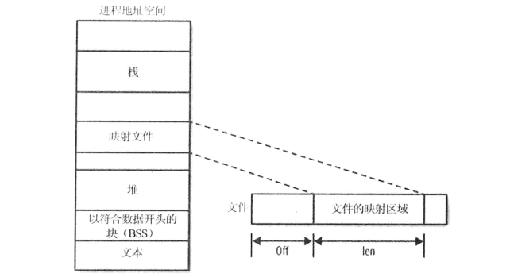
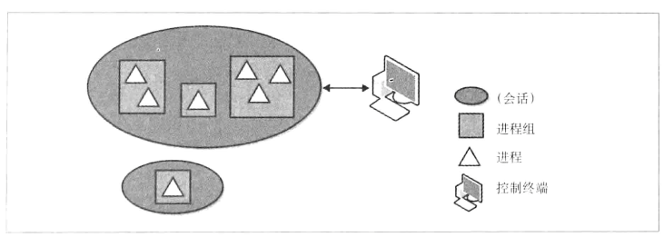

# 高级文件 I/O

## 分散/聚集 I/O

​        分散/聚集 I/O 是一种可以在单词系统调用中对多个缓冲区输入输出方法，可以把多个缓冲区的数据写到单个数据流，也可以把单个数据流读到多个缓冲区中。其命名的原因在于数据会被分散到指定缓冲区向量，或者从指定缓冲区向量中聚集数据。这种输入输出方法也称为向量I/O（vector I/O）。前面提到（第二章）的标准读写系统调用可称为线性I/O（linear I/O）。

​        与线性I/O相比，分散/聚集 I/O有如下几个优势

- **编码模式更自然**：如果数据本身是分段的（如预定义的结构体变量），向量I/O提供了直观的数据处理方式
- **效率更高**：单个向量I/O操作可以取代多个线性I/O操作
- **性能更好**：除了减少发起的系统调用次数，通过内部优化，向量I/O可以比线性I/O提供更好的性能
- **支持原子性**：和多个线性I/O操作不同，一个进程可以执行单个向量I/O操作，避免了和其他进程交叉操作的风险

### readv()和writev()

​        Linux 实现了 POSIX 1003.1-2001 中定义的一组实现分散/聚集 I/O机制的系统调用。该实现满足了前面所述的所有特性。

​        readv()函数从文件描述符fd中读取count个段（segment）到参数iov所指定的缓冲区中

```c
#include <sys/uio.h>

ssize_t readv(int fd, const struct iovec *iov, int count);
```

​        write()函数从参数iov指定的缓冲区中读取count个段的数据，并写入fd中

```c
#include <sys/uio.h>

ssize_t writev(int fd, const struct iovec *iov, int count);
```

​        除了同时操作多个缓冲区外，readv()函数和writev()函数的功能分别和read()、write()功能一致。

​        每个iovec结构体描述一个独立的、物理不连续的缓冲区，称其为段（segment）

```c
#include <sys/uio.h>

struct iovec {
  	void *iov_base;		// 指向buffer开始的pointer
	size_t iov_len;		// buffer的字节大小
};
```

一组段的集合称为向量（vector）。

​        每个段描述了内存中所要读写的缓冲区的地址和长度。readv()函数在处理下个缓冲区之前，会填满当前缓冲区的iov_len个字节。writev()函数在处理下个缓冲区之前，会把当前缓冲区所有iov_len个字节数据输出。这两个函数都会顺序处理向量中的段。

#### 返回值

​        操作成功时，readv()函数和writev()函数分别读写的字节数。该返回值应该等于所有count个iov_len的和。出错时，返回-1，并相应设置errno值。这些系统调用可能会返回任何read()和write()可能返回的错误，而且出错时，设置的errno值也与read()、write()相同。此外，标准还定义了另外两种错误场景

- 由于返回值类型是ssize_t，如果所有count个iov_len的和超出SSIZE_MAX，则不会处理任何数据，返回-1，并把errno值设置为EINVAL
- POSIX指出count值必须大于0，且小于等于IOV_MAX（IOV_MAX在文件limits.h中定义）。在Linux中，当前IOV_MAX的值是1024。如果count为0，该系统调用会返回0。如果count大于IOV_MAX，不会处理任何数据，返回-1，并把errno值设置为EINVAL。

​        **优化count值**：在向量I/O操作中，Linux内核必须分配内部数据结构来表示每个段（segment）。一般来说，是基于count的大小动态分配进行的。然而，为了优化，如果count值足够小，内核会在栈上创建一个很小的段数组，通过避免动态分配段内存，从而获得性能上的一些提升。count的阈值一般设置为8，因此如果count值小于或等于8时，向量I/O操作会以一种高效的方式，在进程的内核栈中运行。

​        大多数情况下，无法选择在指定的向量I/O操作中一次同时传递多少个段。当认为可以试用一个较小值时，选择8或更小的值肯定会得到性能的提升。

​        **writec()示例**：向量包含3个段，且每个段包含不同长度的字符串。看如何将这3个段写入一个缓冲区

```c
#include <stdio.h>
#include <sys/types.h>
#include <sys/stat.h>
#include <fcntl.h>
#include <string.h>
#include <sys/uio.h>

int main(void)
{
    struct iovec iov[3];
    ssize_t nr;
    int fd, i;

    char *buf[] = {
        "The term buccaneer comes from the word boucan.\n",
        "A boucan is a wooden frame used for cooking meat.\n",
        "Buccaneer is the West Indies name for a pirate.\n"};

    fd = open("txts/buccaneer.txt", O_WRONLY | O_CREAT | O_TRUNC);
    if (fd == -1)
    {
        perror("open");
        return 1;
    }

    // 填充三个iovec 结构体
    for (i = 0; i < 3; i++)
    {
        iov[i].iov_base = buf[i];
        iov[i].iov_len = strlen(buf[i]) + 1;
    }

    // 一次调用全部写入
    nr = writev(fd, iov, 3);
    if (nr == -1)
    {
        perror("wrirtev");
        return 1;
    }

    printf("wrote %d bytes\n", nr);

    if (close(fd))
    {
        perror("close");
        return 1;
    }

    return 0;
}
```

- **编译**

  ```bash
  gcc main.c -o main
  ```

- **执行**

  ```bash
  ./main
  ```

- **查看结果**

  ```bash
  cat txts/buccaneer.txt
  ```

> ​        其他
>
> - 如果不事先创建buccaneer.txt，那么执行后的权限好像有点不对

---

​        **readv()示例**

```c
#include <stdio.h>
#include <sys/types.h>
#include <sys/stat.h>
#include <fcntl.h>
#include <sys/uio.h>

int main(void)
{
    char foo[48], bar[51], baz[49];
    struct iovec iov[3];
    ssize_t nr;
    int fd, i;

    fd = open("txts/buccaneer.txt", O_RDONLY);
    if (fd == -1)
    {
        perror("open");
        return 1;
    }

    // 建立iovec结构体
    iov[0].iov_base = foo;
    iov[0].iov_len = sizeof(foo);
    iov[1].iov_base = bar;
    iov[1].iov_len = sizeof(bar);
    iov[2].iov_base = baz;
    iov[2].iov_len = sizeof(baz);

    // 一次调用全部读取
    nr = readv(fd, iov, 3);
    if (nr == -1)
    {
        perror("readv");
        return 1;
    }

    for (i = 0; i < 3; i++)
        printf("%d: %s", i, (char *)iov[i].iov_base);

    if (close(fd))
    {
        perror("close");
        return 1;
    }

    return 0;
}
```

- **编译**

  ```bash
  gcc main.c -o main
  ```

- **执行**

  ```bash
  ./main
  ```

---

​        **实现**：可以在用户空间简单实现readv()函数和writev()函数

```c
#include <unistd.h>
#include <sys/uio.h>

ssize_t naive_writev(int fd, const struct iovec *iov, int count)
{
    ssize_t ret = 0;
    int i;
    
    for(i = 0; i < count; i++){
        ssize_t nr;
        
        errno = 0;
        nr = write(fd, iov[i].iov_base, iov[i].iov_len);
        if(nr == -1){
            if(errno == EINTR)
                continue;
            ret = -1;
            break;
        }
        ret += nr;
    }
    return ret;
}
```

Linux内核不是这么实现的：Linux内核把readv()和writev()作为系统调用实现，在内部使用分散/聚集 I/O模式。实际上，Linux内核中的所有I/O都是向量I/O，read()和write()是作为向量I/O实现的，且向量中只有一个段。

## Event Poll

​        由于poll()和select()的局限，Linux 2.6内核引入了event poll（epoll）机制。虽然epoll的实现比poll()和select()复杂得多，epoll解决了前两个都存在的基本性能问题，并增加了一些新的特性。

​        对于poll()和select()，每次调用时都需要所有被监听的文件描述符列表。内核必须遍历所有被监视的文件描述符，当这个文件描述符列表变得很大时，每次调用都要遍历列表就变成规模上的瓶颈。

​        epoll把监听注册从实际监听中分离出来，从而解决了这个问题。一个系统调用会初始化epoll上下文，另一个从上下文中加入或删除监视的文件描述符，第三个执行真正的事件等待（event wait）

> ​        epoll是在2.5.44开发版内核中加入，该接口最终在2.5.66版本中完成。它是Linux专有的

### 创建新的epoll实例

​        通过epoll_create1()创建epoll上下文

```c
#include <sys/epoll.h>

int epoll_create1(int flags);
// 废弃版本
int epoll_create(int size);
```

调用成功时，epoll_create1()会创建新的epoll实例，并返回和该实例关联的文件描述符。这个文件描述符和真正的文件没有关系，仅仅是为了后续调用epoll而创建的。参数flags支持修改epoll的行为，当前，只有EPOLL_CLOEXEC是个合法的flag，它表示进程被替换时关闭文件描述符。

​        出错时，返回-1，并设置errno为下列值之一

- **EINVAL**：参数flags非法
- **EMFILE**：用户打开的文件数达到上限
- **ENFILE**：系统打开的文件数达到上限
- **ENOMEN**：内存不足，无法完成本次操作

​        epoll_create()是老版本的epoll_create1()的实现，现在已经废弃。它不接收任何标志位，相反，接收size参数，该参数没有用。size之前是用于表示要监视的文件描述符个数；现在，内核可以动态获取数据结构的大小，只要size参数大于0即可。如果size值小于0，会返回EINVAL。如果应用所运行的系统其Linux版本低于Linux内核2.6.27以及glibc 2.9，应该使用老的epoll_create()调用。

​        epoll的标准调用方式如下

```c
int epfd;

epfd = epoll_create1(0);
if(epfd < 0)
    perror("epoll_create1");
```

完成监视后，epoll_create1()返回的文件描述符需要通过close()调用来关闭。

### 控制 epoll

​        epoll_ctl()函数可以向指定的epoll上下文中加入或删除文件描述符

```c
#include <sys/epoll.h>

int epoll_ctl(int epfd, int op, int fd, struct epoll_event *event);
```

头文件sys/epoll.h中定义了epoll event结构体

```c
struct epoll_event {
    __u32 events;
    union {
        void *ptr;
        int fd;
        __u32 u32;
        __u64 u64;
    } data;
};
```

epoll_ctl()调用如果执行成功，会控制和文件描述符epfd关联的epoll实例。参数op指定对fd指向的文件所执行的操作。参数event进一步描述epoll更具体的行为

- **op有效值**
  - **EPOLL_CTL_ADD**：把文件描述符fd所指向的文件添加到epfd指定的epoll监听实例集中，监听event中定义的事件
  - **EPOLL_CTL_DEL**：把文件描述符fd所指向的文件从epfd指定的epoll监听集中删除
  - **EPOLL_CTL_MOD**：使用event指定的更新事件修改在已有fd上的监听行为
- epoll_event结构体中的events变量列出了指定文件描述符上要监听的事件。多个监听事件可以通过位或运算同时指定。以下为有效events值
  - **EPOLLERR**：文件出错。即使没有设置，这个事件也是被监听的
  - **EPOLLET**：在监听文件上开启边缘触发（edge-triggered）。默认是条件触发（level-triggered）
  - **EPOLLHUP**：文件被挂起。即使没有设置，这个事件也是被监听的
  - **EPOLLIN**：文件未阻塞，可读
  - **EPOLLONESHOT**：在事件生成并处理后，文件不会再被监听。必须通过EPOLL_CTL_MOD指定新的事件掩码，以便重新监听文件
  - **EPOLLOUT**：文件未阻塞，可写
  - **EPOLLPRI**：存在高优先级的带外（out-of-band）数据可读。
- event_poll中的data变量是由用户私有使用。当接收到请求的事件后，data会被返回给用户，通常的用法是把event.data.fd设置为fd，这样可以很容易查看哪个文件描述符触发了事件。当成功时，epoll_ctl()返回0。失败时，返回-1，并相应设置errno为下列值
  - **EBADF**：epfd不是有效的epoll实例，或者fd不是有效的文件描述符
  - **EEXIST**：op值设置为EPOLL_CTL_ADD，但是fd已经与epfd关联
  - **EINVAL**：epfd不是epoll实例，epfd和fd相同，或op无效
  - **ENOENT**：op值设置为EPOLL_CTL_MOD或EPOLL_CTL_DEL，但是fd没有和epfd关联。
  - **ENOMEN**：没有足够的内存处理请求。
  - **EPERM**：fd不支持epoll


​        下面的例子中，在epoll实例epfd中加入fd所指向文件的监听事件

```c
struct epoll_event event;
int ret;

event.data.fd = fd;  // return the fd to us later (from epoll_wait)
event.events = EPOLLIN | EPOLLOUT;

ret = epoll_ctl(epfd, EPOLL_CTL_ADD, fd, &event);
if(ret)
    perror("epoll_ctl");
```

​        修改epfd实例中的fd上的一个监听事件

```c
struct epoll_event event;
int ret;

event.data.fd = fd;  // return the fd to us later
event.events = EPOLLIN;

ret = epoll_ctl(epfd, EPOLL_CTL_MOD, fd, &event);
if(ret)
    perror("epoll_ctl");
```

​        从epoll实例epfd中删除在fd上的一个监听事件

```c
struct epoll_event event;
int ret;

ret = epoll_ctl(epfd, EPOLL_CTL_DEL, fd, &event);
if(ret)
    perror("epoll_ctl");
```

当op设置为EPOLL_CTL_DEL时，由于没有提供事件掩码，event参数可能会是NULL。但是，在2.6.9以前的内核版本中，会检查该参数是否非空。为了和老的内核版本保持兼容，必须传递一个有效的非空指针，该指针不能只是声明。内核2.6.9版本修复了这个bug。

### 等待 epoll 事件

​        系统调用 epoll_wait()会等待和指定epoll实例关联的文件描述符上的事件

```c
#include <sys/epoll.h>

int epoll_wait(int epfd, struct epoll_event *events, int maxevents, int timeout);
```

当调用epoll_wait()时，等待epoll实例epfd中的文件fd上的事件，时限为timeout毫秒。成功时，events指向描述每个事件的epoll_event结构体的内存，且最多可以有maxevents个事件，返回值是事件数；出错时，返回-1，并将errno设置为以下值

- **EBADF**：epfd是一个无效的文件描述符
- **EFAULT**：进程对events所指向的内存没有写权限
- **EINTR**：系统调用在完成前发生信号中断或超时
- **EINVAL**：epfd不是有效的epoll实例，或者maxevents值小于或等于0

​        如果timeout为0，即使没有事件发生，调用也会立即返回0。如果timeout为-1，调用将一直等待到有事件发生才返回。

​        当调用返回时，epoll_event结构体中的events变量描述了发生的事件。data变量保留了用户在调用epoll_ctl()前的所有内容。

​        **完整的epoll_wait()例子**

```c
#define MAX_EVENTS 64

struct epoll_event *events;
int nr_events, i, epfd;

events = malloc(sizeof(struct epoll_event) * MAX_EVENTS);
if(!events)
{
    perror("malloc");
    return 1;
}

nr_events = epoll_wait(epfd, events, MAX_EVENTS, -1);
if(nr_events < 0)
{
    perror("epoll_wait");
    free(events);
    return 1;
}

for(i = 0; i < nr_events; i++)
{
    printf("event=%ld on fd=%d\n", events[i].events, events[i].data.fd);
    // we now can per events[i].events operate on events[i].data.fd without blocking
}
free(events);
```

### 边缘触发事件和条件触发事件

​        如果epoll_ctl()的参数event中的events项设置为EPOLLET，fd上的监听方式为边缘触发（Edge-triggered），否则为条件触发（Level-triggered）。

​        考虑下面生产者和消费者在通过UNIX管道通信时的情况

1. 生产者向管道写入1KB数据
2. 消费者在管道上调用epoll_wait()，等待管道上有数据并可读。

​        通过条件触发监视时，在步骤2中的epoll_wait()调用会立即返回，表示管道可读。通过边缘触发监视时，需要步骤1发生后，步骤2中的epoll_wait()调用才会返回。也就是说，对于边缘触发，在调用epoll_wait()时，即使管道已经可读，也只有当有数据写入之后，调用才会返回。

​        条件触发是默认行为，poll()和select()就是采用这种模式。边缘触发需要不同的编程解决方案，通常是使用非阻塞I/O，而且需要仔细检查EAGAIN。

> ​       **边缘触发**：这个术语源于电子工程领域。条件触发是只要有状态发生就触发，边缘触发是只有在状态改变的时候才会发生。条件触发关心的是事件状态，边缘触发关心的是事件本身。
>
> ​       举个例子：对于一个读操作的文件描述符，如果是条件触发，只要文件描述符可读了，就会收到通知，是“可读”这个条件触发了通知。如果是边缘触发，当数据可读时，会接收到通知，而且通知有且仅有一次，是“有数据”这个变化本身触发了通知。

## 存储映射

​        除了标准文件I/O，内核还提供了一个接口，支持应用程序将文件映射到内存中，即内存地址和文件数据一一对应。这样，开发人员可以直接通过内存来访问文件，就像操作内存中的数据块一样，甚至可以写入内存数据区，然后通过透明的映射机制将文件写入磁盘。

​        Linux实现了POSIX.1标准中定义的mmap()系统调用，该调用将对象映射到内存中。

### mmap()

​        mmap()调用请求内核将文件描述符fd所指向的对象的len个字节数据映射到内存中，起始位置从offset开始。如果指定addr，表示优先使用addr作为内存中的起始地址。参数prot指定了访存权限，flags指定了其他操作行为

```c
#include <sys/mman.h>

void *mmap(void *addr, size_t len, int prot, int flags, int fd, off_t offset);
```

- addr参数告诉内核映射文件的最佳地址，但仅仅是作为提示信息，而不是强制性的。大部分传递的值是0。调用返回内存映射区域的真实开始地址

- prot参数描述了对内存区域所请求的访问权限。如果是PROT_NONE，表示无法访问映射区域的页（基本上不用），也可以是以下标志位的比特位或运算值

  - **PROT_READ**：页可读
  - **PROT_WRITE**：页可写
  - **PROT_EXEC**：页可执行

  prot参数所设置的访存权限不能和打开文件的访问模式冲突。如，如果程序以只读方式打开文件，prot参数就不能设置为PROT_WRITE

  > ​        **保护标志、体系结构和安全性**：虽然POSIX标准定义了三种保护位（读、写和执行），一些体系结构只支持其中几个。这很正常，比如对于处理器而言，读和执行没有区别，因此处理器可能只有一个读标志。在这些操作系统上，PROT_READ即PROT_EXEC。之前，体系结构x86还属于这样的系统
  >
  > ​        依赖这样的处理方式会导致程序不可移植。可移植的程序在执行映射代码时，都应该相应设置PROT_EXEC。
  >
  > ​        另一方面来说，这是造成缓冲区溢出攻击盛行的原因之一：即使指定的映射没有执行权限，处理器还是支持执行
  >
  > ​        后来，x86处理器加入了NX（no-execute）位，表示映射允许读，但不可执行。在新的系统上，PROT_READ不再表示PROT_EXEC。

- flags参数描述了映射的类型及其一些行为，其值为以下值按位或运算的结果

  - **MAP_FIXED**：表示mmap()应该强制接收参数addr，而不是作为提示信息。如果内核无法映射文件到指定地址，调用失败。如果地址和长度指定的内存和已有映射有区域重叠，重叠区的原有内容被丢弃，通过新的内容填充。该选项需要深入了解进程的地址空间，不可移植，不鼓励使用。

  - **MAP_PRIVATE**：表示映射区不共享。文件映射采用了写时复制，进程对内存的任何改变不影响真正的文件或其他进程的映射。

  - **MAP_SHARED**：表示和所有其他映射该文件的进程共享映射内存。对内存的写操作等效于写文件。读该映射区域会受到其他进程的写操作的影响

    MAP_SHARED和MAP_PRIVATE必须指定其中一个，但不能同时指定

​        当映射文件描述符时，文件的引用计数会加1。因此，如果映射文件后关闭文件，进程依然可以访问该文件。当取消映射或者进程终止时，对应的文件引用计数会减1。

​        下面代码以只读方式映射到fd所指向的文件，从第1个字节开始，长度为len个字节

```c
void *p;

p = mmap(0, len, PROT_READ, MAP_SHARED, fd, 0);
if(p == MAP_FAILED)
    perror("mmap");
```

​        下图显示了mmap()参数对文件与进程地址空间映射的影响



#### 页大小

​        页是内存管理单元（MMU）的粒度单位。因此，它是内存中允许具有不同权限和行为的最小单元。页是内存映射的基本块，因而也是进程地址空间的基本块。

​        mmap()系统调用的操作单元是页。参数addr和offset都必须按页大小对齐。也就是说，它们必须是页大小的整数倍。

​        所以，映射区域是页大小的整数倍。如果调用方提供的len参数没有按页对齐（可能是因为需要映射的文件大小不是页大小的整数倍），映射区域会一直占满最后一个页。多出来的内存，即最后一个有效字节到映射区域边界这一部分区域，会用0填充。该区域的所有读操作都将返回0.所有写操作都不会影响文件的最后部分，即使使用参数MAP_SHARED进行映射，只有最前面的len个字节会写到文件中。

​        标准POSIX规定，获得页大小的方法是通过sysconf()函数，它将返回一系列系统特定的信息

```c
#include <unistd.h>

long sysconf(int name);
```

sysconf()调用会返回配置项name值，如果name无效，返回-1。出错时，errno被设置为EINVAL。因为-1对于某些项而言可能是有效值（比如对于limits，-1不是没有限制），明智的做法是在调用前清空errno，并在调用后检查其值来判断是否出错。

​        POSIX定义`_SC_PAGESIZE`（`_SC_PAGE_SIZE`与其同义）表示页大小。因此，在运行时获取页大小其实很简单

```c
long page_size = sysconf(_SC_PAGESIZE);
```

​        Linux也提供了getpagesize()函数来获得页大小

```c
#include <unistd.h>

int getpagesize(void);
```

调用getpagesize()将返回页按字节计数的大小

```c
int page_size = getpagesize();
```

并不是所有的UNIX系统都支持这个函数，POSIX 1003.1-2001弃用了该函数，在这里包含它，只是出于完整性考虑。

​        页大小是由`<asm/pages.h>`中的宏`PAGE_SIZE`定义的，因此第三种获取页大小的方式为

```c
int page_size = PAGE_SIZE;
```

和前两种方式不同，这种方法是在编译时获得页大小，而不是在运行时。一些体系结构支持多种机型使用不同页大小，某些机型本身甚至支持多种页大小。一个二进制文件应该能在指定体系结构下的所有机型上运行，即一次编译，到处运行。对页大小硬编码则会使这种可能性为0。因此，正确的做法是在运行时确定页大小。因为参数addr和offset通常设置为0，在运行时确定其实并不是很困难。

​        此外，未来的内核版本可能不会将该宏开放给用户空间。这里提一下是因为在UNIX代码中使用很频繁，但不要在自己的程序中使用。目前看来，为了可移植性和今后的兼容性，sysconf()是最好的选择。

#### 返回值和错误码

​        成功时，mmap()返回映射区域的地址；失败时，返回MAP_FAILED，并相应设置errno值。mmap()调用永远都不会返回0。可能的errno值如下

- **EACESS**：指定的文件描述符不是普通文件，或者打开模式和参数prot或flags冲突
- **EAGAIN**：文件已通过文件锁锁定
- **EBADF**：指定文件描述符非法
- **EINVAL**：参数addr、len、off中的一个或多个非法
- **ENFILE**：打开文件数达到系统上线
- **ENODEV**：文件所在的文件系统不支持存储映射
- **ENOMEM**：内存不足
- **EOVERFLOW**：参数addr+len的结果值超过了地址空间大小
- **EPERM**：设定了参数PROT_EXEC，但是文件系统以不可执行方式挂载

#### 相关信号

​        和映射区域相关的两个信号

- **SIGBUS**：当进程试图访问一块已经失效的映射区域时，会生成该信号。如，文件在映射后被截断（truncated）
- **SIGSEGV**：当进程试图写一块只读的映射区域时，会生成该信号。

### munmap()

​        Linux提供了munmap()系统调用，取消mmap()所创建的映射

```c
#include <sys/mman.h>

int munmap(void *addr, size_t len);
```

munmap()会消除进程地址空间从addr开始，len字节长的内存中的所有页面的映射。一旦映射被消除，之前关联的内存区域就不再有效，如果试图再次访问会生成SIGSEGV信号。

​        一般来说，传递给munmap()的参数是上一次mmap()调用的返回值及其参数len。成功时，munmap()返回0；失败时，返回-1，并相应设置errno值。唯一标准的errno值是EINVAL，表示一个或多个参数无效。

​        下面代码消除了内存中`[addr, addr+len]`区间内所有页的映射

```c
if(munmap(addr, len) == -1)
    perror("munmap");
```

### 存储映射实例

​        下面的实例使用mmap()将用户选择的文件输出到标准输出

```c
#include <stdio.h>
#include <sys/types.h>
#include <sys/stat.h>
#include <fcntl.h>
#include <unistd.h>
#include <sys/mman.h>

int main(int argc, char *argv[])
{
    struct stat sb;
    off_t len;
    char *p;
    int fd;

    if (argc < 2)
    {
        fprintf(stderr, "usage: %s <file>\n", argv[0]);
        return 1;
    }

    fd = open(argv[1], O_RDONLY);
    if (fd == -1)
    {
        perror("open");
        return 1;
    }

    if (fstat(fd, &sb) == -1)
    {
        perror("fstat");
        return 1;
    }

    if (!S_ISREG(sb.st_mode))
    {
        fprintf(stderr, "%s is not a file\n", argv[1]);
        return 1;
    }

    p = mmap(0, sb.st_size, PROT_READ, MAP_SHARED, fd, 0);
    if (p == MAP_FAILED)
    {
        perror("mmap");
        return 1;
    }

    if (close(fd) == -1)
    {
        perror("close");
        return 1;
    }

    for (len = 0; len < sb.st_size; len++)
        putchar(p[len]);

    if (munmap(p, sb.st_size) == -1)
    {
        perror("munmap");
        return 1;
    }

    return 0;
}
```

例子中，fstat()返回指定文件的信息，S_ISREG()宏可以检查这些信息，这样可以在映射前确保指定文件是个普通文件（相对于设备文件和目录而言）。映射非普通文件的执行结果取决于该文件所在的设备。有些设备是可以映射的，而有些是不可以的，并会设置errno值为EACCESS。

​        这段程序完成以下操作：接收一个文件名作为程序参数，打开文件，确保是普通文件，为文件做存储映射，关闭，按字节把文件输出到标准输出，最后消除文件的存储映射。

### mmap()的优点

​        相对于系统调用read()和write()而言，使用mmap()处理文件有很多优点

- 使用read()或write()系统调用时，需要从用户缓冲区进行数据读写，而使用映射文件进行操作，可以避免多余的数据拷贝操作
- 除了可能潜在页错误，读写映射文件不会带来系统调用和上下文切换的开销，它就像直接操作内存一样简单
- 当多个进程把同一对象映射到内存中时，数据会在所有进程间共享。只读和写共享的映射在全体中都是共享的；私有可写的映射对尚未进行写时拷贝的页是共享的。
- 在映射对象中搜索只需要很简单的指针操作，不需要使用系统调用lseek()

### mmap()的不足

​        使用mmap()时需要注意以下几点

- 由于映射区域的大小总是页大小的整数倍，因此，文件大小与页大小的整数倍之间有空间浪费。对于小文件，空间浪费会比较严重。如，假如页大小是4KB，一个7字节的映射就会浪费4089字节
- 存储映射区域必须在进程地址空间内。对于32位的地址空间，大量的大小不同的映射会导致生成大量的碎片，使得很难找到连续的大片空内存。这个问题在64位地址空间就不是很明显
- 创建和维护映射以及相关的内核数据结构有一定的开销。不过，由于mmap()消除了读写时的不必要拷贝，这种开销几乎可以忽略，对于大文件和频繁访问的文件更是如此。

基于以上理由，处理大文件（浪费空间很小），或者在文件大小恰好被page大小整除（没有空间浪费）时，mmap()的优势就会非常显著。

### 调整映射的大小

​        Linux提供了系统调用mremap()开扩大或减少指定映射的大小。该函数是Linux特有的

```c
#define _GNU_SOURCE

#include <sys/mman.h>

void * mremap(void *addr, size_t old_size, size_t new_size, unsigned long flags);
```

mremap()将映射区域`[addr, addr+old_size)`的大小增加或减少到new_size。内核可以同时移动映射区域，这取决于进程地址空间可用以及参数flags的值。

​        参数flags的值可以是0或MREMAP_MAYMOVE，表示内核可以根据需求移动映射区域，设置为重新指定的大小。如果内核可以移动映射区域，一个较大值的大小调整操作才更有可能会成功。

#### 返回值和错误码

​        成功时，mremap()返回指向新映射区域的指针；失败时，返回MAP_FAILED，并相应设置errno为以下值

- **EAGAIN**：内存区域被锁，不能重新调整大小
- **EFAULT**：指定范围内的一些页不是进程地址空间内的有效页，或者在重新映射指定页时出现错误
- **EINVAL**：某个参数非法
- **ENOMEM**：如果不进行内存区域移动，则无法扩展指定的范围（而且没有设置MREMAP_MAYMOVE），或者进程地址空间内没有足够的空闲空间。

​        库函数如glibc，经常使用mremap()来实现高效的realloc()，realloc()是个接口，可以通过它重新调整由malloc()分配的内存大小

```c
void * realloc(void *addr, size_t len)
{
    size_t old_size = look_up_mapping_size(addr);
    void *p;
    
    p = mremap(addr, old_size, len, MREMAP_MAYMOVE);
    if(p == MAP_FAILED){
        return NULL;
    }
    return p;
}
```

只有当所有的malloc()操作都是唯一的匿名映射时，这段代码才有效。即便如此，它也能作为如何提高性能的简单示例。例子中，假设libc提供了一个名为look_up_mapping_size()函数。GNU C库使用mmap()及其相关函数来进行内存分配。

### 改变映射区域的权限

​        POSIX定义了mprotect()接口，允许程序改变已有的内存区域的权限

```c
#include <sys/mman.h>

int mprotect(const void *addr, size_t len, int prot);
```

调用mprotect()会改变`[addr, addr+len]`区域内页的访问权限，其中参数addr是页对齐的。参数prot接收的值和mmap()的prot参数相同。这些值都不能累加，如果某个内存区域可读，而且prot值设置为PROT_WRITE，调用后该区域会变成只可写。

​        在某些操作系统上，mprotect()只能操作之前由mmap()所创建的内存区域。在Linux中，mprotect()可以操作任意区域的内存。

#### 返回值和错误码

​        成功时，mprotect()返回0；失败时，返回-1，并把errno值相应设置为如下值之一

- **EACCESS**：内存不能设置参数prot所请求的权限。比如，当试图将一个以只读模式打开的文件的映射设置成可写时，会出现该错误
- **EINVAL**：参数addr非法或者没有页对齐
- **ENOMEM**：内核内存不足，无法满足请求，或者指定内存区域中有一个或多个页面不是有效的进程地址空间。

### 通过映射同步文件

​        POSIX提供了一种通过存储映射来同步文件的方式，它的功能等价于系统调用fsync()

```c
#include <sys/mman.h>

int msync(void *addr, size_t len, int flags);
```

调用msync()可以将mmap()生成的映射在内存中的任何修改写回到磁盘中，从而实现同步内存中的映射和被映射的文件。具体来说，文件或者文件子集在内存中的映射从addr开始的len长度字节被写回到磁盘。参数addr必须是页对齐的，通常是上一次mmap()调用的返回值。

​        如果不调用msync()，无法保证在映射被取消之前，修改过的映射会被写回到硬盘。这一点与write()有所不同，被write()修改的缓冲区被保存在一个队列中等待被写回。而当向内存映射写数据时，进程会直接修改内核页缓存中的文件页，而无需经过内核。内核不会立即同步页缓存到硬盘。

​        参数flags控制同步操作的行为。它的值是以下值的按位或操作结果

- **MS_SYNC**：指定同步操作必须同步进行。直到所有页写回到磁盘后，msync()调用才会返回
- **MS_ASYNC**：指定同步操作应该异步执行。更新操作是由系统调度的，而msync()调用会立即返回，不用等待write()操作完成
- **MS_INVALIDATE**：指定所有其他的该块映射的拷贝都将失效。后期对该文件的所有映射区域上的访问操作都将直接同步到硬盘

​        MS_ASYNC和MS_SYNC必须指定其一，但二者不能共用。msync()的用法如下

```c
if(msync(addr, len, MS_ASYNC) == -1)
    perror("msync");
```

这个例子是以异步的方式把文件的映射区域`[addr, addr+len)`同步到磁盘。

#### 返回值和错误码

​        成功时，msync()返回0；失败时，返回-1，并相应设置errno值。以下为有效的errno值

- **EINVAL**：参数flags同时设置了MS_SYNC或MS_ASYNC（设置成除以上三个合法参数值外的其他值），或者参数addr没有页对齐
- **ENOMEM**：指定的内存区域（或其中一部分）没有被映射。按照POSIX规定，Linux在处理请求同步一块部分被解除映射的内存时，会返回ENOMEM，但是它依然会同步该区域中所有有效的映射

​        在Linux内核2.4.29版本之前，msync()会返回EFAULT，而不是ENOMEM。

### 给出映射提示

​        Linux提供了系统调用madvise()，进程对自己期望如何访问映射区域给内核一些提示信息。内核会据此优化自己的行为，尽量更好地利用映射区域。内核通常会动态调整自己的行为，一般而言，即使没有显式提示信息，内核也能保证较好的性能，但是，适当的提示信息可以确保在某些负载情况下，可以获得期望的缓存并准确预读。

​        带哦用madvise()会告诉内核如何对起始地址为addr，长度为len的内存映射区域进行操作

```c
#include <sys/mman.h>

int madvise(void *addr, size_t len, int advice);
```

如果len为0，内核将把该提示信息应用于所有起始地址为addr的映射。参数advice表示提示信息，可以是下列值之一

- **MADV_NORMAL**：对指定的内存区域，应用没有特殊提示，按正常方式操作
- **MADV_RANDOM**：应用将以随机（非顺序）访问方式，访问指定范围的页
- **MADV_SEQUENTIAL**：应用期望从低地址到高地址顺序访问指定范围的页
- **MADV_WILLNEED**：应用期望会很快访问指定范围的页
- **MADV_DONTNEED**：应用在短期内不会访问指定范围内的页

​        内核得到提示后，实际所采取的执行方式是和具体的实现相关：POSIX只规定了提示的含义，而没有规定具体的行为。Linux 内核 2.6 以后的版本会以如下方式处理advice参数

- **MADV_NORMAL**：内核行为照常，有适量的预读
- **MADV_RANDOM**：内核不做预读，每次物理读操作只读取最小量的数据
- **MADV_SEQUENTIAL**：内核大量预读
- **MADV_WILLNEED**：内核开始预读，将指定的页预读至内存
- **MADV_DONTNEED**：内核释放所有和指定页相关的资源，丢弃所有被修改的、未同步写回的页。后续对映射数据的访问会把数据重新载入内存页或以0填充请求页

​        madvise()的典型用法如下

```c
int ret;

ret = madvise(addr, len, MADV_SEQUENTIAL);
if(ret < 0)
    perror("madvise");
```

该调用会告诉内核，进程期望连续访问内存区域`(addr, addr+len)`。

> ​        **预读**：当Linux内核访问磁盘上的文件时，通常会采用预读（readahead）来优化。也就是说，当请求加载文件的某块内容时，内核也会读取被加载块的下一个块。如果随后也请求访问下一个块（比如对于连续访问某个文件时会发生），内核可以马上返回数据。因为磁盘有缓冲区（磁盘内部也会有预读行为），而且文件通常是连续分布在磁盘的，这个优化的开销很低。
>
> ​        预读通常是有好处的，但是具体的优化效果依赖于预读的窗口大小。较大的预读窗口在连续访问文件时会很有效，而对随机访问来讲，预读则纯属无用的开销。
>
> ​        内核会动态调整预读窗口，以保证在预读窗口中一定的命中率。命中率高则意味着最好把预读窗口调大，反之则表示应该把预读窗口调小。应用程序可以提供madvise()系统调用来影响预读窗口的大小。

#### 返回值和错误码

​        成功时，madvise()返回0；失败时，返回-1，并设置相应errno值。以下为有效的错误值

- **EAGAIN**：内核内部资源（可能是内存）不可用，进程可以重试
- **EBADF**：内存区域存在，但是没有映射到文件
- **EINVAL**：参数len是负数，参数addr不是页对齐的，参数advice非法，或者页面被锁定或以MADV_DONTNEED方式共享该区域
- **EIO**：advice参数设置为MADV_WILLNEED，操作出现内部I/O错误
- **ENOMEM**：指定的区域不是进程地址空间内的合法映射，或者设置了MADV_WILLNEED，但是没有足够内存可供分配

## 普通文件I/O提示

​        Linux提供了两个接口，可以给出普通文件I/O的提示信息：posix_fadvise()和readahead()

### 系统调用 posix_fadvise()

​        posix_fadvise()函数可以给出提示信息，在POSIX 1003.1-2003中定义如下

```c
#inculde <fcntl.h>

int posix_fadvise(int fd, off_t offset, off_t len, int advice);
```

带哦用posix_fadvise()会向内核提供文件fd的`[offset, offset+len)`区间内操作提示。如果len为0，则该提示适用于区间`[offset, length of file]`。常见的用法是设置len和offset为0，使得提示可以应用于整个文件。

​        advice的可用选项和madvise()类似，必须是以下值之一

- **POSIX_FADV_NORMAL**：应用在指定文件的指定区域没有特殊要求，按正常情况处理。
- **POSIX_FADV_RANDOM**：应用期望在指定范围内随机访问
- **POSIX_FADV_SEQUENTIAL**：应用期望在指定范围内从低地址到高地址顺序访问
- **POSIX_FADV_WILLNEED**：应用期望最近会访问指定范围
- **POSIX_FADV_NOREUSE**：应用可能在最近会访问指定范围，但只访问一次
- **POSIX_FADV_DONTNEED**：应用最近可能不会访问指定范围

​        和madvise()一样，内核对这些提示的实际处理方式因具体的实现不同而不同，甚至不同版本的Linux内核的处理方式也不尽相同。下面是当前内核的处理方式

- **POSIX_FADV_NORMAL**：内核行为照常，有适量预读
- **POSIX_FADV_RANDOM**：内核禁止预读，每次物理读操作尽可能读取最少量的数据
- **POSIX_FADV_SEQUENTIAL**：内核大量预读，读取预读窗口两倍长度的数据
- **POSIX_FADV_WILLNEED**：内核开始预读，并将指定页读到内存中
- **POSIX_FADV_NOREUSE**：当前，其行为与POSIX_FADV_WILLNEED一致；未来内核可能会将其作为“只使用一次”的优化，在madvice()中没有与之对应的选项
- **POSIX_FADV_DONTNEED**：内核丢弃所有缓存的数据。和其他选项不同，它与madvise()中对应的选项行为不一样

​        以下代码片段要求内核随机、无序地访问fd所指向的文件

```c
int ret;

ret = posix_fadvise(fd, 0, 0, POSIX_FADV_RANDOM);
if(ret == -1)
	perror("posix_fadvise");
```

#### 返回值和错误码

​        成功时，返回0；失败时，返回-1，并设置相应errno值

- **EBADF**：文件描述符非法
- **EINVAL**：参数advice非法，文件描述符指向一个管道，或者设置的选项无法应用到指定的文件

### readahead()系统调用

​        posix_fadvise()是在Linux内核2.6中新加入的系统调用。在此之前，readahead()可以完成和posix_fadvise()使用POSIX_FADV_WILLNEED选项时同样的功能。和posix_fadvise()不同的是，readahead()是Linux所特有的

```c
#define _GNU_SOURCE

#include <fcntl.h>

ssize_t readahead(int fd, off64_t offset, size_t count);
```

readahead()调用将把fd所表示文件的映射区域`[offset, offset+count)`读入到页缓存中。

#### 返回值和错误码

​        成功时，返回0；失败时，返回-1，并设置相应errno值

- **EBADF**：文件描述符非法或没有打开用于读
- **EINVAL**：文件描述符对应的文件不支持预读

### “经济实用”的操作提示

​        通过向内核传递良好的操作提示，很多普通应用的效率可以获得明显提升。这种提示信息对于减轻繁重的I/O负荷很有助益。由于磁盘速度与现代处理器速度的不匹配，每个提示位的设置都很重要，良好的提示信息对应用大有帮助。

​        在读取文件的一个块的内容时，进程可以通过设置POSIX_FADV_WILLNEED，告诉内核把文件预读到页缓存中。预读的I/O操作将在后台异步进行。当应用最终要访问文件时，访问操作可以立即返回，不会有I/O阻塞。

​        相反地，在读写大量数据后（比如往磁盘写入连续的视频数据流），进程可以设置POSIX_FADV_DONTNEED，告诉内核丢弃页面缓存中指定文件块的内容。大量的流操作会连续填满页缓冲区。如果应用不想再次访问这些数据，则意味着页缓冲区中充斥了过量的数据，其代价是导致没有空间保存有用的数据。因此对于视频流这类应用，应该定期请求将数据从缓存中清除。

​        如果一个进程想要读取整个文件时，可以设置POSIX_FADV_SEQUENTIAL，告诉内核要大量预读。相反地，如果一个进程知道自己将随机访问文件，可以设置POSIX_FADV_RANDOM，告诉内核预读没有用，只会带来无谓的开销。

## 同步、同步及异步操作

​        UNIX操作系统在使用术语同步（synchronized）、非同步（nonsynchronized）、同步（synchronous）和异步（asynchronous）时很随意，基本没考虑这几个词所引起的困惑。英语中，synchronized和synchronous之间的区别很小，而且一般都译为同步。

​        synchronous写操作在数据全部写到内核缓冲区之前是不会返回的。synchronous读操作在数据写到应用程序在的用户空间的缓冲区之前是不会返回的。相反地，异步写操作在用户空间还有数据时可能就返回了，异步读操作在数据准备好之前可能就返回了。也就是说，异步操作在请求时并没有被放入操作队列中来执行，而只是在后期查询。当然，在这种情况下，必须存在一定的机制来确认操作是否已经完成以及完成的程度。

​        synchronized操作要比synchronous操作更严格，也更安全。synchronized写操作把数据写回硬盘，确保硬盘上的数据和内核缓冲区中是同步的。synchronized读操作总是返回最新的数据，一般是从硬盘中读取。

​        总的来说，同步（synchronous）和异步（asynchronous）是指I/O操作在返回前是否等待某些事件（如数据存储）返回。而术语同步（synchronized）和异步（asynchronized）则明确指定了某个事件必须发生（如把数据写回硬盘）。

​        通常，UNIX的写操作是synchronous但nonsynchronized，读操作是synchronous且synchronized。对于写操作，上述特性的任意组合都是可能的

​        **表：写操作的同步性（synchronicity）**

|                     |                     同步（synchronized）                     |                  非同步（nonsynchronized）                   |
| :-----------------: | :----------------------------------------------------------: | :----------------------------------------------------------: |
| 同步（synchronous） | 写操作在数据写入磁盘后才返回。当打开文件时指定O_SYNC时才按照这种方式执行 |     写操作在数据保存入内核缓冲区后返回。这是常见执行行为     |
|        异步         | 写操作在请求被加入队列后返回。一旦该操作被执行，会确保数据写入磁盘 | 写操作在请求被加入队列后返回。一旦该操作被执行，会确保数据写入内核缓冲区 |

> ​        从技术角度看，读操作和写操作，都是非同步的（nonsynchronized），但是内核保证页缓冲包含最新的数据。也就是说，页缓冲中的数据总是和磁盘上的数据一样或者更新一些。因此，实际上操作都是同步的。也没有人提出要采用别的方式。

​        由于读取旧数据是没有意义的，读操作通常是同步的（synchronized）。读操作既可以是同步（synchronous）的，也可以是异步（asynchronous）的

​        **表：读操作的同步性**

|                     |                    同步的（synchronized）                    |
| :-----------------: | :----------------------------------------------------------: |
| 同步（synchronous） | 读操作直到最新数据保存到提供的缓冲区后才返回（这是常见的执行方式） |
|        异步         | 读操作在请求被加入队列后返回。一旦该操作被执行，返回最新数据 |

​        前面讨论如何使写操作同步（synchronized）（设置O_SYNC标志），以及如何确保所有I/O操作是同步的（synchronized）（提供fsync()及其友元函数）。下面看看如何使读写操作异步完成

#### 异步I/O

​        执行异步I/O需要内核在最底层的支持。POSIX 1003.1-2003定义了aio接口，幸运的是Linux实现了该接口。aio库提供了一系列函数来实现异步I/O并在完成时收到通知

```c
#include <aio.h>

/* asynchronous I/O control block */
struct aiocb {
    int aio_fildes;    /* file descripter */
    int aio_lio_opcode;    /* operation to perform */
    int aio_fildes;    /* request priority offset */
    volatile void *aio_buf;   /* pointer to buffer */
    size_t aio_bnytes;    /* length of operation */
    struct sigevent aio_sigevent;  /* signal number and value */
    
    /* internal, private members follow... */
};

int aio_read(struct aiocb *aiocbp);
int aio_write(struct aiocb *aiocbp);
int aio_error(const struct aiocb *aiocbp);
int aio_return(struct aiocb *aiocbp);
int aio_cancel(int fd, struct aiocb *aiocbp);
int aio_fsync(int op, struct aiocb *aiocbp);
int aio_suspend(const struct aiocb * const cblist[], int n, const struct timespec *timeout);
```

## I/O调度器和I/O性能

​        现代系统中，磁盘和系统其他组件的性能差距很大。磁盘性能最糟糕的部分在于把读写头（即磁头）从磁盘的一个位置移动到另一个位置，该操作称为“查找定位（seek）”。在实际应用中，很多操作是以处理器周期来衡量，而单次磁头查找定位平均需要8毫秒以上，整个值虽不大，但却是CPU周期的千万倍。

​        由于磁盘驱动和系统其他组件在性能上的巨大差异，如果每次有I/O请求时，都按序把这些I/O请求发送给磁盘，效率会非常低下。因此，现代操作系统内核实现了I/O调度器（I/O Scheduler），通过操纵I/O请求的服务顺序以及服务时间点，最大程度减少磁盘寻址次数和移动距离。I/O调度器尽力将硬盘访问的性能损失控制在最小。

### 磁盘寻址

​        硬盘基于用柱面（cylinders）、磁头（heads）和扇区（section）几何寻址方式来获取数据，这种方式也被称为CHS寻址。每个硬盘都是由多个盘片（platter）组成，每个盘片包括一个磁盘、一个主轴和一个读写头。可以把每个盘【片看作一个CD，硬盘上所有盘片看作一摞CD。每个盘片又分成很多环状的磁道，就像CD上一样。每个磁道分为整数倍个扇区。

​        为了定位某个特定数据单元在磁盘上的位置，驱动程序需要知道三个信息：柱面、磁头和扇区的值。柱面值指定了数据在哪个磁道上。如果把盘片放成一摞，磁道在所有盘片上构成了一个柱面。换句话说，一个柱面是由所有盘片上离盘中心相同距离的磁道组成的。磁头值表示准确的读写头（即准确的盘片）。查找先是定位到了单个盘片上的单个磁道。然后，磁盘驱动利用扇区找到磁道上准确扇区。现在，查找完成：硬盘驱动知道了应该在哪个盘片，哪个磁道，哪个扇区来查找数据。然后定位读写头到正确的盘片上正确的磁道，从正确的扇区读写。

​        现代相同不会直接操作硬盘的柱面、磁头和扇区。硬盘驱动将每个柱面/磁头/扇区的是三元组映射成唯一的块号（也叫物理块或设备块），更准确地说，映射到指定的扇区。现代操作系统可以直接使用块号（即逻辑块寻址LBA）来访问硬盘、硬盘驱动程序把块号转换成正确的CHS地址。很自然地，块到CHS的映射是连续的：逻辑块n和逻辑块n+1在物理上也是相邻的。这种连续映射很重要

> ​        对块绝对数量的限制很大程度上导致了近年来在磁盘容量上的各种限制

​        文件系统是软件领域的概念。它们操作自己的操作单元，即逻辑块（有时候称作文件系统快，或者块）。逻辑块的大小必须是物理块大小的整数倍。换句话说，文件系统的逻辑块会映射到一个或多个硬盘物理块。

### I/O调度器的功能

​        I/O调度器实现两个基本操作：合并（merging）和排序（sorting）。

- 合并操作是将两个或多个相邻的I/O请求的过程合并为一个。考虑两次请求，一次读取第5号物理块，第二次读取第6号和第7号物理块上的数据。这些请求被合并为一个对块5到7的操作。总的I/O吞吐量可能一样，但I/O的次数减少了一半。
- 排序是选取两个操作中相对更重要的一个，并按块递增的顺序重新安排等待的I/O请求。比如，I/O操作要求访问块52、109和7；I/O调度这三个请求以7、52、109的顺序进行排序。如果还有一个请求要访问81，它将被插入到访问52和109的中间。然后，I/O调度器按它们在队列中的顺序统一调度：7、52、81、109

​        按照这种方式，磁头的移动距离最小。磁头以平滑、线性的方式移动，而不是无计划地移动（在整个磁盘中来回无序地移动进行查找）。因为寻址是I/O操作中代价最高的部分，改进该操作可以使I/O性能获得提升。

### 改进读请求

​        每次读请求必须返回最新的数据。因此，当请求的数据不在页缓存中时，读请求在数据从磁盘读出前一直会阻塞，这可能是一个相当漫长的操作。将这种性能损失称为读延迟（read latency）。

​        一个典型的应用可能在短时期发起好几个I/O读请求。由于每个请求都是同步的，后面的请求会依赖于前面请求的完成。举个例子，假设要读取一个目录下所有的文件。应用会打开第一个文件，读取一块数据，等待，然后再读下一段数据，如此往复，直到读完整个文件。然后，该应用开始读取下一个文件。所有的请求都是串行进行的：只有当前请求结束后，后续请求才可以执行。

​        这和写请求（缺省是非同步的）形成了鲜明的对比，写请求在短时间内不需要发起任何I/O操作。从用户空间应用角度看，写操作请求的是数据流，不受硬盘性能的影响。这种数据流行为只会影响读操作：由于写数据流会占用内核和磁盘资源。该现象被称为“写饿死读（writes-starving-reads）”问题。

​        如果I/O调度器总是以插入方式对请求进行排序，可能会“饿死”（无限期延迟）块号值较大的访问请求，下面，看看之前的例子。如果新的请求不断加入，如都是50~60间的，第109块的访问请求将一直不会被调度到。读延迟的问题很严重，可能会极大影响性能系统。因此，I/O调度器采用了一种机制，可以避免“饿死”现象。

​        最简单的方式就是像Linux内核2.4那样，采用Linus电梯调度法（Linus Elevator），在该方法中，如果队列中有一定数量的旧的请求，则停止插入新的请求。这样整体上可以做到平等对待每个请求，但在读的时候，却增加了读延迟（read latency）。问题在于这种检测方法太简单。因此，2.6内核丢弃了Linus电梯调度法，转而使用了几种新的调度器算法。

> ​        Linus以他自己的名字命名了整个调度器。这种算法因为和解决电梯平滑运行的问题类似，所以也称为电梯算法。

#### Deadline I/O调度器

​        Deadline I/O调度器（截至时间I/O调度器）是为了解决2.4调度程序及传统的电梯调度算法的问题。Linus电梯算法维护了一个经过排序的I/O等待列表。队首的I/O请求是下一个将被调度的。Deadline I/O调度器保留了这个队列，为了进一步改进原来的调度器，增加了两个新的队列：读FIFO队列和写FIFO队列。队列中的项是按请求提交时间来排序。读FIFO队列只包含读请求，同样写FIFO队列只包含写请求。FIFO队列中的每个请求都设置了一个过期时间。读FIFO队列的过期时间设置为500ms，写队列则为5s。

​        当提交一个新的I/O请求后，它会按序被插入到标准队列，然后加入到相应队列（读队列或写队列）的队尾。通常情况下，硬盘总是先发送标准队列中队首的I/O请求。因为普通队列是按块号排列的（linus电梯调度法也是如此），这样可以通过减小查找次数来增大全局吞吐量。

​        当某个FIFO队列的队首请求超出了所在队列的过期时间时，I/O调度器会停止从标准I/O队列中调度请求，转而调度这个FIFO队列的队首请求。I/O调度程序只需检查处理队首请求，因为它是队列中等待时间最久的。

​        按照这种方式，Deadline I/O调度器在I/O请求上加入了最后期限。虽然不能保证在过期时间前调度I/O请求，但是一般都是在过期时间左右调度请求。因此，Deadline I/O调度器能够提供很好的吞吐量，而不会让任一个请求等待过长的时间。因为读请求被赋予更小的过期时间，“写饿死读”问题的发生次数降到了最低。

#### Anticipatory I/O调度器

​        Deadline I/O调度器并不完美。使用Deadline I/O调度器时，在一系列读请求中的第一个，在它的截止时间前或马上到来时会很快被响应，然后I/O调度程序返回，处理队列中其他I/O请求。到现在为止，暂时没有什么问题。但是假设应用突然提交一个读请求，而且该请求即将到截止时间，I/O调度器响应该请求，在硬盘查找请求的数据，然后返回，再处理队列中其他请求。这样的前后查找可能持续很长时间，在很多应用中都能看到这样的情况。当延迟保持在很短的时间内，因为要不断处理读请求并在磁盘上查找数据，所以总的吞吐量并不是很好。如果硬盘能够停下来等待下一个读请求，而不处理排序队列中的请求，性能将会得到一定的提升。不幸的是，在下次应用程序被调度并提交下一个独立的读请求之前，I/O调度器已经移动磁头了。

​        当存在很多这种独立的读请求时，问题又会浮现出来，每个读请求在前一个请求返回后才会执行，当应用程序得到数据，准备运行并提交下一个读请求时，I/O调度程序已经去处理其他的请求了，这样导致了恶性循环，每次查找时都要进行不必要的寻址操作：查找数据、读数据、返回。是否存在这样的情况，I/O调度器可以预知下一个提交的请求是对磁盘同一部分的访问，等待下次的读，而不必往复进行查找定位。花几毫秒的等待时间来避免查找操作是很值得的。

​        这就是Anticipatory I/O调度器（期望I/O调度器）的工作原理。它起源于Deadline I/O机制，但是多了预测机制。当提交一个读操作请求时，Anticipatory I/O调度器调度器会在该请求到达终止期限前调度它。和Deadline I/O调度器不同的是，Anticipatory I/O调度器会等待6毫秒。如果应用程序在6毫秒内对硬盘同一部分发起另一次读请求，读请求会立刻被响应，Anticipatory I/O调度器继续等待。如果6毫秒内没有收到读请求，Anticipatory I/O调度器确认预测错误，然后返回进行正常操作（例如处理标准队列中的请求）。即使只有一定数目的请求预测正确，也可以节省大量的时间（为了节省寻道时间，每次进行预测是值得的）。因为大部分读是相互依赖的，预测可以节省大量的时间。

#### CFQ I/O调度器

​        尽管在方法上有所区别，但Complete Fair Queuing（完全公平队列，CFQ）I/O调度器和上述两种调度器的目标是一致的。使用CFQ时，每个进程都有自己的队列，每个队列分配一个时间片。I/O调度程序使用轮询方式访问并处理队列中的请求，直到队列的时间片耗尽或所有的请求都被处理完。后一种情况，CFQ I/O调度器将会空转一段时间（默认10ms），等待当前队列中新的请求。如果预测成功，I/O调度器避免了查找操作。如果预测无效，调度程序转而处理下一个进程的队列。

​        在每个进程的队列中，同步请求（如读操作）被赋予比非同步请求更高的优先级。这种情况下，CFQ更希望进行读操作，也避免了“写饿死读”的问题。由于提供了进程队列设置，CFQ调度器对所有进程都是公平的，同时全局性能也很优。

​        CFQ调度器适合大多数的应用场景，是很多情况下的最佳选择

#### Noop I/O调度器

​        Noop I/O调度器是目前最简单的调度器。无论什么情况，它都不进行排序操作，只是简单地合并。它一般用在不需要对请求排序的特殊设备上。

> ​        **固态驱动器（solid state drivers，SSDs）**：如闪存越来越普遍。有很多驱动器如移动手机和平板，根本没有这样的旋转磁盘设备，全部都是采用闪存。像闪存这样的固态驱动器的查找定位时间要远远低于硬盘驱动器的时间，因为在查找给定数据块时没有“旋转”代价。相反，SSDs是以随机访问内存的方式来索引：它不但可以非常高效地读取大块连续数据，而且访问其他位置的数据耗时也很小。
>
> ​        因此，对于SSDs，对I/O请求排序带来的好处不是很明显，这些设备很少使用I/O调度器。对于SSDs，很对系统采用Noop I/O调度器机制，因为该机制提供了合并功能（会带来更多好处），而不是排序。但是，如果系统期望优化交互操作性能，会采用CFQ I/O调度器，对于SSDs也是如此。

### 选择和配置I/O调度器

​        在启动时可以通过内核命令参数iosched来指定默认I/O调度器。有效选项包括as、cfq、deadline和noop。也可以在运行时针对每个块设备进行选择，可以通过修改文件/sys/block/device/queue/scheduler来完成。读该文件时，可以知道当前的I/O调度器是什么，把上述有效选项值写入文件中即可更改I/O调度程序。如，要设置设备hda的I/O调度程序为CFQ，可使用如下方式

```bash
echo cfq > "/sys/block/hda/queue/scheduler"
```

目录`/sys/block/hda/queue/iosched`包含了支持管理员获得和设置的I/O调度器相关的选项。准确的选项值依赖于当前I/O调度器。改变任何设置都需要root权限。

​        一个好的程序员写的程序不会涉及底层的I/O子系统。但毫无疑问，对子系统的了解有助于写出更优化的代码。

### 优化I/O性能

​        由于和系统其他组件相比，磁盘I/O很慢，而I/O系统又是现代计算机很重要的组成部分，因此使I/O性能达到最优是非常重要的。

​        减少I/O操作的次数（通过讲很多小的操作聚集为一些大的操作），实现块对齐的I/O，或者使用用户空间缓冲，这些是系统编程工具箱中非常重要的工具。同样，利用高级I/O计数，如向量I/O、定位I/O和异步I/O，这些是系统编程中需要考虑的重要模式。

​        不过，一些关键任务和I/O操作频繁的应用程序，可以使用额外的技巧来优化性能。虽然Linux内核利用了高级I/O调度器来减少磁盘寻址次数，用户空间的应用可以采用类似方式，来实现更大的性能提升。

#### 用户空间I/O调度

​        对于需要发起大量I/O请求的I/O密集型应用，可以通过使用类似于Linux I/O调度器的方法，对挂起的I/O请求进行排序和合并，进而获得更多性能的提升。

> ​        只能将这种技术应用于I/O操作频繁的应用或者关键应用上。对I/O请求很少的应用则没必要对I/O操作进行排序

​        既然I/O调度器会按块排序请求，减少寻址，并尽量使磁头以线性平滑的方式移动，为什么还要再应用程序中重复这些操作？举个例子，假设有个应用提交大量未排序的I/O请求。这些请求以随机顺序进入I/O调度器的队列。I/O调度器在向磁盘转发请求前对其进行排序和合并，但是当请求开始向磁盘提交时，应用仍在不断提交其他I/O请求。I/O调度程序只能排序大量请求中的一小部分，区域的都被挂起。

​        因此，如果某个应用会生成大量请求，尤其是请求可能是遍布整个磁盘的数据，最好在提交之前对其排序，确保它们有序提交给I/O调度器，这样会带来很大的性能提升。

​        但是，对于同样的信息，用户空间的程序和内核不见得有同样的访问权限。在I/O调度器的最底层，请求已经是以物理块的形式进行组织。对物理块进行排序是很简单的。但是，在用户空间，请求是以文件和文件偏移的形式存在的。用户空间的应用必须获取信息，并对文件系统的布局做出合理的猜测。

​        为了使某个文件的所有I/O请求能以有利于寻址操作的顺序提交，用户空间可以做出很多处理。它们可按照以下方式进行排序

- 绝对路径
- inode编号
- 文件的物理块

每个选项都涉及一定程度的折衷。

#### 按路径排序

​        按路径排序是最简单的，也是最低效的接近块排序的方法。在大部分文件系统所采用的布局算法中，每个目录（以及同一父目录下的子目录）里的文件，往往在磁盘上物理相邻。同一个目录中的文件，如果在同一段时间内创建，物理相邻的概念更高。

​        因此，按路径排序几乎相当于文件在磁盘上的物理位置相邻。在同一个目录下的文件显然比在文件系统完全不同位置的两个文件有更大的概率会物理相邻。这种方法的缺点在于没有考虑文件系统的碎片。文件系统碎片越多，按路径排序的作用越小。即使忽略了碎片，按路径排序也只能说是接近实际的物理块顺序。其优点在于，按路径排序至少对于所有文件系统都是可用的。不管在文件布局上是否物理相邻，空间局部性使得这种方式至少比较准确。此外，这种排序方法还很容易实现。

#### 按inode排序

​        在UNIX中，inode（索引节点）是包含和文件唯一相关的元信息的结构。一个文件可能占用了多个物理块，但每个文件只有一个inode，其中包含了文件大小、权限、所有者等信息。现在只需知道：每个文件都有一个inode与之关联，这个inode是由数字唯一标识

​        使用inode排序比路径排序更有效，考虑如下关系

```
file i's inode number < file j's inode number
```

通常意味着

```
physical blocks of file i < physical blocks of file j
```

​        对UNIX系的文件系统（如ext2和ext3）而言，以上结论是毫无疑问的。对于并不使用inode的文件系统来讲，存在各种可能性，但是使用inode（无论其如何映射）排序也不失为一种比较好的方法。

​        可以通过stat()系统调用来获得inode序号。由于inode和每次请求所涉及的文件关联，可以按inode序号升序方式对每个请求进行排序。

​        以下简单的示例程序可以输出指定文件的inode编号

```c
#include <stdio.h>
#include <sys/types.h>
#include <sys/stat.h>
#include <fcntl.h>
#include <stdlib.h>

int get_inode(int fd)
{
    struct stat buf;
    int ret;

    ret = fstat(fd, &buf);
    if (ret < 0)
    {
        perror("fstat");
        return -1;
    }
    return buf.st_ino;
}

int main(int argc, char *argv[])
{
    int fd, inode;

    if (argc < 2)
    {
        fprintf(stderr, "usage: %s <file>\n", argv[0]);
        return 1;
    }

    fd = open(argv[1], O_RDONLY);
    if (fd < 0)
    {
        perror("open");
        return 1;
    }

    inode = get_inode(fd);
    printf("%d\n", inode);

    return 0;
}
```

```bash
gcc main.c -o main

./main test.txt
```

​        按inode编号排序有如下优点：inode编号容易获取，容易排序，和文件的物理布局很近似。主要缺点是碎片会降低这种近似性，而且近似性只是估算，在非UNIX系统上也不够准确。无论如何，使用inode进行排序都是在用户空间I/O请求调度中最常用的方法。

#### 按物理块排序

​        设计自己的电梯算法，最好的方式是使用物理块进行排序。如之前讨论的，逻辑块是文件系统最小的分配单元，每个文件都被分割成若干逻辑块。逻辑块的大小和文件系统有关，每个逻辑块对应一个物理块。因此，可以通过确定文件的逻辑块数，确定它们对应的物理块，并在此基础上进行排序。

​        内核提供了通过文件的逻辑块获得物理块的方法。通过系统调用ioctl()，使用FIBMAP命令

```c
ret = ioctl(fd, FIBMAP, &block);
if(ret < 0)
    perror("ioctl");
```

这里，fd是所请求文件的文件描述符，block是希望确定其物理块号的逻辑块。调用成功时，block会被赋值为物理块号。逻辑块号从0开始索引，与文件相关。如果文件由8个逻辑块组成，其有效值范围为0到7。

​        获得逻辑块到物理块的映射需要两个步骤。首先，确定给定文件中块的数量。这可以通过stat()调用来完成。其次，对每个逻辑块，发起ioctl()调用请求获得相应的物理块。

​        以下示例程序对通过命令行传递的文件进行相关操作，获取逻辑块号

```c
#include <stdio.h>
#include <sys/types.h>
#include <sys/stat.h>
#include <fcntl.h>
#include <stdlib.h>
#include <sys/ioctl.h>
#include <linux/fs.h>

int get_block(int fd, int logical_block)
{
    int ret;

    ret = ioctl(fd, FIBMAP, &logical_block);
    if (ret < 0)
    {
        perror("ioctl");
        return -1;
    }
    return logical_block;
}

int get_nr_blocks(int fd)
{
    struct stat buf;
    int ret;

    ret = fstat(fd, &buf);
    if (ret < 0)
    {
        perror("fstat");
        return -1;
    }
    return buf.st_blocks;
}

void print_blocks(int fd)
{
    int nr_blocks, i;
    if (nr_blocks < 0)
    {
        fprintf(stderr, "get_nr_blocks failed!\n");
        return;
    }

    if (nr_blocks == 0)
    {
        printf("no allocated blocks\n");
        return;
    }
    else if (nr_blocks == 1)
    {
        printf("1 block\n\n");
    }
    else
        printf("%d blocks\n\n", nr_blocks);

    for (i = 0; i < nr_blocks; i++)
    {
        int phys_block;
        phys_block = get_block(fd, i);
        if (phys_block < 0)
        {
            fprintf(stderr, "get_block failed!\n");
            return;
        }
        if (!phys_block)
            continue;
        printf("(%u, %u)", i, phys_block);
    }
    putchar('\n');
}

int main(int argc, char *argv[])
{
    int fd;

    if (argc < 2)
    {
        fprintf(stderr, "usage: %s <file>\n", argv[0]);
        return 1;
    }

    fd = open(argv[1], O_RDONLY);
    if (fd < 0)
    {
        perror("open");
        return 1;
    }

    print_blocks(fd);

    return 0;
}
```

```bash
gcc main.c -o main
./main test.txt
```

​        因为文件往往是物理连续的，所以基于每个逻辑块对I/O请求进行排序应该会比较难，按指定文件的第一个逻辑块排序则比较好一些。这样，就不需要get_nr_blocks()函数，应用可以根据以下调用的返回值进行排序

```c
get_block(fd, 0);
```

使用FIBMAP的缺点在于它需要设置CAP_SYS_RAWIO权限，即拥有root权限。因此，非root的应用无法使用这种方法。此外，虽然FIBMAP命令是标准化的，但是其具体的实现则是和每个文件系统相关。虽然常见的文件系统如ext2和ext3都支持FIBMAP，但无法避免某些离奇的文件系统不支持的情况。如果不支持FIBMAP，ioctl()会返回EINVAL。

​        不过，使用FIBMAP的优点在于它返回了文件所在的真实物理块号，这正是排序所真正需要的。即使只基于一个块地址对所有同一文件的I/O请求进行排序（内核的I/O调度器对每个I/O请求的排序就是基于块），这种方法也很接近最优排序。但是，问题在于需要root权限。

# 进程管理

​        进程是UNIX系统中仅次于文件的基本抽象概念。当目标代码执行时，正在运行的进程不仅仅是汇编代码，而是由数据、资源、状态和虚拟的计算机组成。

​        在创建进程上，UNIX采取了一种很有趣的、不走寻常路的方式：它把创建进程和加载新的二进制镜像分离。虽然大多数情况下，这两个任务都是顺序执行的，但分离后对两个任务可以有更多的空间来实践和改进。这条不寻常路至今依然被证明是正确的。大多数操作系统只是提供单个系统调用来启动新的进程，而UNIX提供了两个系统调用：fork和exec。

## 程序、进程和线程

​        程序（program）是指编译过的、可执行的二进制代码，保存在存储介质如磁盘上，不运行。规模很大的二进制程序集可称为应用。/bin/ls和/usr/bin/X11都属于二进制程序。

​        进程（process）是指正在运行的程序。进程包括二进制镜像，加载到内存中，还涉及很多其他方面：虚拟内存实例、内核资源如打开的文件、安全上下文如关联的用户，以及一个或多个线程。线程（thread）是进程内的活动单元。每个线程包含自己的虚拟存储器，包括栈、进程状态如寄存器，以及指令指针。

​        在单线程的进程中，进程即线程。一个进程只有一个虚拟内存实例，一个虚拟处理器。在多线程的进程中，一个进程有多个线程。由于虚拟内存是和进程关联的，所有线程会共享相同的内存地址空间。

## 进程ID

​        每个进程都有一个唯一的标识符表示的，即进程ID，简称pid。系统保证在任意时刻pid都是唯一的。也就是说，在t+0时刻有且只有一个进程的pid是770（如果有的话），但并不表示在t+1时刻另一个进程的pid就不能是770。从本质上讲，大多数程序会假定内核不会重用已用过的pid值。这个假设是完全正确的。当然，从进程角度看，其pid永远都不会变化。

​        空闲进程（idle process），即当没有其他进程在运行时，内核所运行的进程，其pid值为0。在启动后，内核运行的第一个进程为init进程，其pid值为1。一般来说，Linux中init进程就是init程序。init这个术语不但表示内核运行的第一个进程，也表示完成该目的的程序每次。

​        除非用户显式告诉内核要运行哪个程序（通过init内核命令行参数），否则内核就必须自己指定合适的init程序，这种情况很少见，是内核策略的一个特例。Linux内核会尝试四个可执行文件，顺序如下

1. /sbin/init：init最有可能存在的地方，也是期望存在的地方
2. /etc/init：init另一个可能存在的地方
3. /bin/init：init可能存在的位置
4. /bin/sh：Bourne shell所在的位置，当内核没有找到init程序时，就会尝试运行它

以上四个可能的韦志中，最先被发现的就会当作init允许。如果四个运行都失败了，内核就会报警，系统挂起。

​        内核交出控制后，init会接着完成后续的启动过程。一般而言，这个过程包括初始化系统、启动各种服务以及启动登录进程。

### 分配进程ID

​        缺省情况下，内核将进程ID的最大值设置为32768，这是为了和老UNIX系统兼容，因为这些系统使用了有符号16位数来表示进程ID。系统管理员可以通过修改`/proc/sys/kernel/pid_max`把这个值设置为更大的值，但是会牺牲一些兼容性。

​        内核分配进程ID是以严格的线性方式执行的。如果当前pid的最大值是17，那么分配给新进程的pid值就是18，即使当新进程开始运行时，pid为17的进程已经不再运行了。内核分配的pid值到达了`/proc/sys/kernel/pid_max`之后，才会重用以前已经分配过的pid值。因此，尽管内核不保证长时间的进程ID的唯一性，但这种分配方式至少可以保证pid在短时间内是稳定且唯一的。

### 进程体系

​        创建新进程的那个进程称为父进程，而新进程被称为子进程。每个进程都是由其他进程创建的（除了init进程），因此每个子进程都有一个父进程。这种关系保存在每个进程的父进程ID号（ppid）中。

​        每个进程都属于某个用户和某个组。这种从属关系可以用来实现访问控制。对于内核来说，用户和组都不过是些整数值。通过`/etc/passwd`和`/etc/group`两个文件，这些整数被映射成人们易读的形式。如root用户、wheel组（通常来说，内核不关心这些易读的字符串，它更喜欢用整数来标识它们）。每个子进程都继承了父进程的用户和组。

​        每个进程都是某个进程组（process group）的一部分，进程组表示的是该进程和其他进程之间的关系。子进程通常属于其父进程所在的那个进程组。此外，当通过shell建立管道时（如用户输入了命令`ls|less`），所有和管道相关的命令都是同一个进程组。进程组这个概念使得在管道上的进程之间发送信号或获取信息变得很容易，同样，也适用于管道中的子进程。从用户角度来看，进程组和作业（job）是紧密关联的。

### pid_t

​        从编程角度看，进程ID是由数据类型pid_t来表示的，pid_t在头文件`<sys/types.h>`中定义。pid_t对应的具体的C语言类型是与机器的体系结构相关的，并且在任何C语言标准中都没有定义它。但是，在Linux中，pid_t通常定义为C语言的int类型。

### 获取进程ID和父进程ID

​        系统调用getpid()会返回调用进程的进程ID

```c
#include <sys/types.h>
#include <unistd.h>

pid_t getpid(void);
```

​        系统调用getppid()会返回调用进程的父进程ID

```c
#include <sys/types.h>
#include <unistd.h>

pid_t getppid(void);
```

​        这两个系统调用都不会返回错误，因此使用很简单

```c
printf("My pid=%jd\n", (intmax_t)getpid());
printf("Parent's pid=%jd\n", (intmax_t)getppid());
```

例子中，把返回值强制类型转换成intmax_t类型，是一种C/C++类型，能够确保可以存储系统上的任意有符号整数值。换句话说，它表示的范围大于等于所有其他整数类型表示的范围。通过在printf()函数中指定输出修饰符为`%j`，保证可以正确输出typedef所表示的整数值。在intmax_t之前，没有一种可兼容的方式做到这一点（如果系统没有intmax_t，可以认为pid_t就是int类型，这适用于绝大多数UNIX系统）。

## 运行新进程

​        UNIX中，把程序载入内存并执行程序映像的操作与创建新进程的操作是分离的。一次系统调用会把二进制程序加载到内存中，替换地址空间原来的内容，并开始执行。这个过程称为“执行（executing）”一个新的程序，是通过一系列exec系统调用来完成。

​        同时，另一个不同的系统调用是用于创建一个新的进程，它基本上相当于复制其父进程。通常情况下，新的进程会立即执行新的程序。创建新进程的操作称为派生（fork），是系统调用fork()来完成这个功能。在新进程中执行一个新的程序需要两个步骤：创建一个新的进程；通过exec系统调用把新的二进制程序加载到该进程中。

### exec 系统调用

​        不存在单一的exec函数，而是基于单个系统调用，由一系列的exec函数构成。

```c
#include <uinstd.h>

int execl(const char *path, const char *arg, ...);
```

execl()调用会把path所指路径的映像载入内存，替换当前进程的映像。参数arg是它的第一个参数。省略号表示可变长度的参数列表，参数列表必须以NULL结尾。

​        以下代码会通过`/bin/vi`替换当前运行的程序

```c
int ret;

ret = execl("/bin/vi", "vi", NULL);
if(ret == -1)
    perror("execl");
```

这段代码遵循了UNIX惯例，用`vi`作为第一个参数。当创建/执行（`fork/exec`）进程时，shell会把路径中的最后部分即`vi`，放入新进程的第一个参数`argv[0]`，程序解析`argv[0]`后，就知道二进制映像文件的名字了。很多情况下，用户会看到有些系统工具有不同的名字，实际上这些名字都是指向同一个程序的硬连接。程序通过第一个参数来确定其具体行为。

​        另一个例子是，如果想要编辑文件`/home/kidd/hooks.txt`

```c
int ret;

ret = execl("/bin/vi", "vi", "/home/jidd/hooks.txt", NULL);
if(ret == -1)
    perror("execl");
```

通常情况下，execl()不会返回。调用成功时，会跳转到新的程序入口点，而刚刚运行的代码是不再存在于进程的地址空间中。错误时，execl()会返回-1，并相应设置errno值，表示错误信息。

​        成功的execl()调用不仅改变了地址空间和进程映像，还改变了进程的其他一些属性

- 所有挂起的信号都会丢失
- 捕捉到的所有信号都会还原为默认处理方式，因为信号处理函数已经不存在于地址空间了
- 丢弃所有内存锁
- 大多数线程的属性会还原成默认值
- 重置大多数进程相关的统计信息
- 清空和进程内存地址空间相关的所有数据，包括所有映射文件
- 清空所有只存在于用户空间的数据，包括C库的一些功能（如atexit()的函数行为）

​        但是，进程的某些属性还是没有改变，如pid、父进程的pid、优先级、所属的用户和组。

​        通常，打开的文件描述符也通过exec继承下来。这意味着如果新进程知道原进程所打开的文件描述符，它就可以访问所有这些文件。但是，这通常并不是期望的行为，所以实际操作中一般会在调用exec前关闭打开的文件，当然，也可以通过fcntl()，让内核去自动完成关闭操作。

​        **exec系的其他函数**：除了execl()外，exec系还有其他5个函数

```c
#include <unistd.h>

int execlp(const char *file, const char *arg, ...);

int execle(const char *path, const char *arg, ..., char * const envp[]);

int execv(const char *path, char *const argv[]);

int execvp(const char *file, char *const argv[]);

int execve(const char *filename, char *const argv[], char *const envp[]);
```

l和v分别表示参数是以列表方式还是数组（向量）方式提供的。p表示会在用户的绝对路径path下查找可执行文件。使用变量p的命令可以只指定文件名，该文件必须在用户路径下。e表示会为新进程提供新的环境变量。奇怪的是，exec函数中没有一个同时可以搜索路径和使用新环境变量的函数，虽然从技术角度看完全可以实现它。这可能是因为带p的exec函数主要是用于shell的，因为shell执行的进程通常会从shell本身继承环境变量。

​        以下代码使用execvp()来执行`vi`，它依赖于vi必须在用户路径下

```c
int ret;

ret = execvp("vi", "vi", "/home/jidd/hooks.txt", NULL);
if(ret == -1)
    perror("execvp");
```

> ​        **execlp()和execvp()的安全隐患**：当需要设置组ID和设置用户ID操作时，进程应该以二进制程序的组或用户权限运行，而不应该以调用方的组或用户身份运行。不要调用shell或那些会调用shell的操作。否则会产生安全漏洞，调用方可能会设置环境变量来操纵shell行为。对于这类攻击，最常见的形式是“路径注入（path injection）”，黑客设置PATH变量，导致进程通过execlp()执行他选中的二进制代码，使得黑客可以以和该进程相同的权限运行任意程序。

​        exec系函数也可以接收数组，先构建数组，再把该数组作为参数传递。使用数组可以支持在运行时确定参数。对于可变参数列表，数据必须以NULL结束。

​        以下代码段会使用execv()来执行vi

```c
const char *agrs[] = {"vi", "/home/kidd/hooks.txt", NULL};
int ret;

ret = execv("/bin/vi", args);
if(ret == -1)
    perror("execvp");
```

​        在Linux中，exec系函数只有一个是真正的系统调用，其他都是基于该系统调用在C库中封装的函数。由于处理变长参数的系统调用难于实现，而且用户的路径只存在于用户空间中，所以execve()是唯一系统调用，其原型和用户调用完全相同。

#### 错误返回值

​        成功时，exec调用不会返回。失败时，返回-1，并把errbo设置为下列值之一

- **E2BIG**：参数列表（arg）或者环境变量（envp）的长度过长
- **EACCESS**：没有在path所指定路径的查找权限；path所指向的文件不是一个普通文件；目标文件不可执行；path或文件所位于的文件系统以不可执行（noexec）的方式挂载
- **EFAULT**：给定指针非法
- **EIO**：底层I/O错误（这种情况很糟糕）
- **EISDIR**：路径path的最后一部分或者路径解释器是个目录
- **ELOOP**：系统在解析path时遇到太多的符号连接
- **EMFILE**：调用进程打开的文件数达到进程上限。
- **ENFILE**：打开文件达到系统上限
- **ENOENT**：目标路径或文件不存在，或者所需要的共享库不存在
- **ENOEXEC**：目标文件不是一个有效的二进制可执行文件或者是其他体系结构上的可执行格式
- **ENOMEM**：内核内存不足，无法执行新的程序
- **ENOTDIR**：path中除最后名称外的其中某个部分不是目录
- **EPERM**：path或文件所在的文件系统以没有sudo权限的用户（nosuid）挂载，而且用户不是root用户，path或文件的suid或sgid位被设置（只允许有sudo权限执行）
- **ETXTBSY**：目标目录或文件被另一个进程以可写方式打开

### fork()系统调用

​        通过系统fork()调用，可以创建一个和当前进程映像一样的进程

```c
#include <sys/types.h>
#include <unistd.h>

pid_t fork(void);
```

当调用成功时，会创建一个新的进程，它几乎与调用fork()的进程完全相同。这两个进程都会继续运行，调用者进程从fork()返回后，还是照常运行。

​        新进程称为原进程的“子进程”，原进程称为“父进程”。在子进程中，成功的fork()调用会返回0；在父进程中，fork()会返回子进程的pid。除了一些本质性区别，父进程和子进程之间在其他各个方面都完全相同

- 子进程的pid是新分配的，与父进程不同
- 子进程的ppid会设置为父进程的pid
- 子进程中的资源统计信息（Resource statis）会清零
- 所有挂起的信号都会清除，也不会被子进程继承
- 所有文件锁也都不会被子进程所继承

​        出错时，不会创建子进程，fork()返回-1，并相应设置errno值。errno有两种可能值，包含三种不同的含义

- **EAGAIN**：内核申请资源时失败，例如达到进程数上限，或者达到了RLIMIT_NPROC设置的资源限制（rlimit）
- **ENOMEM**：内核内存不足，无法满足所请求的操作

​        fork()系统调用的用法如下

```c
pid_t pid;

pid = fork();
if(pid > 0)
    printf("I am the parent of pid = %d!\n", pid);
else if(!pid)
    printf("I am the child!\n");
else if (pid == -1)
    perror("fork");
```

最常见的fork()用法是创建一个新的进程，载入新的二进制映像，类似shell为用户创建一个新进程，或者一个进程创建了一个辅助进程。首先，该进程创建了新的进程，而这个新建的子进程会执行一个新的二进制可执行文件的映像。这种“派生/执行”的方式很常见，而且非常简单。下面例子创建了一个新的进程来运行`/bin/windlass`

```c
pid_t pid;

pid = fork();
if(pid == -1)
    perror("fork");
    
/* the child ... */
if(!pid)
{
    const char *args[] = {"windlass", NULL};
    int ret;
    
    ret = execv("/bin/windlass", args);
    if(ret == -1){
        perror("execv");
        exit(EXIT_FAILURE);
    }
}
```

除了创建了一个子进程外，父进程会照常继续运行。调用execv()会使子进程运行`/bin/windlass`。

#### 写时复制

​        在早期的UNIX系统中，创建进程很简单，甚至有些过于简单。调用fork()时，内核会复制所有的内部数据结构，复制进程的页表项，然后把父进程的地址空间按页（page-by-page）复制到子进程的地址空间中。糟糕的是，这种按页复制方式是十分耗时的。

​        现代UNIX系统采取了更优的实现方式。在现代UNIX系统如Linux中，采用了写时复制（copy-on-write，COW）的方式，而不是对父进程空间进行整体复制。

​        写时复制是一种基于惰性算法的优化策略，为了避免复制时的系统开销。其前提是假设很简单：如果有多个进程要读取它们自己那部分资源的副本，那么复制是不必要的。每个进程只要保存一个指向这个资源的指针就可以了。只要没有一个进程修改自己的“副本”，每个进程就好像独占那个资源，从而避免了复制带来的开销。如果某个进程想要修改自己的那份资源“副本”，就会开始复制该资源，并把副本提供给这个进程。复制过程对进程而言是“透明”的。这个进程后面就可以反复修改其持有的副本，而其他进程还是共享原来那份没有修改过的资源。这就是“写时复制”这个名称的由来，即只有在写入时才执行复制。

​        写时复制的主要好处在于：如果进程从未修改资源，则都不需要执行复制。一般来说，惰性算法的好处就在于它们会尽量延迟代价高的操作，直到必要时才执行。

​        在使用虚拟内存的场景下，写时复制是以页为基础执行的。所以，只要进程没有修改其他全部地址空间，就不需要复制整个地址空间。在fork()调用结束后，父进程和子进程都以为自己有唯一的地址空间，实际上它们共享父进程的原始页，这些页后面可能又会被其他的父进程或子进程共享。

​        写时复制在内核中的实现非常简单。这些页被标记为只读，并对内核页相关的数据结构实现写时复制。如果有进程试图修改某个页，就会产生缺页中断。内核处理缺页中断的处理方式就是对该页执行一次透明复制。这时，会清空该页的写时复制属性，表示这个页不再被共享。现代的计算机结构体系统中都在内存管理单元（MMU）提供了硬件级别的写时复制支持，所以实现是很容易的。

​        对于调用fork()创建进程的场景，写时复制有更大的优势。由于大量的fork创建之后都会紧接着执行exec，因此把整个父进程地址空间中的内容复制到子进程的地址空间往往只是纯属浪费；如果子进程立刻执行一个新的二进制可执行文件的映像，它先前的地址空间就会被交换出去。写时复制可以对这种情况进行优化。

#### vfork()

​        在实现对页写时复制之前，UNIX的设计者们就一直很关注在fork后立刻执行exec所造成的地址空间的浪费。因此，BSD的开发者们在BSD 3.0系统中引入了vfork()系统调用。

```c
#include <sys/types.h>
#include <unistd.h>

pid_t vfork(void);
```

vfork()调用成功时，其执行结果和fork()是一样的，除了子进程会立即执行一次exec系统调用，或者调用`_exit()`退出。vfork()系统调用会通过挂起父进程，直到子进程终止或执行新的二进制镜像，从而避免地址空间和页表拷贝。在这个过程中，父进程和子进程共享相同的地址空间和页表项，并不使用写时复制。实际上，vfork()调用只完成了一件事：复制内部的内核数据结构。因此，子进程也就不能修改地址空间中的任何内存。

​        系统调用vfork()是个历史遗留，Linux系统本不应该实现它，虽然需要注意的是，即使提供了写时复制机制，vfork()也比fork()快，因为它没有进行页表项的复制。然而，写时复制的出现减弱了以vfork()替换fork()的争论。实际上，在Linux 内核2.2.0之前，vfork()只是简单的fork()封装。由于对vfork()的需求要小于fork()，所以vfork()的这种实现方式是可行的。

​        严格来讲，vfork()的所有实现都是有bug的：考虑一下这种情况，如果exec调用失败了，父进程将一直被挂起，直到子进程采取措施或退出。程序应该更倾向于使用简单明了的fork()调用。

## 终止进程

​        POSIX 和 C89 都定义了一个标准函数，可以终止当前进程

```c
#include <stdlib.h>

void exit(int status);
```

对exit()的调用通常会执行一些基本的关闭步骤，然后通知内核终止这个进程。这个函数无法返回错误值，实际上也从不返回。因此在exit()之后执行任何指令都没有意义。

​        参数status用于标识进程的退出状态。其他程序如shell用户，可以检查这个值。具体来说，会返回给父进程`status&0377`这个值。

​        EXIT_SUCCESS和EXIT_FAILURE这两个宏分别表示成功和失败，而且是可移植的。在Linux中，0通常表示成功；非0值，如1或-1，表示失败。

​        成功退出时，只需要简单写上类似下面的代码

```c
exit(EXIT_SUCCESS);
```

在终止进程之前，C库会按顺序执行以下关闭进程的步骤

1. 调用任何由atexit()或on_exit()注册的函数，和在系统中注册时顺序相反
2. 清空所有已打开的标准I/O流
3. 删除由tmpfile()函数创建的所有临时文件

​        这些步骤完成了在用户空间需要做的所有工作，最后exit()会调用系统调用`_exit()`，内核可以处理终止进程的剩余工作

```c
#include <unistd.h>

void _exit(int status);
```

当进程退出时，内核会清理进程所创建的、不再使用的所有资源。这包括但不局限于：分配内存、打开文件和System V的信号量。清理完成后，内核会摧毁进程，并告知父进程其子进程已经终止。

​        应用可以直接调用`_exit()`，但这通常并不合适：绝大多数应用在完全退出前需要做一些清理工作，如清空stdout流。然而，需要注意的是，vfork()用户终止进程时必须调用`_exit()`，而不是`exit()`。

```c
#include <stdlib.h>

void _Exit(int status);
```

### 终止进程的其他方式

​        终止进程的典型方式不是通过显式系统调用，而是采用“直接跳到结束（falling off the end）”的方式。在C和C++语言中，当main()函数返回时会发生这种情况。然而，这种直接跳到结束的方式还是会执行系统调用：编译器会在最后关闭代码后插入隐式exit()调用。在main()函数返回时显式给出返回状态值，或者调用exit()函数，这是一个良好的编程习惯。shell会根据这个返回值来判断命令是否成功执行。注意，成功时返回exit(0)，或者是从main()函数返回0。

​        如果进程收到一个信号，并且这个信号对应的处理函数时终止进程，进程也会终止。这样的信号包括SIGTERM和SIGKILL。

​        最后一种进程终止方式是被内核强制终止。内核可以杀死执行非法指令、引起段错误、耗尽内存、消耗资源过多的任何进程。

### atexit()

​        系统调用atexit()是由POSIX 1003.1-2001 所定义，Linux也实现了该函数。它是用来注册一些在进程结束时要调用的函数

```c
#include <stdlib.h>

int atexit(void (*function)(void));
```

​        atexit()调用成功时，会注册指定的函数作为终止函数，在程序正常结束时（即进程通过调用exit()或main()函数中返回）运行。如果进程调用了exec函数，会清空所注册的函数列表（这些函数不再存在于新进程的地址空间中）。如果进程是通过信号结束，就不会调用这些注册的函数。

​        指定函数必须是无参的，且没有返回值。函数形式如下

```c
void my_function(void);
```

函数调用的顺序和注册函数的顺序相反。也就是说，这些函数时存储在栈中，以后进先出的方式调用（LIFO）。注册的函数不能调用exit()，否则会导致递归调用死循环。如果需要提前结束进程，应该调用`_exit()`。一般不推荐这种行为，因为它会使得一些重要的关闭函数不会被调用到。

​        POSIX标准要求atexit()至少支持注册ATEXIT_MAX这个注册函数，而且这个值至少是32。具体的最大值可以通过sysconf()得到，参数是`_SC_ATEXIT_MAX`

```c
long atexit_max;

atexit_max = sysconf(_SC_ATEXIT_MAX);
printf("atexit_max=%ld\n", atexit_max);
```

成功时，atexit()返回0；错误时，返回-1。

```c
#include <stdio.h>
#include <stdlib.h>

void out(void)
{
    printf("arexit() succeeded!\n");
}

int main(int argc, char *argv[])
{
    if (atexit(out))
    {
        fprintf(stderr, "atexit() failed!\n");
    }
    return 0;
}
```

### on_exit()

​        SunOS 4自己定义了一个和atexit()等价的函数：on_exit()。Linux的glibc也支持该函数

```c
#include <stdlib.h>

int on_exit(void (*function)(int, void*), void *arg);
```

该函数的工作方式和atexit()一样，只是注册函数的形式不同

```c
void my_function(int status, void *arg);
```

参数status是传给exit()的值或者是从main()函数返回的值。arg是传给on_exit()的第二个参数。需要注意的是，当调用该注册函数时，要保证arg所指的内存地址必须是合法的。

​        最新版本的Solaris不再支持on_exit()函数了。因此，应该使用和标准兼容的atexit()。

### 5.4.4 SIGCHILD

​        当一个进程终止时，内核会向其父进程发送SIGCHILD信号。默认情况下，父进程会忽略此信号量，也不会采取任何操作。但是，进程也可以选择通过signal()或sigaction()系统调用来处理这个信号。

​        SIGCHILD信号可能会在任意时刻产生，并在任意时刻被传递给父进程，因为对于父进程而言，子进程的终止是异步的。通常情况下，父进程都希望能更多地了解到子进程的终止，或者显式等待子进程终止。这可以通过系统调用来实现。

## 等待子进程终止

​        可以通过信号通知父进程，但很多父进程想知道关于子进程终止的更多信息，比如子进程的返回值。

​        如果终止时，子进程完全消失了，父进程就无法获取关于子进程的任何信息。所以，UNIX的最初设计者们做了这样的决定：如果子进程在父进程之前结束，内核应该把该子进程设置成特殊的进程状态。处于这种状态的进程称为僵尸（zombie）进程。僵尸进程只保留最小的概要信息——一些基本内核数据结构，保存可能有用的信息。僵尸进程会等待父进程来查询自己的状态（这个过程称为在僵尸进程上等待）。只有当父进程获取到了已终止的子进程信息，这个子进程才会正式消失，不再处于僵尸状态。

​        Linux内核提供了一些接口，可以获取已终止子进程的信息。其中最简单的一个是wait()，它由POSIX所定义

```c
#include <sys/types.h>
#include <sys/wait.h>

pid_t wait(int *status);
```

调用wait()成功时，会返回已终止子进程的pid；出错时，返回-1。如果没有子进程终止，调用会阻塞，直到有一个子进程终止。如果有个子进程已经终止了，调用会立即返回。因此，当得到子进程终止信息后，比如接收到SIGCHILD信号，调用wait()函数，就会立即返回，不会被阻塞。

​        出错时，errno有两种可能的值

- **ECHILD**：调用进程没有任何子进程
- **EINTR**：在等待子进程结束时收到的信号，调用提前返回

​        如果status指针不是NULL，那它包含了关于子进程的一些其他信息。由于POSIX允许实现可以根据需要给status定义一些合适的比特位来表示附加信息，POSIX标准提供了一些宏来解释status参数

```c
#include <sys/wait.h>

int WIFEXITED(status);
int WIFSIGNALED(status);
int WIFSTOPPED(status);
int WIFCONTINUED(status);

int WEXITSTATUS(status);
int WTERMSIG(status);
int WSTOPSIG(status);
int WCOREDUMP(status);
```

前两个宏可能会返回真（非0值），这取决于子进程的结束情况。如果进程正常结束了，也就是进程调用了`_exit()`，第一个宏WIFEXITED会返回真。在这种情况下WEXITSTATUS会返回status的第八位，并传递给`_exit()`函数。

​        如果信号导致进程终止，WIFSIGNALED会返回真。在这种情况下，WTERMSIG会返回导致进程终止的信号编号。如果进程收到信号时生成core，WCOREDUMP就返回true。虽然很多UNIX系统，包括Linux都支持WCOREDUMP，但POSIX并没有定义它。

​        当子进程停止或继续执时，WIFSTOPPED和WIFCONTINUED会分别返回真。当前，进程状态是通过系统调用ptrace()跟踪。只有当实现了调试器时，这些状态才可用，虽然和waitpid()一起使用时，这些调试器也可以用来实现作业控制。通常情况下，wait()仅用于获取子进程的终止信息。如果WIFSTOPPED返回真，WSTOPSIG就返回使进程终止的信号编号。虽然POSIX没有定义WIFCONTINUED，但是新的标准为waitpid()函数定义了这个宏。正如在2.6.10内核中，Linux也为wait()函数提供了这个宏。

​        下面例子使用wait()来确定其子进程的状态

```c
#include <stdio.h>
#include <sys/types.h>
#include <sys/wait.h>

int main(int argc, char *argv[])
{
    int status;
    pid_t pid;

    if (!fork())
    {
        return 1;
    }

    pid = wait(&status);
    if (pid == -1)
    {
        perror("wait");
    }

    printf("pid = %d\n", pid);

    if (WIFEXITED(status))
    {
        printf("Normal termination with exit status = %d\n", WEXITSTATUS(status));
    }

    if (WIFSIGNALED(status))
    {
        printf("Killed by signal = %d%s\n", WTERMSIG(status), WCOREDUMP(status) ? "( dumped core)" : "");
    }

    if (WIFSTOPPED(status))
    {
        printf("Stopped by signal = %d\n", WSTOPSIG(status));
    }

    if (WIFCONTINUED(status))
    {
        printf("Continued\n");
    }

    return 0;
}
```

程序中，创建了一个子进程，然后程序立即退出。随后，父进程调用了系统调用wait()来获取子进程的状态。父进程会打印出子进程的pid以及结束信息。在例子中，子进程是通过main()返回来结束，因而输出结果如下

```
pid = 30177
Normal termination with exit status = 1
```

如果子进程的结束不是从main()返回，而是调用abort()，会给自己发送一个SIGABRT信号，会看到如下结果

```
pid = 8678
Killed by signal = 6
```

### 等待特定进程

​        监视子进程的行为很重要。但是，一个进程通常会有很多子进程，而且需要等待所有子进程的结束，父进程只想等待其中一个特定的子进程。一种解决方式就是多次调用wait()，每次根据返回值来判断是不是那个特定的进程。这个办法十分笨重，但假设这样一种情况，如果后面要检测另一个子进程的状态呢。父进程必须保存wait()的所有返回值，以备将来会用到。

​        如果知道需要等待进程的pid，可以使用系统调用法国waitpid()

```c
#include <sys/types.h>
#include <sys/wait.h>

pid_t waitpid(pid_t pid, int *status, int options);
```

比起wait()来，waitpid()是一个更强大的系统调用。它额外的参数可以支持细粒度调整。

​        参数pid指定要等待的一个或多个进程的pid，其值必须是下面四种情况之一

- `<-1`：等待一个指定进程组中的任何子进程退出，该进程组的ID等于pid的绝对值。比如，传递参数值-500，表示等待在进程组500中的任何子进程
- `-1`：等待任何一个子进程退出，行为和wait()一致
- `0`：等待同一个进程组中的任何子进程
- `>0`：等待进程pid等于pid的子进程。

​        参数status的作用和wait()函数的唯一参数是一样的，而且之前讨论的宏也可以使用。

​        参数options是0个或多个以下选项按二进制“或”运算的结果

- **WNOHANG**：不要阻塞，如果要等待的子进程还没结束、停止或继续运行，会立即返回
- **WUNTRACED**：如果设置该位，即使调用进程没有跟踪子进程，也会设置返回调用参数中的WIFSTOPPED位。和标志位WUTRACED一样，这个标志位可以用来实现更通用的作业控制，如shell。
- **WCONTINUED**：如果设置该位，即使是调用进程没有跟踪子进程，也会设置返回调用参数中的WIFCONTINUED位。和WUNTRACED一样，这个标志位对于shell的实现很有帮助

​        调用成功时，waitpid()返回状态发生改变的那个进程的pid。如果设置了WNOHANG参数，并且要等待的一个或多个子进程的状态还没有发生改变，waitpid()返回0，出错时，调用会返回-1，并且会相应设置seerno值为以下三个之一

- **ECHILD**：参数pid所指定的进程不存在，或者不是调用进程的子进程
- **EINTR**：没有设置WNOHANG，在等待时收到了一个信号
- **EINVAL**：参数options非法

​        作为一个例子，假设程序期望获取指定pid值为1742的子进程的返回值，如果该子进程没有结束，父进程就立即返回。这段程序代码实现如下

```c
int status;
pid_t pid;

pid = waitpid(1742, &status, WNOHANG);
if(pid == -1)
    perror("waitpid");
else
{
    printf("pid = %d\n", pid);
    
    if(WIFEXITED(status))
        printf("Normal termination with exit status = %d\n", WEXITSTATUS(status));
    
    if(WIFSIGNALED(status))
        printf("Killed by signal = %d%s\n", WTERMSIG(status), WCOREDUMP(status)? " (dumped core)":"");
}
```

此外，注意下面wait()的用法

```c
wait(&status);
```

它和以如下方式使用waitpid()的效果是完全一样的

```c
waitpid(-1, &status, 0);
```

### 等待子进程的其他方法

​        对于某些应用，希望有更多等待子进程的方式。XSI扩展了POSIX，而Linux提供了waitid()

```c
#include <sys/wait.h>

int waitid(idtype_t idtype, id_t id, siginfo_t *infop, int options);
```

和wait()、waitpid()一样，waitid()是用于等待子进程结束并获取其状态变化（终止、停止或者继续运行）的信息。waitid()提供了更多的选项，但是其代价是复杂性变高。

​        类似于waitpid()，waitid()支持开发人员指定等待哪个子进程，但waitid()需要两个参数，而不是一个。参数idtype和id用来指定要等待哪个子进程，和waitpid()中的pid参数的作用一样。idtype的值是下面三个中的一个

- **P_PID**：等待pid值是id的子进程
- **P_GID**：等待进程组ID是id的那些子进程
- **P_ALL**：等待所有子进程，参数id被忽略

​        参数id的类型是id_t，或者类型很少见，它代表着一种通用的ID号。由于将来可能会增加idtype值，所以引入这个类型，这样新加入的idtype值也可以很容易表示。id_t类型足够大，可以保证能够存储任何类型的pid_t值。在Linux上，开发人员可以把它当作pid_t来用，比如直接把pid_t值或数值常量传递给id_t。然而，有经验的程序员不关心类型转换。

​        参数options是以下一个或多个选项值进行而进行“或”运算的结果

- **WEXITED**：调用进程会等待结束的子进程（由id和idtype指定）
- **WSTOPPED**：调用进程会等待因收到信号而停止执行的子进程
- **WCONTINUED**：调用进程会等待因收到信号而继续执行的子进程
- **WNOHANG**：调用进程不会阻塞，如果没有子进程结束（停止或继续执行），它就会立即返回
- **WNOWAIT**：调用进程不会删除相应子进程的僵尸状态。在将来可能会继续等待处理僵尸进程。

​        成功时，waitid()会填充参数infop，infop指向一个合法的siginfo_t类型。siginfo_t结构体的具体成员变量是与实现相关的，但是在调用waitpid()之后，有一些成员变量就生效了。也就是说，一次成功的调用可以保证下面的成员会被赋值

> ​        实际上，在Linux上，siginfo_t的结构是很复杂的。关于它的定义，可以参看/usr/include/bits/siginfo.h

- **si_pid**：子进程的pid
- **si_uid**：子进程的uid
- **si_code**：根据子进程的状态是终止、被信号所杀死、停止或者继续执行而分别设置为CLD_EXITED、CLD_KILLED、CLD_STOPPED或CLD_CONTINUED
- **si_signo**：设置为SIGCHILD
- **si_status**：如果si_code是CLD_EXITED，该变量是子进程的退出值。否则，该变量是导致状态改变的那个信号编码

​        当成功时，waitid()返回0，出错时，返回-1。errno会被设置成下列值之一

- **ECHILD**：由id和idtype确定的进程不存在
- **EINTR**：在options里没有设置WNOHANG，而且一个信号打断了子进程的执行
- **EINVAL**：options参数不合法，或者id和idtyp的组合不合法。

​        和wait()、waitpid()相比，waitid()提供了更多有用的功能。特别地，从结构体siginfo_t获取的信息可能是很有用的。如果不需要这些信息，那么就应该选择更简单的函数，这样可以被更多的系统所支持，并且更被容易移植到更多的非Linux系统上。

### BSD 中的wait3()和wait4()

​        waitpid()来源于AT&T的System V Release 4，而BSD也采用了自己的方法，提供了另外两个函数，用于等待子进程的状态改变

```c
#include <sys/types.h>
#include <sys/time.h>
#include <sys/resource.h>
#include <sys/wait.h>

pid_t wait3(int *status, int options, struct rusage *rusage);

pid_t wait4(pid_t pid, int *status, int options, struct rusage *rusage);
```

数字3和4实际上是指这两个函数分别是有3个和4个参数的wait()函数。

​        除了rusage参数外，这两个函数的工作方式基本和waitpid()一致，以下是对wait3()的调用

```c
pid = wait3(status, options, NULL);
```

等价于下面的waitpid()调用

```c
pid = waitpid(-1， status, options);
```

​        以下是对wait4()的调用

```c
pid = wait4(pid, status, options, NULL);
```

等价于下面的waitpid()调用

```c
pid = waitpid(pid, status, options);
```

​        也就是说，wait3()会等待着任意一个子进程改变状态，而wait4()会等待由pid所指定的子进程改变状态。参数options的功能和waitpid()一样。

​        这些系统调用的最大区别在于rusage参数。如果rusage指针非空，那么会给rusage所指向的结构体赋上与子进程相关的信息。这个结构体提供了子进程资源的使用情况

```c
#include <sys/resource.h>

struct rusage {
    struct timeval ru_utime; /* user time consumed*/
    struct timeval ru_stime; /* system time consumed*/
    long ru_maxrss;    /* maximum resident set size */
    long ru_ixrss;    /* shared memory size */
    long ru_idrss;    /* unshared data size */
    long ru_isrss;    /* unshared stack size */
    long ru_minflt;    /* page reclaims */
    long ru_mahflt;    /* page faults */
    long ru_nswap;    /* swap operations */
    long ru_inblock;    /* block input operations */
    long ru_oublock;    /* block output operations */
    long ru_msgsnd;    /* messages sent */
    long ru_msgrcv;    /* messages received */
    long ru_nsignals;    /* signals received */
    long ru_nvcsw;    /* voluntary context switches */
    long ru_nivcsw;    /* involuntary context switches */
};
```

​        成功时，这两个函数都返回状态发生变化的进程的pid。出错时，返回-1，errno会被设置成和waitpid()出错时一样的值。

​        因为wait()3和wait4()不是由POSIX所定义的，所以最好不要使用它们，除非真的需要了解子进程的资源使用情况。尽管这两个调用不是由POSIX所定义的，但是几乎所有的UNIX系统都支持它们。

> ​        最初wait3()包含在Single UNIX Specification中，但后来被删除了。

### 创建并等待新进程

​        ANSI和POSIX都定义了一个用于创建新进程并等待它结束的函数，可以把它想象成是同步创建进程。如果一个进程创建了新进程并立即开始等待它的结束，那就很适合使用下面这个接口

```c
#define _XOPEN_SOURCE /* if we want WEXITSTATUS, etc. */
#include <stdlib.h>

int system(const char *command);
```

​        system()之所以这样命名是因为进程同步创建一般被称为“交付给系统运行”。通常会使用system()来运行简单的工具或shell脚本，大多数期望能够显式获取其返回值。

​        调用system()会执行参数command所提供的命令，而且还可以为该命令指定参数。`/bin/sh -c`会作为前缀加到command参数前面。通过这种方式，再把整个命令传递给shell。

​        成功时，返回值是执行command命令得到的返回状态，该状态和执行wait()所获取的状态一致。因此，可以通过WEXITSTATUS获取执行command命令的返回值。如果调用`/bin/sh`本身失败了，那么从WEXITSTATUS返回的值和调用exit(127)的返回值是一样的。因为也可能是调用的命令返回了127，但没有办法来检测是shell本身发生了错误还是调用command命令执行失败而返回127。失败时，system()调用会返回-1。

​        如果参数command命令过程中，会阻塞SIGCHILD信号，而且SIGINT和SIGQUIT信号会被忽略。忽略SIGINT和SIGQUIT信号很有意义，尤其是在循环内调用system()时。如果在循环内调用system()，那需要保证程序可以正确地检测子进程的退出状态。举个例子

```c
do
{
    int ret;
    
    ret = system("pidof rudderd");
    if(WIFSIGNALED(ret) && (WTERMSIG(ret) == SIGINT || WTERMSIG(ret) == SIGQUIT))
        break; /* or otherwise handle */
}while(1);
```

​        利用fork()、exec系统调用和waitpid()实现一个system()是非常有用的练习。为较完整介绍这些概念，以下是个示例

```c
/*
* my_system - synchronously spawns and waits for the command
* "/bin/sh -c <cmd>".
*
* Returns -1 on error of any sort, or the exit code from the launched process, Does not block or ignore any signals.
*/

int my_system(const char *cmd)
{
    int status;
    pid_t pid;
    
    pid = fork();
    if(pid == -1)
        return -1;
    else if(pid == 0)
    {
        const char *argv[4];
        
        argv[0] = "sh";
        argv[1] = "-c";
        argv[2] = cmd;
        argv[3] = NULL;
        execv("/bin/sh", argv);
        
        exit(-1);
    }
    
    if(waitpid(pid, &status, 0) == -1)
        return -1;
    else if(WIFEXITED(status))
        return WEXITSTATUS(status);
    
    return -1;
}
```

注意，这个例子没有阻塞或禁止任何信号，这和正式的system()调用不同。根据程序情况，这可能是好事也可能是坏事。但是至少要保证SIGINT信号不被阻塞，这是很明智的，因为这样可以按照用户的意愿随时终止命令的执行。一个较好的实现可以再添加个指针参数，当指针非空时，表示不同的错误。如，可能会加入fork_failed和shell_failed。

> ​        **system()调用的安全隐患**：system()系统调用存在与execlp()和execvp()调用相同的安全隐患。永远都不要从设置组ID或设置用户ID的程序中执行system()调用，因为黑客可能会修改环境变量（最常见的是PATH），获得和执行程序一样的权限。前面实现的my_system()调用，由于使用了shell，也容易受到攻击。
>
> ​        为了避免这些攻击风险，执行设置组ID或设置用户ID的程序应该通过fork()创建进程，通过execl()执行期望的二进制代码，不要使用shell。如果也不用调用外部二进制代码，那会是更佳的解决方案。

### 僵尸进程

​        一个进程已经终止了，但是它的父进程还没有获取到其状态，那么整个进程就叫做僵尸进程。僵尸进程还会消耗一些系统资源，虽然消耗很少，仅仅够描述进程之前状态的一些概要信息。保留这些概要信息主要是为了在父进程查询子进程的状态时可以提供相应的信息。一旦父进程得到了想要的信息，内核就会清除这些信息，僵尸进程就不存在了。

​        然而任何用过UNIX系统的人都会或多或少地看到过僵尸进程。通常称这些进程为“幽灵进程（ghosts）”，这些进程没有相应的父进程。如果进程创建了一个子进程，那么它就有责任去等待子进程（除非它的生命周期很短），即使会丢弃得到的子进程信息。否则，如果父进程没有等待子进程，其所有子进程就会成为幽灵进程，并一直存在，沾满系统的进程列表，导致应用非常慢。

​        然而，如果父进程在子进程结束之前就结束了。或者父进程还没有机会等待其僵尸的子进程，就先结束了。无论何时，只要有进程结束了，内核就会遍历它的所有子进程，并且把它们的父进程重新设为init进程（即pid为1的那个进程）。这保证了系统中不存在没有父进程的进程。init进程会周期性地等待所有子进程，确保不会有长时间的僵尸进程。因此，当父进程在子进程之前结束，或者在退出前没有等待子进程，那么init进程会被指定为这些子进程的父进程，从而确保它们最终会退出。这种处理方式受到人们的推崇，不过这种安全措施也意味着生命周期短的进程没有必要等待它所有的子进程结束。

## 用户和组

​        进程是与用户和组相关联的，用户ID和组ID分别用C语言的uid_t和gid_t这两个类型标识。映射表示数值金额可读字符串之间的关系（如root用户的uid是0），是通过文件`/etc/passwd`和`/etc/group`在用户空间完成的。内核只处理数值形式。

​        在Linux系统中，一个进程的用户ID和组ID代表这个进程可以执行哪些操作。进程必须以合适的用户和组运行。许多进程是以root用户运行。然而，在软件开发中，最好采取“最小权限”原则，表示进程要尽可能以最小权限来运行。这个要求是动态变化的：如果进程在前期需要以root用户的权限运行，而在后面不需要root权限了，那么它就应该在后期尽可能放弃root权限。由于这个原因，很多进程，特别是那些需要root权限来执行特定操作的进程，经常需要操作自己的用户ID或组ID。

### 实际用户ID/组ID、有效用户ID/组ID和保留的用户ID/组ID

​        实际上，与进程相关的用户ID有4个：实际用户ID（real user ID）、有效用户ID（effective user ID）、保留的用户ID（saved user ID）和文件系统用户ID（filesystem user ID）。

​        实际用户ID是指运行这个进程的用户uid。这个用户uid会被设置为父进程的实际用户ID，并且在exec系统调用中都不会发生改变。一般情况下，登录进程会将用户登录的那个shell的实际用户ID设置为登录用户的uid，并且这个用户所有进程的实际用户ID都会继承这个值。超级用户（root）可能会把实际用户ID修改为任意值，但是其他用户不能改变这个值。

​        有效用户ID是当前进程所使用的用户ID。权限验证一般是使用这个值。初始时，这个ID等于实际用户ID。因为创建进程时，子进程会继承父进程的有效用户ID。此外，exec系统调用不会改变有效用户ID。但是在exec调用过程中，实际用户UD和有效用户UD开始存在区别：通过执行setuid(uid)，进程可以改变自己的有效用户ID。准确地说，有效用户ID被设置为程序文件所有者的用户ID。比如，`/usr/bin/passwd`是一个setuid文件，它的所有者是root用户。当一个普通用户创建一个进程来运行它时，不论谁运行了它，这个进程的有效用户ID都是root用户ID。

​        因此，没有特殊权限的用户只能把有效用户ID设置成实际用户ID或保留的用户ID。超级用户可以把有效用户ID设置成任意值。

​        保留的用户ID是进程原先的有效用户ID。当创建进程时，子进程会从父进程继承保留的用户ID。对于exec系统调用来说，内核会把保留的用户ID设置为有效用户ID，从而在exec系统调用过程中保存了一份有效用户ID的记录。没有特殊权限的用户不能改变保留的用户ID的值，超级用户可以把它设置为实际用户ID的值。

​        为什么有这么多ID

- 有效用户ID的作用是：它是在检查进程权限过程中使用的用户ID。
- 实际用户ID和保留的用户ID是作为代理或潜在用户ID值，其作用是允许非root进程在这些用户ID之间相互切换
- 实际用户ID是真正运行程序的有效用户id。
- 保留的用户ID是在执行suid程序前的有效用户id

### 改变实际用户/组ID和保留的用户/组ID

​        用户ID和组ID是通过下面两个系统调用来设置

```c
#include <sys/types.h>
#include <unistd.h>

int setuid(uid_t uid);
int sergid(gid_t gid);
```

​        调用setuid()会设置当前进程的有效用户ID。如果进程当前的有效用户ID是0（root），那么也会设置实际用户ID和保留的用户ID的值。root用户可以为uid提供任何值，从而把所有三种用户ID的值都设置成uid。非root用户只允许将实际用户ID和保留的用户ID设置为uid。也就是，非root用户只能将有效用户ID设置为上述中的一个值。

​        调用成功时，setuid()返回0；出错时，返回-1，并把errno设置为下面的值之一

- **EAGAIN**：uid值和实际用户ID值不同，把实际用户ID设置成uid会导致此用户拥有的进程数超过上限RLIM_NPROC的rlimit值（它定义了一个用户可以拥有的进程数上限）
- **EPERM**：不是root用户，uid既不是有效用户ID也不是保留的用户ID

​        上面的讨论对组也是适用的，只需要将setuid()替换为setgid()，把uid替换为gid。

### 改变有效的用户ID或组ID

​        Linux提供了两个POSIX所定义的函数，可以设置当前正在执行进程的有效用户ID和组ID的值

```c
#include <sys/types.h>
#include <unistd.h>

int seteuid(uid_t euid);
int setegid(gid_t egid);
```

调用seteuid()会把有效用户ID设置为euid。root用户可以为euid提供任何值。而root用户只能将有效用户ID设置为有效用户ID或者是保留的用户ID。成功时，setuid()返回0；失败时，返回-1，并把errno设置为EPERM。它表示当前进程的所有者不是root用户，并且euid的值既不等于实际用户ID也不等于保留的用户ID。

​        注意，对于非root用户来说，seteuid()的行为是完全一样的。因此，当进程需要以root权限来运行时，使用setuid()更合适一些，否则使用seteuid()应该是更好的解决方案。

​        同样，前面的讨论对组也是适用的，只需要将seteuid()替换为setegid()，把euid替换为egid。

### BSD改变用户ID和组ID的方式

​        BSD在改变用户ID和组ID上有自己的接口。处于兼容性考虑，Linux也提供了这些接口

```c
#include <sys/types.h>
#include <unistd.h>

int setreuid(uid_t, ruid, uid_t euid);
int setregid(gid_t, rgid, gid_t egid);
```

调用setreuid()会分别将实际用户ID和有效用户ID设置成ruid和euid。将这两个参数中的任何一个设置为-1都不会改变相应的用户ID值。非root用户的进程只允许将有效用户ID设置为实际用户ID或者是保留的用户ID，或把实际用户ID设置为有效用户ID。如果实际用户ID发生了变化，或者有效用户ID被修改成不是先前的实际用户ID，那么保留的用户ID就会修改成新的有效用户ID。至少，Linux或其他UNIX系统是这么处理的。但是对于POSIX，这些都是未定义的行为。

​        成功时，setreuid()返回0，出错时返回-1，并把errno值设置为EPERM，表示当前进程的所有者不是root用户，并且euid的值既不等于实际用户ID也不等于保留的用户ID，或者ruid不等于有效用户ID。

​        同样，前面的讨论对组也是适用的，只需要将setreuid()替换为setregid()，把ruid替换为rgid，把euid替换为egid。

### HP-UX中改变用户ID和组ID的方式

​        HP-UX（Hewlett-Packard's UNIX系统）也有自己设定用户ID和组ID的方式。Linux同样也提供了这些接口，如果要和HP-UX兼容，需要使用这些接口

```c
#define _GNU_SOURCE
#include <unistd.h>

int setresuid(uid_t ruid, uid_t euid, uid_t suid);
int setresgid(gid_t rgid, gid_t egid, gid_t sgid);
```

调用setresuid()会分别将实际用户ID、有效用户ID和保留的用户ID设置为ruid、euid和suid。把这几个参数中的任何一个值设置为-1表示不会改变相应的用户ID。

​        root用户可以把用户ID设置为任意值。非root用户只可以把用户ID设为当前的实际用户ID、有效用户ID和保留的用户ID。成功时，setresuid()返回0.出错时返回0，并把errno设置为下列值之一

- **EAGAIN**：uid和实际用户ID不同，把实际用户ID设置为uid会导致此用户的进程数超过上限RLIM_NPROC的rlimit（它定义了一个用户可以拥有的进程数上限）
- **EPERM**：不是root用户，并试图设置的新的实际用户ID、有效用户ID或保留的用户ID，它们和当前的各个相应ID值不匹配。

​        同样，前面的讨论对组也是适用的，只需要将setresuid()替换为setresgid()，把ruid替换为rgid，把euid替换为egid，suid替换为sgid。

### 操作用户ID/组ID的首选方法

​        非root用户应该使用seteuid()来设置有效用户ID。如果有root权限的进程希望改变三种用户ID，那么应该使用setuid()；如果只是想临时改变有效用户ID，那么最好使用seteuid()。这些函数都很简单，它们的行为遵循POSIX定义，并相应地考虑到了保留的用户ID。

​        虽然提供额外的功能，BSD和HP-UX所支持的设置和setuid()、seteuid()是一致的，也并没有支持其他有用的设置。

### 对保留的用户ID的支持

​        保留的用户ID最先是IEEE Std 1003.1-2001（POSIX 2001）中定义的，Linux早在1.1.38内核时就提供了相应的支持。只在Linux上编写的程序可以放心使用保留的用户ID。在较老版本的UNIX上编写的程序在引用保留的用户ID或组ID之前需要先检查一下`_POSIX_SAVED_IDS`宏。

​        对于不支持保留的用户ID和组ID的系统，之前的说明依然是成立的，只需要忽略与保留的用户ID和组ID的相关的说明即可。

### 获取用户ID和组ID

​        下面两个系统调用分别返回实际用户ID和组ID

```c
#include <sys/types.h>
#include <unistd.h>

int getuid(void);
int getgid(void);
```

这两个调用都不会失败。类似地，下面两个系统调用分别返回有效用户ID和组ID

```
#include <sys/types.h>
#include <unistd.h>

int geteuid(void);
int getegid(void);
```

同样，这两个系统调用也不会失败。

## 会话（Session）和进程组

​        每个进程都属于某个进程组。进程组是由一个或多个为了实现作业控制而相互关联的进程组成的。进程组的主要特征就是信号可以发送给进程组中的所有进程：单个操作可以使同一个进程租中的所有进程终止、停止或继续运行。

​        每个进程组都是由进程组ID（pgid）唯一的标识，并且都有一个“进程组首进程”（process group leader）。进程组ID就是进程组首进程的pid。只要在某个进程组中还有一个进程存在，则该进程组就存在。即使进程组首进程终止了，该进程组依然存在。

​        当有新的用户登录计算机时，登录进程就会为这个用户创建一个新的会话。这个新的会话只包含单个进程：用户的登录shell（login shell）。登录shell被称作“会话首进程（session leader）”。会话首进程的pid就被称作为会话ID。会话是一个或多个进程组的集合。会话囊括了登录用户的所有活动，并且分配给用户一个控制终端（controling terminal）。控制终端是用于处理用户I/O的特定tty设备。因此，会话的功能和shell差不多，实际上，没有谁刻意去区分它们。

​        虽然进程组提供了向其中所有进程发送信号的机制，这使得作业控制和其他的shell功能变得很容易，此外，会话登录把控制终端联系起来。会话中的进程分为一个前端进程组以及零个或多个后台进程组。当用户退出终端时，会向前端进程组中的所有进程发送SIGQUIT信号。当终端发现网络中断的情况时，会向前端进程组中的所有进程发送SIGHUP信号。当用户敲入了终止键（一般是Ctrl+C），会向前端进程组中的所有进程发送SIGINT信号。因此，会话使得shell可以更容易管理终端以及登录行为。

​        假设某个用户登录系统，登录的shell是bash，并且pid是1700。登录用户的bash实例成为新进程组中的唯一进程，也是进程组首进程。这个进程组所在会话的会话ID是1700，而且bash成为这个会话中的唯一进程。用户在shell中运行的命令在新的进程组中以1700会话运行。在进程组中，直接和用户打交道并控制终端的进程，是前端进程组。其他的进程组都是后台进程组。

​        在指定的系统中，存在着多个会话：每个用户的登录都是一个会话，还有一些是与用户登录会话无关的进程（例如守护进程）。守护进程往往会创建自己的会话，从而避免与其他存在的会话产生关系。

​        每个会话都包含着一个或多个进程组，而且每个进程组至少包含一个进程。包含多个进程的进程组通常是用来完成作业控制的。

​        如下的shell命令

```bash
cat ship-inventory.txt | grep booty | sort
```

会产生三个进程构成的一个进程组，以这种方式，shell可以向三个进程同时发送信号。因为用户直接敲入了这条命令，而且结尾没有使用`&`符号，所以它是一个前端进程组。下图显示了会话、进程组、进程和控制终端之间的关系。



​        Linux提供了几个接口，可以设置与获取与给定进程相关的会话进程组。这几个接口主要是为shell服务的，但是也可用于像守护进程之类的进程，因为守护进程不希望与会话和进程组有任何关系。

### 与会话相关的系统调用

​        登录时，shell会创建新的会话。这是通过一个特殊的系统调用来完成的，用它可以很容易创建会话

```c
#include <unistd.h>

pid_t setsid(void);
```

假如调用进程不是某个进程组首进程，调用setsid()会创建新的会话。调用进程就是这个新建会话的唯一进程，也是它的首进程，但是它没有控制终端。同时，调用setsid()还会在这个会话内创建新的进程组，调用进程成为了首进程，也是进程组中的唯一进程。新会话ID和进程组ID都被设置为调用进程的pid。

​        也就是说，setsid()创建新的会话，并在其中创建一个新的进程组，而且使得调用进程成为新会话的首进程和新进程组的首进程。对于守护进程来说，这十分有用，因为它不想是任何已存在会话的成员，也不想拥有控制终端。对于shell来说，它也很有用，因为shell希望为每一个登录的用户创建新的会话。

​        成功时，setsid()会返回新会话的会话ID。出错时，返回-1，并把errno设置为EPERM，表示调用进程是当前进程组的首进程。使任何进程不成为首进程的最简单的方式是创建一个新进程，并终止父进程，然后让子进程来调用setsid()。如下

```c
pid_t pid;

pid = fork();
if(pid == -1)
{
    perror("fork");
    return -1;
}else if(pid != 0)
    exit(EXIT_SUCCESS);

if(setsid() == -1){
    perror("setsid");
    return -1;
}
```

虽然获得当前进程的会话ID不是很常用，但也是可以做到的

```c
#define _XOPEN_SOURCE 500
#include <unistd.h>

pid_t getsid(pid_t pid);
```

对getsid()的调用会返回进程pid的会话ID。如果参数pid是0，就返回调用进程的会话ID。出错时，返回-1，而errno的唯一可能值就是ESRCH，其含义是pid不表示任何有效进程。注意，在其他的UNIX系统中，可能也会把errno设置为EPREM，表示pid进程和调用进程不属于同一个会话。Linux不会这么处理，而是会返回任意一个进程的会话ID。

​        getsid()很少使用，主要用于诊断问题

```c
pid_t sid;

sid = getsid(0);
if(sid == -1)
    perror("getsid");    /* should not be possible */
else
    printf("My session id = %d\n", sid);
```

### 与进程组相关的系统调用

​        setpgid()调用会把pid进程的进程组ID设置为pgid

```c
#define _XOPEN_SOURCE 500
#include <unistd.h>

int setpgid(pid_t pid, pid_t pgid);
```

如果pid是0，则使用调用者的当前进程ID；如果pgid是0，则将pid的进程ID设置为进程组ID。

​        成功时，返回0。成功必须依赖以下几个条件

- pid进程必须是调用进程或者是其子进程，而且子进程没有调用过exec函数并且和pid进程在同一个会话中
- pid进程不能是会话首进程
- 如果pgid已经存在，它必须与调用进程在同一个会话中
- pgid必须为非负值

​        出错时，返回-1，并把errno设置为下列值之一

- **EACCESS**：pid进程是调用了exec函数的调用进程的子进程
- **EINVAL**：pgid小于0
- **EPREM**：pid进程是会话首进程，或者是与调用进程不在同一个会话中。也可能是试图把一个进程放到不在同一个会话的进程组中
- **ESRCH**：pid不是当前进程、0或当前进程的子进程

​        可以通过会话获得进程的进程组ID，虽然这种做法用处不大

```c
#define _XOPEN_SOURCE 500
#include <unistd.h>

pid_t getpgid(pid_t pid);
```

getpgid()返回pid进程的进程组ID。如果pid是0，返回当前进程的进程组ID。出错时，返回-1，并把errno设置成唯一可能值是ERSCH，表示pid是个非法的进程标识符。

​        与getsid()类似，getpgid()也主要用于诊断错误

```c
pid_t pgid;
pgid = getgpid(0);
if(gpid == -1)
    perror("getpgid");  /* should not be possible */
else
    printf("My process group id = %d\n", pgid);
```

### 废弃的进程组函数

​        Linux支持BSD中两个较早的用于操作和获取进程组ID的接口。因为和前面讨论的系统调用相比，这两个接口作用比较小。除非对可移植性有严格要求，新的程序不应该使用它们。setpgrp()用于设置进程组ID。

```c
#include <unistd.h>

int setpgrp(void);
```

这个调用

```c
if(setpgrp() == -1)
    perror("setpgrp");
```

和下面的调用是一样的

```c
if(setpgid(0, 0) == -1)
    perror("setpgid");
```

这两种方式都试图把进程组ID设置为当前进程的进程ID。成功时，返回0，失败时，返回-1.除了ERSCH，setpgid()的所有errno可能值都适用于setpgrp()。

​        同样，getpgrp()用来获取进程组ID

```c
#include <unistd.h>

pid_t getpgrp(void);
```

这个调用

```c
pid_t pgid = getpgrp();
```

和下面的是一样的

```c
pid_t pgid = getpgid(0);
```

这两种方式都返回调用进程的进程组ID。getpgid()不会失败。

## 守护进程

​        守护进程运行在后台，不与任何控制终端相关联。守护进程通常在系统启动时就运行，它们以root用户或者其他特殊的用户（如apache和postfix）运行，并处理一些系统级的任务。习惯上守护进程的名字通常以d结尾（就像crond和sshd），但这不是必需的，甚至不是通用的。

> ​        这个名字的由来源于Maxwell's demon，它是物理学家James Maxwell在1867年进行的一个思想实验。Daemon这个词也是希腊神话中的鬼怪，它存在于人类和神之间，拥有占卜的能力。与Judeo-Christian神话中的daemon不同，希腊神话中的daemon不是邪恶的。实际上，神话中的daemon是神的助手，做一些奥林匹斯山的居民自己不愿做的事，很像UNIX中的守护进程，完成前端用户不愿做的事。

​        一般来讲，进程可以通过以下步骤成为守护进程

1. 调用fork()，创建新的进程，该进程将会成为守护进程
2. 在守护进程的父进程中调用exit()。这会确保父进程的父进程（即守护进程的祖父进程）在其子进程结束时会退出，保证了守护进程的父进程不再继续运行，而且守护进程不是首进程。最后一点是成功完成下一步步骤的前提
3. 调用setsid()，使得守护进程有一个新的进程组和新的会话，并作为二者的首进程。这也保证不存在和守护进程相关联的控制终端（因为守护进程刚创建了新的会话，不会给它分配一个控制终端）
4. 通过调用chdir()，将当前工作目录改为根目录。因为守护进程是通过调用fork()创建来创建，它继承来的当前工作目录可能在文件系统中的任何地方。而守护进程往往会在系统开机状态下一直运行，我们不希望这些随机目录一直处于打开状态，导致管理员无法卸载守护进程工作目录所在的文件系统
5. 关闭所有的文件描述符。我们不希望继承任何打开的文件描述符，不希望这些描述符一直处于打开状态而自己没有发现。
6. 打开文件描述符0、1和2（标准输入、标准输出和标准错误），并把它们重定向到`/dev/null`

​        下面示例遵循了以上规则，可以成为守护进程

```c
#include <stdio.h>
#include <sys/types.h>
#include <stdlib.h>
#include <sys/stat.h>
#include <fcntl.h>
#include <unistd.h>
#include <linux/fs.h>

int main(int argc, char *argv[])
{
    pid_t pid;
    int i;

    pid = fork();
    if (pid == -1)
        return -1;
    else if (pid != 0)
        exit(EXIT_SUCCESS);

    // create new session and process group
    if (setsid() == -1)
        return -1;

    // set the working directory to the root directory
    if (chdir("/") == -1)
        return -1;

    // close all ioen files--NR_OPEN is overkill, but works
    for (i = 0; i < NR_OPEN; i++)
        close(i);

    // recirect fd's 0,1,2 to /dev.null
    open("/dev/null", O_RDWR);  //stdin
    dup(0);                     //stdout
    dup(0);                     //stderror

    // do its daemon thing...

    return 0;
}
```

​        许多UNIX系统在它们的C函数库中提供了daemon()函数来自动完成这些工作，从而简化了一些繁琐的工作

```c
#include <unistd.h>

int daemon(int nochdir, int noclose);
```

如果参数nochdir是非0值，就不会将工作目录改为根目录。如果参数noclose是非0值，就不会关闭所有打开的文件描述符。如果父进程设置了守护进程的这些属性，那么这些参数是很有用的。通常都会把这些参数设为0。

​        成功时，返回0；失败时，返回-1，并将errno设置为调用fork()或setsid()的错误码之一。

# 高级进程管理

## 进程调度

​        进程调度器是个内核子系统，其功能是把有限的处理器资源分配给系统中的各个进程。换句话说，进程调度器（简称调度器）是个内核组件，决定选择哪个进程来运行。在决定哪个进程运行以及何时运行的过程中，调度器既要最大化处理器资源利用率，同时要支持从用户角度看多个进程是并发、无缝运行的。

​        就绪进程（runnable process）就是非阻塞进程；阻塞进程（blocked process）是正在随眠的进程，等待I/O，需要内核唤醒。

​        进行用户交互、执行大量的文件读写操作以及响应网络事件的进程往往会花费大量时间来等待资源可用，长时间被阻塞，在这期间无法转为就绪状态。如果只有一个就绪进程，进程调度器的任务就非常简单：运行这个进程。但是，当就绪进程数大于处理器数时，调度器就非常必要了。在这些情况下，有些进行会运行，而其他进程必须等待，决定哪个进程可以运行、何时运行、运行多久是进程调度器的基本功能。

​        在单处理机上，如果操作系统能交错地运行多个进程，从用户角度似乎是同时运行多个进程，就称该操作系统是”多任务（multitasking）“的。在多处理机上，多任务操作系统支持进程真正在不同处理器上并行执行。对于非多任务操作系统，比如DOS，每次只能运行一个任务。

​        多任务操作系统可以分为两大类：协同式（cooperative）和抢占式（preemptive）。Linux实现了后一种形式的多任务，调度器决定某个进程何时停止运行，而由另一个进程运行。这种中止正在运行的进程而由另一个进程运行的行为称作”抢占“。进程在被抢占前所能够运行的时间称为该进程的”时间片（timeslice）“（该名称归因于调度器给每个就绪进程分配一个处理器”时间片“）

​        相反地，在协同式多任务系统中，进程会一直运行直到它自己结束。这种自发结束的行为称为”让出（yielding）“。理想情况下，会经常有进程让出，但操作系统绝不可强制要求其让出。因此，一个拙劣或破坏性的程序可能会运行很长时间，破坏了多任务机制，设置导致整个系统崩溃。由于这个原因，现代操作系统几乎都采用抢占式多任务机制，Linux也不例外。

​        这些年，Linux进程调度器不断发生变化。当前进程调度器是在Linux内核版本2.6.23发布的，称为”完全公平调度器（Completely Fair Scheduler， CFS）“。这个名称源于该调度器采用了”公平入队（fair queuing）“策略，公平入队是个调度算法，对竞争进程采取公平访问资源的策略。CFS和其他UNIX进程调度器存在天壤之别，包括其前身O(1)进程调度器。

### 时间片

​        进程调度器分配给进程的时间片对于系统的全局行为和性能而言，是至关重要的。如果时间片太长，进程在执行前必须等待很长时间，降低了并发运行，用户会因为感觉到明显的延迟而失望；相反，如果时间片太短，大量时间会花费在进程调度上，而且如时间局部性这种性能提升也得不到保证。

​        因而，确定合适的时间片绝非易事。有些操作系统会给进程分配很长的时间片，期望最大化系统吞吐率和全局性能。其他系统则分配很短的时间片，期望得到最佳交互性能。而Linux的完全公平调度器，则以一种怪异的方式解决”时间片大小“这一难题：不用时间片。

### I/O约束型进程和处理器约束型进程

​        一直消耗完所有可用时间片的进程称为”处理器约束型进程（process-bound process）“。这类进程需要获取大量CPU资源，会消耗掉调度器分配的全部CPU。最简单的例子就是一个无限循环

```c
// 100% processor-bound
while(1)
    ;
```

其他的例子包括科学计算、数学演算和图像处理。

​        相反，多数时间处于阻塞状态等待资源的进程称为”I/O约束型进程（I/O-bound process）“。I/O约束型进程经常发起和等待文件或网络I/O，阻塞在键盘输入，或等待用户移动鼠标。关于I/O约束型进程的应用的例子包括一些文件处理小工具，它们除了请求内核执行I/O操作外几乎什么都不做，比如cp或mv；还包括很多GUI应用，花费了大量时间在等待用户输入。

​        处理器约束型应用和I/O约束型应用之间的区别在于：其相应最佳调度器的行为不同。处理器约束的应用期望会获取尽可能长的时间片，从而最大化缓存命中率（通过时间局部性远离），尽快完成任务。相反地，I/O约束型应用不需要很长的时间片，因为它们一般在发出I/O请求前只会运行很短的一段时间，然后阻塞在某些内核资源。对于I/O约束型应用，如果调度器能够优先执行，则自然会受益。对于这类应用，在阻塞后越快被唤醒，就可以调度越多的I/O请求，应用就能更好地利用系统硬件资源。更进一步说，如果一个在等待用户输入的程序，被调度的速度越快，越能给用户无缝运行的感觉。

​        平衡处理器约束型应用和I/O约束型应用之间的不同需求难比登天。实际上，大多数应用是混合型约束：有些进程是I/O约束型；有些进程是处理器约束型。音频/视频的编码/解码就是一个很好的例子，无法把它简单地划分成任意一种。许多游戏也是混合约束型。因此，对于一个应用，并非总是能够判断出它属于哪一种约束型，而且一个进程在不同时间可能会有不同的行为。

### 抢占式调度

​        在传统UNIX进程调度中，内核会给所有就绪进程分配一个时间片。当进程消耗完其时间片，内核会挂起该进程，开始运行另一个进程。如果系统中没有就绪进程，内核就会给消耗完时间片的所有进程重新分配时间片，并再次运行这些进程。因此，进程在创建或终止时分别进入和退出就绪进程列表，阻塞在I/O，或者被唤醒，这个过程反复执行。通过这种方式，所有的进程最后都有机会运行，即使在系统中存在优先级高的进程，优先级低的进程只需要等待优先级高的进程消耗完时间片或阻塞，就有机会运行。这种行为方式指定了UNIX调度中没有明确指出但非常重要的规则：所有进程都必须运行。

## 完全公平调度器

​        完全公平调度器和传统的UNIX进程调度器有很大区别。在大多数UNIX系统中，包括引入CFS之前的Linux系统，在进程调度中存在两个基本的基于进程的因素：优先级和时间片。在传统的进程调度器中，会给每个就绪进程分配一个时间片，表示分配给该进程的处理器”分片“。进程可能会一直运行到消耗完其分配到的时间片。此外，还给每个进程分配优先级。进程调度器会先调度运行优先级高的进程，然后再运行优先级低的进程。这个调度算法非常简单，而且对于早期的基于时间片共享的UNIX系统效果良好。但是，需要交互和公平性的系统而言，比如现代计算机的桌面和移动设备，该算法就有些差强人意了。

​        完全公平调度器引入了一种非常不同的算法，称为公平调度，它消除了时间片作为处理器访问分配单元，相反地，它给每个进程分配了处理器的时间比例。算法很简单：CFS在最初给N个进程分别分配I/N的处理器时间。然后，CFS通过优先级（nice value）权衡每个进程的比例，调整分配。默认的优先级是0，权值是1，则比例不变。优先级的值设置越小（优先级越高），权值就越高，就增加分配给该进程的处理器的比例值;优先级的值设置越高（优先级越低），权值越低，就减少分配给该进程的处理器的比例值。

​        通过这种方式，完全公平调度器就给每个进程分配了基于权值的处理器比例。要确定每个进程真正的执行时间，完全公平调度器需要把比例划分成一个固定的周期。该周期称为“目标延迟（target latency）”，它表示系统的调度延迟。假设“目标延迟”设置为20ms，存在两个优先级相同的可运行进程。每个进程有相同的权值，并被分配相同的处理器比例，每个进程占用10ms。这样，完全公平调度器就会先执行一个进程，运行10ms，然后执行另一个进程，也运行10ms，这样不断重复。如果系统中有五个可运行的进程，完全公平调度器会每个运行4ms。

​        目前来看一切都不错，没什么问题。但是，当有200个可运行进程时，怎么办？如果目标延迟是 20ms，完全公平调度器会给每个进程仅分配100微妙。由于从一个进程到另一个进程的上下文切换会带来开销（该开销称为“切换开销”），以及无法更好地利用时间局部性，基于以上问题,完全公平调度器引人了另一个关键因素：最小粒度。

​        “最小粒度”是指任一进程所运行的时间长的基准值。所有进程，不管其分配到的处理器比例是多少，都至少会运行最小粒度的时间（除非被阻塞了）。这种机制可以保证切换代价不会因为目标延迟值很小，而占用过大比例的系统总时间。也就是说，如果在最小粒度内切换进程，就破坏了公平性。设置了目标延迟和最小粒度后在可运行进程数合理的情况下，不需要应用最小粒度，只需要满足目标延迟，就可以保证公平性。

​        通过给进程分配处理器资源比例，而不是固定的时间片，完全公平调度可以实现公平性：每个进程都获得了处理器资源的“公平份额”。此外，完全公平调度器还可以支持可配置的调度延迟，因为目标延迟是用户可设置的。在传统的UNIX调度器中，进程运行几个固定的时间片，称为“priori（先验值）”，但调度延迟（运行频率）是未知的。在完全公平调度器中，进程按“配额”运行，其延迟称为“priori”时间片是根据系统上可运行的进程数而动态变化的。完全公平调度器是完全不同的处理进程调度方案，解决了传统进程调度器对于交互进程和I/O约束型进程所面临的很多问题。

## 让出处理器

​        虽然Linux是个抢占式多任务操作系统，它也提供了一个系统调用，支持进程主动让出处理器，并通知调度器选择新的进程来运行

```c
#include <sched.h>

int sched_yield(void);
```

调用 sched_yield()函数，会挂起当前正在运行的进程，然后进程调度器会选择一个新的进程来运行，就和内核主动抢占进程一样。注意，在多数情况下，系统中并没有其他就绪进程，让出的进程会立即恢复运行。由于不确定系统是否存在其他就绪进程，而且人们普遍认为应该有其他更好的选择，这一系统调用并不经常使用。

​        成功时，返回0，失败时，返回-1，并相应设置errno值。在包括Linux 在内的多数UNIX系统上，sched_yield()不会失败，总是返回0。然而，一个严谨的程序员还是会检查其返回值

```c
if(sched_yield())
    perror("sched_yield");
```

#### 合理使用

​        实际上，在Linux系统这样的抢占式多任务系统中，很少有合理使用sched_yield()的机会。内核完全有能力做出最优化、最有效率的调度决策，这是因为内核显然比一个独立的应用程序更懂得应该何时抢占哪个进程。这正是操作系统放弃协同式多任务机制，而采用抢占式多任务机制的原因。

​        那么，为什么POSIX会提供这种“重新调度”的系统调用呢?这是因为应用需要等待一些外部事件，比如用户、硬件组件或者其他进程所触发的外部事件。例如，如果一个进程需要等待另一个进程，直观的解决方案是“让出处理器，直到另一个进程完成”。一个简单的消费者/生产者模型实现可能看起来如下

```c
// the consumer
do {
	while(producer_not_ready())
        sched_yield();
    process_data();
}while(!time_to_quit());
```

​        幸运的是，UNIX程序员一般不需要编写这样的代码。UNIX程序通常是事件驱动的，往往会在消费者和生产者之间利用阻塞机制（比如管道）来代替sched_yield()。在这种情况下，消费者从管道中读取数据，在必要的时候阻塞等待数据。生产者则在有新数据时就向管道写数据。通过这种机制，可以避免用户空间进程之间的协同工作，而是把这些工作交给了内核；对于内核而言，又可以通过使进程睡眠，并在需要的时候以激活的方式来优化管理。一般来说，UNIX程序会致力于使用事件驱动机制，它需要可阻塞文件描述符。

​        最近，有一种场景非常迫切需要sched_yield()调用：用户空间线程锁。当一个线程试图请求的锁已经被另一个线程持有时，该线程会让出处理器直到锁可用。在内核不支持用户空间锁的时候，这种方法最简单高效。然而,现代Linux 的线程实现（theNative POSIX Threading Library，NPTL）引入了一个基于快速用户互斥锁（futexes）的优化方案，它在内核中提供对用户空间锁的支持。

​        sched_yield()的另一个合理使用场景是“表现友好（playing nicely）一个处理器密集的程序可以周期性调用 sched_yield(),减少对系统的影响。这个策略的出发点很不错，但是存在两个缺点。第一，内核可以比一个独立进程做出更好的全局调度决策，因此，使系统操作更平滑的工作应该由调度器来承担，而不是用户进程。第二，减轻处理器密集应用带来的负担，从而保证其他应用可以运行，这是用户的责任，而不是某个应用。用户可以通过shell命令“nice”为应用程序设置偏好

## 进程优先级

​        Linux不是随意进行进程调度。相反，它给所有进程分配了一个“优先级”，影响它们的运行时间：回想一下，Linux通过进程“优先级（nice value）”来调整分配给该进程的处理器比例。先前，UNIX把这个优先级称为“nice values”，因为它背后的思想是要对其他进程“友好（nice）”，降低该进程的优先级，支持其他进程消耗更多的处理器时间。

​        合法的 nice value 范围是(-20,19]，默认值为 0。稍让人有些困惑的是：nice value 越低，优先级越高，时间片越长;相反，nice value越高，优先级越低，时间片越短。因此，增加进程的nice value意味着该进程对系统更“友好（nice）”。数值上的反向对应很容易让人混淆。当一个进程有“优先级高”时，是指比起优先级低的进程，该进程运行时间更长，但是该进程的 nice value 值更低。

#### nice()

​        Linux提供了获取和设置进程nice value的系统调用。最简单的方式是调用nice()

```c
#include <unistd.h>

int nice(int inc);
```

nice()调用成功时，会在现有的nice value上增加inc，并返回更新后的值。只有拥有CAPSYS NICE权限的进程（实际上即进程所有者为root）才可以使用负值inc，减少 nice value，从而提升该进程的优先级。因此，非root用户的进程只能降低优先级（增加 nice value）

​        出错时，nice()返回-1。但是，由于nice()调用会返回更新后的值，-1也可能是成功时的返回值。因此，为了判断调用是否成功，在调用前应该先把errno值置为0，然后，在调用后再检查errno值。举个例子

```c
int ret;

errno = 0;
ret = nice(10);
if(ret == -1 && errno != 0)
    perror("nice");
else
    printf("nice value is now %d\n", ret);
```

对于 nice()，Linux只会返回一种错误码:EPERM，表示调用的进程试图提高其优先级（传递int值为负数），但没有CAPSYSNICE权限。当nice value超出指定范围时，其他系统还会返回EINVAL，但Linux不会。相反，Linux会把非法值通过四舍五人方式获取对应值，或者当超出指定范围值时，就设置成下限值。

​        获得当前优先级的一种简单方式是给nice()函数传递参数0

```c
printf("nice value is currently %d\n", nice(0));
```

​        通常，当进程需要设置绝对优先级而不是相对增量的时候可以使用如下代码

```c
int ret, val;

// get current nice value
val = nice(0);

// want a nice value of 10
val = 10 - val;
errno = 0;
ret = nice(10);
if(ret == -1 && errno != 0)
    perror("nice");
else
    printf("nice value is now %d\n", ret);
```

## getpriority()和setpriority()

​        要修改进程优先级，更好的解决方案是通过getpriority()和 setpriority()系统调用这两个调用支持更多控制功能，不过使用起来也更复杂

```c
#include <sys/time.h>
#include <sys/resource.h>

int getpriority(int which, int who);
int setpriority(int which, int who, int prio);
```

这两个系统调用可以作用于由参数“which”和“who”指定的进程、进程组或用户。其中，“which”的取值必须是PRIOPROCESS、PRIOPGRP或PRIO USER而“who”则指定了进程ID、进程组ID或用户ID。当“who”的值是0时，调用分别是在当前进程、当前进程组或当前用户上运行。

​        调用 getpriority()会返回任何指定进程的最高优先级(即 nice value 最小)，调用setpriority()则将所有进程的优先级都设置为“prio”。和nice()一样，只有拥有CAPSYS NICE权限的进程可以提升进程的优先级（降低其nice value）。此外，只有拥有这样权限的进程才可以调整那些不属于当前用户的进程的优先级。

​        出错时，getpriority()会返回-1。同 nice()返回值类似，-1也可能是成功的返回值，因此为了处理错误情况，编程人员必须在调用前把error清0。相反地，setpriority()就没有这些问题：它总是成功时，返回0；出错时，返回-1。

​        以下代码会返回当前线程的优先级

```c
int ret;

ret = getpriority(PRIO_PROCESS, 0);
printf("nice value is %d\n", ret);
```

以下代码会把当前进程组的所有进程优先级都设置为10

```c
int ret;

ret = setpriority(PRIO_PGRP, 0, 10);
if(ret == -1)
    perror("setpriority");
```

​        出错时，函数会把errno设置为以下几个值之一

- **EACCESS**：进程试图提高进程优先级，但没有CAP_SYS_NICE权限（仅适用于setpriority()）。
- **EINVAL**：参数“which”的值不是PRIO_PROCESS、PRIO _PGRP或PRIO USER
- **EPERM**：指定的进程有效用户ID和调用进程有效用户ID不一致，且调用进程没有CAP_SYS_NICE权限（仅适用于setpriority()）。
- **ESRCH**：不存在匹配参数”which“和”who“所指定值的进程

### I/O优先级

​        除了调度优先级，Linux还支持进程指定I/O优先级。I/O优先级会影响进程的I/O请求优先级。内核I/O调度器总是优先响应来自于高I/O优先级的请求。

​        缺省情况下，I/O 调度器通过进程的 nice value 决定 I/O 优先级。因此，设置 nice value会自动改变I/O优先级。但是，Linux内核还提供了两个系统调用来显式设置或获取 I/O 优先级，且和nice value 无关

```c
int ioprio_get(int which, int who);
int ioprio_set(int which, int who, int ioprio);
```

糟糕的是，glibc 没有提供对这两个系统调用的用户空间接口。没有glibc的支持函数用起来是相当麻烦的。在 glibc开始支持的时候，接口有可能和系统调用不同。在这之前，有两个可移植方法来操作进程I/O优先级：通过nicevalue，或者类似于类似 ionice 的工具，ionice 是 util-linux包的一部分。

> ​        util-linux包可以从kernel.org中获取，授权方式是GNU General Public Licence v2

​        不是所有的I/O调度器都支持I/O优先级，特别地，完全公平队列（CompleteFairQueuing，CFQ）I/O调度器支持I/O优先级，其他标准调度器不支持。如果当前 I/O调度器不支持 I/O优先级，调用时会直接忽略，而不会给出任何提示信息。

## 处理器亲和力（Affinity）

​        Linux在单个系统中支持多处理器，除了启动进程，支持多处理器的大多数工作都依赖于进程调度器。在多处理机上，进程调度器必须决定在每个CPU上运行哪个进程。

​        因此，必须解决两大难题：调度器必须尽量充分利用系统的处理器，因为当某个进程在等待运行时有个CPU空闲，性能就不会很高。但是，如果一个进程曾在某一CPU上运行，后面再运行时，进程调度器还应该尽量把它再放到同一个CPU上，因为处理器间的进程迁移会带来性能损失。

​        处理器间的进程迁移最大的性能损失来自于“缓存效应（cacheeffects）”。现代对称多处理（SMP）系统的设计中，每个处理器的缓存是各自独立的，而且相互不同。也就是说，处理器并不共享缓存中的数据。因此，当进程迁移到新处理器上后写入新数据到内存时，原有处理器的缓存就过期了，如果依赖原来这份缓存可能会带来损坏（corruption）。为了避免这种情况，缓存读入新的一块内存数据时会标记其他缓存无效。因此，在任意时刻，任意数据仅在一个处理器的缓存中有效（假设该数据被缓存）。因此，当进程在处理器间迁移时，就会带来两方面的代价：一是进程不再能访问缓存数据，二是原处理器的缓存中的数据必须标记为无效。考虑到这些代价，进程调度器会尽量让进程尽可能在固定的某个处理器上运行。

​        当然，进程调度器的两个目标有潜在的冲突。如果一个处理器比另一个处理器的负载大得多，或者更糟的是，如果一个处理器很忙而另一个空闲。这样，把某些进程重新调度到不忙碌的CPU上就很有意义。决定何时移动进程来避免不平衡称为负载均衡，对SMP机器的性能至关重要。

​        处理器亲和力（processor affinity）表明一个进程会一直被调度到同一处理器上的可能性。术语“软亲和力（soft affinity）”表明调度器持续调度进程到同一处理器上的自然倾向，这是非常有价值的特性。Linux调度器尽可能地这样做，只有当负载极端不平衡的时候，才考虑迁移进程，从而，最小化迁移的缓存效应，还能保证系统中的处理器负载基本平衡。

​        但是，有些时候，用户或者应用需要保证进程和处理器间的绑定，这通常发生在进程非常依赖缓存（cache-sensitive），期望能够在同一个处理器下运行。把进程绑定到特定处理器并强制内核保证这种绑定关系，这称为“硬亲和力（hard affinity）”。

### sched_getaffinity()和sched_setaffinity()

​        子进程会从父进程那里继承处理器亲和力，在默认情况下，进程可以运行在任何CPU上。Linux提供两个系统调用来获取和设定进程的“硬亲和力”

```c
#define _GNU_SOURCE
#include <sched.h>

typedef struct cpu_set_t;

size_t CPU_SETSIZE;

void CPU_SET(unsigned long cpu, cpu_set_t *set);
void CPU_CLR(unsigned long cpu, cpu_set_t *set);
void CPU_ISSET(unsigned long cpu, cpu_set_t *set);
void CPU_ZERO(cpu_set_t *set);
int sched_setaffinity(pid_t pid, size_t setsize, const cpu_set_t *set);
int sched_getaffinity(pid_t pid, size_t setsize, cpu_set_t *set);
```

调用 sched_getaffinity()可以获得由“pid”指定的进程的处理器亲和力，保存在特定类型cpu_set_t中，可以用特殊的宏来访问。如果pid值是0，则返回当前进程的亲和力。参数setsize是cpu_set_t类型的大小，glibc用它来保证将来类型变化时依然具有兼容性。成功时，函数 sched_getaffnity()返回0；出错时,返回-1，并设置 errno值。代码示例如下

```c
cpu_set_t set;
int ret, i;

CPU_ZERO(&set);
ret = sched_getaffinity(0, sizeof(cpu_set_t), &set);
if(ret == -1)
    perror("sched_getaffinity");

for(i = 0;i < CPU_SETSIZE; i++)
{
    int cpu;
    
    cpu = CPU_ISSET(i, &set);
    printf("cpu = %i is %s\n", i, cpu ? "set" : "unset");
}
```

在调用前，我们调用CPU_ZERO()函数，把所有的二进制位清零，然后对集合set从0到CPU_SETSIZE进行迭代。注意，CPU_SETSIZE并不是set的大小，这一点很容易让人误解，一定不要把它作为setsize()函数的参数，相反，CPU_SETSIZE是指set可能表示的处理器数量。由于当前实现是通过1个二进制位来表示一个处理器。因此，CPU_SETSIZE 实际上比 sizeof(cpu _set_t)大得多。我们通过 CPU_ISSET检查系统中某个处理器i是否被绑定到这个进程，0表示未绑定，非0表示绑定。

​        只对系统中物理真实存在的处理器进行设置，因此，在双核系统上运行上述代码会得到如下结果

```
cpu = 0 is set
cpu = 1 is set
cpu = 2 is unset
cpu = 3 is unset
...
cpu = 1023 is unset
```

当前的CPU_SETSIZE值（从0开始）是1024

​        由于系统是双核的，只考虑CPU#0和#1这两个处理器。可能期望确保进程只运行在CPU#0上，而不会运行在#1上。代码如下

```c
cpu_set_t set;
int ret, i;

CPU_ZERO(&set);		// clear all CPUs
CPU_SET(0, &set);	// allow CPU #0
CPU_CLR(1, &set);	// disallow CPU #1
ret = sched_getaffinity(0, sizeof(cpu_set_t), &set);
if(ret == -1)
    perror("sched_getaffinity");

for(i = 0;i < CPU_SETSIZE; i++)
{
    int cpu;
    
    cpu = CPU_ISSET(i, &set);
    printf("cpu = %i is %s\n", i, cpu ? "set" : "unset");
}
```

首先，通过CPU_ZERO把set 清零，然后通过CPU_SET把CPU #0置成1，用CPU_CLR把CPU#1置0。前面已经对整个set 清零，所以这里执行CPU_CLR是多余的，这里提供仅仅是出于完整性考虑。

​        在同一台双核系统上运行该程序，其输出结果会和之前的稍有差别

```
cpu = 0 is set
cpu = 1 is unset
cpu = 2 is unset
cpu = 3 is unset
...
cpu = 1023 is unset
```

现在，CPU#1已经被禁用，不论如何执行，该进程总是运行在CPU#0上。

​        可能的错误值有以下四种

- **EFAULT**：提供的指针在进程的地址空间外或非法
- **EINVAL**：系统中没有处理器被允许调度（仅适用于sched_setaffinity()），或者setsize小于内核中表示处理器集合的内部数据结构的大小
- **EPERM**：pid指向的进程不属于当前调用进程的有效用户ID，而且该进程没有CAP_SYS_NICE能力
- **ESRCH**：pid指定的进程不存在

## 实时系统

​        在计算机领域,术语“实时”往往很容易引起困惑和误解。如果一个系统受限于“操作时限（operational deadlines）”，即请求和响应之间的最少且必须执行的次数，就称该系统是”实时系统”。一个常见的“实时系统”是“防抱死（ABS）”系统，几乎在所有的现代机动车都能够看到它。在这个系统中，当踩下刹车时，计算机会调节刹车压力，一般是通过在一秒内多次施加和释放最大刹车压力，以防止轮胎“锁死”，降低刹车动力，避免汽车失控。在这种系统中，系统的“操作时限”是指系统能够多快地响应轮胎“锁死”，能够多快地施加刹车压力。

​        绝大多数现代操作系统，包括Linux，都提供了某种程度的“实时支持”。

### 硬实时系统和软实时系统

​        实时系统可以分为两大类：硬实时系统和软实时系统。硬实时系统对操作时限要求非常严格，超过期限就会失败，后果很严重。相反，软实时系统并不认为超过期限是个严重失败。

​        硬实时应用很容易识别，其中一些典型的例子是防抱死系统、军用武器系统、医疗设备、信号处理。软实时应用则不太容易识别，一个比较明显的例子是视频处理应用:如果超过了操作时限，会影响用户体验，而少量的丢帧还是可以忍受的。

​        很多其他应用也存在时间约束，如果不能满足这些约束条件，就会影响用户体验。多媒体应用、游戏和网络程序都在其中。但是，文本编辑器呢？如果程序不能很快响应键盘输人，用户体验就会变得很差，用户会感到愤怒或有挫败感。这是软实时应用吗？当然，当开发人员实现程序时，他们意识到必须及时响应键盘输入。但是，这是否可以算得上“操作时限”？软实时应用的定义本来就很不清楚。

​        和一般看法不同，实时系统并不一定就很快。实际上，在相同的硬件条件下，实时系统很可能要慢于非实时系统，其原因在于，即使不考虑其他因素，支持实时进程本身也会增加系统代价。同样，软硬实时系统的区分和操作时限的长短无关。在检测到过量的中子流出的几秒钟内，如果SCRAM 系统没有把控制杆放低一些，核反应堆就可能过热。这就是操作时限很长的硬实时系统。相反，如果视频播放器无法在100ms内重新填充回放缓冲区，该播放器就会跳过一些或者发出声，播放器是对操作实现要求较高的软实时系统

### 延迟、抖动和截止期限

​        “延迟（latency）”是指触发请求（stimulus）开始发生直到执行响应的时间，如果延迟小于等于操作时限，系统会运行正常。在很多硬实时系统中，操作时限和延迟是等价的，系统以固定的时间间隔、在准确时间点处理触发请求。在软实时系统中响应不需要那么精确，延迟也会有些区别，响应只需要在截止期限内发生就行。

​        通常很难测量延迟，因为要计算延迟，就必须知道请求发生的时间。但是，给请求打上时间戳，往往会影响对请求的及时响应。因此，很多测量延迟的方法都不这么处理；实际上，人们测量成功响应的时间偏差。连续事件中的时间偏差称为抖动（jitter），而不是延迟。

​        举个例子，假定触发请求每10ms发生一次。为了测量系统性能，给响应打上时间戳，确保每10ms响应一次，几次测量之间的偏差就是抖动，所测量的就是连续响应间的时间偏差。不知道请求发生的时间，也就不知道请求和响应之间真正的时间差；即使知道请求每10ms发生一次，还是不知道第一次请求何时开始。或许更令人惊讶的是，很多测量延迟的操作都错了，实际上得到的是抖动而不是延迟。可以确定的是，抖动是一个很有用的指标，而且这种测量方式很可能也是非常有用的。不管怎么说，都必须实事求是。

​        硬实时系统经常出现一些非常小的抖动，因为它们在一段时间后而不是那段时间内响应刺激。系统追求零抖动，从而使延迟等于操作间隔。如果延迟超过间隔，就会失败。

​        硬实时系统通常抖动更少，因为它是在请求之后（而不是在请求和响应之间）的某个确切时间点响应。硬实时系统的目标是零抖动，延迟等于操作时延，通常延迟会小很多，有时会大一些。因此，抖动可以作为性能指标的完美替代品了。

### Linux的实时支持

​        Linux通过IEEE Std 1003.1b-1993（缩写为POSIX 1993或POSIX.1b）定义的一系列系统调用来为应用程序提供软实时支持。

​        从技术上来讲，POSIX标准并没有指明提供的实时支持是软实时支持还是硬实时支持。实际上，POSIX 标准仅仅描述了一些基于优先级的调度策略，操作系统服从何种时间约束取决于操作系统设计者。

​        过去这些年,，Linux内核在不牺牲系统性能的情况下，取得了越来越好的实时支持，提供越来越小的延迟以及更一致的抖动。其主要原因在于改进延迟可以帮助很多不司的应用类型，比如桌面和 I/O 约束型进程，而不仅仅是实时应用。改进延迟也可以归功于 Linux 在嵌人式和实时领域的成功。

​        不幸的是，很多嵌入式和实时领域对Linux内核的修改仅仅存在于定制的Linux版本中，而没有进人主流的官方内核。其中某些修改进一步减少了延迟，甚至达到了硬实时系统的标准。以下仅仅讨论官方内核接口和主流内核行为。幸运的是，大多数实时修改使用的还是POSIX接口，因此，接下来的讨论也适用于修改版系统。

### Linux 调度策略和优先级

​        Linux 对进程的调度行为依赖于进程的调度策略，也称为调度类别（scheduling class）。除了正常的默认策略，Linux 还提供了两种实时调度策略。头文件<sched.h>中的预处理器宏表示各个策略：分别是SCHED_FIFO、SCHED_RR和SCHED_OTHER。

​        每个进程都持有一个静态优先级，该优先级和nice value无关。对于普通应用，静态优先级的值为0；对于实时应用，其值为1到99。Linux调度器总是选择优先级最高的进程运行（即静态优先级值最大的进程）。如果一个正在运行的进程，其优先级值为50，当优先级为51的进程就绪时，调度器会立即直接抢占当前进程，转而运行新的高优先级进程。相反地，如果一个优先级为49的进程就绪，它会一直等待，直到优先级为50的进程阻塞才可运行。因为普通进程的优先级是0，所以任何就绪的实时进程总会抢占非实时进程，开始运行。

#### “先进先出”策略

​        先进先出（FIFO）策略是没有时间片、非常简单的实时策略。只要没有更高优先级进程就绪，FIFO类型的进程就会持续运行，用宏SCHED_FIFO表示。

​        由于缺少时间片，它的操作策略相当简单

- 如果一个就绪的FIFO类型的进程是系统中的最高优先级进程，它就会一直保持运行。特别地，当FIFO类型的进程就绪时，它就会立即抢占普通进程。
- FIFO 类型的进程会持续运行，直到阻塞或者调用sched_yield()，或者有个更高优先级的进程就绪。
- 当FIFO类型的进程阻塞时，调度器会将其移出就绪队列。当该进程重新就绪时，会被插到相同优先级的进程队列末尾。因此，它必须等待更高优先级或同等优先级的进程停止运行后，才会运行。
- 当FIFO 类型的进程调用 sched_yield()时，调度器会把它放到同等优先级的进程队列末尾，因此，它必须等待其他同等优先级的进程停止运行后，才会运行如果不存在和调用进程相同优先级的进程，调用sched_yield()就没有用。
- 当FIFO类型的进程被抢占，它在优先级队列中的位置不变。因此，一旦高优先级进程停止运行，被抢占的FIFO类型的进程就会继续运行。
- 当一个进程成为FIFO类型的进程，或者该进程的静态优先级发生变化，它就会被放到相应优先级的进程队列队首。因此，新来的FIFO类型的进程会抢占同等优先级的进程。

​        实质上，只要FIFO类型的进程在系统中的优先级最高，可以认为它就能一直运行。比较有趣的部分在于同等优先级的FIFO进程之间的关系。

#### 轮询策略

​        轮询（round-robin，RR）策略和FIFO策略类似，区别在于对于处理相同优先级的进程，轮询策略还额外指定了一些其他规则。轮询策略以SCHED_RR表示。

​        调度器会给每个轮询类型的进程分配一个时间片。当轮询类型的进程耗光时间片时，调度器会把该进程放到其所在优先级队列的末尾。通过这种方式，轮询类型的进程间就能轮询调度。如果给定优先级队列里只有一个进程，轮询类型就等同于FIFO类型，在这种情况下，当进程消耗完当前时间片，会立即继续执行。

​        可以认为轮询类型的进程等同于FIFO型进程，只不过轮询类型的进程会是在时间片耗尽的时候停止运行，排到同等优先级队列的末尾。
​         决定选择SCHED_FIFO还是SCHED_RR完全取决于内部优先级的操作，轮询类型的进程的时间片仅在相同优先级的进程间相关。FIFO类型的进程还是会继续运行轮询类型的进程会在某个相同优先级的进程间调度，但是都不会出现高优先级进程等待低优先级进程的情况。

#### 普通调度策略

​        SCHED_OTHER代表标准调度策略，是非实时进程的默认调度策略。所有普通类型的进程的静态优先级都为0，因此，任何一个就绪的FIFO或轮询类型的进程都会抢占它们。

​        调度器利用先前讨论过的nice value来划分普通进程的优先级，静态优先级不受nice value 的影响，始终为0。

#### 批调度策略

​         SCHED_BATCH是批调度或空闲调度策略，它在某种程度上是实时调度的对立面这种类型的进程只在系统中没有其他就绪进程时才会运行，即使那些进程已经耗光时间片。这不同于低优先级进程（即nice value值最大），在那种情况下，进程最终会在高优先级进程耗光时间片后开始运行。

#### 设置 Linux 调度策略

​        进程可以通过 sched_getscheduler()和sched_setscheduler()来操作Linux调度策略

```c
#include <sched.h>

struct sched_param {
    // ...
    int shced_priority;
    // ...
};

int shced_getscheduler(pid_t pid);

int shced_setscheduler(pid_t pid, int policy, consy struct shced_param *sp);
```

成功调用 sched_getscheduler()会返回由pid 指定的进程的调度策略。如果 pid 值为 0，则返回调用进程的调度策略。<sched.h>中定义了一个整数，表示调度策略：SCHED_FIFO表示先进先出策略，SCHED_RR表示轮询策略，SCHED_OTHER表示普通策略。出错时，函数值返回-1（-1不是合法的调度策略），同时相应地设置errno 值。

​        sched_getscheduler()用法很简单

```c
int policy;

// get our scheduling policy
policy = sched_getscheduler(0);

switch(policy) {
    case SCHED_OTHER:
        printf("Policy is normal\n");
        break;
    case SCHED_RR:
        printf("Policy is round-robin\n");
        break;
    case SCHED_FIFO:
        printf("Policy is first-in, first-out\n");
        break;
    case -1:
        perror("sched_getscheduler\n");
        break;
    default:
        fprintf(stderr, "Unknown policy!\n");
}
```

调用sched_setscheduler()将设置由 pid 指定进程的调度策略。和策略相关的其他参数则是通过sp设置。当pid 值为0时，进程将设置自己的策略和参数。成功时，函数返回0；失败时，返回-1并设置errno值。

​        sched_param 结构体中的有效字段依赖于操作系统支持的调度策略。SCHED_RR和SCHED_FIFO都至少需要一个字段sched_priority 来指明静态优先级。SCHED_OTHER不使用任何字段，虽然未来的调度策略可能会用到。因此，可移植的合法程序不应该对sched_param 结构体的字段做出任何假定判断。

​         设置进程调度策略和参数很简单

```c
struct sched_param sp = {.sched_priority = 1};
int ret;

ret = sched_setscheduler(0, SCHED_RR, &sp);
if(ret == -1) {
    perror("sched_setscheduler");
        return 1;
}
```

这个代码片段会设置调用进程采用轮询调度策略，其静态优先级值为1。假定1是个有效的优先级值--从技术角度看，并不需要这么做。后面将会讨论如何得到有效优先级的取值范围。

​        设置非 SCHED_OTHER的调度策略需要CAP_SYS_NICE权限，因此，通常由root用户运行实时进程。从 2.6.12内核开始，RLIMIT_RTPRIO资源限制允许非root用户在一定上限内设置实时优先级。

​        出错时，errno 值可能为以下四种错误值之一

- **EFAULT**：指针 sp指向的内存区域非法或不可访问。
- **EINVAL**：policy指定的调度策略无效，或者sp值不适用于给定的策略（仅适用于sched_setscheduler()）
- **EPERM**：调用进程没有相应权限来执行。
- **ESRCH**：pid 指定的进程不存在。

### 设置调度参数

​        POSIX定义的sched_getparam()和sched_setparam()接口可以获取并设置和已有调度策略相关的参数

```c
#include <sched.h>

struct sched_param {
    // ...
    int sched_priority;
    // ...
};

int sched_getparam(pid_t pid, struct sched_param *sp);
int sched_setparam(pid_t pid, const struct sched_param *sp);
```

​        sched_getscheduler()接口只返回调度策略，不含任何相关的参数。sched_getparam()调用则将 pid 进程相关的调度参数存储在 sp中

```c
struct sched_param sp;
int ret;

ret = sched_getparam(0, &sp);
if(ret == -1)
{
    perror("sched_getparam");
    return 1;
}

printf("Our priority is %d\n", sp.sched_priority);
```

如果 pid 值为0，sched_getparam()调用会返回调用进程的参数。成功时，调用会返回0，出错时，返回-1，并相应设置 errno值。

​        如果 pid 值为0，sched_getparam()调用会返回调用进程的参数。成功时，调用会返回0，出错时，返回-1，并相应设置 errno值。

```c
struct sched_param sp;
int ret;

sp.sched_priority = 1;
ret = sched_setparam(0, &sp);
if(ret == -1)
{
    perror("sched_getparam");
    return 1;
}
```

成功时，函数会根据 sp 设置 pid 指定进程的调度参数，并返回0。失败时，返回-1，并相应设置errno值

​        如果以反序运行上面两个代码片段，可以看到如下输出

```
Our priority is 1
```

这个例子还是假设1是有效的优先级值。它确实是，但可移植的程序应该先判断一下。稍后我们将查看如何检测有效优先级的范围。

#### 错误码

​        出错时，errno值可能为以下四个值之一

- **EFAULT**：指针sp指向的内存区域非法或不可访问。
- **EINVAL**：sp值不适用于给定的策略（仅适用于sched_getparam()）
- **EPERM**：调用进程没有足够的权限，
- **ESRCH**：pid 指定的进程不存在。

#### 确定有效优先级的范围

​        在前一个例子中，我们把硬编码的优先级数值传递给函数调用。POSIX并不保证系统上的调度优先级为固定值，只要求至少有32个不同的优先级。前面曾提到Linux为两种实时调度策略提供了从1到99共99级的优先级策略。一个清晰、可移植的程序通常会实现自己的优先级范围，然后映射到操作系统的范围上。比如，如果你希望以四个不同的实时优先级来运行程序，可以动态地确定优先级范围，再从中选择四个值。

​        Linux 提供两个系统调用来获得有效的优先级范围，一个返回最小优先级，另一个返回最大优先级

```c
#include <sched.h>

int sched_get_priority_min(int policy);
int sched_get_priority_max(int policy);
```

成功时，sched_get _priority_min()会返回最小值；sched_get_priority_max()返回 policy所关联的调度策略的最大有效优先级。失败时，这两个调用都返回-1。唯一可能的错误是 policy值非法，在这种情况下，errno值会被设置为EINVAL。

​        这两个函数调用的用法很简单

```c
int min, max;

min = sched_get_priority_min(SCHED_RR);
if(min == -1){
    perror("sched_get_priority_min");
    return 1;
}

max = sched_get_priority_max(SCHED_RR);
if(max == -1){
    perror("sched_get_priority_max");
    return 1;
}

printf("SCHED_RR priority range is %d - %d\n", min, max);
```

在标准 Linux系统上，运行以上代码片段会得到如下输出

```
SCHED_RR priority range is 1 - 99
```

​        正如前面所讨论的，数值越大意味着优先级越高。要把进程设置成相应策略的最高优先级，可以通过如下代码实现

```c
/*
* set_highest_priority - set the associated pid's scheduling priority to the highest value allowed by its current scheduling policy. If pid is zero, sets the current process's priority.
*
* Returns zero on success
*/
int set_highest_priority(pid_t pid)
{
    struct sched_param sp;
    int policy, max, ret;
    
    policy = sched_getscheduler(pid);
    if(policy == -1)
        return -1;
    
    max = sched_get_priority_max(policy);
    if(max == -1)
        return -1;
    
    memset(&sp, 0. sizeof(struct sched_param));
    sp.sched_priority = max;
    ret = sched_setparam(pid, &sp);
    
    return ret;
}
```

程序一般都是获取系统的最小优先级或最大优先级，然后按1递增（比如max-1，max-2等），给指定进程分配优先级。

### sched_rr_get_interval()

​        正如前面所提到的，除了拥有时间片外，SCHED_RR进程（即轮询）和SCHED_FIFO进程（即先进先出）相同。当SCHED_RR进程消耗完时间片时，调度器会把它放到同一优先级的进程队列队尾。通过这种方式，所有相同优先级的SCHED_RR进程循环运行。无论正在运行的进程时间片是否用完，高优先级的进程（包括同等或较高优先级的SCHED_FIFO进程）总是会抢占它。

​        POSIX定义了一个接口，可以获得指定进程的时间片长度

```c
#include <sched.h>

struct timespec {
    time_t tv_sec;
    long tv_nsec;
};

int sched_rr_get_interval(pid_t pid, struct timespec *tp);
```

sched_rr_get_interval()这个函数命名很糟糕，调用成功时，将把 pid 指定进程的时间片存储在tp指向的timespec结构中，并返回0；失败时，函数返回-1，并相应设置 errno 值。

​        POSIX 规定 schedrr_get_interval()函数只适用于 SCHED_RR 进程，然而在 Linux上，该函数可以获得任意进程的时间片长度。可移植的应用应该假定该函数仅适用于轮询策略，而只运行在Linux上的程序可以根据需要灵活使用该调用。该函数的调用例子如下

```c
struct timespec tp;
int ret;

// get the current task's timeslice length
ret = sched_rr_get_interval(0, &tp);
if(ret == -1)
{
    perror("sched_rr_get_interval");
    return 1;
}

printf("Our time quantum is %.2lf milliseconds\n", (tp.tv_sec * 1000.0f)+(tp.tv_nsec/1000000.0f));
```

如果进程是FIFO类型，则tvsec和tv nsec都是0，表示时间片无限长。

#### 错误码

​        出错时，errno值可能是三种值之一

- **EFAULT**：指针tp指向的内存非法或不可访问。
- **EINVAL**：pid 值非法（比如 pid 是负值）
- **ESRCH**：pid值合法，但指向的进程不存在

### 关于实时进程的注意事项

​        由于实时进程的本质，开发者在开发和调试这类程序时应该特别慎重。如果一个实时程序走极端，系统可能会失去响应。在实时程序中，任何CPU约束型的循环，或者是任何不会阻塞的代码，都会一直运行,直到有更高优先级的实时进程就绪。

​        因此，设计实时程序需要非常慎重。这些实时程序优先级很高，很容易导致系统崩溃。以下是关于实时进程的一些技巧和注意事项

- 切记，任何CPU约束型的循环，如果没有中断或者被高优先级进程打断，在完成前都会一直运行。如果该循环是个无限循环，系统就会失去响应。
- 因为实时进程运行会占有系统的所有资源，所以在设计时需要特别谨慎，不要使得系统中其他程序由于轮不上处理器周期而被“饿死”。
- 注意避免“忙等待（busy waiting）”。如果一个实时进程忙等待一个较低优先级进程占有的资源，该实时进程会永远处于忙等待状态。
- 当开发实时程序时，应该确保一直开着一个终端，以比正在开发的程序更高优先级的方式运行。这样，在紧急情况下，终端会保持响应，允许你杀死失控的实时进程。(当终端空闲等待键盘输入时，除非必要，它不会干扰其他实时进程。)

​        util-linux 工具包中的实用工具chrt 可以很容易获取和设置其他实时进程的属性。该工具可以很方便地在实时调度策略下启动任意程序，比如之前提到的终端，或者改变已有应用的实时进程优先级。

### 确定性

​        实时进程期望产生确定性的结果。在实时计算中，如果给予相同的输入，一个动作总是在相同的时间内产生相同的结果，我们就说这个动作是“确定性的。现代计算机可以说是一些不确定性的集合体：多级缓存（命中（deterministic）”与否不可预测），多处理器，分页，交换以及多任务这些因素都使估计一个动作需要执行多长时间变得不可能。当然，我们现在的每个动作（相对于硬盘访问而言）都“快得不可思议”，但同时现代系统也使得我们难于精确测量每一个动作的时间。实时应用往往会对不可预测性以及最坏情况下的延迟有特殊限制。以下将讨论实现这一目标的两种方法。

#### 数据故障预测和内存锁定

​        想象一下以下场景：当洲际导弹系统ICBM监测碰撞的监视器接入产生硬件中断时，设备驱动迅速拷贝硬件数据到内核。驱动器发现有个进程因等待数据，阻塞在硬件设备上而进入睡眠状态。驱动器会通知内核唤醒该进程。内核注意到该进程是实时进程且拥有高优先级，就会直接抢占当前运行进程，直接切换成调度该实时进程。调度器也切换成运行实时进程，上下文切换到相应的地址空间。该实时进程又开始继续运行，整个过程耗时0.3ms，而最大延迟限度是1ms。

​        现在，我们来看看用户空问的情况。当实时进程接入洲际导弹系统时，开始处理轨道。当计算好弹道后，实时进程开始配置反导系统。这个过程仅仅耗时0.1ms，足够部署反弹道导弹响应和拯救生命。但实际上并非如此！因为反弹道导弹代码已经被交换到硬盘上，于是会发生页错误，处理器切换回内核模式，内核启动硬盘IO来获取交换出去的数据。该实时进程会一直休眠，直到解决了页错误问题。这样，几秒钟就过去了，一切都太晚了。

​        显然，分页和交换给实时进程带来了很多不确定性，可能会带来灾难。为了阻止这种灾难，实时应用往往会通过“锁定”或“硬连接”的方式，把地址空间中的页提前放人物理内存，阻止其被交换出去。一旦页被锁定，内核就不会将其交换出去对锁定页的任何访问都不会引起页错误,大多数实时应用都会锁定部分和全部页面到物理内存。

​        Linux为故障预测和锁定数据都提供了接口。前面讨论了故障预测，把数据预先读入内存的接口，后面将讨论锁定数据到物理内存的接口。

#### CPU亲和力和实时进程

​        实时应用的第二个难点在于多任务。虽然Linux内核是抢占式的，但是调度器并不总能直接调度另一个进程。有时，当前进程运行在内核中的临界区，调度器就必须等待该进程退出临界区，如果此时有一个实时进程要运行，延迟就会变得不可接受很快就会超出操作时限。

​        同样，多任务和分页一样也带来了类似的不确定性。对于多任务，其解决方案也差不多：消除它。当然，前提是你不能简单地消灭所有其他进程，如果可以的话，可能根本就不需要 Linux 了，一个简单的、定制的操作系统就能满足要求。如果系统中有多个处理器，可以指定一个或多个专门用于处理实时进程。实际上，可以把实时进程从多任务中分离开来。

​        前面已经讨论过用于操作进程CPU亲和力的系统调用。对实时进程的潜在优化方式是为每个实时进程保留一个处理器，剩下的处理器由其他进程共享。

​        要实现这一点，最简单的方式是修改Linux的init 程序，SysVinit，从而可以在启动进程前完成类似下面的操作

> ​        SysVinit源代码可以在ftp://ftp.cisrton.nl/pub/people/miquels/sysvinit/获取，其授权方式是GNU Genera Public License v2

```c
cpu_set_t set;
int ret;

CPU_ZERO(&set);   // clear all CPUs
ret = sched_getaffinity(0, sizeof(cpu_set_t), &set);
if(ret == -1) {
    perror("sched_getaffinity");
    return 1;
}

CPU_CLR(1, &set);
ret = sched_setaffinity(0, sizeof(cpu_set_t), &set);
if(ret == -1) {
    perror("sched_setaffinity");
    return 1;
}

```

这个代码片段首先得到初始的当前可用处理器集合，我们期望是所有处理器集合然后，从集合中划出一个处理器CPU#1，更新可用处理器集合。

​        因为子进程会继承父进程的可用处理器集合，而init 又是所有进程的祖先，所以所有的进程都会根据修改后的处理器集合运行，CPU#1上将不运行任何进程。

​        接下来，修改实时程序，使它只在CPU#1上运行

```c
cpu_set_t set;
int ret;

CPU_ZERO(&set);   // clear all CPUs
CPU_SET(1, &set);   // allow CPU #1
ret = sched_getaffinity(0, sizeof(cpu_set_t), &set);
if(ret == -1) {
    perror("sched_setaffinity");
    return 1;
}
```

因此，结果是实时进程只运行在CPU#1上，所有其他的进程分享剩下的处理器

## 资源限制

​        Linux内核对进程有资源限制，明确规定了进程可以消耗的内核资源的上限，比如打开文件的数目，内存页数，未处理的信号等。这些限制是强制性的，内核不会允许进程的资源消耗超过这一硬性限制。比如，如果一个打开文件的操作会使得进程拥有的文件超出资源限制，open()调用会失败。

> ​        此时，调用会设置错误号为EMFILE，表明进程达到文件数量上限

​        Linux提供了两个操作资源限制的系统调用。这两个都是标准的POSIX调用，而且Linux 还做了一些补充，可以分别调用 getlimit()和setlimit()来获取和设置限制:

```c
#include <sys/time.h>
#include <sys/resource.h>

struct rlimit {
    rlim_t rlim_cur;  // soft limit
    rlim_t rlim_max;  // hard limit
};

int getrlimit(int resource, struct rlimit *rlim);
int setrlimit(int resource, const struct rlimit *rlim);
```

一般用类似RLIMIT_CPU的整数常量表示资源，rlimit结构表示实际限制，该结构定义了两个上限：软限制和硬限制。内核对进程采取软限制，但进程自身可以修改软限制，设置成0到硬限制之间的任意值。不具备CAP_SYS_RESOURCE权限的进程（比如，非root进程），只能调低硬限制。非特权进程不能提升其硬限制，甚至不能恢复成之前的较高的值，因此，调低硬限制的操作是不可逆的。特权进程则可以把硬限制设置为任意合法值。

​        限制的真正含义与资源相关。比如资源的上限RLIMIT_FSIZE，就表示一个进程可以创建的最大文件长度是RLIMIT_FSIZE个字节。因此，如果rlim_cur是1024，则表示进程不可以创建大于1KB的文件，也不能扩展文件至1KB以上。

所有的资源限制都有两个特殊值：0和无限制（infinity）。前者表示禁止使用资源例如如果 RLIMIT_CORE是0，则表示内核不会创建内存转储文件。相反，后者表示不存在对资源的限制。内核用特殊值RLIM_INFINITY表示无限，该值用-1表示（可能会和函数调用错误返回-1值相混淆）。如果RLIMIT_CORE是无限制，则内核可以创建任意大小的core 文件。

​        函数 getrlimit())会在指针rlim指向的结构中存储参数resource 所指向资源的软硬限制。成功时，返回0；出错时，返回-1，并设置相应的errno值。

​        因此，函数 setrlimit()会按rlim 指定的值设置参数resource 所指向资源的软硬限制。成功时，返回0，内核更新对应的资源限制；失败时，返回-1，并相应设置errno值。

### 限制项

​        当前，Linux提供了16种资源限制

- **RLIMIT_AS**：限制了进程地址空间上限值，单位是字节。如果要增加的地址空间大小超过该上限值，比如调用 mmap()和 brk()函数，这些调用会失败，返回ENOMEM。如果进程的栈自动增加，超过了限制，内核会给进程发送SIGSEGV信号。该限制的值通常为 RLIM_INFINITY。
- **RLIMIT_CORE**：core 文件大小的最大值，单位是字节。如果该上限值非0，超出限制的core 文件将截短为最大限制大小，如果是0，则不会生成 core 文件。
- **RLIMIT_CPU**：一个进程可以使用的最长CPU时间，单位是秒。如果进程运行的时间超出这个限制，内核会发出SIGXCPU信号，进程会接收并处理该信号。一个可移植程序必须在接收到该信号时中断，POSIX没有定义内核的下一步动作。如果进程继续运行有些系统会中断进程，然而Linux允许进程继续运行，并且继续每秒给该进程发送一个 SIGXCPU 信号。一旦进程达到硬限制，将会收到SIGKILL信号并被中断。
- **RLIMIT_DATA**：进程数据段和堆的大小，单位是字节。如果通过 brk()来扩大数据段，并超出限制，将会失败并返回ENOMEM。
- **RLIMIT_FSIZE**：文件可以创建的最大文件，单位是字节。如果进程扩展文件超出了限制，内核将发送 SIGXFSZ信号。默认情况下，信号将终止进程。但是，进程也可以在系统调用失败返回 EFBIG 时选择自己捕捉和处理信号。
- **RLIMIT_LOCKS**：进程可以拥有的文件锁的最大数量。一旦达到最大值，任何试图获取额外锁的努力都会失败，返回ENOLCK。Linux 2.4.25内核移除了这一功能，在当前内核中，可以设定这一限制，但不会起任何作用。
- **RLIMIT_MEMLOCK**：没有CAP_SYS_IPC权限的进程（非root 进程）通过 mlock()、mlockall()或者shmctl())能锁定的最多内存的字节数。当超过限制的时候，调用失败范围EPERM。实际上实际限制向下舍人到整数个内存页。拥有CAP_SYS_IPC权限的进程可以锁定任意数量的内存页，此限制不再有效。在2.6.9内核前，该限制只局限于有CAP_SYS_IPC权限的进程，非特权进程根本不能锁定内存页。该限制项不属于POSIX标准，BSD首先引人了它。
- **RLIMIT_MSGQUEUE**：用户可以在POSIX消息队列中分配的最多字节。如果新建的消息超出限制，mp_open()函数会失败返回ENOMEM。它不属于POSIX标准，发送在内核2.6.8中引人，该限制项是 Linux 所特有的。
- **RLIMIT_NICE**：进程可以降低nice value（提高优先级）的最大值。普通进程只能提高其 nice value（降低优先级）。这个限制允许管理员规定进程可以合法地提高优先级的级数。因为nice value 可能是负值，内核用20-rlim_cur 表示。因此，如果限制设置为 40，进程 nice value 最低为-20（最高优先级）。Linux 2.6.12内核引人了这个限制。
- **RLIMIT_NOFILE**：该值比进程可以打开的最多文件数大一。任何超出限制的操作都会失败，并返回EMFILE。在BSD中，此限制名字也可以是RLIMIT_OFILE。
- **RLIMIT_NPROC**：指定某个用户在系统任意时刻允许的最多进程数。任何超出限制的操作都会失败，fork()调用会返回 EAGAIN。此限制不属于POSIX标准，而是由BSD引人。
- **RLIMIT_RSS**：指定进程可以驻留在内存中的最大页数（即驻留集大小RSS）。仅在早期的2.4内核中强制有该限制;当前内核允许设置该限制，但不强制。此限制不属于POSIX，由BSD引入。
- **RLIMIT_RTTIME**：指定一个实时进程在没有发起阻塞的系统调用时，最多可以消耗的CPU时间上限（单位是微秒）。一旦进程发起了阻塞的系统调用，CPU时间就重新设置为0。该限制可以避免实时进程运行得不到控制而导致系统崩溃。在Linux内核版本 2.6.25中引入了该限制，它是 Linux 所特有的。
- **RLIMIT_RTPRIO**：指定没有CAP_SYS_NICE权限的进程可以拥有的最大实时优先级。通常，非特权进程不会要求实时调度。此限制不属于POSIX，由2.6.12内核引人并为Linux所特有。
- **RLIMIT_SIGPENDING**：指定用户消息队列中最多信号数。请求更多的信号将失败，sigqueue()这样的系统调用将返回EAGAIN。注意，可以无视这个限制而将一个尚未排入队列的信号实例加入该队列。因此，总是可以向进程传递SIGKILL和SIGTERM 信号。此限制不属于 POSIX，由 Linux 独有。
- **RLIMIT_STACK**：指定栈的最大字节长度。超出限制将收到SIGSEGV 信号。

​        在 Linux内核中，以进程为单位管理资源限制。子进程在fork 时从父进程继承资源限制，这些限制在 exec 调用时会起作用。

#### 默认的限制值

​        默认的限制值取决于3个变量：初始软限制、初始硬限制和系统管理员。内核设置了初始软限制和初始硬限制，如下表所示。内核在init 进程中设置这些限制值，由于子进程会继承父进程的限制值，所有后续进程都会继承init的软硬限制值。

​        **表：默认的软硬件资源限制**

|     资源限制      |        软限制         |        硬限制         |
| :---------------: | :-------------------: | :-------------------: |
|     RLIMIT_AS     |     RLIM_INFINTY      |     RLIM_INFINTY      |
|    RLIMIT_CORE    |           0           |     RLIM_INFINTY      |
|    RLIMIT_CPU     |     RLIM_INFINTY      |     RLIM_INFINTY      |
|    RLIMIT_DATA    |     RLIM_INFINTY      |     RLIM_INFINTY      |
|   RLIMIT_FSIZE    |     RLIM_INFINTY      |     RLIM_INFINTY      |
|   RLIMIT_LOCKS    |     RLIM_INFINTY      |     RLIM_INFINTY      |
|  RLIMIT_MEMLOCK   |        8 pages        |        8 pages        |
|  RLIMIT_MSGQUEUE  |        800 KB         |        800 KB         |
|    RLIMIT_NICE    |           0           |           0           |
|   RLIMIT_NOFILE   |         1024          |         1024          |
|   RLIMIT_NPROC    | 0（implies no limit） | 0（implies no limit） |
|    RLIMIT_RSS     |     RLIM_INFINTY      |     RLIM_INFINTY      |
|   RLIMIT_RTPRIO   |           0           |           0           |
| RLIMIT_SIGPENDING |           0           |           0           |
|   RLIMIT_STACK    |         8 MB          |     RLIM_INFINTY      |

​        可以通过两种方式改变默认限制

- 任何进程都可以在0到硬限制的范围内增加软限制，也可以减少硬限制，子进程在调用fork时会继承更新的限制值。
- 有特殊权限的进程可以任意设置硬限制,子进程同样在调用fork时继承这些更新的限制值。

​        在正常的进程继承体系中，root进程很少会修改任何硬限制，因此，更多的是通过第一种方式修改默认限制，而不是第二种方式。实际上，对于进程的限制往往由用户通过shell设定，系统管理员可以进行设置来提供种类繁多的限制。比如在Bourne-again shell（bash）中，管理员可以使用 ulimit 命令来设置。注意，管理员不仅可以降低限制值，还可以提升软限制到硬限制，从而给用户提供更合理的限制。这一般是通过使用RLIMIT_STACK，在很多系统上，该值都被设置为RLIM_INFINITY。

### 获取和设置资源限制

​        获取资源限制值的方法很简单

```c
struct rlimit rlim;
int ret;

// get the limit on core sizes
ret = getrlimit(RLIMIT_CORE, &rlim);
if(ret == -1)
{
    perror("getrlimit");
    return 1;
}

printf("RLIMIT_CORE limits: soft = %ld hard = %ld\n", rlim_rlim_cur, rlim.rlim_max);
```

​        可以设置软链接为任意值，下面设置core文件最大为32MB

```c
struct rlimit rlim;
int ret;

rlim.rlim_cur = 32 * 1024 * 1024;
rlim.rlim_max = RLIM_INFINITY;
ret = setrlimit(RLIMIT_CORE, &rlim);
if(ret == -1)
{
    perror("setrlimit");
    return 1;
}
```

#### 错误码

​        出错时，errno可能有三种值

- **EFAULT**：rlim 指向的内存非法或不可访问。
- **EINVAL**：resource 值非法，或者 rlim.rlim_cur 值大于 rlim.rlim_max 值（仅适用于 setrlimit()）
- **EPERM**：调用者要提升硬限制，但没有CAP_SYS_RESOURCE权限。

# 线程

​        线程（threading）是指在单个进程内，多路并行执行的创建和管理单元。

## 二进制程序、进程和线程

- 二进制程序（binaries）是指保存在存储介质上的程序，以给定操作系统和计算机体系结构可访问的格式编译生成，可以运行但尚未开始。
- 进程（processes）是操作系统对运行的二进制程序的抽象，包括：加载的二进制程序、虚拟内存、内核资源如打开的文件、关联的用户等。
- 线程（threads）是进程内的执行单元，具体包括:虚拟处理器、堆栈、程序状态。换句话说，进程是正在运行在二进制程序，线程是操作系统调度器可以调度的最小执行单元。

​        一个进程包含一个或多个线程。如果一个进程只包含一个线程，则该进程只有一个执行单元，每次只有一个操作在运行。称这种进程为“单线程”，它们是经典的 UNIX 进程。如果一个进程包含多个线程，每个会有多个操作在同时执行。称这种进程为“多线程

​        现代操作系统包括了两种对用户空间的基础的虚拟抽象：虚拟内存和虚拟处理器它们使得进程“感觉”自己独占机器资源。虚拟内存为每个进程提供独立的内存地址空间，该内存地址连续映射到物理RAM或磁盘存储（通过分页实现）。实际上系统的RAM中可能有100个不同的正在运行的进程，但是每个进程都“感觉”所有的内存都是自己独占的。虚拟处理器使得进程“感觉”只有自己正在运行，操作系统对其“隐藏”了事实：多个进程在多个处理器（可能）以多任务方式同时运行。

​        虚拟内存是和进程相关的，与线程无关。因此，每个进程有独立的内存空间，而进程中的所有线程共享这份空间。相反地,虚拟处理器是和线程相关的，与进程无关。每个线程都是可独立调度的实体，支持单个进程每次“处理”多个操作。很多程序员会把虚拟内存和虚拟处理器混淆在一起,但从线程角度看，它们是完全不一样的。和进程一样，线程也“感觉”自己独占一个处理器。但是，和进程不同的是，线程并没有“感觉”自己独占内存，进程中的所有线程共享全部内存地址空间

## 多线程

​        多线程机制提供了六大好处

- **编程抽象**：把工作切分成多个模块，并为每个分块分配一个执行单元（线程）是解决很多问题的常见方式。利用这种方法的设计模式包括“每个连接一个线程”和线程池模式。编程人员觉得这些模式有用且直观。但是，有些人觉得线程破坏了模式理念。AlanCox曾提出这样的说法，“线程是为那些不会使用状态机编程的人设计的”。也就是说，从理论上而言，所有可通过线程解决的编程问题都可以通过状态机解决。
- **并发性**：对于有多个处理器的计算机，线程提供了一种实现“真正并发”的高效方式。每个线程有自己的虚拟处理器，是作为独立的调度实体，因此在多个处理器上可以同时运行多个线程，从而提高系统的吞吐量。由于线程可以实现并发性，也就是说线程数小于等于处理器数，前面提到的“线程是为那些不会使用状态机编程的人设计的”的说法是不成立的。
- **提高响应能力**：即使是在单处理器的计算机上，多线程也可以提高进程的响应能力。在单线程的进程中，一个长时间运行的任务会影响应用对用户输入的响应，导致应用看起来“僵死”了。有了多线程机制，这些操作可以委托给worker线程，至少有一个线程可以响应用户输入并执行UI操作
- **I/O 阻塞**：这和前一项“提高响应能力”紧密相关。如果没有线程，I/O阻塞会影响整个进程这对吞吐量和延迟都是灾难。在多线程的进程中，单个线程可能会因I/O等待而阳塞，而其他线程可以继续执行。除了线程之外，异步I/O和非阻塞 I/O 也是这种问题的解决方案。
- **上下文切换**：在同一个进程中，从一个线程切换到另一个线程的代价要显著低于进程间的上下文切换。
- **内存保存**：线程提供了一种可以共享内存，并同时利用多个执行单元的高效方式。从这个角度看，多线程在某些场景下可以取代多进程。

​        基于以上这些原因，多线程是操作系统以及应用的较常见的特性。在某些系统上，如 Android，几乎每个进程都是多线程的。十来年前，“线程是为那些不会使用状态机编程的人设计的”的说法基本正确，因为线程的绝大多数优势都可以通过其他方式实现，比如非阻塞 I/O 以及状态机。现在，即使是在很小的计算机上都有多个处理器，甚至连手机都有多个处理器，而某些技术如多核和同步线程（SMT）更使得线程成为最大化系统吞吐量的工具。现在，难以想象会存在一个高性能的Web 服务不是运行在多核的多线程上。

> ​        **上下文切换：进程和线程**
>
> ​        线程的一大性能优势在于同一个进程内的线程之间的上下文切换代价很低（进程内切换）。在任何系统上，进程内切换的代价低于进程间切换，前者通常是后者的一小部分。在非Linux系统上，这种代价差别非常明显，进程间通信代价非常高。因此，在很多系统上，称线程为“轻量级进程”
>
> ​        在 Linux 中，进程间切换代价并不高，而进程内切换的成本接近于0：接近进入和退出内核的代价。进程的代价不高，但是线程的代价更低。
>
> ​        计算机体系结构对进程切换有影响，而线程不存在这个问题，因为进程切换涉及把一个虚拟地址空间切换到另一个虚拟地址空间。举个例子，在x86系统上，转换后备缓冲器（translation lookaside buffer，TLB），即用于把虚拟内存地址映射到物理内存地址的缓存，当切换到虚拟地址空间时，必须都清空。在某些负载场景下，TLB 丢失对系统性能有极大损伤。在极端情况下，在某些ARM机器上，必须把整个CPU缓存都清空!对于线程而言，不存在这些代价，因为线程到线程之间的切换并不会交换虚拟地址空间。

### 多线程代价

​        虽然多线程有很多优势，但也不是毫无代价。事实上，有些最可怕的bug就是由多线程引起的。设计、编写、理解，以及最重要的，调试多线程程序，这些复杂度都远远高于单个线程的进程。

​        对线程恐惧的原因还在于：多个虚拟的处理器，但是只有一个虚拟化内存实例。换句话说，多线程的进程有多个事件在同时运行（并发性），而这些事件共享同一块内存。自然而然地，同一个进程的线程会共享资源，也就是说，需要读或写同一份数据。因此，理解程序如何工作就从理解简单的序列化执行指令转变成对多线程独立运行的理解，时间和顺序不可预测，但结果肯定是正确的。如果线程同步失败会造成输出脏数据,运行出错以及程序崩溃。由于理解和调试多线程代码非常困难因此线程模型和同步策略必须从一开始就是系统设计的一部分。

### 其他选择

​        除了多线程外，还有一些其他选择，这取决于使用多线程的目的。比如，多线程带来的低延迟和高I/O吞吐也可以通过I/O多路复用，非阻塞 I/O和异步I/O来实现。这些技术支持进程并发执行I/O操作，不会阻塞进程。如果目的是实现并发，和N个线程相比，N个进程也可以同样利用处理器资源，除了增加了资源消耗代价和上下文切换开销。相反，如果目的是减少内存使用，Linux 提供了一些工具，比起多线程，它们可以以更严格的方式共享内存。

​        当前，系统编程人员发现替代方案都没有竞争力。比如，异步I/O往往让人很恼火即使可以通过共享内存和其他共享资源的方式减少多进程之间的代价，上下文切换代价是少不了的。因此，线程在系统编程上很常见，而且几乎到处都是：从底层内核一直到高层GUI应用。由于多核变得越来越普遍，对多线程的使用只会变得更加普遍。

## 线程模型

​        在一个系统上实现线程模型的方式有好几种，因内核和用户空间提供的支持而有定程度的级别差异。最简单的模型是在内核为线程提供了本地支持的情况，每个内核线程直接转换成用户空间的线程。这种模型称为“1:1线程模型（threading）”因为内核提供的线程和用户的线程的数量是1:1。该模型也称为“内核级线程模型（kernel-level threading）”，因为内核是系统线程模型的核心。

​        Linux 中的线程就是“1:1 线程模型”。在 Linux内核中只是简单地将线程实现成能够共享资源的进程。线程库通过系统调用clone()创建一个新的线程，返回的“进程”直接作为用户空间的线程。也就是说，在Linux上，用户调用线程和内核调用线程基本一致。

### 用户级线程模型

​        和“内核级线程模型”模型相反，“用户级线程模型（user-level threading）”是“N:1线程模型（threading）”。在“用户级线程模型”模型中，用户空间是系统线程支持的关键，因为它实现了线程的概念。一个保护N个线程的进程只会映射到一个内核进程，即 N:1。该模型很少甚至不包含内核支持，但用户空间代码有很多，包括用来管理线程的用户空间调度器，以及以非阻塞模式捕捉和处理 I/O的机制。用户级线程模型的优点在于上下文切换几乎是零成本的，因为应用本身可以决定何时运行哪个线程，不需要内核操作。其缺点在于由于支持线程的内核实体只有一个，该模型无法利用多处理器，因此无法提供真正的并行性。在现代的操作系统中，这个缺点很严重，尤其是在Linux上，减少上下文切换代价带来的好处微乎其微，因为Linux 支持非常低成本的上下文切换。

​        在Linux上，虽然也存在用户级线程库，大多数库提供的都是“1:1线程模型”。

### 混合式线程模型

​        如果把内核级线程模型和用户级线程模型结合起来。是否可以实现“1:1 线程模型”带来的真正并行性，同时还可以利用“N:1 线程模型”的零成本上下文切换。确实可以，只不过这个模型很复杂。“N:M 线程模型”也称为“混合式线程模型”，正是希望能够充分利用前两种模型的优点：内核提供一个简单的线程概念（thread concept），而用户空间也实现用户线程。然后，用户空间（可能和内核结合起来）决定如何把N个用户线程映射到M个内核线程中其中

​        由于实现机制不同，映射方法也有区别，但是经典策略是不要在一个内核线程中支持大部分的用户线程。一个进程可能包含几百个用户线程，但只包含几个内核线程。由几个处理器（每个处理器至少有一个内核线程支持对系统的完全使用）和阻塞式I/O处理。正如所想象的，该模型很难实现。由于在Linux中上下文切换成本很低，很多系统开发人员不觉得这个方法可行，1:1模型在Linux系统上还是很普遍。

> ​        调度器激活（Scheduler Activation）是一种为用户级线程提供内核支持的解决方案，支持更高效的 N:M 线程模型。它是在华盛顿大学的一篇学术论文中提出的，后来被FreeBSD和NetBSD采用，成为实现线程模型的核心。调度器激活支持在用户空间控制和观察内核中的进程调度，这使得混合式模型更高效，并解决了因内核不支持而出现的一些问题。
>
> ​        FreeBSD和NetBSD都已经放弃了调度器激活机制，转而采用了更简单的 1:1 线程模型。这可以归于两个原因，一是 N:M 模型过于复杂，二是由于 x86 体系结构变得非常普遍，x86支持相对高效的上下文切换

### 协调程序

​        协同程序（coroutines and fibers）提供了比线程更轻量级的执行单位（coroutines和fbers的区别在于前者是编程语言中的概念，后者是系统中的概念）。和用户级线程模型类似,协同程序也属于用户空间的范畴，但是和用户级线程模型不同的是几乎不存在用户空问对协同程序的调度和执行的支持。相反，它们是协作式调度支持显式放弃一个程序而去执行另一个。协同程序和子程序（普通的C/C++函数）的差别非常微小。实际上，也可以把子程序作为特殊的协同程序。协同程序更侧重于程序流的控制，而不是并发性。

> ​        协调程序（coroutines 和 fibers）都是非常轻量的执行线程：http://en.wikipedia.org/wiki/Fiber_(computer_science)

​        Linux本身并不支持协同程序，可能还是因为其上下文切换已经非常快，不需要比内核线程性能更好的结构。编程语言Go为Linux提供了对类似协同程序的语言级支持，称为Go-routines。协同程序支持区分编程规范和I/O模型，这是非常值得关注的

## 线程模式

​        创建多线程应用的第一步也是最重要的一步就是确定线程模式，线程模式也是应用程序的逻辑处理和I/O的模式，可能存在很多抽象和实现细节，但两个核心的编程模式是：“每个连接对应一个线程（thread-per-connection）”和“事件驱动（event-driven）

### 每个连接对应一个线程

​        “每个连接对应一个线程”是一种编程模式，在该模式中，每个工作单元被分配给一个线程，而该线程在该工作单元执行期间，不会被分配给其他工作单元。工作单元是指如何分解应用的工作：请求、连接等。在这里，将“连接”作为描述该模式的通用术语。

​        一个线程处理一个连接或请求，直描述该模式的另一种方式是“运行直到结束”到处理结束，这样线程就可以处理另一个新的请求。这对于 I/O 很有意义，实际上，I/O 是“每个连接对应一个线程”模式和事件驱动模式之间的一个很大区别。在“每个连接对应一个线程”模式中，采用阻塞式I/O，实际上任何 I/O 都是允许的，因为连接“持有”该线程。阻塞线程只会中止引起阻塞的连接。在这种情况下，“每个连接对应一个线程”模式使用内核处理工作调度以及I/O管理。

​        在这种模式下，线程数是个实现细节。目前为止，已经讨论了每个连接对应一个线程，假设每个工作单元都有线程来处理它。这种情况是存在的，但是对于大多数应用在实现时都倾向于对创建线程数设置上限。如果当前正在执行的连接数（即线程数）达到上限，新的连接可能会人队列，可能会被拒绝，直到正在执行的连接数下降到上限值以下。

​        注意，该模式本身并不需要线程。实际上，如果把“线程”替换成“进程当于描述老的 UNIX服务器。比如，Apache 的标准fork 模式就遵循这个模式。这也是 Java I/O的经典模式，虽然偏好有变化。

### 事件驱动的线程模式

​        事件驱动的线程模式和“每个连接对应一个线程”的模式是对立的。以Web 服务器为例。对于计算能力，当前硬件可以同时处理多个请求。在“每个连接对应一个线程”模式中，就需要很多线程。线程自身的成本是固定的，主要需要内核和用户空间栈。这些固有成本带来了可扩展性上限，对一个进程中的线程数有上限，尤其是对于32位的系统（对于64位的系统而言，“每个连接对应一个线程”模式的局限性不是那么明显，但是事件驱动还是更优的选择）。系统可能有计算资源可以处理数千个正在执行的连接，但是运行这么多并发线程会带来可扩展性上限。

​        在寻求备选方案时，系统设计人员发现很多线程执行很多等待操作：读文件，等待数据库返回结果，发送远程过程调用。实际上，回顾关于“多线程”的探讨：使用的线程数如果超出系统的处理器个数，并不会给并发带来任何好处。相反这种线程使用方式反映了一种编程抽象，敏捷编程方式可以通过更正式的控制流模式来实现复制。

​        有了这些观察之后，就提出了“事件驱动的线程模式”。因为在“每个连接对应一个线程”模式中大部分工作负荷是在等待，我们把这些等待操作从线程中剥离出来。转而通过发送异步I/O请求和使用I/O多路复用来管理服务器中的控制流。在这种模式下，请求处理转换成一系列异步I/O请求及其关联的回调函数。这些回调函数可能会通过I/O多路复用方式来等待，完成该操作的进程称为“事件循环（event loop）”。当返回I/O请求时，事件循环会向等待的线程发送回调。

​        和“每个连接对应一个线程”模式一样，事件驱动模式本身也都不需要线程。实际上，如果一个单线程的进程执行回调时，事件循环可以完全没有。只有当真正可以提供并发时，才使用线程。在这个模式中，线程数没有理由要大于处理器数。

​        不同模式随着欢迎程度不断兴衰变更,事件驱动模式是当前设计多线程服务器的最佳选择。举个例子，在过去几年发展起来的除了Apache外的其他服务器，都是事件驱动模式。在设计多线程的系统软件时，建议首先考虑事件驱动模式：异步IO回调、事件循环，一个很小的线程池，每个处理器只有一个线程。

## 并发性、并行性和竞争

​        线程引人了两个相关但截然不同的概念：并发性（Concurrency）和并行性（Parallelism）。两者都是有好有坏，带来了线程代价及其收益。并发性是指两个或多个线程可以在重叠的时间周期内执行。并行性是指可以同时运行两个或两个以上的线程。并发不一定是并行：比如在单处理器系统上的多任务机制。并行性（有时出于强调，称为真正并行性true Parallelism）是一种特殊的并发，它需要多个处理器（或者支持多个执行引擎的单处理器，如GPU）。如果不是并发，多个线程都执行处理，但不一定是同时的。对于并行性，线程实际上是并行执行的，多线程的程序可以利用多个处理器。

​        并发性是一种编程模式，是处理问题的一种方式。并行性是一种硬件特征，可以通过并发性实现。两者都是有用的。

### 竞争

​        并发性给线程编程带来了很多挑战。由于支持重叠执行（overlapping execution），线程以不可预测的顺序执行。在某些情况下，这不会带来问题。但是，如果线程间需要共享资源，怎么办呢?即使只是访问内存中的一个单词都会造成“竞争”，程序由于不确定哪个线程先执行而带来行为不一致。

​        一般而言，竞争条件是指由两个或多个线程对共享资源的非同步访问而导致错误的程序行为。共享资源可以是以下任意一种：系统硬件、内核资源或内存中的数据。后者是最常见的，称为数据竞争（data race）。竞争所发生的窗口，需要同步的代码区，称为“临界区”。竞争可以通过对临界区的同步线程访问来消除。在深入探讨同步机制之前，先来探讨一些条件竞争的例子。

#### 现实世界中的竞争场景

​        假设有个自动取款机（ATM）。使用方式很简单：来到取款机前，刷卡，输入个人识别码（PIN），然后输人要提取的金额。然后，把钱取走。在这个过程中，银行需要验证你的账户是否有足够金额。如果有，则从你的账户中减去要提取的金额。算法看起来如下

1. 账户是否有足够X金额
2. 如果有，从账户余额中减去X，把X金额弹出给用户
3. 如果没有，返回错误

​        C 代码看起来如下

```
int withdraw(struct account *account, int amount)
{
    const int balance = account->balance;
    if(balance < amount)
        return -1;
    account->balance = balance - amount;
    disburse_money(amount);
    
    return 0;
}
```

这种执行方式会产生可怕的竞争问题。想象一下，如果银行并发执行两次该函数会发生什么情况。可能客户正在取钱，同时银行在处理在线账单或评估异常账单。如果这两项账户余额检查发生在同一时刻，都发生在已经弹出取款金额，并在更新账户余额之前，结果会怎么样?会弹出两次金额，即使账户余额不够弹出两次。举个例子，假设账户中有500美元，两次取款请求分别是200美元和400美元，这两次取款请求都会成功，虽然这样会导致100美元坏账，当然，代码本身也不希望允许这种情况。

​        实际上，这个函数还存在另一个竞争问题。假设把更新的余额值保存到account 字段中。两次取款对于更新账户余额也会存在竞争。在前面给出的例子中，最后保存的余额值可能是 300美元或100美元。在这种情况下，银行不仅允许执行本不应该支持的两次取款操作，而且还可能会导致给客户余额额外400美元。

​        实际上，该函数每一行操作几乎都涉及临界区。如果这家银行要通过可行的商业模式生存下去，需要对 withdraw()函数以同步方式来操作，确保即使有两个或多个线程并发执行，整个函数还是作为原子单元来执行:银行需要加载账户余额，检查可用的资源，并且把余额在一次不可分割的事务中记人借方。

​        在查看银行如何执行之前，先来考虑一个示例，它说明了竞争条件是多么基本的。银行取款示例实际是非常高层的：甚至我们都不需要给出示例代码。银行经理理解如果允许账户同时记账和借账，那计算就乱套了。竞争条件也都存在于最底层。

​        比如以下这段简单的代码

```
x++;
```

该++操作符是个后增操作符，都知道它会执行什么操作：获取当前的x值，把x值加1，把加1后的新的值再保存到x中，该表达式的返回值即更新后的x值。该操作如何编译成机器码取决于架构，它看起来可能如下

```
load x into register
add 1 to register
store register in x
```

x++也是一个竞争条件。

| 时间 |        线程1         |        线程2         |
| :--: | :------------------: | :------------------: |
|  1   | 把x加载到寄存器（5） |                      |
|  2   |   寄存器值加1（6）   |                      |
|  3   | 把寄存器值赋给x（6） |                      |
|  4   |                      | 把x加载到寄存器（6） |
|  5   |                      |   寄存器值加1（7）   |
|  6   |                      | 把寄存器值赋给x（7） |

下面的情况也是期望的

| 时间 |        线程1         |        线程2         |
| :--: | :------------------: | :------------------: |
|  1   |                      | 把x加载到寄存器（5） |
|  2   |                      |   寄存器值加1（6）   |
|  3   |                      | 把寄存器值赋给x（6） |
|  4   | 把x加载到寄存器（6） |                      |
|  5   |   寄存器值加1（7）   |                      |
|  6   | 把寄存器值赋给x（7） |                      |

如果是以上两种情况，还算是幸运的。但是，无法避免下面这种情况

| 时间 |        线程1         |        线程2         |
| :--: | :------------------: | :------------------: |
|  1   | 把x加载到寄存器（5） |                      |
|  2   |   寄存器值加1（6）   |                      |
|  3   |                      | 把x加载到寄存器（5） |
|  4   | 把寄存器值赋给（6）  |                      |
|  5   |                      |   寄存器值加1（6）   |
|  6   |                      | 把寄存器值赋给（6）  |

很多其他的组合也会带来不期望的结果。这些示例说明了并发性，而不是并行性。有了并行性，线程可以同时执行，就会带来更多的潜在错误。

| 时间 |        线程1         |        线程2         |
| :--: | :------------------: | :------------------: |
|  1   | 把x加载到寄存器（5） | 把x加载到寄存器（5） |
|  2   |   寄存器值加1（6）   |   寄存器值加1（6）   |
|  3   | 把寄存器值赋给（6）  | 把寄存器值赋给（6）  |

## 同步

​        竞争的最根本的源头在于临界区是个窗口，在这个窗口内，正确的程序行为要求线程不要交叉执行。为了阻止竞争条件，程序员需要在这个窗口内执行同步访问操作，确保对临界区以互斥的方式访问。

​        在计算机科学中，如果一个操作（或一组操作）不可分割，就称该操作是原子性的（atomic），不能和其他操作交叉。对于系统的其他部分而言，原子操作看起来是瞬间发生的，而这正是临界区的问题：这些区域不是不可分割，也不是瞬间发生的，它们不是原子的。

### 互斥

​        实现临界区原子性访问的技术有很多种：从单一指令解决方案到大块的代码段。最常见的技术是锁（lock），锁机制可以保证临界区的互斥，使得对临界区的操作具备原子性。由于锁支持互斥，在 Pthreads（以及其他地方）中称之为“互斥（mutexes）“

​        计算机的“锁”和现实世界的锁的工作机制类似：假设房间是个临界区。如果没有锁，人们（线程）就可以在房间里（临界区）随意来来去去。在特定情况下，同一时刻房间里可以有多个人。因此，我们给房间安上门并锁上门。我们给这门发个钥匙。当有人（线程）来到门前时，他们发现钥匙在外面，就拿钥匙开门，进到房间里，然后从里面锁上门。不会再有其他人进来。他们可以在房间内做自己的事情而不会被打扰。没有其他人会同时占用该房间，它是个互斥的资源。当这个人不需要房间时，打开门出去，把钥匙留在外面。可能会有下一个人进来，并锁上门，这样不断重复。

​        锁在线程机制下的工作方式很类似。程序员定义锁，并确保在进入临界区之前获取该锁。锁的实现机制确保一次只能持有一个锁。如果有另一个线程使用锁，新的线程在继续之前必须等待。如果不再在临界区，就释放锁，让等待线程（如果有的话）持有锁并继续执行。

​        现在我们先假定通过函数lock()和unlock()分别获取和释放互斥。

```
int withdraw(struct account *account, int amount)
{
    lock();
    const int balance = account->balance;
    if(balance < amount)
    {
        unlock();
        return -1;
    }
    account->balance = balance - amount;
    disburse_money(amount);
    
    return 0;
}
```

只对会产生竞争的那部分代码加锁：读取账户余额，检查资金是否足够，以及更新账户余额。一旦程序判定交易有效，并更新账户余额,就可以删除锁，弹出钱，之后不再执行互斥操作。临界区越小越好，因为锁阻止并发，因而会抵消线程带来的好处。

​        注意，锁本身并没有什么神秘之处。物理上并不会强制互斥操作。锁遵循“绅士原则”。所有线程必须获取正确的锁。只要认真编程，没有什么可以阻止线程获取真正的锁。

> ​        **锁住数据，而不是代码**
>
> ​        多线程编程中最重要的编程模式之一是“锁住数据，而不是代码”虽然我们已经探讨了关于临界区的竞争条件，好的程序员不会把代码作为锁对象。你永远不会说“通过锁保护这个函数”。相反，好的程序员会把数据和锁关联起来。共享数据持有关联锁，访问这部分数据需要持有关联的锁。
>
> ​        区别在哪里呢?当你把锁和代码关联起来时，锁的语义就很难理解随着时间变化，锁和数据之间的关系就不会很清晰，程序员会为数据引入新的使用方式，而不会包含相应的锁。把锁和数据关联，这个映射就会很清晰。

### 死锁

​        对于线程而言，需求链带来痛苦，导致解决方案变得更加痛苦，这几乎是个残酷的讽刺。我们想要具有并发性的线程，而该并发性却带来了竞争条件。因此，我们引入了互斥，但互斥又带来了新的编程 bug：死锁。

​        死锁是指两个线程都在等待另一个线程结束，因此两个线程都不能结束。在互斥场景下,两个线程都在等待对方持有的互斥对象。另一个场景是当某个线程被阻塞了等待自己已经持有的互斥体。调试死锁往往很需要技巧,因为程序本身并没有崩溃相反，它只是不再向前执行，因为越来越多的线程都在等待锁，而这一天却永远也不会来。

> ​        **多线程在火星上的灾难**
>
> ​        有很多真实的线程带来悲剧的故事，其中一个最让人印象深刻的是Mars Pathfnder，在1997年7月成功到达火星表面，结果却是它要分析火星气候和地理的使命不断地被系统重新设置干扰。
>
> ​        Mars PathFinder 的引擎是实时的，高度多线程化的嵌入式内核（不是 Linux）内核提供对线程的抢占式调度。类似Linux，实时线程包含优先级，给定优先级的线程总是在低优先级线程执行之前运行。引发这个bug的主要是三大线程：一个低优先级线程收集气象学数据，一个中间优先级的线程和地球通信，还有一个高优先级的线程管理存储。正如在前面所看到的，同步对于阻止数据竞争是至关重要的，因此线程通过互斥管理并发。需要注意的是，互斥对低优先级的气象线程（生成数据）和高优先级的存储线程（管理该数据）进行同步。
>
> ​        气象线程不会频繁运行，负责对太空船的各个传感器进行轮询。线程会获取互斥把气象数据写到存储子系统中，最后释放互斥。存储线程运行更频繁，对系统事件进行响应。在管理存储子系统之前，该线程还会获取互斥体。如果没有获取到互斥体，它会休眠，直到气象线程释放它。
>
> ​        从目前看，一切都正常。但是，在某些情况下，当气象线程持有互斥而存储线程等待互斥时，通信线程会醒来并运行。由于通信线程比气象线程优先级更高，前者会先抢先运行。不幸的是，通信线程是个运行时间很长的任务:火星离我们实在太远啦!因此，在整个通信线程操作期问，气象线程都没有运行。这看起来是由于设计问题，因为是按优先级来的。但是气象线程持有资源（互斥），而存储线程需要该资源。因此，一个优先级较低的线程（通信）间接“抢占”了更高级优先级线程（存储）。最终，系统发现存储线程没有继续向前执行，认为出现故障，因此执行系统重置操作。这个例子就是经典的“优先级倒置（priority inversion）”问题。
>
> ​        解决该问题的技术称为“优先级继承（priority inheritance）”，持有资源的进程继承等待该资源的最高优先级进程的优先级。在这个示例中，优先级低的气象线程在持有互斥期间，可以继承优先级高的存储线程。通过这种方式，通信线程就可以抢占气象线程，支持快速释放互斥，并调度存储线程。如果你觉得这个方案还是不保险，那就使用单线程编程吧!

#### 避免死锁

​        避免死锁很重要，要想持续、安全地做到这一点，唯有从一开始的设计中就为多线程程序设计好锁的机制。互斥体应该和数据关联，而不是和代码关联，从而有清晰的数据层（因而互斥也清晰了）。举个例子,一种简单的死锁方式是“ABBA 死锁”也称为“死锁拥抱”。当一个线程先获取互斥锁A，然后获取互斥锁 B，而另一个线程先获取互斥锁B，然后是A（即ABBA），就会发生这种情况。在正确的情况下，这两个线程都可以成功获取第一个互斥锁：线程1持有A，线程2持有B。当它们要获取另一个互斥时,发现被另一个线程持有,因此这两个线程都阻塞在那里，因为每个持有互斥的线程也在等待另一个互斥，双方都没有释放自己持有的互斥因而导致线程死锁。

​        解决这个问题需要有明确的原则:必须总是先获取互斥A，然后获取互斥B。由于程序的复杂性和同步机制变得更加复杂，越到后来加强这些原则只会变得更加困难。早点开始，设计简洁。

## Pthreads

​        Linux 内核只为线程的支持提供了底层原语，比如clone()系统调用。多线程库在用户空间。很多大型软件项目只定义自己的线程库：Android、Apache、GNOME和Mozilla都提供自己的线程库，比如C++11和Java 语言都提供标准库来支持线程。然而，POSIX在IEEEStd1003.1c-1995（也称为POSIX1995或POSIX.1c）对线程库进行了标准化。开发人员称之为POSIX线程，或简称为Pthreads。Pthreads是UNIX 系统上C和C++语言的主要线程解决方案。

### Linux 线程实现

​        Pthreads 标准是一堆文字描述。在 Linux中，该标准的实现是通过 glibc 提供的，即Linux的C库。随着时间推移，glibc 提供了两个不同的Pthreads 实现机制：LinuxThreads 和NPTL。

​        LinuxThreads 是 Linux 原始的 Pthread 实现，提供 1:1的线程机制。它的第一版被包含在 glibc 的 2.0版本中，虽然只是作为外部库提供。LinuxThreads 在设计上是为了内核设计的，它提供非常少的线程支持：和创建一个新的线程的clone()系统调用不同。LinuxThreads通过已有的UNIX接口实现了POSIX 线程机制。举个例子，LinuxThreads通过信号实现线程到线程的通信机制。由于缺乏对Pthreads的内核支持，LinuxThreads 需要“管理员”线程来协调各种操作，当线程数很大时会导致可扩展性很差，而且对于POSIX标准的兼容也不太完善。

​        本地 POSIX线程库（NPTL）比LinuxThreads要优越，依然是标准的LinuxPthread实现机制。NPTL是在 Linux2.6和 glibc2.3 中引人的。类似于 LinuxThreads，NPTL基于clone()系统调用和内核模型提供了1:1的线程模式,线程和其他任何进程没有太大区别，除了它们共享特性资源。和LinuxThreads 不同，NPTL 突出了内核 2.6新增的额外内核接口，包括用于线程同步的futex()系统调用，以及exit_group()系统调用，用于终止进程中的所有线程，内核支持线程本地存储(TLS)模式。NPTI解决了 LinuxThreads 的非一致性问题,极大提升了线程的兼容性，支持在单个进程中创建几千个线程，而且不会变慢。

> ​        **NGPT**
>
> ​        和 NPTL 对立的是下一代 POSIX线程（NGPT）。类似于 NPTL，NGPT也是期望解决 LinuxThreads 的局限性，并提升可扩展性。但是，不同于NPTL和LinuxThreads，NGPT实现的是N:M的线程模式。正如在Linux 中，总是采纳更简单的解决方案，因此NGPT只是在历史上留下一笔而已。

​        虽然基于LinuxThreads的系统开始成长起来，而且现在还有。由于PTL是LinuxThreads 的一个很大改进，强烈建议把系统更新到 NPTL（抛弃一个很古老的系统其实不需要理由），如果没有更新到 NPTL的话，那就还是采用单线程编程吧

### Pthread API

​        Pthread API定义了构建一个多线程程序需要的方方面面，虽然是在很底层做的。Pthread API提供了 100多个接口，因此还是很庞大的。由于 Pthread API过于庞大和丑陋，Pthreads也有不少骂声。但是，它依然是UNIX系统上核心的线程库，即使使用不同的线程机制，Pthreads还是值得一学的，因为很多都是构建在Pthreads上的。

​        Pthread API在文件<pthread.h>中定义。API中的每个函数前缀都是 pthread_。举个例子,创建线程的函数称为pthread_create()。Pthread函数可以划分成两个大的分组：

- **线程管理**：完成创建、销毁、连接和datach线程的函数。
- **同步**：管理线程的同步的函数，包括互斥、条件变量和障碍。

### 链接 Pthreads

​        虽然 Pthreads 是由 glibc 提供的，但它在独立库 libpthread 中，因此需要显式链接。有了 gcc，可以通过-pthread 标志位来自动完成，它确保链接到可执行文件的是正确的库

```
gcc -Wall -Werror -pthread beard.c -o beard
```

如果通过多次调用 gcc 编译和链接二进制文件，需要给它们提供-pthread 选项:标志位还会影响预处理器，通过设置某个预处理器可以定义控制线程的安全。

#### 创建线程

​        当程序第一次运行并执行main()函数时，它是单线程。实际上，编译器支持一些线程安全选项，链接器把它连接到Pthreads库中，你的进程和其他进程没有什么区别。在初始化线程中，有时称为默认线程或主线程，必须创建一个或多个线程，才能实现多线程机制。

​        Pthreads 提供了函数pthread_create()来定义和启动新的线程

```
#include <pthread.h>

int pthread_create(pthread_t *thread, const pthread_attr_t *attr, void *(*start_routine)(void *), void *arg);
```

调用成功时，会创建新的线程，开始执行start_routine 提供的函数，可以给该函数传递一个参数 arg。函数会保存线程ID，用于表示新的线程，在由thread 指向的pthreadt结构体中，如果不是NULL的话

​        由 attr 指向的 pthread_attr_t对象是用于改变新创建线程的默认线程属性。绝大多数pthread_create()调用会传递NULL给attr，采用默认属性。线程属性支持程序改变线程的各个方面，比如栈大小、调度参数以及初始分离（detach）状态。对线程属性的完整探讨，Pthread的man pages（帮助页面）是个很好的资源。start_routine 必须包含以下特征

```
void * start_thread(void *arg);
```

因此，线程执行函数，接收 void 指针作为参数，返回值也是个 void 指针。和 fork()类似，新的线程会继承绝大多数属性、功能以及父线程的状态。和fork()不同的是，线程会共享父进程资源，而不是接收一份拷贝。当然，最重要的共享资源是进程地址空间，但是线程也共享（通过接收拷贝）信号处理函数和打开的文件。

​        使用该函数的代码应该传递-pthread 给gcc。这适用于所有的Pthread 函数，后面不会再提这一点。

​        出错时，ptlread create()会直接返回非零错误码（不使用errno），线程的内容是未定义的。可能的错误码包含

- **EAGAIN**：调用进程缺乏足够的资源来创建新的线程。通常这是由于进程触碰了某个用户或系统级的线程限制。
- **EINVAL**：attr 指向的 pthread_attr_t对象包含无效属性
- **EPERM**：attr 指向的 pthread_attr_t对象包含调用进程没有权限操作的属性。

```
pthread_t thread;
int ret;

ret = pthread_create(&thread, NULL, start_routine, NULL);
if(!ret)
{
    errno = ret;
    perror("pthread_create");
    return -1;
}

// a new thread is created and running start_routine concurrently ...
```

### 线程 ID

​        线程ID（TID）类似于进程ID（PID）。但是，PID是由Linux内核分配的，而TID 是由 Pthread 库分配的'。TID是由模糊类型pthread_t表示的，POSIX不要求它是个算术类型。正如所看到的，新线程的TID是在成功调用pthread_create()时，通过 thread 参数提供。线程可以在运行时通过pthread_self()函数来获取自己的 TID

```
#include <pthread.h>

pthread_t pthread_self(void);
```

> ​        对于Linux内核而言，线程只是共享资源的进程，因此像其他进程那样，内核通过唯一PID引用每个线程。用户空间的程序可以通过gettid()系统调用获取该PID，但是该值只是在某种情况下有效。程序员应该使用PThread ID概念来引用它们的线程。

​        使用方式很简单，因为函数本身不会失败

```
const pthread_t me = pthread_self();
```

比较线程ID。

​        因为 Pthread 标准不需要 pthread_t是个算术类型，因此不能确保等号可以正常工作。因此，为了比较线程ID，Pthread 库需要提供一些特定接口

```
#include <pthread.h>

int pthread_equal(pthread_t t1, pthread_t t2);
```

如果提供的两个线程ID 一样，pthread_equal()函数会返回非零值。如果提供的线程ID 不同，返回0。该函数不会失败。

```
int ret;

ret = pthread_equal(thing1, thing2);
if(ret != 0)
    printf("The TIDs are equal!\n");
else
    printf("The TIDs are unequal!\n");
```

### 终止线程

​        和创建线程相对应的是终止线程。线程终止和进程终止很类似，差别在于当线程终止时，进程中的其他线程会继续执行。在一些线程模式中，比如“每个连接一个线程”，线程会被频繁创建和销毁。

​        线程可能会在某些情况下终止，所有这些情况都和进程终止类似。

- 如果线程在启动时返回，该线程就结束。这和main()函数结束有点类似。
- 如果线程调用了 pthread_exit()函数，它就会终止。这和调用 exit()返回类似。
- 如果线程是被另一个线程通过 pthread_cancel()函数取消，它就会终止。这和通过 kill()发送 SIGKILL 信号类似。

这三个示例都只会杀死有问题的线程。

​        在以下场景中，进程中的所有线程都被杀死，因此整个进程都被杀死:

- 进程从 main()函数中返回。
- 进程通过 exit()函数终止。
- 进程通过 execve()函数执行新的二进制镜像。

信号可以杀死一个进程或单个线程，这取决于如何发送。Pthreads使得信号处理变得非常复杂，在多线程程序中，最好最小化信号的使用方式。

#### 线程自杀

​        最简单的线程自杀方式是在启动时就结束掉。在通常情况下，你可能想要结束函数调用栈中的某个线程，而不是在启动时。在这种情况下,Pthreads提供了 pthread_exit()函数，该函数等价于exit()函数

```
#include <pthread.h>

void pthread_exit(void *retval);
```

调用该函数时，调用线程会结束。retval是提供给需要等待结束线程的终止状态的线程，还是和exit()功能类似。不会出现出错情况。

```
pthread_exit(NULL);
```

#### 终止其他线程

​        线程通过其他线程终止来调用结束线程。它提供了pthread_cancel()函数来实现这点

```
#include <pthread.h>

int pthread_cancle(pthread_t thread);
```

成功调用 pthread_cancel()会给由线程ID表示的线程发送取消请求。线程是否可以取消以及如何取消分别取决于取消状态和取消类型。成功时，pthread_cancel()会返回0。注意，返回成功只是表示成功执行取消请求。实际的取消操作是异步的。出错时，pthread_cancel()会返回ESRCH，表示thread 是非法的。

​        线程是否可取消以及何时取消有些复杂。线程的取消状态只有“允许（enable）和“不允许（disable）”两种。对于新的线程，默认是允许。如果线程不允许取消请求会入队列,直到允许取消。在其他情况下，取消类型会声明什么时候取消请求。线程可以通过 pthread_setcancelstate()来改变其状态

```
#include <pthread.h>

int pthread_setcancelstate(int state, int *oldstate);
```

成功时，调用线程的取消状态会被设置成state，老的状态保存到oldstate 中。state值可以是PTHREAD_CANCEL_ENABLE或PTHREAD_CANCEL_DISABLE，分别表示支持取消和不支持取消。

> ​        Linux 支持oldstate值为NULL，但是POSIX不支持。出于可移植性考虑，程序应该传递一个有效的指针，不用的话后面可以忽略该指针。

​        出错时，pthread_setcancelstate()会返回 EINVAL，表示 state 值无效。

​        线程的取消类型可以是异步的或延迟的（deferred），默认是后者。对于异步取消请求操作,当发出取消请求后，线程可能会在任何点被杀死。对于延迟的取消请求线程只会在特定的取消点（cancellation points）被杀死，它是Pthread或C库，表示要终止调用方的安全点。异步取消操作只有在某些特定场景下才有用，因为它使得进程处于未知状态。举个例子，如果取消的线程是处于临界区的中央，会发生什么情况?对于合理的程序行为，异步取消操作只应该用于那些永远都不会使用共享资源的线程，而且只调用信号安全的函数。线程可以通过pthread_setcanceltype()改变状态

```
#include <pthread.h>

int pthread_setcanceltype(int type, int *oldtype);
```

成功时，调用线程的取消类型会设置成type，老的类型保存到oldtype 中。type 可以是PTHREAD_CANCEL_ASYNCHRONOUS或PTHREAD_CANCEL_DEFERRED类型，分别使用异步或延迟的取消方式。

> ​        对于 pthread_setcancelstate()，给 oldtype 传递 NULL 会导致程序不可移植，虽然Linux 支持 NULL。

​        出错时，pthread_setcanceltype()会返回EINVAL，表示非法的type值。

​        下面考虑一个线程终止另一个线程是示例。首先，要终止的线程支持取消并把类型设置成 deferred（这些是默认设置，因此以下只是个示例）

```
int unused;
int ret;

ret = pthread_setcanclestate(PTHREAD_CANCLE_ENABLE, &unused);
if(ret)
{
    errno = ret;
    perror("pthread_setcanclestate");
    return -1
}

ret = pthread_setcancltype(PTHREAD_CANCLE_DEFERRED, &unused);
if(ret)
{
    errno = ret;
    perror("pthread_setcancltype");
    return -1
}
```

然后，另一个线程发送取消请求

```
int ret;

// thread is the thread ID of the to-terminate thread
ret = pthread_cancel(thread);
if(ret)
{
    errno = ret;
    perror("pthread_cancel");
    return -1
}
```

### join（加入）线程和detach（分离）线程

​        由于线程创建和销毁很容易，必须有对线程进行同步的机制，避免被其他线程终止，对应的线程函数即 wait()。实际上，即join（加入）线程。

#### join 线程

​        join 线程支持一个线程阻塞，等待另一个线程终止

```
#include <pthread.h>

int pthread_join(pthread_t thread, void **retval);
```

成功调用时，调用线程会被阻塞，直到由thread指定的线程终止（如果线程已经终止，pthread_join()会立即返回）。一旦线程终止，调用线程就会醒来，如果retval值不为 NULL，被等待线程传递给 pthread_exit()函数的值或其运行函数退出时的返回值会被放到retval中。通过这种方式，我们称线程已经被“joined”了。join 线程支持线程和其他线程同步执行。Pthread中的所有线程都是对等节点，任何一个线程都可以join对方。一个线程join多个线程（实际上，正如我们所看到的，这往往是主线程等待其创建的线程的方式），但是应该只有一个线程尝试join某个特殊线程，多个线程不应该尝试随便join任何一个线程。

​        出错时，pthread join()会返回以下非0错误码值之一

- **EDEADLK**：检测到死锁:线程已经等待join调用方，或者线程本身就是调用方。
- **EINVAL**：由thread指定的线程不能join。
- **ESRCH**：由 thread 指定的线程是无效的。

```
int ret;

// koin with thread and we don't care about its return value
ret = pthread_join(thread, NULL);
if(ret)
{
    errno = ret;
    perror("pthread_join");
    return -1
}
```

#### detach 线程

​        默认情况下，线程是创建成可join的。但是，线程也可以detach（分离），使得线程不可join。因为线程在被join 之前占有的系统资源不会被释放，正如进程消耗系统资源那样，直到其父进程调用wait()，不想join的线程应该调用pthread_detach进行 detach。

```
#include <pthread.h>

int pthread_detach(pthread_t thread);
```

成功时，pthread_detach()会分离由thread 指定的线程，并返回0。如果在一个已经分离的线程上调用 pthread_detach()，结果会是未知的。出错时，函数返回 ESRCH，表示 thread 值非法。

​        pthread_join()或 pthread_detach()都应该在进程中的每个线程上调用，这样当线程终止时，也会释放系统资源。(当然，如果整个进程退出，所有的线程资源都会释放掉，但是显式加入或分离所有的线程是个良好的编码习惯。)

### 线程编码实例

​        以下完整的程序示例可以把目前讨论到的接口都串起来。它创建两个线程（共三个线程），使用相同的线程函数 start_thread()启动这两个线程。通过提供不同的参数这两个线程在启动行为上有区别。然后，把这两个线程都ioin 到第三个线程中，如果join 不成功，主线程会在其他线程之前退出，从而终止整个进程。

```
#include <stdlib.h>
#include <stdio.h>
#include <pthread.h>

void * start_thread(void *message)
{
    printf("%s\n", (const char *)message);
    return message;
}

int main(void)
{
    pthread_t thing1, thing2;
    const char *message1 = "Thing 1";
    const char *message2 = "Thing 2";
    
    // create two threads, each with a different message
    pthread_create(&thing1, NULL, start_thread, (void *)message1);
    pthread_create(&thing2, NULL, start_thread, (void *)message2);
    
    // wait for the threads to exit. If we didn't join here, we'd risk terminating this main thread before the other two threads finished
    pthread_join(thing1, NULL);
    pthread_join(thing2, NULL);
    
    return 0;
}
```

以上给出了完整的程序代码。如果把它保存成example.c，可以通过以下命令编译

```
gcc -Wall -02 -pthread example.c -o example
```

运行后，会产生如下的两种结果之一

```
Thing 1
Thing 2
```

或

```
Thing 2
Thing 1
```

但是都不会生成无意义的数据。因为printf()是个线程安全的函数。

### Pthread 互斥

​        确保相互排斥的最主要方法是互斥（mutex）。尽管互斥功能强大而且很重要，但实际上其使用是非常容易的。

#### 初始化互斥

​        互斥使用 pthread_mutex_t对象表示。正如Pthread API中的绝大多数对象，它表示提供给各种互斥接口的模糊结构。虽然你可以动态创建互斥，绝大多数使用方式是静态的

```
// define and initialize a mutex named mutex
pthread_mutex_t mutex = PTHREAD_MUTEX_INITIALZER;
```

上面这段代码段定义和初始化了一个互斥体 mutex。在使用互斥之前，需要做只有这么多。

#### 对互斥加锁

​        锁（也称为获取）Pthread互斥是通过pthread_mutex_lock()函数实现的

```
#include <pthread.h>

int pthread_mutex_lock(pthread_mutex_t *mutex);
```

成功调用 pthread_mutex_lock()会阻塞调用的线程，直到由mutex指向的互斥体变得可用。一旦互斥体可用了，调用线程就会被唤醒，函数返回0。如果在调用时互斥体可用，函数会立即返回。 出错时，函数可能返回的非0错误码如下

- **EDEADLK**：调用线程已经持有请求的互斥体。默认情况下，不会有错误码，尝试获取已经持有的互斥体会导致死锁。
- **EINVAL**：由mutex指向的互斥体是非法的

​        调用方往往不会检查返回值，因为编码风格良好的代码不应该在运行时生成错误信息。一种使用方式如下

```
pthread_mutex_lock(&mutex);
```

#### 对互斥解锁

​        加锁的反面就是解锁，或者称释放互斥体

```
#include <pthread.h>

int pthread_mutex_unlock(pthread_mutex_t *mutex);
```

成功调用 pthread_mutex_unlock()会释放由mutex所指向的互斥体，并返回0。该调用不会阻塞，互斥可以立即释放。

​        出错时，函数返回非0的错误码，可能的错误码如下:

- **EINVAL**：由mutex指向的互斥体是无效的。
- **EPERM**：调用进程没有持有由mutex指向的互斥。该错误码是不确定的，如果尝试释放一个没有持有的互斥会产生 bug。

​        对于解锁，用户也一般不会检查返回值

```
pthread_mutex_unlock(&mutex);
```

> ​        **Scoped 锁**
>
> ​        资源获取即初始化（RAII）是C++的一种编程模式，它是C++语言最强大的模式之一。RAII通过把资源的生命周期绑定到一个scoped 对象的生命周期上，高效地实现了资源分配和收回。虽然RAII本是为了处理异常抛出后的资源清理而设计的，它是管理资源的最强大的方式之一。举个例子，RAII支持创建一个“Scoped 文件”对象，当创建对象时打开文件，当对象超出范围时自动关闭。同样，我们也可以创建一个“scoped锁”,在创建时获取锁，当超出作用域空间时,自动释放互斥体。
>
> ```
> class ScopedMutex {
> public:
>     ScopedMutex(pthread_mutex_t& mutex):mutex_(mutex)
>     {
>         pthread_mutex_lock(&mutex_);
>     }
>     
>     ~ScopedMutex()
>     {
>         pthread_mutex_unlock(&mutex_);
>     }
> private:
>     pthread_mutex_t& mutex_;
> };
> ```
>
> 为了使用互斥，只需要调用 ScopedMutexm(mutex)。当m超出作用城空间时会自动释放锁。这使得函数比较松弛，错误处理更简单，而且可以随意使用 goto语句。

#### Mutex 示例

​        我们一起来看个简单的代码片段，它利用互斥来保证同步。回顾一下“现实世界中的竞争场景”中的银行取款例子。我们虚构的银行面临严重的条件竞争问题，允许不应该支持的行为。通过 Pthread 互斥体，我们可以解决取款问题

```
static pthread_mutex_t the_mutex = PTHREAD_MUTEX_INITIALIZER;

int withdraw(struct account *account, int amount)
{
    pthread_mutex_lock(&the_mutex);
    const int balance = account->balance;
    if(balance < amount)
    {
        pthread_mutex_unlock(&the_mutex);
        return -1;
    }
    account->balance = balance - amount;
    pthread_mutex_unlock(&the_mutex);
    
    disburse_money(amount);
    
    return 0;
}
```

这个例子使用 pthread_mutex_lock()来获取一个互斥体，然后通过 pthread_mutex_unlock()释放它。通过这种方式，有助于消除竞争条件，但是它引入了银行中单点竞争问题：一次只能有一个客户取款。这会带来很大性能瓶颈，对于一个规模很大的银行而言，这种方式非常失败。

​        因此，绝大多数对锁的使用都避免全局锁，而是把锁和某些数据结构的特定实例关联起来。这称为细粒度锁。它可以使得锁语义更复杂，尤其是对于死锁避免，但是它是利用现代计算机多核扩展的关键。

​        在这个例子中，不是定义全局锁，而是在account结构体内定义了一把锁，使得每个 account 实例都有自己的锁。由于临界区中的数据只在 account 结构体中，所以这种机制工作良好。通过只锁定借方账户，银行可以并行处理其他客户的取款操作。

```
int withdraw(struct account *account, int amount)
{
    pthread_mutex_lock(&account->mutex);
    const int balance = account->balance;
    if(balance < amount)
    {
        pthread_mutex_unlock(&account->mutex);
        return -1;
    }
    account->balance = balance - amount;
    pthread_mutex_unlock(&account->mutex);
    
    disburse_money(amount);
    
    return 0;
}
```

# 文件和目录管理

## 文件及其元数据

​        每个文件均对应一个inode（索引节点），它是由文件系统中唯一数值编址，该数值称为inode编号（或称inode号，inode number）。inode既是位于 UNIX式的文件系统的物理对象，也是在Linux内核数据结构描述的概念实体。inode 存储了与文件有关的元数据，例如文件的访问权限、最后访问时间戳、所有者、用户组、大小以及文件数据的存储位置

​        可以使用ls命令的-i选项来获取一个文件的inode 编号。在不同的文件系统中，不能保证inode编号完全相同。

> ​        inode没有存储文件名，在目录项中保存文件名。

### 一组 stat 函数

​        UNIX 提供了一组获取文件元数据的函数

```
#include <sys/types.h>
#include <sys/stat.h>
#include <unistd.h>

int stat(const char *path, struct stat *buf);
int fstat(int fd, struct stat *buf);
int lstat(const char *path, struct stat *buf);
```

以上这些函数都返回文件的信息。stat()函数会返回由参数path 所指定的文件信息，而 fstat()返回由文件描述符fd所指向的文件信息。lstat()与 stat()类似，唯一的区别是对于符号链接，Istat()返回的是链接本身而非目标文件。

​        以上这些函数都把用户提供的信息保存在stat结构体中。结构体stat是在<bits/stat.h>中定义的，但真正的定义是包含在<sys/stat.h>中

```
struct stat {
    dev_t st_dev;          // ID of device containing file
    ino_t st_ino;          // inode number
    mode_t st_mode;        // permissions
    nlink_t st_nlink;      // number of hard links
    uid_t st_uid;          // user ID of owner
    gid_t st_gid;          // group ID of owner
    dev_t st_rdev;         // device ID(if special file)
    off_t st_size;         // total size in bytes
    blksize_t st_blksize;  // blocksize for filesystem I/O
    blkcnt_t st_blocks;    // number of blocks allocated
    time_t st_atime;       // last access time
    time_t st_mtime;       // last modification time
    time_t st_ctime;       // last status change time
};
```

- 字段st_dev 描述了文件位于什么设备节点上。如果文件不在本地设备上--比如文件在网络文件系统（NFS）上，该值就为 0。
- 字段 st_ino 表示文件的 inode 编号。
- 字段 st_mode 表示文件的权限字段。
- 学段st_nlink表示指向文件的硬链接数。每个文件至少有一个硬链接。
- 字段 st_uid 表示文件所有者的用户 ID
- 字段 st_gid 表示文件的所属组 ID
- 如果文件是设备节点，字段st_rdev描述了该设备节点信息。
- 字段 st_size 提供了文件的字节数。
- 字段 st_blksize 表示进行有效文件 I/O的首选块大小。该值（或该值倍数）为用户缓冲 IO的最佳块大小
- 字段 st_blocks 表示分配给文件的块数目。当文件有“洞”时（也就是说该文件是一个稀疏文件）该值将小于 st_size 值。
- 字段 st_atime 表示最新的文件访问时间，即最近一次文件被访问的时间（例如，通过 read()或 execle()）
- 字段 st_mtime 包含最新的文件修改时间，也就是说,最近一次文件被写人的时间。
- 字段 st_ctime 包含最新的文件状态改变时间。该字段常被误解为文件创建时间，而在 Limux或其他类 UNIX系统中并不保存文件创建时间。该字段实际上描述的是文件的元数据（例如文件所有者或权限）最后一次被改变的时间。

​        成功时，三个调用都会返回0，并将文件元数据保存在stat结构体中。出错时，它们都返回-1，并相应设置 erro值为以下值之一

- **EACCES**：调用的进程缺少对path指定的目录的某一部分的搜索权限（仅适用于stat()和 lstat()）
- **EBADF**：fd（仅适用于fstat()）非法。
- **EFAULT**：参数path或buf指针非法。
- **ELOOP**：path 包含太多的符号链接（仅适用于 stat()和 lstat()）
- **ENAMETOOLONG**：参数path太长（仅适用于stat()和lstat()）
- **ENOENT**：参数path中的某个目录或者文件不存在（仅适用于stat()和lstat()）
- **ENOMEM**：剩余内存不足，无法完成请求。
- **ENOTDIR**：参数path指向的路径名不是目录（仅适用于stat()和Istat()）

​        下面程序使用stat()来获取文件（文件在命令行参数中指定）的大小

```
#include <stdio.h>
#include <sys/types.h>
#include <sys/stat.h>
#include <unistd.h>

int main(int argc, char *argv[])
{
    struct stat sb;
    int ret;

    if (argc < 2)
    {
        fprintf(stderr, "usage: %s <file>\n", argv[0]);
        return 1;
    }

    ret = stat(argv[1], &sb);
    if (ret)
    {
        perror("stat");
        return 1;
    }

    printf("%s is %ld bytes\n", argv[1], sb.st_size);

    return 0;
}
```

​        下面程序会给出程序的第一个参数所指向的文件的文件类型（如符号链接或块设备节点）

```
#include <stdio.h>
#include <sys/types.h>
#include <sys/stat.h>
#include <unistd.h>

int main(int argc, char *argv[])
{
    struct stat sb;
    int ret;

    if (argc < 2)
    {
        fprintf(stderr, "usage: %s <file>\n", argv[0]);
        return 1;
    }

    ret = stat(argv[1], &sb);
    if (ret)
    {
        perror("stat");
        return 1;
    }

    printf("File type: ");
    switch (sb.st_mode & S_IFMT)
    {
    case S_IFBLK:
        printf("block device node\n");
        break;
    case S_IFCHR:
        printf("character device node\n");
        break;
    case S_IFDIR:
        printf("directory\n");
        break;
    case S_IFIFO:
        printf("FIFO\n");
        break;
    case S_IFLINK:
        printf("symbolic link\n");
        break;
    case S_IFREG:
        printf("regular file\n");
        break;
    case S_IFSOCK:
        printf("socket\n");
        break;
    default:
        printf("unknown\n");
        break;
    }

    return 0;
}
```

​        下面代码片段使用fstat()检查已经打开的文件是否在物理设备上（因为也可能是在网络上）

```
// is_on_physical_device - returns a positive integer if 'fd' resides on a physical device, 0 if the fule resides on a nonphysical or virtual device(e.g., on an NFS mount), and -1 on error

int is_on_physical_device(int fd)
{
    struct stat sb;
    int ret;
    
    ret = fstat(fd, &sb);
    if(ret)
    {
        perror("fstat");
        return -1;
    }
    
    return gnu_dev_major(sb.st_dev);
}
```

### 权限

​        虽然可以使用系统调用stat来获取指定文件的权限，但是可以使用下面两个系统调用来设置权限值

```
#include <sys/types.h>
#include <sys/stat.h>

int chmod(const char *path, mode_t mode);
int fchmod(int fd, mode_t mode);
```

​        chmod()和 fchmod()都可以把文件权限设置为参数mode 指定的值。对于 chmod()方法，参数path表示需要修改的文件的相对或绝对路径名。对于fchmod()方法，文件是由文件描述符给定。

​        类型 mode_t（该类型为整型）表示的是参数mode 的合法值，和结构体 stat 中字段st_mode 返回的值一样。虽然都是简单的整数值，对不同的 UNIX 实现而言，其含义都是不同的。所以，POSIX定义了各种代表权限的常量集。这些常量能执行二进制或运算，生成合法的mode值。例如，（S_IRUSR|S_IRGRP）会同时把文件拥有者和所属组的权限都设置为可读。

​        为了改变文件的权限，调用chmod()或fchmod()的进程有效ID必须匹配文件所有者，或者进程必须具有CAP_FOWNER权限。

​        成功时，chmod()和fchmod()都返回0：失败时，都返回-1，并相应设置errno值为下列值之一

- **EACCES**：调用的进程缺少对路径path中某一目录组成的搜索权限（仅适用于chmod()）
- **EBADF**：文件描述符非法（仅适用于fchmod()）
- **EFAULT**：path 指针非法（仅适用于chmod()）
- **EIO**：文件系统发生内部 I/O 错误。这是遇到的很严重的错误，它表明损坏的磁盘或文件系统。
- **ELOOP**：内核解析path时遇到太多符号链接（仅适用于chmodO)）
- **ENAMETOOLONG**：path太长（仅适用于chmod()）
- **ENOENT**：path不存在（仅适用于chmod()）
- **ENOMEM**：剩余内存不足，无法完成请求。
- **ENOTDIR**：path路径中某部分不是目录（仅适用于chmod()）
- **EPERM**：调用的进程有效ID与文件所有者不匹配，且进程缺少CAP_FOWNER权限。
- **EROFS**：文件位于只读文件系统上。

​        这段代码将map.png权限设置为所有者可读可写

```
int ret;

// Set 'map.png' in the current directory to owner-readable and -writable. This is the same as 'chmod 600 ./map.png'
ret = chmod("./map.png", S_IRUSR|S_IWUSR);
if(ret)
    perror("chmod");
```

​        这段代码与上段代码功能一样，并假定用fd指向打开的文件map.png

```
int ret;

// Set the file behind 'fd' to owner-readable and -writable
ret = fchmod(fd", S_IRUSR|S_IWUSR);
if(ret)
    perror("fchmod");
```

对所有现代UNIX系统而言，chmod()和fchmod()都是可用的。POSIX标准要求使用前者，而后者可选。

### 所有权

​        在 stat 结构中，字段st_uid 和st_gid 分别表示文件的所有者和所属群。以下三个系统调用允许用户改变这两个值

```
#include <sys/types.h>
#include <unistd.h>

int chown(const char *path, uid_t owner, gid_t group);
int lchown(const char *path, uid_t owner, gid_t group);
int fchown(int fd, uid_t owner, gid_t group);
```

chown()和 lchown()设置由路径 path 指定的文件的所有权。它们的作用是相同的除非文件是个符号链接：前者会获取符号链接所指向的目标文件，并改变链接目标而不是链接本身的所有权，而Ichown()并不会获取符号链接所指向的目标文件，因此只改变符号链接的所有权。fchown()设置了文件描述符fd所指向的文件的所有权。

​        成功时，所有三个调用都会把文件所有者设置为owner，设置文件所属组为group，并返回0。如果字段owner或group的值为-1，说明值没有设定。只有具有CAP_CHOWN权限的进程（通常是root进程）才可以改变文件的所有者。文件所有者可以将文件所属组设置为任何用户所属组，具有CAP_CHOWN权限的进程可以把文件所属组修改为任何值。

​        失败时，调用均返回-1，并相应设置 errno值为下列值之一

- **EACCES**：调用进程缺少对路径path中某一目录的搜索权限（仅适用于chown()和lchown()）
- **EBADF**：fd非法（仅适用于fchown()）
- **EFAULT**：path 非法（仅适用于 chown()和 lchown()）
- **EIO**：发生内部 I/O 错误（这很严重）。
- **ELOOP**：内核在解析path时遇到太多符号链接（仅适用于chown()和Ichown()）
- **ENAMETOOLONG**：path 太长（仅适用于chown()和lchown()）。
- **ENOENT**：文件不存在。
- **ENOMEM**：剩余内存不足，无法完成请求，
- **ENOTDIR**：路径path中的某部分不是目录（仅适用于chown()和lchown()）
- **EPERM**：调用的进程缺少必要的权限，无法按要求改变所有者或所属组。
- **EROFS**：文件系统只可读。

​        这个代码片会把在当前工作目录下的manifest.txt 文件的所属群修改为 officers。为了实现这一点，调用的用户必须具备CAP_CHOWN权限或必须是用户kidd且在officers 所属组中

```
struct group *gr;
int ret;

// getgrnam() returns information on a group given its name
gr = getgrnam("officers");
if(!gr)
{
    // likely an invalid group
    perror("getgrnam");
    return 1;
}

// set manifest.txt's group to 'officers'
ret = chown("manifest.txt", -1, gr->gr_gid);
if(ret)
    perror("chown");
```

文件的所有者不会被改变，因为代码片段传递-1给uid。以下函数将fd 指向的文件的所有者和所属组设置为root

```
// make_root_owner - changes the owner and group of the file given by 'fd' to root. Returns 0 on success and -1 on failure
int make_root_owner(int fd)
{
    int ret;
    
    // 0 is both the gid and the uid for root
    ret = fchown(fd, 0, 0);
    if(ret)
        perror("fchown");
    return ret;
}
```

调用的进程必须具有CAP_CHOWN权限。如果进程具有CAP_CHOWN权限，往往意味着该进程的所有者是root。

### 扩展属性

​        “扩展属性（Extended attributes）”也称作 xattrs，提供一种把文件与键/值对相关联的机制。我们已经讨论了各种与文件关联的键/值元数据的情况：文件大小，所有者，最后修改时间戳等等。扩展属性支持已有文件系统支持最初设计中未实现的新特性，例如出于安全目的的强制访问控制。扩展属性的很有趣的一点在于用户空间的应用可能任意创建和读写键/值对。

​        扩展属性是与文件系统无关的，这是指应用程序可以使用标准接口操作它们，接口对所有的文件系统都没有区别。因此，应用程序在使用扩展属性时无需考虑文件所在的文件系统，或文件系统如何内部存储键与值。但是，扩展属性的实现是与文件系统相关的。不同的文件系统以不同的方式存储扩展属性，但内核隐藏了这些差别把它们从扩展属性接口抽象出来。

​        例如ext4文件系统，在文件inode的空闲空间存储其扩展属性。该特性是读取文件属性非常快。因为应用程序无论何时访问文件，包含inode的文件系统块都会从磁盘被读人内存，因此扩展属性会“自动”被读入内存，且被访问时没有额外的开销。

> ​        当然，在inode空间用完之后，ext4在额外的文件系统块存储扩展属性

​        其他文件系统，例如FAT和minixfs，根本不支持扩展属性。当对这些文件系统的文件调用扩展属性时，这些文件系统会返回ENOTSUP。

#### 键与值

​        每个扩展属性都对应一个唯一的键（key）。键必须是合法的UTF-8字符。它们采用 namespace.attribute 的形式。每一个键都必须包含完整的名称，也就是说，它必须以有效的命名空间开头，并接着一个句点。一个有效的键名的例子是user.mime_type，该键的命名空间是user，属性名是 mime_type。

> ​        **存储MIME类型的更好方式**
>
> ​        GUI文件管理器，例如GNOME的文件管理器，对不同类型的文件，其处理方式完全不同：图标不同，默认点击行为不同，可执行操作列表不同等等。为了实现这些，文件管理器必须知道每个文件的格式。为了确定文件格式，Windows文件系统往往只是简单地查看文件的扩展名。但出于传统和安全的双重原因UNIX 系统倾向于检查文件并解释其类型，这个过程被称作MIME类型监听（MIME type sniffing）
>
> ​        键可能是已定义的，也可能是未定义的。如果一个键已定义，其值可能是空值，也可能是非空值。也就是说，未定义的键与已定义但未指定值的键之间是有区别的。正如我们所看到的，这意味着删除一个键需要特殊的接口（仅仅给该键赋空值是不够的）。

​        与键相关联的值，如果是非空值，可能是任意的字节序列。因为关联值不一定是字符串，它没必要以`\0`结尾，尽管当你选用C字符串存储键值时以`\0`结尾很合理。既然键值不保证以`\0`结尾，所有对扩展属性的操作需要该值的长度。当读取属性时，内核提供长度；当写入属性时，必须提供属性的长度。

​        Linux 对键的数目，键的长度，值的大小，或被与文件相关联的所有键与值消耗的空间大小上都没有任何限制。但在文件系统上却有实际的限制。这些限制通常体现在与给定文件相关联的所有键与值的总长度上。

​        举个例子，对于ext3 文件系统，给定文件的所有扩展属性都必须适合文件inode 的剩余空间，最多达到一个额外的文件系统块大小。（更老版本的ext3限制在一个文件系统块，而不再在inode 内保存。）这个限制依赖于文件系统的块大小，相当于每个文件实际限制是从1KB至8KB。而在XFS中，则没有实际限制。由于大多数键与值都是较短的文本字符串，在ext3 中这些限制一般也不是问题。尽管如此还是应该记住这些限制,在把某个项目的整个版本修订历史保存到文件的扩展属性之前，要还是要慎重考虑这些限制条件。

#### 扩展的属性命名空间

​        与扩展属性相关联的命名空间不仅仅是组织文件的工具。依赖于命名空间，内核可以执行不同访问策略。

​        Linux当前定义四种扩展属性命名空间，将来可能会定义更多。目前分别有以下四种扩展

- **system**：命名空间system通常利用扩展属性实现内核特性，例如访问控制列表（ACLS）。在命名空间的扩展属性的一个例子是system.posix_acl_access。无论用户是读取这些属性还是写人这些属性，都依赖于相应位置的安全模块。最糟糕的情况是，没有用户（包括root）可以读取这些属性。
- **security**：命名空间 security 通常实现安全模块，例如 SELinux。用户空间应用程序访问这些属性也依赖于相应位置的安全模块。默认情况下，所有进程能读取这些属性，但只有具有CAP_SYS_ADMIN 权限的进程能写人它们。
- **trusted**：命名空间 trusted 存储用户空间限制的信息。只有具有CAP_SYS_ADMIN 权限的进程能读写这些属性。
- **user**：命名空间user是普通进程所使用的标准命名空间。内核通过普通的文件权限位来控制访问该命名空间。为了从已有的键中读取值,进程必须具有给定文件的读权限要创建一个新键，或者向已有的键写人值，进程必须具有给定文件的写权限。在用户命名空间只能对普通文件指派扩展属性，符号链接或设备文件则不可以。当设计一个能使用扩展属性的用户空间应用程序时，命名空间正是你所需要采用的。

### 扩展属性操作

​        POSIX定义了应用程序可以对给定文件扩展属性执行的四种操作：

- 给定文件，返回文件所有的扩展属性键的列表。
- 给定文件和键，返回相应的值。
- 给定文件，键与值，对键进行赋值。
- 给定文件和键，从文件中删除对应的扩展属性

​        对每个操作，POSIX提供三个系统调用

- 在给定路径名上执行操作的系统调用。如果路径指向符号链接，通常会在链接的目标文件上执行操作。
- 在给定路径名上执行操作的系统调用。如果路径指向符号链接，也会在链接本身上执行操作（通常是以“l”开头的系统调用）
- 在文件描述符上执行操作的系统调用（一般为以“f”开头的系统调用）

​        接下来讨论所有12种组合。

#### 返回扩展属性

​        最简单的操作是返回文件扩展属性给定键的值

```
#include <sys/types.h>
#include <attr/xattr.h>

ssize_t getxattr(const char *path, const char *key, void *value, size_t size);
ssize_t lgetxattr(const char *path, const char *key, void *value, size_t size);
ssize_t fgetxattr(int fd, const char *key, void *value, size_t size);
```

getxattr()调用成功后，会将路径为path的文件中名字为key的扩展属性保存到缓冲区 value 中，该缓冲区的长度为 size 个字节。函数返回值为该值的实际大小。

​        如果 size是0，调用会返回该值的大小，但不会把扩展属性保存到缓冲区 value 中。使用“0”，可以使应用程序确认存储键值的缓冲区的长度是否合适。获知大小后，应用程序会按需分配或调整缓冲区。

​        lgetxattr()与 getxattr()行为一致。只是当路径为符号链接时，lgetxattr()返回的是链接本身而不是链接目标文件的扩展属性。用户命名空间的属性不能被应用在符号链接上。因此，该调用很少被使用。

​        fgetxattr()在文件描述符fd上操作，其他方面，它的行为与 getxattr()行为一致。 出错时，所有三个调用都返回-1，并相应设置errno值为下列值之一

- **EACCES**：调用的进程缺少对路径path中某一目录的搜索权限（仅适用于getxattr()和lgetxattr()）
- **EBADF**：fd非法（仅适用于fgetxattr()）
- **EFAULT**：path、key 或value 指针非法。
- **ELOOP**：路径path中包含太多符号链接（仅适用于getxattr()和lgetxattr()）。
- **ENAMETOOLONG**：路径path太长（仅适用于getxattr()和lgetxattr()）
- **ENOATTR**：属性key不存在，或进程没有访问属性的权限
- **ENOENT**：路径 path中的某部分不存在（仅适用于getxattr()和lgetxattr()）
- **ENOMEM**：剩余内存不足，无法完成请求。
- **ENOTDIR**：路径 path中的某个部分不是目录（仅适用于getxattr()和lgetxattr()）
- **ENOTSUP**：path或fd所在的文件系统不支持扩展属性。
- **ERANGE**：size 太小，缓冲区无法保存键值。就像之前讨论的，调用可能将size 设置为0，返回值将指明需要的缓存大小，并对 value 做适当的调整。

#### 设置扩展属性

​        以下三个系统调用会设置给定的扩展属性

```
#include <sys/types.h>
#include <attr/xattr.h>

ssize_t setxattr(const char *path, const char *key, void *value, size_t size, int flags);
ssize_t lsetxattr(const char *path, const char *key, void *value, size_t size, int flags);
ssize_t fsetxattr(int fd, const char *key, void *value, size_t size, int flags);
```

setxattr()调用成功时，会设置文件 path的扩展属性 key为 value，value 的长度为 size字节。字段 flags 修改调用的行为。如果flags是XATTR_CREATE，当扩展属性已存在时调用将失败。如果flags是XATTR_REPLACE，当扩展属性不存在时，调用将返回失败。默认的行为（即当flags值为0时执行）是同时允许创建和替换。不管flags 值如何，除了key之外，对其他键都不会有影响。

​        lsetxattr()与 setxattr()行为一致，只是当 path是符号链接，它会设置链接本身而不是链接目标文件的扩展属性。用户命名空间的属性不能被应用在符号链接上。因此，该调用很少被使用。

​        fsetxattr()在文件描述符上执行操作，其他方面，它与 setxattr()行为一致。成功时，所有三个系统调用都返回0；失败时，都返回-1，并相应设置errno值为以下值之一

- **EACCES**：调用的进程缺少对路径path中某一目录的搜索权限（仅适用于setxattr()和lsetxattr()）
- **EBADF**：fd 非法（仅适用于fsetxattr()）
- **EDQUOT**：由于配额限制，阻止请求操作使用空间。
- **EEXIST**：flags 设置为XATTR_CREATE，且给定文件中的 key 已存在。
- **EFAULT**：Path、key 或 value 指针非法。
- **EINVAL**：flags 非法。
- **ELOOP**：路径 path 中包含太多符号链接（仅适用于setxattr()和 lsetxattr()）
- **ENAMETOOLONG**：路径 path 太长（仅适用于 setxattr()和 lsetxattr()）
- **ENOATTR**：flags 设置为XATTR_REPLACE，且给定的文件中不存在 key。
- **ENOENT**：路径 path 中的某部分不存在（仅适用于 setxattr()和 lsetxattr()）
- **ENOMEM**：剩余内存不足，无法完成请求
- **ENOSPC**：文件系统剩余空间不足，无法存储扩展属性。
- **ENOTDIR**：路径 path 中某部分不是目录（仅适用于setxattr()和 lsetxattr()）
- **ENOTSUP**：path或fd所在的文件系统不支持扩展属性

#### 列出文件的扩展属性

​        以下三个系统调用会列出给定文件扩展属性集

```
#include <sys/types.h>
#include <attr/xattr.h>

ssize_t listxattr(const char *path, char *list, size_t size);
ssize_t llistxattr(const char *path, char *list, size_t size);
ssize_t flistxattr(int fd, char *list, size_t size);
```

​        listxattr()调用成功时，会返回一个与路径 path 指定的文件相关联的扩展属性键列表。该列表存储在list指向的长度为size 字节的缓冲区中。系统调用会返回列表的实际字节大小。

​        list 中的每个扩展属性键是以`\0`结尾的，因此列表可能看起来如下

```
"user.md5_sum\0user.mime_type\0system.posix_acl_default\0"
```

因此，虽然每个键都是一个传统的、以`\0`结尾的C字符串，但是为了能够遍历整个键列表，还是需要整个列表的长度（可以从调用的返回值中获得该值）。为了确定所需缓冲区的大小，设置 size为0并调用任意一个列表的函数，函数将返回整个键列表的实际长度。和调用 getxattr()类似，应用程序可能使用这个功能来分配或调整缓冲区。

​        llistxattr()与 listxattr()行为一致，只是当path为符号链接时，它会列出与链接本身而不是链接目标文件相关联的扩展属性。用户命名空间的属性不能被应用于符号链接--因此，该调用很少被使用。

​        flistxattr()对文件描述符 进行操作，其他方面，它与 listxattr()行为一致。

​        失败时，所有三个调用都返回-1，并相应设置errno值为以下值之一

- **EACCES**：调用的进程缺少对路径path中某一目录的搜索权限（仅适用于listxattr()和 llistxattr()）
- **EBADF**：fd非法（仅适用于fistxattr()）
- **EFAULT**：path 或 list 指针非法。
- **ELOOP**：路径path中包含太多符号链接（仅适用于listxattr()和 llistxattr()）
- **ENAMETOOLONG**：path 过长（仅适用于listxattr()和 llistxattr()）
- **ENOENT**：路径path中的某个部分不存在（仅适用于listxattr()和 llistxattr()）
- **ENOMEM**：剩余内存不足，无法完成请求。
- **ENOTDIR**：路径path中某部分不是目录（仅适用于listxattr()和 llistxattr()）
- **ENOTSUPP**：path或fd所在的文件系统不支持扩展属性
- **ERANGE**：size 非零，且没足够大小存放整个键列表。应用程序可能设置size为0调用后获得列表的实际大小。程序之后可能重置value，并重新调用该系统调用。

#### 删除扩展属性

```
#include <sys/types.h>
#include <attr/xattr.h>

ssize_t removexattr(const char *path, const char *key);
ssize_t lremovexattr(const char *path, const char *key);
ssize_t fremovexattr(int fd, const char *key);
```

成功调用removexattr()会从文件 path中删除扩展属性 key。未定义键与已定义但为空的键（零长度）有一定的区别。

​        lremovexattr()与removexattr()行为一致，除非 path是符号链接，它会删除链接本身而不是链接目标文件的扩展属性。用户命名空间的属性不能被应用于符号链接，因此，该调用也很少被使用。

​         fremovexattr()操作文件描述符fd，其他方面，它与removexattr()行为一致。

​        成功时，所有3个系统调用返回0。失败时，所有3个调用返回-1，并相应设置errno值为下列值之一

- **EACCES**：调用的进程缺少对路径path中某一目录的搜索权限（仅适用于removexattr()和removexattr()）
- **EBADF**：fd非法（仅适用于femovexattr()）
- **EFAULT**：path或key 指针非法。
- **ELOOP**：路径 path 中包含太多符号链接。（仅适用于removexattr()和 lremovexattr()）。
- **ENAMETOOLONG**：path 太长（仅适用于removexattr()和 lremovexattr()）
- **ENOATTR** 给定文件不存在键key。
- **ENOENT**：路径 path中的某部分不存在（仅适用于removexattr()和 removexattr()）
- **ENOMEM**：剩余内存不足，无法完成请求
- **ENOTDIR**：路径path中的某部分不是目录（仅适用于removexattr()和lremovexattr()）。
- **ENOTSUPP**：path或fd所在的文件系统不支持扩展属性。

## 目录

​        在UNIX中，目录是个简单的概念：它包含一个文件名列表，每个文件名对应一个inode 编号。每个文件名称为目录项，每个名字到inode 的映射称为链接。目录内容（就是用户执行Is命令所看的结果）就是该目录下所有文件名列表。当用户打开指定目录下的文件时，内核会在该目录列表中查找文件名所对应的inode编号并将该inode编号传递给文件系统，文件系统使用它来寻找文件在设备上的物理位置。

​        日录还能包含其他目录。子目录是在另一个目录里的目录。基于这个定义，除了文件系统树真正的根目录`/`外，所有目录都是某个父目录的子目录。毫无疑问，目录`/`称为根目录（root directory，不要把根目录和root用户的home 目录`/root` 混淆）

​        路径名是由文件名及一级或多级父目录组成。绝对路径名是以根目录起始的路径名，例如`/usr/bin/sextant`。相对路径名是不以根目录起始的路径名，例如 `bin/sextant`。为了使路径名有效，操作系统必须知道目录的相对路径。使用当前工作目录

​        除了用于描述路径目录的`/`符号和终止路径名的null符号以外，文件和目录名可以包含其他一切字符。也就是说，标准上实际要求路径名中字符为在当前环境下有效的可打印字符，甚至可以是ASCII。但是，由于内核和C库都没有强加这样的限制，一般都是由应用程序强制只使用有效可打印字符。

​        较老的 UNIX系统限制文件名至多有14个字符。今天，所有现代 UNIX 文件系统对每个文件名至少支持255个字节。Linux下许多文件系统甚至支持更长的文件名。

> ​        需要注意的是，该限制是255个字节，而非255个字符。多字节的字符显然一个字符占用多于一个字节。
>
> ​        当然，Linux 对较老的文件系统提供向后兼容性，例如FAT，仍然保持它们自己的限制。对于FAT，每个文件名的限制是八个字符，其次是一个`.`，最后是三个字符。确实，在文件系统中强制使用`.`作为特殊字符是很愚蠢的。

#### 当前工作目录

​        每个进程都有一个当前目录，一般是在创建时从父进程继承的。该目录就是大家熟知的进程的当前工作目录（current working directory，cwd）。内核解析相对路径名时，会把当前工作目录作为起始点。例如，如果进程的当前工作目录是/home/blackbeard，且该进程试图打开 parrot.jpg，内核将试着打开/ome/blackbeardparrot.jpg。相反地，如果进程试图打开/usr/bin/mast，内核将直接地打开/usr/bin/mast。当前工作路径对绝对路径名（就是以斜杆/起始的路径名）没有影响。

​        进程可以获取并更改其当前工作目录。

### 获取当前工作目录

​        获取当前工作目录的首选方法是使用POSIX的标准系统调用getcwd()

```
#include <unistd.h>

char * getcwd(char *buf, size_t size);
```

成功调用 getcwd()会把当前工作目录以绝对路径名形式拷贝到由buf指向的长度为size 字节的缓冲区中，并返回一个指向 buf的指针。失败时，调用返回 NULL，并相应设置 errno 值为下列值之一

- **EFAULT**：buf指针非法。
- **EINVAL**：size 值为 0，但 buf不是 NULL。
- **ENOENT**：当前工作目录不再有效。如果当前工作目录被删除，会出现这种情况
- **ERANGE**：size值太小，无法将当前工作目录保存至buf。应用程序需要分配更大的缓冲区并重试。

​        下面是使用getcwd()的一个例子

```
char cwd[BUF_LEN];

if(!getcwd(cwd, BUF_LEN))
{
    perror("getcwd");
    exit(EXIT_FAILURE);
}

printf("cwd = %s\n", cwd);
```

POSIX 指出如果 buf是 NULL，getcwd()的行为是未定义的。在这种情况下，Linux的C库将分配一个长度size字节的缓冲区，并在那存储当前工作目录。如果size为0，C库将分配足够大小的缓冲区存储当前工作目录。调用结束后，则由应用程序负责使用 free()来释放缓冲区。因为这是Linux 特有的处理方式，如果应用程序希望值可移植或严格遵守POSIX，不应该使用这种方式。该特性的用法非常简单

```
char *cwd;

cwd = getcwd(NULL, 0);
if(!cwd)
{
    perror("getcwd");
    exit(EXIT_FAILURE);
}

printf("cwd = %s\n", cwd);

free(cwd);
```

Linux的C库也提供 get_current_dir_name()函数，当传递buf为Null 并且size为0时，其行为与 getcwd( )一致

```
#define _GNU_SOURCE
#include <unistd.h>

char *get_current_dir_name(void);
```

因此，这部分与之前的相同

```
char *cwd;

cwd = get_current_dir_name();
if(!cwd)
{
    perror("get_current_dir_name");
    exit(EXIT_FAILURE);
}

printf("cwd = %s\n", cwd);

free(cwd);
```

较早的 BSD系统喜欢系统调用getcwd()，Linux对其提供向后兼容

```
#define _XOPEN_SOURCE_EXTENDED // or _BSD_SOURCE
#include <unistd.h>

char * get_wd(char *buf);
```

调用 getwd()会把当前工作目录拷贝到 buf中，buf的字节长度至少为PATH _MAX成功时，调用会返回 buf指针，而失败时，返回NULL。

```
char cwd[PATH_MAX];

if(!getwd(cwd))
{
    perror("getwd");
    exit(EXIT_FAILURE);
}

printf("cwd = %s\n", cwd);
```

出于移植性与安全性双重原因，应用程序不应该使用getwd()，推荐使用getcwd()。

#### 改变当前工作目录

​        当用户第一次登录系统时，登录进程会把其当前工作目录设置home目录，在/etc/passwd中指定该home 目录。但是，在某些情况下，某个进程希望改变其当前工作目录。例如，在 shell 下，可以通过键人cd 改变当前工作目录。

​        Linux提供了两个系统调用来更改当前工作目录，一个接受目录路径名，而另一个接受指向已打开目录的文件描述符，如下

```
#include <unistd.h>

int char(const char *path);
int fchdir(int fd);
```

调用chdir()会把当前工作目录更改为path指定的路径名，该路径名可以是绝对路径，也可以是相对路径。同样，调用fchdir()会把当前工作目录更改为文件描述符fd指向的路径名，而fd必须是打开的目录。成功时，两个调用都返回0；失败时都返回-1。

​        失败时，chdir()还会相应设置errno值为下列值之一

- **EACCES**：调用的进程缺少对路径path中某一目录的搜索权限
- **EFAULT**：path 指针非法。
- **EIO**：发生内部 I/O 错误。
- **ELOOP**：内核解析path时遇到太多符号链接
- **ENAMETOOLONG**：path 太长。
- **ENOENT**：path 指向的目录不存在。
- **ENOMEM**：剩余内存不足，无法完成请求
- **ENOTDIR**：路径path中的一个或多个组成部分不是目录。

​        fchdir()会相应设置 errno 值为下列值之一

- **EACCES**：调用的进程缺少对fd指向的路径目录的搜索权限（比如未设置“执行位”）。当最上层目录可读，但不可执行时则会出现这种情况，在这种情况下,open()会成功，但 fchdir()会失败。
- **EBADF**：不是一个已打开的文件描述符

对于不同的文件系统，这两个调用可能会有其他的错误值。

​        这些系统调用只对当前运行的进程有影响。在UNIX中，没有更改不同进程当前工作目录的机制。因此，在shell 下的cd命令（和大多数命令一样）不可能是一个独立的进程，只是简单地把第一个命令行参数传递给 chdir()执行,然后退出。相反地，cd 必须是个特殊的内置命令，使得shell 本身调用chdir()，改变其当前工作目录。

​        getcwd()调用最常见的使用方式是用来保存当前工作目录，从而进程稍后可以返回它。例如

```
char *swd;
int ret;

// save the current working directory
swd = getcwd(NULL, 0);
if(!swd)
{
    perror("getcwd");
    exit(EXIT_FAILURE);
}

// change to a different directory
ret = chdir(some_other_dir);
if(ret)
{
    perror("chdir");
    exit(EXIT_FAILURE);
}

// do some other work in the new directory ...

// return to saved directory
ret = chdir(swd);
if(ret)
{
    perror("chdir");
    exit(EXIT_FAILURE);
}

free(swd);
```

但是，最好先调用open()打开当前目录，然后再调用fchdir()，这样做往往会更快一些，因为内核不在内存中保存当前工作目录的路径名，它只保存inode。因此，不管用户何时调用 getcwd()，内核必须通过遍历目录结构，生成路径名。相反地打开当前工作目录的开销更少，因为内核中已经有了该目录的inode，不需要使用人类可读的路径名来打开文件。下面的代码段使用了这种方法

```
int swd_fd;

swd_fd = open(".", O_RDONLY);
if(swd_fd == -1)
{
    perror("open");
    exit(EXIT_FAILURE);
}
    
// change to a different directory
ret = chdir(some_other_dir);
if(ret)
{
    perror("chdir");
    exit(EXIT_FAILURE);
}

// do some other work in the new directory ...

// return to saved directory
ret = fchdir(swd_fd);
if(ret)
{
    perror("fchdir");
    exit(EXIT_FAILURE);
}

// close the directory's fd
ret = close(swd_fd);
if(ret)
{
    perror("close");
    exit(EXIT_FAILURE);
}
```

以上代码说明了shell 如何实现缓存之前的目录(（例如，在bash中执行`cd -`）

​        不关心其当前工作目录的进程（比如守护进程），往往会调用`chdir("/")`，把当前工作目录设置为`/`。而对于需要和用户及其数据进行交互的应用（比如文字处理器），通常会把它的当前工作目录设置为用户的home目录,或设置成某个特殊的文档目录由于在相对路径名情况下，只能使用当前工作目录,因此更改当前工作目录是用户在 shell 上执行的命令行工具中最实用的。

### 创建目录

​        Linux为创建新目录提供了一个标准的POSIX系统调用

```
#include <sys/stat.h>
#include <sys/types.h>

int mkdir(const char *path, mode_t mode);
```

成功调用 mkdir()会创建参数path所指定的目录（可能是相对或绝对路径），其权限位为 mode（可以通过 umask 修改），并返回 0。

​        umask 可以修改参数 mode，并和操作系统特定的模式位进行计算：在Linux，新建目录的权限位是（mode&~umask&01777）。换句话说，umask为进程施加的mode限制是 mkdir()必须遵循的。如果新目录的父目录拥有已设置的用户组ID（sgid）位设置，或文件系统以BSD的组方式被挂载，新目录将从父目录继承用户组从属关系。否则进程有效用户组 ID将应用于新目录。

​        调用失败时，mkdir()返回-1，并相应设置errno值为下列值之一

- **EACCES**：当前进程对父目录不可写，或path参数中的一个或多个组成部分不可搜索。
- **EEXIST**：path已存在（且非必要的目录）
- **EFAULT**：path 指针非法。
- **ELOOP**：内核解析path时遇到太多符号链接。
- **ENAMETOOLONG**：path 太长。
- **ENOENT**：path的某个组成部分不存在或是一个无效的符号链接。
- **ENOMEM**：剩余内存不足，无法完成请求。
- **ENOSPC**：包含path的设备空间用尽，或用户磁盘配额已超限。
- **ENOTDIR**：path 的一个或多个组成部分不是目录。
- **EPERM**：包含path的文件系统不支持目录创建
- **EROFS**：包含path的文件系统只读。

### 删除目录

​        与mkdir()对应，标准的POSIX调用rmdir()会将目录从文件系统层次上删除

```
#include <unistd.h>

int rmdir(const char *path);
```

调用成功时，rmdir()会从文件系统删除path，并返回0。path指向的目录必须为空除了`.`和`..`目录以外。没有支持类似`rm -r` 一样递归删除功能的系统调用，要实现`rm -r`功能，首先要执行文件系统的深度优先搜索，从叶节点开始删除所有文件与目录,并返回至文件系统。当目录内的文件被全部删除时,则可以使用rmdir()来删除该目录。

​        调用失败时，rmdir()返回-1，并相应设置errno值为下列值之一

- **EACCES**：path的父目录不允许写入，或路径path中的某个组成部分不可搜索。
- **EBUSY**：系统正在使用path，不可删除。在Linux，只有当path是挂载点或根目录（幸运的是，有了chroot()调用，根目录不必是挂载点）时才可能发生。
- **EFAULT**：path 指针非法。
- **EINVAL**：path 目录的最后组成部分是的`.`
- **ELOOP**：内核解析path 时遇到太多符号链接。
- **ENAMETOOLONG**：path 太长。
- **ENOENT**：path中一部分不存在或一个无效的符号链接。
- **ENOMEM**：剩余内存不足，无法完成请求。
- **ENOTDIR**：path 的一个或多个组成部分不是目录
- **ENOTEMPTY**：path包含除了特殊的`.`和`..`之外的目录项。
- **EPERM**：path的父目录设置了粘贴位(S_ISVTX)，但进程的有效用户ID既不是父目录也不是 path 本身的用户ID，且进程不具有CAP_FOWNER 权限。基于以上两个原因之一，包含 path的文件系统不允许删除目录。
- **EROFS**：包含path的文件系统以只读方式加载。

​        下面是简单的例子

```
int ret;

// remove the directory /home/barbary/maps
ret = rmdir("/home/barbary/maps");
if(ret)
    perror("rmdir");
```

### 读取目录内容

​        POSIX定义了一系列函数，可以读取目录内容，即获取位于指定目录的文件列表。这些函数在以下方面都很有用：实现类似ls或图形化的文件保存对话框，需要操作给定目录下的每个文件，在目录下搜索匹配给定模式的文件。

​        开始读取目录内容前，首先需要创建一个由DIR对象指向的目录流（directory stream）：

```
#include <sys/types.h>
#include <dirent.h>

DIR * opendir(const char *name);
```

成功调用opendir()，会创建由参数name所指向的目录的目录流。

​        目录流与指向打开目录的文件描述符所持有的信息几乎相同，包含一些元数据以及保存目录内容的缓冲区。因此，可以在给定目录流中获取该目录的文件描述符

```
#define _BSD_SOURCE // or _SVID_SOURCE
#include <sys/types.h>
#include <dirent.h>

int dirfd(DIR *dir);
```

成功调用 dirfd()会返回目录流 dir 的文件描述符。出错时，dirfd()调用会返回-1。由于目录流函数只能在内部使用该文件描述符，程序只能调用那些不操作文件位置的系统调用。dirfd()是BSD的扩展，但不是POSIX标准函数，希望遵循POSIX标准的程序员应该避免使用它。

#### 从目录流读取

​        使用 opendir()创建一个目录流后,程序可以从目录中读取目录项。为了实现这一点可以使用readder()，从给定 DIR对象中依次返回目录项

```
#define _BSD_SOURCE // or _SVID_SOURCE
#include <sys/types.h>
#include <dirent.h>

struct dirent * readdir(DIR *dir);
```

成功调用 readdir()，会返回 dir 指向的下一个目录项。dirent 结构体指向目录项，其在 Linux 的<dirent.h>中的定义如下

```
struct dirent
{
    ino_t d_ino;                // inode number
    off_t d_off;                // offset to the next dirent
    unsigned short d_reclen;    // length of this record
    unsigned char d_type;       // type of file 
    char d_name[256];           // filename
}
```

POSIX只需要字段d_name，该字段是目录内单个文件名。其他字段是可选的，或Linux特有的。如果应用希望可以移植到其他系统，或与保持POSIX一致，应该只使用 d_name 字段。

​       应用连续调用readdir()，获取目录中的每个文件，直至找到其要搜索的文件，或直到整个目录已读完，如果是后者，readdir()会返回 NULL。

​        失败时，readdir()也会返回NULL。为了区别出错和已读完整个目录，应用程序必须在每次调用readdir()之前将errno设置为0，并在之后检查返回值和errno 值。readdir()设置的唯一 errno值是EBADF，意味着参数 dir 无效。因此，对许多应用程序而言，没有必要检查错误，直接假定 NULL表示已经读完整个目录。

#### 关闭目录流

​        使用 closedir()关闭由opendir()打开的目录流

```
#include <sys/types.h>
#include <dirent.h>

int closedir(DIR *dir);
```

closedir()调用成功时，会关闭由dir 指向的目录流，包括目录的文件描述符，并返回0。失败时，函数返回-1，并设置errno为EBADF，这是唯一可能的错误码，意味着 dir 不是一个打开的目录流。

​        下面的代码段实现了函数 find_file_in_dir()，它使用readdir()在给定目录中搜索指定文件。如果文件在目录中存在，函数返回0。否则，返回非0值

```
// find_file_in_dir - searches the directory 'path' for a file named 'file'
// Returns 0 if 'file' exists in 'path' and a nonzero value otherwise

int find_file_in_dir(const char *path, const char *file)
{
    struct dirent *entry;
    int ret = -1;
    DIR *dir;
    
    dir = opendir(path);
    
    errno = 0;
    while((entry = readdir(dir))!=NULL)
    {
        if(strcmp(entry->d_name, file)==0)
        {
            ret = 0;
            break;
        }
    }
    
    if(errno && !entry)
        perror("readdir");
    
    closedir(dir);
    return ret;
}
```

#### 用于读取目录内容的系统调用

​        前面讨论的读取目录内容的函数都是由C库提供的标准POSIX数。在这些函数内部，会使用系统调用readdir()和 getdents()，出于完整性考虑，这里也给出这两个系统调用

```
#include <unistd.h>
#include <linux/types.h>
#include <linux/dirent.h>
#include <linux/unistd.h>
#include <errno.h>

// Not defined for user space: need to use the _syscall3() macro to access
int readdir(unsigned int fd, struct dirent *dirp, unsigned int count);
int getdents(unsigned int fd, struct dirent *dirp, unsigned int count);
```

最好不要使用这些系统调用。它们很晦涩，而且不可移植。相反，用户空问的应用应该使用C库的系统调用opendir()、readdir()和 closedir()。

## 链接

​        目录中每个名字至inode 的映射被称为链接。根据这个简单的定义，链接本质上不过是列表（目录）中一个指向inode的名字，从这个定义来看，并没有限制一个inode 的链接的数目。因此单个inode（或者说单个文件）可以同时由/etc/customs 和/var/run/ledger 指向。

​        在这个例子中，还有一点需要注意：因为链接映射至inode，且不同文件系统的 inode编号是不同的，/etc/customs和/var/run/ledger 必须位于同一文件系统。在一个文件系统，指定文件的链接数可以很大。唯一的限制是用来表示链接树的整数数据类型的范围。在所有链接中，没有一个链接是“原始”或“初始”链接。这些链接都指向同一个文件，并共享文件状态。

​        我们称这种类型的链接为硬链接。文件的链接数可以是0、1或多个。大多数文件的链接数是1，也就是说只有一个目录项指向该文件，但有些文件可能有两个或甚至多个链接。链接数为0的文件在文件系统上没有对应的目录项。当文件链接计数达到0时，文件被标记为空闲，其占用的磁盘块就可重用。当进程打开了这样一个文件时,文件仍在文件系统中保留。如果没有进程打开该文件,文件就会被删除。

> ​        文件系统检测工具fsck的主要工作就是寻找链接计数为0，且块标记为已分配的文件。这样的情况通常发生在文件已删除，但仍然保持打开状态，在文件关闭前发生系统崩溃。内核不能标记文件系统块为空闲，以避免引起不一致问题。日志文件系统可以消除这类错误。

​        Linux 内核通过“链接计数”和“使用计数”来进行管理。使用计数是指文件被打开的实例数的计数。只有当某个文件的链接计数和使用计数都为0时，该文件才会从文件系统中删除。

​        另一种链接是符号链接，它不是文件系统中文件名和inode 的映射，而是更高层次的指针，在运行时解释。符号链接可跨越文件系统

### 硬链接

​        作为初始的 UNIX 系统调用之一，link()已经成为 POSIX标准，我们可以使用 link()为已有的文件创建新链接

```
#include <unistd.h>

int link(const char *oldpath, const char *newpath);
```

成功调用 link()会为 oldpath 所指向的已存在的文件,在路径 newpath 下创建新的链接，并返回0。调用完成后，oldpath和newpath都会指向同一个文件，实际上，我们无法区分哪个是“初始”链接。失败时，调用返回-1，并相应设置 errno值为下列值之一

- **EACCES**：调用的进程缺少对路径oldpath某组成部分的搜索权限，或没有对包含newpath 目录的写权限。
- **EEXIST**：newpath 已存在，link()将不会覆盖已存在的目录项。
- **EFAULT**：oldpath 或 newpath 指针非法。
- **EIO**：发生内部 IO 错误（这个后果很严重）
- **ELOOP**：解析oldpath或newpath 时遇到太多的符号链接
- **EMLINK**：oldpath 指向的 inode 数已达到指向它的最大链接数。
- **ENAMETOOLONG**：oldpath 或 newpath 太长
- **ENOENT**：oldpath或newpath 的某个组成部分不存在。
- **ENOMEM**：剩余内存不足，无法完成请求。
- **ENOSPC**：包含newpath的设备没有建立新目录项的空间
- **ENOTDIR**：oldpath或newpath 组成不是目录
- **EPERM**：包含newpath的文件系统不允许创建新的硬链接，或oldpath是目录
- **EROFS**：newpath 位于只读文件系统上。
- **EXDEV**：newpath和oldpath不在同一文件系统上。（Linux允许单个文件系统挂载在多个地方，但即使这样，硬链接也不能跨越挂载点创建。）

​        这个示例会创建新的目录项 pirate，它与已有的文件 privateer 都指向同一个 inode（即同一个文件），pirate和privateer都在/home/kidd 目录下:

```
int ret;

// create a new directory entry, '/home/kidd/privateer', that points at the same inode as '/home/kidd/pirate'
ret = link("/home/kidd/privateer", /home/kidd/pirate);
if(ret)
    perror("link");
```

### 符号链接

​        符号链接，也称为symlinks或软链接。它和硬链接的相同之处在于二者均指向文件系统中的文件，不同点在于符号链接不会增加额外的目录项，而是一种特殊的文件类型。该文件包含被称为符号链接指向的其他文件（一般称为符号链接的目标文件）的路径名。运行时，内核用该路径名代替符号链接的路径名（除非使用系统调用是以“l”开头的系统调用，例如Istat()，它操作链接本身而非目标文件）。因此，一个硬链接与指向同一文件的另一个硬链接很难区分,但很容易区分符号链接以及其目标文件。

​        符号链接可能是相对或绝对路径名。它可以包含之前讨论的指向目录本身的特殊目录，或指向该目录父目录的`..`目录。这种“相对”的符号链接很常见，而且很有用。

​        软链接和硬链接相比，很重要的一个区别点在于它可以跨越不同的文件系统。实际上，软链接可以指向任何位置。符号链接能指向已存在（通常用法）或不存在的文件。后者被称为“悬空的符号链接（dangling symlink，或称无效的符号链接）。有时，悬空的符号链接是指不再需要的，例如当链接目标已删除，但符号链接没有删除时，该符号链接就变成悬空的了，但是，在某些情况下是故意的。符号链接还可以指向其他符号链接，这样就会存在环。处理符号链接的系统调用通过维护最大遍历深度来查看是否存在环。如果超过深度，就返回ELOOP

​        创建符号链接的系统调用和创建硬链接的系统调用非常类似

```
#include <unistd.h>

int symlink(const char *oldpath, const char *newpath);
```

symlink()调用成功时,会创建符号链接 newpath,指向由oldpath所表示的目标文件，并返回 0。 出错时，symlink()会返回-1，并相应设置errno值为下列值之一:

- **EACCES**：调用的进程缺少对oldpath某组成部分的搜索权限，或没有对包含newpath的目录写权限。
- **EEXIST**：newpath已存在，symlink()将不会覆盖存在的目录项。
- **EFAULT**：oldpath或newpath 指针非法。
- **EIO**：发生内部 I/O 错误（这个后果很严重）。
- **ELOOP**：解析oldpath或newpath 时遇到太多符号链接。
- **EMLINK**：oldpath 指向的 inode 已达到指向它的最大链接数。
- **ENAMETOOLONG**：oldpath 或 newpath 太长。
- **ENOENT**：oldpath或newpath的某组成部分不存在。
- **ENOMEM**：剩余内存不足，无法完成请求。
- **ENOSPC**：包含newpath的设备没有建立新目录项的空间。
- **ENOTDIR**：oldpath或newpath的某组成部分不是目录。
- **EPERM**：包含newpath的文件系统不允许新符号链接的创建。
- **EROFS**：newpath位于只读文件系统上。

​        下面这个代码片段与前面给出的示例很相似，它创建了一个符号链接（与硬链接相对）/home/kidd/privateer，指向目标文件/home/kidd/pirate

```
int ret;

// create a symbolic link, '/home/kidd/privateer', that points at '/home/kidd/pirate'
ret = symlink("/home/kidd/privateer", "/home/kidd/pirate");
if(ret)
    perrot("symlink");
```

### 解除链接

​        建立链接的反向操作是解除链接（unlinking），即从文件系统中删除路径名。只需要调用系统调用unlink()，就可以完成该任务

```
#include <unistd.h>

int unlink(const char *pathname);
```

unlink()调用成功时，会从文件系统中删除pathname，并返回0。如果该路径是指向文件的最后一个链接，则会从文件系统中删除该文件。如果进程打开文件，在进程关闭文件前，内核不会从文件系统中删除文件。若没有进程打开该文件，文件会被删除。

​        如果 pathname 指向符号链接，则只会删除链接，而不会删除目标文件，如果 pathname 指向的是特殊类型的文件（例如设备、FIFO或socket），调用会从文件系统删除该文件，但打开文件的进程可以继续使用它，出错时，unlink()返回-1，并相应设置 errno 值为下列值之一

- **EACCES**：调用的进程没有对 pathname 父目录的写权限，或没有对 pathname 某部分的搜索权限。
- **EFAULT**：pathname 指针非法。
- **EIO**：发生内部 I/O 错误（这很严重）。
- **EISDIR**：pathname 指向一个目录。
- **ELOOP**：解析 pathname 时遇到太多符号链接。
- **ENAMETOOLONG**：pathname 太长
- **ENOENT**：pathname 组成不存在
- **ENOMEM**：剩余内存不足，无法完成请求。
- **ENOTDIR**：pathname的某部分不是目录。
- **EPERM**：系统不允许解除链接。
- **EROFS**：pathname 位于只读文件系统上。

​        unlink()不会删除目录。因此,应用程序应使用我们之前讨论的rmdir()来删除目录。为了简化对各种类型文件的删除，C语言提供函数remove()

```
#include <stdio.h>

int remove(const char *path);
```

成功调用remove0时，会从文件系统删除path,并返回0。如果path是个文件,remove()会调用 unlink();如果path是个目录，remove()会调用rmdir()。

​        出错时，remove()返回-1，其errno可以是调用unlink()和rmdir()中出现的所有可能的错误码。

## 拷贝和移动文件

​        两个最基本的文件处理任务是拷贝和移动文件，往往是通过命令cp和mv来实现在文件系统层，拷贝是在新路径名下拷贝给定文件内容的行为。与创建文件新的硬链接不同的是，对一个文件的改变将不会影响另一个，也就是说，在（至少）两个不同目录项下，保存文件的两份独立拷贝。移动是在文件所在位置下重命名目录项的行为。该行为不会触发创建另外一个拷贝备份的操作。

### 拷贝

​        UNIX并不包含实现多文件和目录拷贝的系统或库调用，这或许会让有些人很吃惊相反，需要手工执行cp或GNOME's Nautilus 文件管理器这类工具来完成这些功能。

​        要拷贝文件 src，生成文件 dst，需要执行以下步骤。

1. 打开 src。
2. 打开 dst，如果 dst 不存在则创建，如果已存在则把其长度截断为零
3. 把src 数据块读至内存。
4. 把该数据块写人 dst。
5. 继续操作直到src全部读取完且已经都写人到dst中。
6. 关闭 dst。
7. 关闭 src。

如果拷贝的是个目录，则通过mkdir()创建该目录及其所有子目录，并单独拷贝其中的每个文件。

### 移动

​        和拷贝文件操作不同，UNIX还提供了移动文件的系统调用。ANSTC 标准中介绍了关于多文件操作的调用，POSIX标准中对多文件和目录操作都支持

```
#include <stdio.h>

int rename(const char *oldpath, const char *newpath);
```

​        成功调用rename()时，会将路径名oldpath重命名为newpath。文件的内容和inode保持不变。oldpath 和newpath 必须位于同一文件系统中，否则调用会失败。类似mv的工具必须通过调用拷贝和解除链接来完成rename操作。

> ​        虽然Linux允许在目录结构下多点挂载设备，即使它们在同一设备上，但仍不能将挂载点重命名为另外一个。

​        成功时，rename()会返回0，原来由oldpath指向的文件现在变成由newpath指向。失败时，请调用会返回-1，但不影响oldpath或newpath，并相应设置 errno 值为下列值之一

- **EACCES**：可能是以下三种情况之一，调用进程缺少对 oldpath 或newpath 父目录的写权限;调用进程缺少对 oldpath或newpath中某个目录的搜索权限;oldpath是个目录，但调用进程缺少对 oldpath 的写权限。最后一种情况实际是因为当 oldpath 是个目录时，rename()必须更新oldpath目录下的`..`目录。
- **EBUSY**：oldpath或newpath 是挂载点。
- **EFAULT**：oldpath 或 newpath 指针非法。
- **EINVAL**：newpath包含在oldpath中，因此，重命名会导致 oldpath 变成自己的子目录。
- **EISDIR**：newpath存在且是目录，但oldpath 不是目录
- **ELOOP**：解析 oldpath或newpath 时，遇到太多符号链接。
- **EMLINK**：oldpath 的链接数目已达到最大值，或 oldpath是个目录，且newpath 的链接数目已达到最大值。
- **ENAMETOOLONG**：oldpath或newpath 字符串长度太长。
- **ENOENT**：oldpath或newpath的某部分不存在，或是个悬空的符号链接。
- **ENOMEM**：剩余内核空间不足，无法完成请求
- **ENOSPC**：剩余设备空间不足，无法完成请求
- **ENOTDIR**：oldpath或newpath的某部分（除了目录的最后一部分）不是目录，或oldpath 是目录，但newpath存在但不是目录。
- **ENOTEMPTY**：newpath 是目录且非空。
- **EPERM**：参数中指定的某个路径，其父目录已设置粘贴位（sticky bit），而调用进程的有效用户ID既不是文件用户ID也不是其父目录的用户ID,且该进程没有特权
- **EROFS**：文件系统标记为只读。
- **EXDEV**：oldpath和newpath 不在同一个文件系统中。

​        **表：不同类型文件互相移动的结果**

|            |       目标是个文件       |                        目标是个目录                         |       目标是个链接       |      目标不存在       |
| :--------: | :----------------------: | :---------------------------------------------------------: | :----------------------: | :-------------------: |
| 源是个文件 |       目标源被覆盖       |                    失败，errno值为EISDIR                    | 文件被重命名，目标被覆盖 |     文件被重命名      |
| 源是个目录 |  失败，errno值为ENOTDIR  | 如果目标为空，把源重命名为目标；否则会失败，errno值为EISDIR | 目录被重命名，目标被覆盖 |     目录被重命名      |
| 源是个链接 | 链接会重命名，目标被覆盖 |                    失败，errno值为EISDIR                    | 链接被重命名，目标被覆盖 |     链接被重命名      |
|  源不存在  |  失败，errno值为ENOENT   |                    失败，errno值为ENOENT                    |  失败，errno值为ENOENT   | 失败，errno值为ENOENT |

对以上所有情况，不论是什么类型，如果源和目标位于不同的文件系统上，调用都会失败并返回EXDEV。

## 设备节点

​        设备节点是应用程序与设备驱动交互的特殊文件。当应用程序在设备节点上执行一般的 UNIX I/O（例如打开、关闭、读取和写入时）操作时，内核以不同于普通文件I/O的方式来处理这些请求。内核将该请求转发给设备驱动。设备驱动处理这些I/O操作，并向用户返回结果。设备节点提供设备抽象，使应用程序不必了解特定设备或特殊接口。设备节点是UNIX系统上访问硬件的标准机制。但网络设备却是个例外，回顾UNIX历史，有些人认为把网络设备单独处理是个错误。对所有机器硬件使用同样的read()、write()和mmap()系统调用进行操作，正是 UNIX简洁优雅的最佳体现。

​        内核如何识别哪些设备驱动该处理哪些请求呢？每个设备节点都具有两个数值属性，分别是主设备号（major number）和次设备号（minor number）。主次设备号与对应的设备驱动映射表已载人内核。如果设备节点的主次设备号和内核的设备驱动不对应（由于各种原因，偶尔会发生这种情况），在设备节点上的open()请求操作会返回-1，并设置errno为ENODEV。这种设备被称为不存在的设备

### 特殊设备节点

​        在所有的Linux系统上，都存在几个特殊的设备节点。这些设备节点是Linux开发环境的一部分，且它们是作为 Linux ABI的一部分。

​        “空设备（null device）”位于/dev/null，主设备号是1，次设备号是3。该设备文件的所有者是root但所有用户均可读写。内核会忽略所有对该设备的写请求。所有对该文件的读请求都会返回文件终止符（EOF）。

​        零设备（zero device）”位于/dev/zero，主设备号是1，次设备号是5。与空设备一样，内核忽略所有对零设备的写请求。读取该设备会返回无限null字节流。

​        “满设备（full device）”位于/dev/full，主设备号是1，次设备号是7。与零设备一样读请求返回null 字符`\0`。写请求却总是触发 ENOSPC错误，表明设备已满

​        这些设备的用途各不相同。它们对测试应用程序如何处理各种特殊问题很有帮助（例如，满文件系统）。由于空设备和零设备会忽略写请求，它们也常用来忽略不想要的IO请求，而且该方法没有任何代价。

### 随机数生成器

​        内核的随机数生成器位于`/dev/random`和`/dev/urandom`设备中。它们的主设备号是1,次设备号分别是8和9。

​        内核的随机数生成器从设备驱动和其他源中收集噪声,内核把收集的噪声进行连结并做单向散列操作，把结果存储在内核熵池（entropy pool）中。内核保留池中的估计值数的熵。

​        读取/dev/random 时，会返回该池中的熵。该结果适于作为随机数生成器的种子用来生成密钥或其他需要强熵加密的任务。

​        理论上，攻击者能从熵池中获取足够数据并成功破解单向散列，并能获得足够多的熵池中剩余熵的状态信息。尽管目前这样的攻击只是理论上存在（众所周知，这种攻击尚未发生过），但内核仍能通过对每个请求，减少池中熵数的估计值来应对这种可能的攻击。当熵数的估计值变成0时，读取请求将阻塞，直到系统产生更多的熵，且对熵的估计值足以能满足读取的请求。

​        /dev/urandom不具有该特性，即使内核熵预算数量不足以完成请求，对该设备的读取请求仍会成功。仅仅是那些对安全性要求极高的程序（例如GNU Privacy Guard中安全数据交换的密钥生成器）需要关注加密的强类型的熵。大多数应用程序应使用/dev/urandom 而非/dev/random。在没有填充内核熵池的 I/O 行为发生时，读取/dev/random 会阻塞一段很长的时间。这种情况在服务器没有磁盘空间且没有监控时是比较常见的。

## 带外通信（Out-of-Band Communication）

​        UNIX 的文件模型很典型。只需要通过简单的读写操作，UNIX 几乎对一个对象上所有可能的操作都进行了抽象。但是，在某些情况下，开发人员需要和UNIX 基本数据流外的文件通信。例如，对于一个串口设备，对设备的读取将从该串口设备的远端硬件读取,写人设备将向该硬件发送数据。进程如何读取串口的特定状态针（比如数据终端就绪（DTR）信号）？此外，进程如何设置串口的奇偶校验?

​        答案是使用系统调用 ioctl()。顾名思义,ioctl 表示 IO 控制,可以通过它进行带外通信

```
#include <sys/ioctl.h>

int ioctl(int fd, int request, ...);
```

该系统调用需要两个参数

- **fd**：文件的文件描述符。
- **request**：特殊请求代码值，该值由内核和进程预定义，它指明对fd所指向的文件执行哪种操作。

​        它还可能接收一个或多个隐式可选参数（通常是无符号整数或指针），并传递给内核。

​        以下程序会使用CDROMEJECT请求,可以从CD-ROM设备弹出多媒体光盘设备，设备是由用户指定，即程序命令行的第一个参数。该程序的功能和eject命令类似

```
#include <stdio.h>
#include <sys/types.h>
#include <sys/stat.h>
#include <unistd.h>
#include <fcntl.h>
#include <linux/cdrom.h>
#include <sys/ioctl.h>

int main(int argc, char *argv[])
{
    int fd, ret;

    if (argc < 2)
    {
        fprintf(stderr, "usage: %s <device to eject>\n", argv[0]);
        return 1;
    }

    // Opens the CD-ROM device, read-only. O_NONBLOCK tells the kernel that we want to open the device even if there is no media present in the drive
    fd = open(argv[1], O_RDONLY | O_NONBLOCK);
    if (fd < 0)
    {
        perror("open");
        return 1;
    }

    // Send the eject command to the CD-ROM device
    ret = ioctl(fd, CDROMEJECT, 0);
    if (ret)
    {
        perror("ioctl");
        return 1;
    }

    ret = close(fd);
    if (ret)
    {
        perror("close");
        return 1;
    }

    return 0;
}
```

CDROMEJECT 请求是 Linux CD-ROM 设备驱动的一个特性。当内核接收到ioctl()请求时，它寻找对应文件描述符的文件系统（真实文件）或设备驱动（设备节点）并传递处理请求。CD-ROM 设备驱动接收请求并物理弹出驱动器。

## 监视文件事件

​        Linux 提供了一个监视文件的接口 inotify，通过该接口可以监控文件的移动、读取、写人或删除操作。假设正在编写一个类似GNOME’s Nautilus 的图形化文件管理器。如果文件已拷贝至目录，而且Nautilus正在显示目录内容，则该目录在文件管理器中的视图将会出现不一致。

​        一个解决办法是连续反复读取目录内容，删除变更内容并更新显示结果。这会产生阶段性的开销，远远谈不上是个优雅的解决方案。更糟的是，文件被删除或添加到目录，以及文件管理器反复读取目录这三者间会产生竞争。

​        通过inotify，内核能在事件发生时把事件推送给应用程序。一旦文件被删除，内核立刻通知 Nautilus。Nautilus 会做出响应，直接从目录的图形化显示中删除被删除的文件。

​        许多其他的应用也关注文件事件，比如备份工具和数据索引工具。inotify能够保证这些程序的实时操作：在创建、删除或写人文件时,可以立刻更新备份或数据索引。

​        inotify 取代了 dnotify。dnotify 是一个较早的文件监视机制，它基于较繁琐的信号接口。和 dnotify相比，应用程序总是应该优先考虑使用inotify。inotify 机制在内核 2.6.13中引人，由于程序在操作普通文件时也使用inotify，因此该机制非常灵活且易于使用。

### 初始化inotify

​        在使用 inotify 之前，首先进程必须对它初始化。系统调用inotify_init()用于初始化inotify，并返回一个文件描述符，指向初始化的实例

```
#include <sys/inotify.h>

int inotify_init1(int flags);
```

参数flags通常是0，但也可能是下列标志位的位或运算值：

- **IN_CLOEXEC**：对新文件描述符设置执行后关闭（close-on-exec）
- **IN_NONBLOCK**：对新文件描述符设置O_NONBLOCK

​        出错时，inotify_init()会返回-1，并相应设置 errno 值为下列值之一

- **EMFILE**：inotify 达到用户最大的实例数上限。
- **ENFILE**：文件描述符数达到系统的最大上限。
- **ENOMEM**：剩余内不足，无法完成请求。

​        下面，对inotify 进行初始化，以便后续使用

```
int fd;

fd = inofity_init1(0);
if(fd == -1)
{
    perror("inofity_init1");
    exit(EXIT_FAILURE);
}
```

### 监视

​        进程完成inotify初始化之后，会设置监视（watches）。监视是由监视描述符（watch descriptor）表示,由一个标准 UNIX路径以及一组相关联的监视掩码（watch mask）组成。监视掩码会通知内核，该进程关心哪些事件（比如读取、写入操作或二者兼有）。

​        inotify 可以监视文件和目录。当监视目录时，inotify 会报告目录本身和该目录下的所有文件事件（但不包括监视目录的子目录下的文件，监视不是递归的）

​        添加一个新的监视

​        系统调用inotify_add_watch()会在文件或目录path上添加一个监视，监视事件是由mask确定，监视实例由fd指定

```
#include <sys/inotify.h>

int inotify_add_watch(int fd, const char *path, uint32_t mask);
```

成功时，inotify_add_watch()调用会返回新建的监视描述符。失败时，返回-1，并相应设置 errno值为下列值之一

- **EACCES**：不允许读取 path指定的文件。添加监视的进程必须能读取该文件
- **EBADF**：文件描述符fd是无效的inotify实例。
- **EFAULT**：无效的 path 指针
- **EINVAL**：监视掩码mask包含无效的事件，
- **ENOMEM**：剩余内存不足，无法完成请求，
- **ENOSPC**：inotify 监视总数达到用户上限。

#### 监视掩码

​        监视掩码由一个或多个inotify 事件的二进制或运算生成，其定义在<inotify.h>

- **IN_ACCESS**：从文件中读取
- **IN_MODIFY**：写人文件中。
- **IN_ATTRIB**：文件的元数据（例如所有者、权限或扩展属性）发生变化。
- **IN_CLOSE_WRITE**：文件已关闭，且已经以写人模式打开。
- **IN_CLOSE_NOWRITE**：文件已关闭，且未曾以写入模式打开。
- **IN_OPEN**：文件已打开。
- **IN_MOVED_FROM**：文件已从监视目录中删除。
- **IN_MOVED_TO**： 文件已添加到监视目录。
- **IN_CREATE**：文件已在监视目录创建
- **IN_DELETE**：文件已从监视目录删除。
- **IN_DELETE_SELF**：监视对象本身已删除。
- **IN_MOVE_SELF**：监视对象本身已删除。

​        还定义了以下事件，把两个或多个事件组合成单个值

- **IN_ALL_EVENTS**：所有合法的事件。
- **IN_CLOSE**：所有涉及关闭的事件（当前，即设置了IN_CLOSE_WRITE和IN_CLOSE_NOWRITE的事件）。
- **IN_MOVE**：所有涉及删除的事件（当前，即设置了IN_MOVED_FROM和IN_MOVED_TO的事件）。

​        看看如何在一个已存在的notify实例中添加一个新的监视

```
int wd;

wd = inotify_add_watch(fd, "/etc", IN_ACCESS | IN_MODIFY);
if(wd == -1)
{
    perror("inotify_add_watch");
    exit(EXIT_FAILURE);
}
```

该例子会对目录/etc下的所有读写操作添加一个新的监视。如果/etc下所有文件被读取或写人，inotify会向其文件描述符发送事件,这个事件提供监视描述符wd。

### inotify事件

​        结构体 inotify_event描述了 inotify 事件，在<inotify.h>文件中定义如下

```
#include <sys/inotify.h>

struct inotify_event
{
    int wd;             // watch descriptor
    uint32_t mask;      // mask of events
    uint32_t cookie;    // unique cookie
    uint32_t len;       // size of 'name' field
    char name[];        // nul-terminated name
};
```

wd 表示监视描述符，是调用inotify_add_watch()生成，mask 表示事件。如果 wd 标识的描述符是个目录，且该目录下的文件发生监视事件，数组name[]就保存和路径相关的文件名。在这种情况下，len值不为零。需要注意的是，len的长度和字符串name的长度不一样，name可以包含多个ul字符进行填充，以确保后续的inotify_event能够正确对齐。因此，在计算数组中下一个inotify_event 结构体的偏移时，必须使用len，而不能使用 strlen()。

> ​        **零长度数组（Zero-Length Arrays）**
>
> 这里，name是个典型的零长度数组。零长度数据，也称为灵活数组，是个C99语言特性，支持创建变长数组。零长度数组有个很强大的功能：在结构体中嵌入变长数组。可以把零长度数组想象成一些指针,其内容和指针本身内联。在inotify这个例子中：在结构体中存储文件名的一种常见方式是包含name字段，比如name[512]。但是在所有文件系统中，不存在文件名长度上限。任何值都可能限制了 inotify 功能。此外，很多文件名很小，因此如果缓存很大，对大多数文件会是个很大的浪费。这种场景其实并不少见，典型的解决方式就是把name作为指针，在其他地方动态分配缓存，再把name指向该缓存，但是这种方式对于系统调用并不合适，而零长度数组则是其最佳的解决方案。

​        举个例子，当wd指向/home/kidd，其掩码为IN_ACCESS，当读取文件/home/kidd/canon 时，name 就会等于 canon，且 len 值至少为6。相反地，如果直接以同一掩码直接监视/home/kidd/canon，len值将为0，且name长度为0（注意，一定不要改变它）

​        cookie通常用于连接两个独立但相关的事件。

#### 读取inotify事件

​        很容易获取 inotify 事件：仅需读取与inotify实例相关联的文件描述符即可。inotify提供 slurping 特性，该特性支持通过单个读请求读取多个事件（具体数量受read()缓冲区大小限制）。可变长字段name是读取inotify 事件最常用的方法。

​        在前一个例子中，我们实例化了inotify实例，并为该实例添加监视。现在，让我们读取未处理的事件

```
char buf[BUF_LEN] __attribute__((aligned(4)));
ssize_t len, i = 0;

// read BUF_LEN bytes' worth of events
len = read(fd, buf, BUF_LEN);

// loop over every read event until none remain
while(i < len)
{
    struct inotify_event *event = (struct inotify_event *)&buf[i];
    printf("wd = %d mask = %d cookie = %d len = %d dir=%s\n", event->wd, event->mask, event->cookie, event->len, (event->mask & IN_ISDIR)?"yes":"no");
    
    // if there is a name, print it
    if(event->len)
        printf("name = %s\n", event->name);
    // update the index to the start of the next event
    i += sizeof(struct inotify_event) + event->len;
}
```

因为 inotify 文件描述符的操作与普通文件一样，程序可以通过 select()、poll()和epoll()监视它。这允许进程使用单线程在进行其他文件I/O时来多路传输inotify事件

#### 高级inotify事件

​        除了标准事件外，inotify还可以产生其他事件

- **IN_IGNORED**：wd指向的监视描述符已删除。当用户手动地删除监视或者当监视对象不再存在时，会发生这种情况。
- **IN_ISDIR**：目标对象是个目录。（如果没有设置该标识位，目标对象默认是文件。）
- **INQ_OVERFLOW**：inotify队列溢出。为避免内核内存无限制消耗，内核对事件队列的大小做了限制。一旦未处理的事件数增长到比上限值少1时，内核会生成该事件，并将其添加至队列尾部。在队列被读取，其大小减小至限制值以下前，不会再有事件产生
- **IN_UNMOUNT**：监视对象所在的设备未挂载。因此，对象不再有效。内核将删除监视，并生成IN IGNORED事件。

​        所有监视都能产生这些事件，用户没必要专门设置它们。程序员必须将掩码视为未处理事件的位掩码。因此，不要使用直接等价测试来检查事件

```
// Do NOT do this
if(event->mask == IN_MODIFY)
    printf("File was written to!\n");
else if(event->mask == IN_Q_OVERFLOW)
    printf("Oops, queue overflowed!\n");
```

相反，应该进行按位测试

```
if(event->mask & IN_ACCESS)
    printf("The file was read from!\n");
if(event->mask & IN_UNMOUNTED)
    printf("The file's backing device was unmounted!\n");
if(event->mask & IN_ISDIR)
    printf("The file is a directory!\n");
```

#### 关联“移动（Move）”事件

​        IN_MOVED_FROM和IN_MOVED_TO事件各自代表移动动作的一半：前者描述从给定位置删除，而后者描述移动到新位置。因此，为了让那些“智能”跟踪文件移动的程序更加有效（例如，索引程序不会对移动的文件重排索引），进程需要将两个移动事件关联起来。

​        来看一下 inotify_event 结构体中的 cookie 字段。

​        如果cookie 字段非零，则包含一个唯一值，可以将两个事件进行关联。假设进程正在监视/bin和/sbin。假定/bin的监视描述符是7，而/sbin的监视描述符是8。如果文件/bin/compass移至/sbin/compass，内核将产生两个inotify 事件。

​        第一个事件将使wd等于7，mask等于IN_MOVED_FROM，且name为 compass。第二个事件将使wd等于8，mask等于IN_MOVED_TO，且name为compass。在两个事件中，cookie 相同，12。

​        如果文件被重命名，内核仍产生两个事件。两个事件的wd是一样的。需要注意的是，如果文件移入或移出一个未监视的目录，进程将不会收到其中的个事件。是否通知第二个符合cookie的事件永远不会到来，则是由程序决定的。

### 高级监视选项

​        当创建新的监视时，你可以在mask中增加下列一个或多个值来控制监视行为

- **IN_DONT_FOLLOW**：如果该值已设置，且path的目标文件为符号链接或路径中有符号链接，则不会沿该链接访问且inotify_add_watch()失败。
- **IN_MASK_ADD**：正常情况下，如果你对已存在监视的文件调用inotify_add_watch()，监视掩码会更新为最新提供的mask。如果 mask已设置该标记，提供的事件会增至已有的掩码中。
- **IN_ONESHOT**：如果该值已设置,内核给定对象上发生第一个事件后自动删除监视该监视实际上是“单触发”的。
- **IN_ONLYDIR**：如果该值已设置,只有当提供的对象是目录时才增加监视。如果 path指向文件，而非目录，调用inotify_add_watch()失败。

例如，只有当 init.d是个目录，且/etc 和/etc/init.d均不是符号链接时，这部分才增加对/etc/init.d的监视

```
int wd;

// Watch '/etc/init.d' to see if it moves, but only if it is a directory and no part of its path is a symbolic link

wd = inotify_add_watch(fd, "/etc/init.d", IN_MOVE_SELF|IN_ONLYDIR|IN_DONT_FOLLOW);

if(wd == -1)
    perror("inotify_add_watch");
```

### 删除 inotify监视

​        就像该实例所示,你能通过系统调用inotify_rm_watch()从inotify实例中删除监视

```
#include <inotify.h>

int inotify_rm_watch(int fd, uint32_t wd);
```

成功调用 inotify_rm_watch()会从 inotify实例（由文件描述符指向的）fd 中删除由监视描述符wd指向的监视，并返回0。

​        如

```
int ret;

ret = inotify_rm_watch(fd, wd);
if(ret)
    perror("inotify_rm_watch");
```

失败时，系统调用返回-1，并相应设置 errno值为下列值之一

- **EBADF**：无效的 inotify实例 fd。
- **EINVAL**：wd 不是给定 inotify 实例上的有效监视描述符

​        当删除监视时，内核产生IN_IGNORED事件。内核在手动删除监视和其他操作所引发的删除监视时都会发送该事件。例如，当监视的文件已删除，文件的所有监视也被删除。因此，内核发送IN_IGNORED。该特性可以使应用程序用专门的IN_IGNORED事件处理函数来强化对事件的删除处理。对于类似GNOME’s Beagle搜索架构这种需要管理大量复杂的数据结构上的监视的应用是非常有帮助的。

### 获取事件队列大小

​        未处理事件队列大小可以通过在inotify实例文件描述符上执行ioctl（参数为FIONREAD）来获取。请求的第一个参数获得以无符号整数表示的队列的字节长度

```
unsigned int queue_len;
int ret;

ret = ioctl(fd, FIONREAD, &queue_len);
if(ret < 0)
    perror("ioctl");
else
    printf("%u bytes pending in queue\n", queue_len);
```

记住，请求所返回的是队列的字节大小，而非队列的事件数。程序可以使用结构inotify_event（通过 sizeof()获取）的大小和对字段 name 平均大小的猜测，来估算事件数。然而更有帮助的是，进程可以通过未处理的字节数来获知将要读取的长度。

​        头文件<sys/ioctl.h>定义了常量 FIONREAD。

### 销毁inotify实例

​        销毁inotify实例及与其关联的监视和关闭实例的文件描述符一样简单

```
int ret;

// 'fd' was obtained via inotify_init()
ret = close(fd);
if(fe == -1)
    perror("close");
```

当然，与一切文件描述符一样，内核自动关闭文件描述符，并在进程退出时回收资源。

# 内存管理

​        对于一个进程来说，内存是最基本也是最重要的资源。后面内容涵盖内存管理，包括内存分配（allocation）、内存操作（manipulation）以及最终的内存释放（release）

​        动词“allocate”是获取内存的一般术语，其实有些误导性，因为它总是让人联想到分配的是稀缺、供不应求的资源。当然，很多用户都期望拥有更多的内存。但是，在现代操作系统中，这个问题并不属于很多进程共享很少的内存这样的场景，而关键在于如何适当使用内存并记录使用情况。

## 进程地址空间

​        像所有的现代操作系统一样，Linux将它的物理内存虚拟化。进程并不能直接在物理内存上寻址,而是由 Linux 内核为每个进程维护一个特殊的虚拟地址空间(virtual address space)。这个地址空间是线性的，从0开始，一直到某个最大值。

### 页和页面调度

​        内存是由比特位组成，8个比特组成一个字节。字节又组成字，字组成页。对于内存管理，页是最重要的：页是内存管理单元（MMU）可以管理的最小可访问内存单元。因此，虚拟空间是由许多页组成的。系统的体系结构以及机型决定了页的大小（页的大小是固定的），典型的页大小包括4K（32位系统）和8K（64位系统）

> ​        一些系统支持一系列的页面大小，由于这个原因，页面大小不是ABI（应用程序二进制接口）的一部分。应用程序必须在运行时获取页面大小

​        32位地址空间包含约一百万的4KB的页，而64位的地址空间包含数倍的8KB的页。一个进程不可能访问所有这些页，这些页可能并没有任何含义。因此，页有两种状态：无效的（invalid）和有效的（valid），一个有效页（valid page）和实际的数据页相关联，可能是物理内存（RAM），也可能是二级存储介质，比如交换分区或硬盘上的文件。一个无效页（invalid page）没有任何含义，表示它没有被分配或使用。访问一个无效的页会引发一个段错误。

​        地址空间不需要是连续的。虽然是线性编址,但实际上中间有很多未编址的小区域。

​        如果一个有效的页和二级存储的数据相关，进程不能访问该页，除非把这个页和物理内存中的数据关联。如果一个进程要访问这样的页，那么存储器管理单元（MMU）会产生页错误(page fault)。然后，内核会介入，把数据从二级存储切换到物理内存中（paging in），而且对用户“透明”。由于虚拟内存要比物理内存大得多，内核可能需要把数据从内存中切换出来，从而为后面要Page in的页腾出更多空间。因而，内核也需要把数据从物理内存切换到二级存储，这个过程称为Paging out。为了优化性能，实现后续page in操作代价最低，内核往往是把物理内存中近期最不可能使用的页替换出来。

#### 共享和写时复制

​        虚拟内存中的多个页面，甚至是属于不同进程的虚拟地址空间，也有可能会映射到同一个物理页面。通过这种方式，可以支持不同的虚拟地址空间共享物理内存上的数据。举个例子，在某个时刻，系统中的很多进程很可能是使用标准C库。有了共享内存，这些进程可以把库映射到它们的虚拟地址空间，但是在物理内存中只存在一个进程。举个更明显的例子，两个进程可能会映射到大数据库的内存中。虽然这两个进程的数据库都在其虚拟地址空间中，它们只存在于RAM中。

​        共享的数据可能是只读的，只写的，或者可读可写的。当一个进程试图写某个共享的可写页时，可能发生以下两种情况之一。最简单的是内核允许写操作，在这种场景下，所有共享这个页的进程都将看到这次写操作的结果。通常，允许大量的进程对同一页面读写需要某种程度上的合作和同步机制。但是在内核级别，写操作“正常工作”，共享数据的所有进程会立即看到修改。在另一种情况场景下，内存管理单元（MMU）会拦截这次写操作，并产生一个异常。内核会相应地“透明”创建一份该页的拷贝，支持继续对新的页面执行写操作。我们将这种方法称为“写时拷贝（copy-on-write，COW）”。实际上，允许进程读取共享的数据，这样可以有效节省空间。当一个进程想要写一个共享页面时，可以立刻获得该页的唯一拷贝,这使得内核工作起来就像每个进程都始终有它自己的私有拷贝。写时拷贝是以页为单位进行的，通过这种方式，多个进程可以高效共享一个大文件。每个进程只有在对共享页写时才能获得一份新的拷贝。

### 内存区域

​        内核将具有某些相同特征的页组织成块（blocks），例如读写权限。这些块叫作内存区域（memory regions），段（segments），或者映射（mappings）。下面是一些在每个进程都可以见到的内存区域

- 文本段（text segment）包含着一个进程的代码、字符串、常量和一些只读数据。在 Linux中，文本段被标记为只读，并且直接从目标文件（可执行程序或是库文件）映射到内存中。

- 堆栈段（stack）包括一个进程的执行栈,随着栈的深度变化会动态伸长或收缩。执行栈中包括了程序的局部变量（local variables）和函数的返回值。

- 数据段（data segment），又叫堆（heap），包含一个进程的动态内存空间。这个段是可写的，而且它的大小是可以变化的。这部分空间往往是由malloc 分配的。

- BSS 段（bss segment）包含了没有被初始化的全局变量。根据不同的C标准，这些变量包含特殊的值（通常来说，这些值都是0）

  > ​        如此命名有一定的历史原因，是从block started by symbol得到的

​        Linux 从两个方面优化这些变量。首先，因为附加段是用来存放没有被初始化的数据，所以链接器（ld）实际上并不会将特殊的值存储在对象文件中。这样，可以减少二进制文件的大小。其次，当这个段被加载到内存时，内核只需根据写时复制的原则，简单地将它们映射到一个全是0的页上，通过这种方式，可以高效地把这些变量设置成初始值。

> ​        大多数地址空间包含很多映射文件，比如可执行文件执行自己的代码、C和其他的共享库和数据文件。可以看看/proc/self/maps，或者pmap程序的输出，我们能看到一个进程里面有很多映像文件。

## 动态内存分配

​        内存同样可以通过自动变量和静态变量获得，但是所有内存管理系统的基础都是关于动态内存的分配、使用以及最终的返回。动态内存是在进程运行时才分配的，而不是在编译时就分配好了，而分配的大小也只有在分配时才确定。作为开发人员，以下两种场景需要使用动态内存：一是在程序运行前不知道需要多大空间，二是需要使用这块内存的时间不确定。举个例子，你可能需要把一个文件或者用户的键盘输人保存到内存中，在这种场景下，可以使用动态内存。由于文件大小未知，且用户从键盘输人内容的长度不确定，因此缓冲区的大小是变化的，随着程序读到的数据增多，应该动态增大内存。

​        C不提供支持动态内存的变量。例如，C不会提供在动态内存中获取结构体struct pirate_ship机制，而是提供了一种机制，可以在动态内存中分配一个足够大的空间来保存结构体pirate_ship。然后，编程人员可以通过指针对这块内存进行操作，在这个例子中，该指针即struct pirate_ship*

​        C中最经典的获取动态内存的接口是malloc()

```c
#include <stdlib.h>

void * malloc(size_t size);
```

成功调用 malloc()时，会得到size 大小的内存区域，并返回指向新分配的内存首地址的指针。这块内存区域的内容是未定义的，不要把它们当作全是0。失败时，malloc()返回 NULL，并把errno值设置为ENOMEM。

​        malloc()的使用非常简单，正如在下面的例子中，使用它来分配固定字节大小的内存

```c
char *p;

// give me 2 KB
p = malloc(2048);
if(!p)
    perror("malloc");
```

或者如下，分配一个结构体

```c
struct treasure_map *map;

// allocate enough memory to hold a treasure_map structure and point 'map' at it
map = malloc(sizeof(struct treasure_map));
if(!map)
    perror("malloc");
```

每次调用时，C都会自动地把返回值由void 指针转变为需要的类型。所以，这些例子在调用时并不需要把 malloc()的返回值强制类型转换为一个左值类型。但是在C++中，并不提供这种自动转换。因而，C++的使用者需要如下对malloc()的返回值做强制类型转换

```C++
char *name;

// allocate 512 bytes
name = (char *)malloc(512);
if(!name)
    perror("malloc");
```

一些C编程人员喜欢将所有返回指针函数（包括malloc）的返回值强制类型转换为 void。我非常反对这种行为，因为这么做会潜在一些问题，当函数的返回值变为其他不是 void的指针时就会出错。此外，如果函数没有正确声明时，这种强制类型转换还会隐藏bug。虽然使用malloc不会产生前一个问题，却很有可能会发生后一个问题。

> ​        没有声明的函数返回值默认是int类型的。int到指针的强制类型转换并不是自动的，所以会产生警告。而强制类型转换会遮盖这个警告。

​        因为malloc可以返回NULL，对于编程人员而言，总是检查并处理错误是非常重要的。很多程序都定义和使用封装后的malloc()，当malloc()返回NULL时就打印错误，并终止程序。按惯例，编程人员把该封装称为xmalloc()

```c
// like malloc(), but terminates on failure
void *xmalloc(size_t size)
{
    void *p;
    p = malloc(size);
    if(!p)
    {
        perror("xmalloc");
        exit(EXIT_FAILURE);
    }
    
    return p;
}
```

### 数组分配

​        当所需分配的内存大小本身是可变时，动态分配内存将变得更加复杂。一个很好的例子就是为数组分配动态内存，其中数组元素的大小是固定的，但是要分配的元素个数却是动态变化的。为了便于处理这种情况，C提供calloc()函数

```c
#include <stdlib.h>

void * calloc(size_t nr, size_t size);
```

调用 calloc()成功时会返回一个指针，指向一块可以存储下整个数组的内存（nr个元素，每个为size 个字节）。所以，下面两种内存申请方式得到的内存大小是一样的（返回的内存可能比请求的多，但不会少）

```c
int *x, *y;

x = malloc(50 * sizeof(int));
if(!x)
{
    perror("malloc");
    return -1;
}

y = calloc(50, sizeof(int));
if(!y)
{
    perror("calloc");
    return -1;
}
```

但是，这两个函数的行为是有区别的。和malloc不同的是，calloc将分配的区域全部用0进行初始化。因此y中的50个元素都被赋值为0，但x数组里面的元素却是未定义的。如果程序不马上给所有的50个元素赋值，编程人员就应该使用calloc()来保证数组里面的元素不会被其他莫名其妙的值填充。另外要注意的是，二进制0值和浮点0值是不一样的。

> ​        **关于calloc()的源起**
>
> ​        不存在关于 calloc()的源起的文档说明。UNIX历史学家对 calloc()的起源有争议：c是否表示count（计数）？因为该函数接收一个数组元素个数作为参数;还是表示clear（清除）？因为该函数会清空内存。你认为是哪个?这个争论一直没有结论。
>
> ​        为了追求真理，我咨询了Brian Kernighan，他是早期的 Linux贡献者Brian 说他并不是该函数的原始作者，但他认为“c表示 clear”。这是我所能得到的最权威的解答了。

​        用户经常希望用0来初始化动态分配得到的内存，即使这块内存不是用来保存数组。后面将会探讨 memset()函数，它提供了一个接口，可以用指定的值填充指定的内存块。但是使用calloc()会更快，因为内核可以为该调用提供本已清0的内存块。

​        当分配失败时,和 malloc()一样，calloc()会返回NULL,并设置errmo为ENOMEM。

​        不清楚为什么C标准不提供一个类似calloc()的函数用来分配以及初始化。但是开发者可以很容易地定义他们自己的接口

```c
// works identically to malloc(), but memory is zeroed
void * malloc0(size_t size)
{
    return calloc(1, size);
}
```

另外，可以非常方便地将 malloc0()和之前的xmalloc()函数结合起来

```c
// like malloc(), but zeros memory and terminates on failure
void * xmalloc0(size_t size)
{
    void *p;
    
    p = calloc(1, size);
    if(!p)
    {
        perror("xmalloc0");
        exit(EXIT_FAILURE);
    }
    
    return p;
}
```

### 调整已分配内存大小

​        C语言提供了一个接口，可以改变（变大或变小）已分配的动态内存大小

```c
#include <stdlib.h>

void * realloc(void *ptr, size_t size);
```

成功调用 realloc()会把 ptr 指向的内存区域的大小变为 size 字节。它返回一个指向新空间的指针，返回的指针可能是ptr，也可能不是。如果realloc()不能在已有的空间上增加到 size 大小，那么就会另外申请一块 size 大小的空间,将原本的数据拷贝到新空间中，然后再将旧的空间释放。在任何情况，会根据新旧区域中的较小的一个来保留原来内存区域的内容。因为有潜在的拷贝操作，所以一个扩大原区域的realloc()操作可能是相当耗时的。

​        如果 size 是0，其效果就和在ptr上调用free()相同。

​        如果 ptr 是 NULL，调用realloc()的结果就和 malloc()一样。如果 ptr 是非 NULL的那么它必须是之前调用的malloc()、calloc()或realloc()之一的返回值。

​        失败时，realloc()返回NULL，并设置ero值为ENOMEM。这时ptr指向的内存区域没有改变。
下面，来看看缩小原存储区域的情况。首先，调用calloc()来申请足够的空间来存放一个由两个map 结构组成的数组

```c
struct map *p;

// allocate memory for two map structures
p = calloc(2, sizeof(struct map));
if(!p)
{
    perror("calloc");
    return -1;
}

// use p[0] and p[1] ...
```

现在，假定已经找到了需要的东西，不需要第二个map了。因此，应该修改内存块的大小，将一半的空间归还给系统。这个操作可能没有什么太大意义，但是当map 结构非常大，而且另一个map保留很长时间时，就变得非常有意义了

```c
struct map *r;

// we now need memory for only one map
r = realloc(p, sizeof(struct map));
if(!r)
{
    // note that 'p' is still valid
    perror("realloc");
    return -1;
}

// use 'r' ...
free(r);
```

在本例中，realloc()调用后，p[0]被保留了下来。所有的数据原封不动。如果realloc()失败了，由于p没有被改变，所以该指针仍然有效。我们可以继续使用P，直到最后释放这部分内存。相反地，如果调用成功了，我们将不再使用p，后续使用r。这样，当完成所有操作时，需要把r释放掉。

### 释放动态内存

​        对于自动分配的内存，当栈不再使用，空间会自动释放。与之不同的是，动态内存将永久占有一个进程地址空间的一部分，直到显式释放。因此，开发人员需要将中请到的动态内存释放掉，返回给系统。(当然，当整个进程都退出的时候，所有动态内存和静态内存都会被释放掉。)

​        通过 malloc()、calloc()或者realloc()分配到的内存，当不再使用时，必须调用free()归还给系统

```c
#include <stdlib.h>

void free(void *ptr);
```

调用 free()会释放 ptr 所指向的内存，其参数 ptr 必须是通过调用 malloc()、calloc()或者realloc()的返回值。也就是说，不能通过给 free()函数传递一个指向已分配内存块的中间位置的指针，来释放申请到的内存的一部分，即已申请的内存块的一半。

​        ptr 可能是 NULL，这个时候 free()什么都不做就返回，因此调用free()时并不需要检査 ptr 是否为 NULL。

​        看看下面这个例子

```c
void print_chars(int n, char c)
{
    int i;
    
    for(i=0;i<n;i++)
    {
        char *s;
        int j;
        
        // Allocate and zero on i+2 element array of chars. Note that 'sizeof(char)' is always 1.
        s = calloc(i+2, 1);
        if(!s)
        {
            perror("calloc");
            break;
        }
        
        for(j =0;j<i+1;j++)
            s[j]=c;
        
        printf("%s\n", s);
        
        // Okay, all done. Hand back the memory
        free(s);
    }
}
```

在这个例子中，为n个字符数组分配了空间，这n个数组的元素个数依次递增，从两个元素（2字节）一直到n+1个元素（n+1字节）。然后，循环将数组中的最后一个元素外的元素赋值为c（最后一个字节为0），然后打印字符串，最后释放动态分配的内存。

> ​        UNIX系统，如SunOS和SCO，提供了一个free()的变种函数cfree()它的行为和具体系统有关，有可能跟 free()一样，但也有可能类似calloc()那样，接收三个参数。在Linux中，free()能处理我们现在涉及的所有由动态存储机制分配到的内存。除非要考虑向后兼容，否则不应该使用 cfiee()。Linux的版本和 free()一致。

​        需要注意的是，在这个例子中，如果不调用free()，会产生什么结果呢。程序将永远也不会将存储空间还给系统，更为糟糕的是，唯一指向这块区域的指针s会消失，使得我们再也无法访问这块内存。这类编程错误通常称为“内存泄漏（memory leak）”。内存泄漏以及一些类似的动态内存问题是很多程序中经常出现的，而不幸的是，它也是C语言编程中最致命的错误。由于C语言将所有的内存管理都交给编程人员，因此C编程人员必须对于所有的内存分配分外小心。

​        另外一个最常见的错误是“释放后再使用（use-after-free）”。这种错误行为发生在一块内存已经被释放后，而后续仍去访问它。一旦调用free()释放了某块内存，我们就再也不能对其进行操作了。编程人员需要特别注意那些“悬空指针”：非空指针，但指向的是不可使用的内存块。Valgrind是检测内存错误的一款非常优秀的T具。

### 对齐

​        数据对齐（alignment）是指数据在内存中的存储排列方式。如果内存地址A是2的n次幂的整数倍，我们就说A是n字节对齐。处理器、内存子系统以及系统中的其他组件都有特定的对齐需求。举个例子，大多数处理器的工作单位是字，只能访间字对齐的内存地址。同样，正如前面所讨论的，内存管理单元也只处理页对齐的地址。

​        如果一个变量的内存地址是它大小的整数倍时，就称为“自然对齐（naturally aligned）”。例如，对于一个 32 位长的变量，如果它的地址是4（字节）的整数倍（也就是说，如果地址的低两位是0），那就是自然对齐了。因此，如果一个类型的大小是2n字节，那么它的内存地址至少低n位是0。

​        数据对齐的规则是依赖于硬件的，因此不同系统的对齐规则不同。有些体系的计算机在数据对齐方面有很严格的要求，而有的很松散。当数据不对齐时，有的系统会生成一个可捕捉的错误。内核可以选择终止该进程或（更多情况下是）手工处理没有对齐的访问(通常通过多个对齐访问完成)。这种处理方式会引起性能下降，但至少进程不会终止。在编写可移植的代码的时候，编程人员一定要注意不要破坏了数据对齐规则。

#### 预对齐内存的分配

​        在大多数情况下，编译器和C库会自动处理对齐问题。POSIX规定通过malloc()、calloc()和realloc()返回的内存空间对于C中的标准类型都应该是对齐的。在Linux中，这些函数返回的地址在32位系统是以8字节为边界对齐，在64位系统是以16字节为边界对齐的。

​        有时，编程人员需要动态分配更大的内存，如页。虽然有很多不同的目的，最常见的需求是要对直接块I/O或其他软硬件通信的缓冲区对齐。为此，POSIX1003.1d提供了posix_memalign()函数

```c
// one or the other -- either suffices
#define _XOPEN_SOURCE 600
#define _GNU_SOURCE

#include <stdlib.h>

int posix_memalign(void **memptr, size_t alignment, size_t size);
```

调用成功时，会返回 size 字节的动态内存，并保证是按照 alignment 进行对齐的。参数 alignment 必须是2的整数幂，并且是 void 指针大小的整数倍。返回的内存块的地址保存在 memptr里，函数调用返回0。

​        调用失败时，不会分配任何内存，memptr值未定义，返回如下错误码之一

- **EINVAL**：参数不是2的数幂，或者不是void指针的整数倍。
- **ENOMEM**：没有足够的内存来满足函数请求

​        要注意的是，对于该函数，errno值不会被设置，而是直接在返回值中给出错误值，由posix_memalign()获得的内存可以通过free()释放。用法很简单

```c
char *buf;
int ret;

// allocate 1 KB along a 256-byte boundary
ret = posix_memalign(&buf, 256, 1024);
if(ret)
{
    fprintf(stderr, "posix_memalign: %s\n", stderror(ret));
    return -1;
}

// use 'buf' ...
free(buf);
```

在 POSIX定义了 posix_memalign()调用之前，BSD和 SunOS 分别提供了如下接口

```c
#include <malloc.h>

void * valloc(size_t size);
void * memalign(size_t boundary, size_t size);
```

函数 valloc()的功能和 malloc()完全一致，但返回的地址是页对齐的。页的大小很容易通过 getpagesize()得到。

​        函数 memalign()和 posix_memalign()类似，是以 boundary 字节对齐的，而 boundary必须是2的整数幂。在这个例子中，这两个函数调用都返回一块足够大的内存，可以存放一个结构体ship，并且是页对齐

```c
struct ship *pirate, *hms;

pirate = valloc(sizeof(struct ship));
if(!pirate)
{
    perror("valloc");
    return -1;
}

hms = memalign(getpagesize(), sizeof(struct ship));
if(!hms)
{
    perror("memalign");
    free(pirate);
    return -1;
}

// use 'pirate' and 'hms' ...
free(hms);
free(pirate);
```

在 Linux中,由这两个所数调用获得的内存都可以通过 free()释放。但是在别的 UNIX系统上,却未必是这样,一些系统并没有提供一个足够安全的机制来释放这些内存。对于需要考虑可移植性的程序，有时可能没有别的选择，只能不要调用free0去释放以上函数调用所申请的内存。

​        除非为了可移植到更老的系统上时，Linux编程人员都不要使用这两个函数。相反，应该优先选择posix_memalign()函数，它是标准的。这三个函数都只有在malloc()无法满足对齐需求时才使用。

#### 其他对齐问题

​        对齐问题并不局限于标准类型与动态内存分配的自然对齐。比如说，非标准的和复杂的数据类型的对齐问题会比标准类型的更复杂。另外，在对不同类型的指针进行赋值以及强制类型转换的时候，对齐问题就变得更为重要。

​        非标准和复杂的数据类型的对齐比简单的自然对齐有更多的要求,可以遵循以下四条规则

- 结构体的对齐要求和它的成员中最大的那个类型是一样的。例如，一个结构中最大的是以4字节对齐的32bit的整型，那么这个结构至少以4字节对齐
- 结构体也带来了填充问题，以此来保证每一个成员都符合各自的对齐要求。因此，如果一个char（很可能是以1字节对齐）后跟着一个int（很可能是以 4字节对齐），编译器会自动地插人3个字节作为填充来保证int以4字节对齐。编程人员有时需要注意一下结构体中成员变量的顺序，比如按成员变量类型大小降序来定义它们，从而减少由于填充所带来的空间浪费。使用GCC编译时加人`-Wpadded`选项可以帮助你实现这个优化，当编译器隐式填充时，它会发出警告。
- 一个联合类型的对齐和联合类型里类型大小最大的一致。
- 一个数组的对齐和数组里的基本元素类型一致。因此，除了对数组元素的类型做对齐外，数组没有其他的对齐需求。这样可以使数组里面的所有成员都是自然对齐的。

​        因为编译器“透明”地处理了绝大多数的对齐问题，所以要找到潜在错误时会比较困难。然而，在处理指针和强制类型转换时，这样的错误并不少见。

​        假设一个指针从一个较少字节对齐的类型强制类型转换为一个较多字节对齐的类型，当通过这样的指针来访问数据时，会导致处理器不能对较多字节类型的数据正确对齐。例如，在下面的代码片段中，把c强制类型转换为badnews，程序将c当作unsigned long类型来读

```c
char greeting[] = "Ahoy Matey";
char *c = greeting[1];
unsigned long badnews = *(unsigned long *)c;
```

unsigned long类型通常是4字节或8字节自然对齐，而c却是以1字节自然对齐因此，当c被强制类型转换之后，再加载c会导致破坏自然对齐。这种问题导致的后果，在不同的系统上各有不同，小者是性能损失，大者是整个程序崩溃。对于可以发现而不能处理对齐错误的体系结构，内核会向破坏对齐的进程发送SIGBUS信号，终止该进程。

​        这样的例子在现实中远远比你想象的要常见得多。当然，在实际应用程序中，这种错误可能不会这么明显，它们往往会更加隐蔽。

> ​        **严格别名（strict aliasing）**
>
> ​        类型转换示例也破坏了严格别名规则，严格别名是C和C++中最不被了解的部分。“严格别名”要求一个对象只能用过该对象的实际类型来访问，包括类型的修饰符（如const或volatile）、实际类型的signed（或unsigned）修饰、包含实际类型作为成员变量的结构体或联合体,或者char类型指针。比如,访问uint32t的一种常见方式是通过两个uint16_t指针，这就破坏了严格别名规则。
>
> ​        记住下面这句箴言：间接引用把一个变量类型转换成另一个类型的指针往往会破坏严格命名规则。如果你看到如下的gcc告警信息“dereferencing type-punnedpointer will break strict-aliasing rules”，就是破坏了这个规则。严格别名一直是C++的一部分，但是在C语言中，它只在C99标准中才标准化。gcc，正如告警信息所证明的，支持严格别名检查，这样可以生成更多优化代码。
>
> ​        对严格别名规则的详细内容感兴趣的话，可以查看ISOC99标准的6.5 这一章节

## 数据段的管理

​        UNIX系统在曾经提供过直接管理数据段的接口。但是，由于malloc()和其他分配机制更强大且易于使用，大多数程序都不会直接使用到这些接口。在这里提到这些接口是为了满足少数读者的好奇心,同时也为那些想自己实现基于堆的动态分配机制提供一些帮助

```c
#include <unistd.h>

int brk(void *end);
void * sbrk(intptr_t increment);
```

这些函数继承了一些老版本UNIX系统中函数的名字，当时堆和栈还在同一个段中。堆中动态内存的分配由数据段的底部一直往上，栈从数据段的顶部一直往下。堆和栈的分界线叫做中断（break）或中断点（break point）。在现代系统中，数据段存在于它自己的内存映射中，我们仍用中断点来标记映射的结束地址。

​        调用 brk()会把中断点（数据段的末端）的地址设置为end指定的值。成功时，该调用返回0。失败时，返回-1，并设置errno为ENOMEM。

​        调用 sbrk()会在数据段的末端增加increment 个字节，参数increment 值可正可负。sbrk()函数返回修改后的断点。因此，当increment值为0时，可以得到如下的断点地址值

```c
printf("The current break point is %p\n", sbrk(0));
```

尽管POSIX和C都没有定义这些函数，但几乎所有的UNIX系统都至少支持其中之一。可移植的程序应该坚持使用基于标准的接口。

## 匿名内存映射

​        glibc的内存分配使用了数据段和内存映射。实现malloc()最经典的方法就是将数据段切分为一系列2的整数幂大小的块，请求会返回符合要求的最小的那个块。内存释放则只是简单地将这块区域标记为“未使用”。如果相邻的分区都是空闲的，它们会被合成一个更大的分区。如果堆的最顶端是空的，系统可以用brk()来降低断点的地址值，缩小堆占用的空间，将内存返还给系统。

​        这个算法称为“伙伴内存分配算法(buddy memory allocation scheme)”。它的优点是高速简单，缺点则是会产生两种类型的碎片。当使用的内存块大于请求的大小。内部碎片会降低可用内存的使用时则产生“内部碎片(Internal fragmentation)率。“外部碎片(External fragmentation)”是指有足够的内存可以满足请求，但是这些内存被划分为两个或多个不相邻的块。外部碎片同样也会导致内存利用不足（因为可能会分配一个更大却并不合适的块）或是直接导致内存分配失败（如果已经没有其他可选的块了）。

​        另外，这个算法会使一块内存分配“栓住”了另一块内存，导致传统C库无法将释放的内存返回给系统。假设已分配了两个内存块，块A和块B。块A正好处在中断点的位置，块B刚好在块A的下面。当程序释放了块B，但在块4被释放前，C库也无法相应的调整中断点位置。在这种情况下，一个长时间存在的内存分配就可能把内存中所有其他空闲空间都“栓住”了。

​        不过，一般来说不会有问题，因为C库并没有严格地把释放的空闲空间返还给系统通常而言，在每次内存释放后，堆所占用的空间并不会缩小。相反，malloc()实现会维护释放的内存，用户后续的内存内分配。只有当堆的大小远远大于已分配的内存大小时，malloc()才会减少数据段的大小。但是，如果分配的内存大，就不会减少。

​        因此，对于较大的内存分配，glibc并不使用堆，而是创建一个名内存映射（anonymous memory mapping）来满足分配请求。名内存映射和在第4章讨论的基于文件的映射很相似，但是它并不是基于文件--因此，称之为“匿名”。实际上，匿名内存映射只是一块已经用0初始化的大的内存块，以供用户使用。可以把它想象成单独为某次分配而使用的堆。由于这些映射并不是基于堆，所以不会造成数据段碎片。

​        使用匿名映射来分配内存有下列好处

- 无需关心碎片。当程序不再需要这块内存的时候，只要撤销映射，这块内存就会立即归还给系统了。
- 匿名内存映射的大小的是可调整的，可以设置权限，还能像普通映射一样接收参数。
- 每次分配都存在于独立的内存映射中，不需要管理一个全局的堆。

​        和堆相比，使用匿名内存映射有两个缺点

- 每个内存映射都是页大小的整数倍。所以，如果不是页大小整数倍的分配会浪费大量的空间。对于较小的分配来说，空间的浪费更加显著，因为和分配的空间相比，浪费的空间更大。
- 创建一个新的内存映射比从堆中返回内存的代价要高，因为使用堆几乎不涉及任何内核操作。分配的空间越小，这些代价带来的损失越大。

​        权衡这些优缺点，glibc的malloc()函数通过数据段来满足小空间的分配，而使用名内存映射来满足大的分配。这两者之间的临界值是可配置的，并且会随着glibc版本的不同而有所变化。目前，这个临界值一般是128KB：分配小于等于128KB的空间是由堆实现，而对于更大空间的内存空间则由匿名内存映射来实现。

### 创建匿名内存映射

​        或许你在某次分配想要使用一个内存映射而不是堆，又或者你正在实现自己的内存分配系统，想要手工创建自己的匿名内存映射，不管怎么样，Linux都将让它变得非常简单。前面介绍了系统如何调用mmap()函数来创建内存映射，而用munmap()来销毁映射

```c
#include <sys/mman.h>

void * mmap(void *start, size_t length, int prot, int flags, int fd, off_t offset);
int munmap(void *start, size_t length);
```

因为不需要打开和管理文件，创建匿名内存映射要比创建基于文件的内存映射更简单。两者最主要的区别在于是否有个特殊标记，表示该映射是匿名映射。

​        看个例子

```c 
void *p;

p = mmap(NULL, 							// do not care where
         512 * 1024, 					// 512 KB
         PROT_READ | PROT_WRITE, 		// read/write
         MAP_ANONYMOUS | MAP_PRIVATE, 	// anonymous, private
         -1, 							// fd(ignored)
         0);							// offset(ignored)

if(p == MAP_FAILED)
    perror("mmap");
else
    // 'p' points at 512 KB of anonymous memory ...
```

对于绝大多数的匿名映射而言，mmap()参数都和这个例子一样。当然了，传递的第二个参数值可以是任意大小（单位是字节）。其他参数大致如下

- 第一个参数是 start，被设为 NULL。表示内核可以把匿名映射放在任意地址上。当然，这里也可以指定一个non-NULL值，只要它是页对齐的，但这样做会限制可移植性。实际上，很少有程序会关心内存映射到哪个地址。
- prot 参数往往同时设置了PROT_READ和PROT_WRITE位，使得映射是可读可写的。一块不能读写的空内存映射是没有用的。此外，尽量避免将可执行代码映射到匿名映射，因为那样做可能产生潜在的安全漏洞。
- flags参数设置MAP_ANONYMOUS位，使得映射是匿名的，并设置MAP_PRIVATE 位，使得映射是私有的。
- 假如MAP_ANONYMOUS被设置了，fd和offset参数都将被忽略。然而，在些更早的系统中,需要把值设置为-1,因此如果要考虑到程序的可移植性，那就把它设置为-1。

​        匿名映射获得的内存块，在使用上和通过堆获得的内存块一样。通过匿名映射进行分配的一个优点在于所有的页都已经用0进行了初始化。由于内核使用写时复制（copy-on-write）将内存块映射到了一个全0的页上，这样就避免了额外的开销。因此，也就没有必要对返回的内存块调用memset()。事实上，这是使用calloc()比先使用malloc()再使用memset()效率更高的原因之一：glibc 知道匿名映射已经是全0了，在该映射上执行的 calloc()调用就不再需要显式置零操作了。

​        系统调用munmap()释放一个匿名映射，归还已分配的内存给内核，

```c
int ret;

// all done with 'p', so give back the 512 KB mapping
ret = munmap(p, 512 * 1024);
if(ret)
    perror("munmap");
```

### 映射到设备文件/dev/zero

​        其他 UNIX系统（例如BSD），并没有MAP_ANONYMOUS标记位。相反，它们通过映射到特殊的设备文件/dev/zero，实现了一个类似的解决方案。设备文件/dev/zero提供了和匿名内存完全相同的语义。/dev/zero是一个包含全0的页的映射采取写时复制方式，因此其行为和匿名存储器一致。

​        Linux 一直支持/dev/zero设备，可以通过映射这个文件来获得全0的内存块。实际上，在引人入MAP_ANONYMOUS 之前，Linux编程人员就使用类似BSD的方法。为了对早期的 Linux版本提供向后兼容，或是为了移植到其他UNIX系统上，编程人员还是可以映射到/dev/zero文件，来实现创建匿名映射。映射到/dev/zero 文件与映射到其他文件，在语法上没什么区别

```c
void *p;
int fd;

// open /dev/zero for reading and writing
fd = open("/dev/zero", O_RDWR);

if(fd < 0)
{
    perror("open");
    return -1;
}

// map [0, page size] of /dev/zero
p = mmap(NULL, 							// do not care where
         getpagesize(), 				// map one page
         PROT_READ | PROT_WRITE, 		// map read/write
         MAP_PRIVATE, 					// private mapping
         fd, 							// map /dev/zero
         0);							// no offset

if(p == MAP_FAILED)
{
    perror("mmap");
    if(close(fd))
        perror("close");
    return -1;
}

// close /dev/zero, no longer needed
if(close(fd))
    perror("close");

// 'p' points at one page of memory, use it ...
```

当然，通过这种映射方式的内存可以使用munmap()函数来取消映射。但是,这种方法由于要打开和关闭设备文件,所以会有额外的系统调用开销。因此匿名内存映射是一种较快的方法。

## 高级内存分配

​        很多内存分配操作都受到glibc或内核的参数所限制和控制，编程人员可以使用 mallopt()函数修改这些参数

```c
#include <malloc.h>

int mallopt(int param, int value);
```

调用 mallopt()会将由param 指定的存储管理相关的参数的值设为 value。成功时,调用返回一个非0值;失败时，返回0。注意，mallopt()不会设置errno值。一般来说，它都会正常返回，所以不要认为一定可以从返回值中获得有用的信息。

​        Linux目前支持6种param值，都在<malloc.h>中定义

- **M_CHECK_ACTION**：环境变量MALLOC_CHECK的值
- **M_MMAP_MAX**：系统用来满足动态内存请求的最大内存映射数。当达到这个限制时，分配就只能在数据段中进行，直到其中一个映射被释放。当该值为0时，将禁止使用匿名映射来实现动态存储的分配。
- **M_MMAP_THRESHOLD**：该阈值决定该用匿名映射还是用数据段来满足存储器分配请求（以字节为单位）需要注意的是，有时候系统为了慎重起见，就算分配的内存空间比该阈值小，也有可能会使用匿名映射来满足动态内存分配。当值为0时，就会对所有的分配请求都启用匿名映射，而不再使用数据段。
- **M_MXFAST**：fast bin 的最大大小（以字节为单位）。fast bins是堆中特殊的内存块，永远不和临近的内存块合并,也永远不归还给系统,以增加碎片为代价来满足高速的内存分配。当值为0时，fast bin将禁止使用。
- **M_PERTURB**：支持内存定位，它可以帮助检测内存管理错误。如果值非0，glibc会把所有分配的字节（除了那些通过 calloc()请求的）设置为value值中最后一个字节的逻辑非值。这有助于检测使用前未初始化的错误。此外，glibc还会把所有已释放的字节设置为 value 值中最后一个字节值。这有助于检测在执行free 释放后还使用的错误。
- **M_TOP_PAD**：调整数据段的大小时所使用的填充（padding）字节数。当glibc通过brk()来增加数据段的大小时，它可能申请更多的内存，希望减少很快再次调用brk()的可能性。相似地，当glibc 收缩数据段的时候，它会保持一些多余的内存，而不是将所有都归还给系统。这多余的字节即填充的字节。值为0时，会禁止使用填充。
- **M_TRIM_THRESHOLD**：该阈值表示在 glibc调用sbrk()把内存返还给内核之前,数据段最上方已释放内存的最少字节数。

​        XPG 标准没有严格定义mallopt()函数，它还指定了其他三个参数：M_GRAIN、M_KEEP和M_NLBLKS。Linux定义了这些参数，但是它们实际上不起任何作用。下表定义了所有合法参数，它们的缺省值以及可接受值的范围

​        **表：mallopt()参数**

|       参数       |   来源    |   缺省值    | 有效值范围 |    特殊值含义    |
| :--------------: | :-------: | :---------: | :--------: | :--------------: |
|  M_CHECK_ACTION  | Linux特有 |      0      |    0-2     |                  |
|     M_GRAIN      |  XPG标准  | Linux不支持 |            |                  |
|      M_KEEP      |  XPG标准  | Linux不支持 |            |                  |
|    M_MMAP_MAX    | Linux特有 |  64 x 1024  |     ≥0     |   0禁用mmap()    |
| M_MMAP_THRESHOLD | Linux特有 | 128 x 1024  |     ≥0     |     0禁用堆      |
|     M_MXFAST     |  XPG标准  |     64      |    0-80    |  0禁用fast bins  |
|    M_NLBLOCKS    |  XPG标准  | Linux不支持 |     ≥0     |                  |
|    M_PERTURB     | Linux特有 |      0      |    0或1    | 0禁用PERTURB功能 |
|    M_TOP_PAD     | Linux特有 |      0      |     ≥0     |    0禁用填充     |
| M_TRIM_THRESHOLD | Linux特有 | 128 x 1024  |    ≥-1     |    -1禁止截断    |

​        程序必须要在调用malloc()或其他内存分配函数之前，使用mallopt()，使用方法也非常简单:

```c
int ret;

// use mmap() for all allocations over 64 KB
ret = mallopt(M_MMAP_THRESHOLD, 64 * 1024);
if(!ret)
    fprintf(stderr, "mallopt failed!\n");
```

使用 malloc_usable_size()和 malloc_trim()进行调优

​        Linux 提供了一组用来控制glibc内存分配系统的底层函数。第一个函数允许程序查询一块已分配内存中有多少可用字节

```c
#include <malloc.h>

size_t malloc_usable_size(void *ptr);
```

调用 malloc_usable_size()成功时,返回 ptr 指向的动态内存块的实际大小。因为 glibc可能扩大动态内存来适应一个已存在的块或匿名映射,动态内存分配中的可使用空间可能会比请求的大。当然，永远不可能比请求的小。下面是一个使用这个函数的例子

```c
size_t len = 21;
size_t size;
char *buf;

buf = malloc(len);
if(!buf)
{
    perror("malloc");
    return -1;
}

size = malloc_usable_size(buf);

// we can actually use 'size' bytes of 'buf' ...
```

​        第二个函数允许程序强制glibc归还所有的可释放的动态内存给内核

```c
#include <malloc.h>

int malloc_trim(size_t padding);
```

调用malloc_trim()成功时，数据段会尽可能地收缩，但是填充字节被保留下来，函数返回1。失败时,返回0。一般来说,每当空闲的内存达到 M_TRIM_THRESHOLD字节时，glibc 会自动完成这种数据段收缩。它使用M_TOP_PAD来填充。

​        除了调试和教学之外，其他地方几乎永远都不要使用这两个函数。它们是不可移植的，而且会将glibc内存分配系统的一些底层细节暴露给应用程序。

### 调试内存分配

​        程序可以设置环境变量`MALLOC_CHECK_`，开启存储系统中高级的调试功能。这个高级的调试检查是以降低内存分配的效率为代价的,然而这个开销在开发应用的调试阶段却是非常值得的。

​        由于控制调试只需要设置环境变量MALLOC_CHECK_，因此不必重新编译程序例如，可以简单地执行如下命令

```bash
MALLOC_CHECK_=1 ./rudder
```

如果MALLOC_CHECK_设置为0，存储系统会忽略所有错误。如果它被设为1，信息会被输出到标准错误输出 stderr。如果设置为2，进程会立即通过 abort()终止。因为`MALLOC_CHECK_ `会改变正在运行的程序的行为，所以setuid程序忽略这个变量。

### 获取统计信息

​        Linux 提供了 mallinfo()函数，可以获取动态内存分配系统相关的统计信息

```c
#include <malloc.h>

struct mallinfo mallinfo(void);
```

调用 mallinfo()会将统计数据保存到结构体mallinfo中。这个结构体是通过值，而不是指针返回的。其字段结构也在<malloc.h>中定义

```c
// all sizes in bytes

struct mallinfo
{
    int arena;		// size of data segment used by malloc
    int ordblks;	// number of free chunks
    int smblks;		// number of fast bins
    int hblks;		// number of anonymous mappings
    int hblkhd;		// size of anonymous mappings
    int usmblks;	// maximum total allocated size
    int fsmblks;	// size of available fast bins
    int uordblks;	// size of total allocated space
    int fordblks;	// size of available chunks
    int keepcost;	// size of trimmable space
};
```

用法很简单

```c
struct mallinfo m;
m = mallinfo();

printf("free chunks: %d\n", m.ordblks);
```

Linux 也提供了malloc_stats()函数，把和内存相关的统计信息打印到标准错误输出（stderr）

```c
#include <malloc.h>

void malloc_stats(void);
```

在内存操作频繁的程序中调用malloc_stats()，会生成一些较大的数字

## 基于栈的分配

​        到目前为止，所讨论的所有动态内存分配机制都是使用堆和内存映射来实现的。由于堆和匿名映射本身就是动态的，所以想到使用它们是很自然的。在程序地址空间中常用的另一个结构体是栈，它用来存放程序的自动变量（automatic variables）

​        然而，认为编程人员不能使用栈来进行动态内存分配是毫无理由的。只要分配不会导致栈溢出，使用栈分配的解决方式是简单而完美的。要在一个栈中实现动态内存分配，可以使用系统调用alloca()

```c
#include <alloca.h>

void * alloca(size_t size);
```

成功时，alloca()调用会返回一个指向size 字节大小的内存指针。这块内存是在栈中的，当调用它的函数返回时，这块内存会被自动释放。失败时，某些该函数的实现会返回NULL，但是alloca()在大多数情况下是不会失败或者无法报告失败。失败表现在出现栈溢出。

​        alloca()的用法和 malloc()一样，但不需要（实际上不允许）释放分配到的内存。以下示例函数，会打开系统配置目录（可能是/etc）下一个给定的文件，该目录可能是/etc，在编译时就确定了。该函数必须申请一块新的缓冲区，把系统配置路径复制到这个缓冲区中，然后将缓冲区和指定文件名关联起来

```c
int open_sysconf(const char *file, int flags, int mode)
{
    const char *etc="SYSCONF_DIR";   // /etc/
    char *name;
    
    name = alloca(strlen(etc)+strlen(file)+1);
    strcpy(name, etc);
    strcat(name, file);
    
    return open(name, flags, mode);
}
```

在open_sysconf函数返回时，从 alloca()分配到的内存会随着栈的释放而被自动释放。这意味着当调用 alloca()的函数返回后，就不能再使用由alloca()得到的那块内存!然而，由于这种方式不需要调用free()来完成释放工作，所以最终代码会简洁一些。以下是通过malloc()实现的功能相同的函数

```c
int open_sysconf(const char *file, int flags, int mode)
{
    const char *etc="SYSCONF_DIR";   // /etc/
    char *name;
    int fd;
    
    name = malloc(strlen(etc)+strlen(file)+1);
    if(!name)
    {
        perror("malloc");
        return -1;
    }
    strcpy(name, etc);
    strcat(name, file);
    fd = open(name, flags, mode);
    free(name);
    
    return fd;
}
```

要注意的是，不要使用 alloca()函数分配的内存来作为一个函数调用的参数，因为分配到的内存块会存在于函数参数所保存的栈空间当中。例如，下面这样做是不行的

```c
// DO NOT DO THIS
ret = foo(x, alloca(0));
```

alloca()接口有着曲折的历史。在许多系统中,它表现很不好,可能出现未定义行为。在某些系统中，栈大小较小而且固定，使用alloca()很容易导致栈溢出，进而导致程序崩溃。在另外一些系统中，根本就不提供alloca()接口。由于经常出错和版本不一致，人们对 alloca()总是没有一个好的印象。

​        因此，如果希望代码具有可移植性，应该避免使用alloca()。但是，在Linux系统上，alloca()却是一个非常好用的工具，但没有被充分利用。在Linux上，它表现很出色（在很多体系结构下，通过alloca()进行内存分配就和增加栈指针一样简单，性能比 malloc()要好很多）。在 Linux下，对于较小的内存分配，使用alloca()可以得到很大的性能提升。

###  把字符串复制到栈中

​        alloca()最常见的用法是临时复制一个字符串

```c
// we want to duplicate 'song'
char *dup;

dup = alloca(strlen(song)+1);
strcpy(dup, song);

// manipluate 'dup' ...
return; // 'dup' is automatically freed
```

因为这种需求非常多，而且alloca()在性能上的高效性，Linux系统专门提供了strdup()变体，可以把指定字符串复制到栈中

```c
#define _GNU_SOURCE
#include <string.h>

char *strdupa(const char *s);
char *strndupa(const char *s, size_t n);
```

调用 strdupa()会返回一份s副本。strndupa()调用会复制字符串s中的前n个字符如果s的长度大于n，就复制s的前n个字符，函数会自动加上一个空字节。这些函数具有和 alloca()相同的优点。当调用的函数返回时，复制的字符串会被自动释放。

​        POSIX并没有定义alloca()、strdupa()或者strndupa()函数，它们在其他操作系统上的表现也差强人意。如果考虑到可移植性，不鼓励使用这些函数。然而，在Linux上，alloca()及其衍生的一些函数却表现很好，可以通过简单地栈指针移动操作来代替其他一些复杂的动态内存分配方法，带来了性能上的很大提升。

### 边长数组

​        C99引进了“变长数组（VLAs）”，变长数组的长度是在运行时决定的，而不是在编译时。在这之前，GNU C已经支持变长数组一段时间了，但是由于C99将其标准化，这很大程度上激励人们使用变长数组。和alloca()相似，VLAs 也采用相同的方式来避免动态内存分配所带来的开销。

```c
for(i=0;i<n;++i)
{
    char foo[i+1];
    
    // use 'foo'...
}
```

在这个代码段中，foo是一个有i+1个char的数组。每次循环时,都会动态创建foo，并在循环结束时自动释放。如果使用alloca()来代替VLA，那内存空间将直到函数区回时才会被释放。使用VLA可以确保每次循环都会释放内存。所以，使用VLA时，最多使用n个字节的内存，而 alloca()会使用掉n*(n+1)/2个字节。通过使用变数组，可以重新实现open_sysconf()函数

```c
int open_sysconf(const char *file, int flags, int mode)
{
    const char *etc="SYSCONF_DIR";   // /etc/
    char name[strlen(etc)+strlen(file)+1];
    
    strcpy(name, etc);
    strcat(name, file);
    
    return open(name, flags, mode);
}
```

alloca()和变长数组之间的主要区别在于通过前者获得的内存在雨数执行过程中始终存在，而通过后者获得的内存在出了作用域后便释放了。这种方式有好有坏。在for循环中，我们希望每次循环都能释放空间，并在没有带来任何副作用的情况下减小内存的开销（不希望有多余的内存始终被占用着）。然而，如果出于某种原因，希望这块空间能保留到下一轮的循环中，那么使用alloca()显然是更加合理的。

> ​        在函数中混合使用 alloca()和变长数组，会给程序带来非预期行为。因此，为了安全起见，在一个函数中只应使用其中之一。

## 选择合适的内存分配机制

​        前面讨论了很多内存分配方式，这可能会使得编程人员陷人迷茫，无法确定某个任务到底应该使用哪种方式。在大部分的情况下，使用malloc()是最好的选择。但是在某些情况下，采用其他方法会更好一些。下表总结了选择内存分配机制的几条原则。

​        **表：在Linux中的内存分配方式**

|       分配方式       |                             优点                             |                             缺点                             |
| :------------------: | :----------------------------------------------------------: | :----------------------------------------------------------: |
|       malloc()       |                      简单、方便，最常用                      |                    返回的内存为用零初始化                    |
|       calloc()       |             使数组分配变得容易，用0初始化了内存              |                 在分配非数组空间时显得较复杂                 |
|      realloc()       |                     调整已分配的空间大小                     |                 只能用来调整已分配空间的大小                 |
|    brk()或sbrk()     |                     允许对堆进行深入控制                     |                  对大多数使用者来说过于底层                  |
|     匿名内存映射     | 使用简单，可共享，允许开发者调整保护等级并提供建议，适合大空间的分配 |      不适合小分配。最优时malloc()会自动使用匿名内存映射      |
|   posix_memalign()   |             分配的内存按照任何合理的大小进行对齐             | 相对较新，因此可移植性是一个问题；对于对齐的要求不是很迫切的时候，则没有必要使用 |
| memalign()和valloc() |         相比posix_memalign()在其他的UNIX系统上更常见         |     不是POSIX标准，对对齐的控制能力不如posix_memalign()      |
|       alloca()       |  最快的分配方式，不需要知道确切的大小，对于小的分配非常何时  |   不能返回错误信息，不适合大分配，在一些UNIX系统上表现不好   |
|       变长数组       | 与alloca()类似，但在退出此层循环时释放空间，而不是函数返回时 | 只能用来分配数组，在一些情况下alloca()的释放方式更加适用，在其他UNIX系统中没有alloca()常见 |

不要忘记以上分配方式之外的其他两个选择：自动内存分配和静态内存分配。一般来说，在栈中分配自动变量或者在堆中分配全局变量往往更简单，而且不需要编程人员对指针进行操作，也不需要关心释放内存。

## 内存操作

​        C语言提供了很多函数，可以执行对内存原始字节的操作。这些函数的功能和字符串操作函数如 strcmp()和strcpy()的功能类似,但是它们处理的是用户提供的缓存大小，而不是以NULL 结尾的字符串。要注意的是，这些函数都不会返回错误。因此，编程人员需要自己实现错误防范，如果传递错误的内存区域而没有防范措施，将毫无疑问会得到段错误。

### 字节设置

​        在一系列的内存操作函数当中，最常用也最简单的是memset()

```c
#include <string.h>

void * memset(void *s, int c, size_t n);
```

调用 memset()，会把s指向区域开始的前n个字节设置为c，并返回s。该函数经常用来清零一块内存

```C
// zero out [s, s+256)
memset(s, '\0', 256);
```

bzero()是早期由BSD引人的相同功能的函数，现在已经废弃。新的代码应该使用memset()，但Linux 出于向下兼容和对其他系统的可移植性的考虑，也提供了bzero()

```c
#include <strings.h>

void bzero(void *s, size_t n);
```

下面的调用功能和前面的memset()示例一样

```c
bzero(s, 256);
```

注意 bzero()（其他b开头的函数也是如此）需要的头文件是<strings.h>，而不是<string.h>。

> ​        **只要可以使用calloc()分配内存，就坚决不要使用memset()**
>
> ​        如果要获取一块清零的内存，不要采用这种方式：先用malloc()分配了内存，再马上使用 memset()来进行清零。相反，应该调用calloc()函数，可以一次调用直接返回已经清零了的空间。调用calloc()的好处不仅在于少了一次函数调用，而且calloc()是直接从内存中获取已经清零了的内存，这显然比手工将每个字节清零更高效。

### 字节比较

​        和 strcmp()类似，memcmp()会比较两块内存是否相等

```c
#include <string.h>

int memcmp(const void *s1, const void *s2, size_t n);
```

调用memcmp()会比较s1和s2的前n个字节，如果两块内存相同就返回0，如果s1 小于 s2就返回一个小于0的数，反之则返回大于0的数。

​        BSD同样提供了具有类似功能的接口，但该接口现已废弃

```c
#include <strings.h>

int bcmp(const void *s1, const void *s2, size_t n);
```

调用 bcmp()会比较s1和s2的前n字节，如果两块内存一样，会返回0，否则返回非0值。

​        由于存在结构填充，通过memcmp()或bcmp()来比较两个结构体是否相等是不可靠的。同一个结构的两个实例也可能因为有未初始化的填充内容而被判为不相等。因此，下面的代码是不安全的

```c
// are two dinghies identical? (BROKEN)
int compare_dinghies(struct dinghy *a, struct dinghy *b)
{
    return memcmp(a,b,sizeof(struct dinghy));
}
```

编程人员如果想要比较两个结构体，只能一个个比较结构体中的每个元素。下面这个方法实现了一些优化，但它的工作量当然比不安全的memcmp()操作要大得多

```c
// are two dinghies identical?
int compare_dinghies(struct dinghy *a, struct dinghy *b)
{
    int ret;
    if(a->nr_oars < b->nr_oars)
        return -1;
    if(a->nr_oars > b->nr_oars)
        return 1;
    
    ret = strcmp(a->boat_name, b->boat_name);
    if(ret)
        return ret;
    
    // and so on, for each member ...
}
```

### 字节移动

​        memmove()会把src 的前n个字节复制到dst，并返回 dst

```c
#include <string.h>

void * memmove(void *dst, const void *src, size_t n);
```

同样，BSD也提供了一个接口来实现相同的功能，但该接口也已经废弃

```c
#include <strings.h>

void * bcopy(const void *src, void *dst, size_t n);
```

需要注意的是，尽管memmove()和bcopy()这两个函数的参数相同，但它们的位置是不一样的。和memmove()相比，bcopy()中前两个参数的位置刚好与之相反。

​        bcopy()和 memmove()都可以安全处理内存区域重叠问题（也就是说，dst的一部分是在 src里面）。通过这种方式，可以允许内存块在一个给定区域内向上或下移动虽然这种情况很少见，但是如果出现这种情况，编程人员应该了解。C标准定义了memmove()变体，它不支持内存区域覆盖。这个变体可能会更快一些

```c
#include <string.h>

void * memcpy(void *dst, const void *src, size_t n);
```

除了 dst 和src 间不能重叠，这个函数基本和 memmove()一样。如重叠了，函数的结果是未被定义的。另外一个安全的复制函数是memccpy()

```c
#include <string.h>

void * memccpy(void *dst, const void *src, int c, size_t n);
```

memccpy()和memcpy()类似，区别在于对于memccpy()，当它在 src 指向的前n个字节中找到字节c时，就会停止拷贝。它返回指向dst中字节c的下一个字节的指针，没有找到c时，返回 NULL。

​        最后，也可以使用mempcpy()来拷贝内存

```c
#define _GNU_SOURCE
#include <string.h>

void * mempcpy(void *dst, const void *src, size_t n);
```

函数 mempcpy()的功能和 memcpy()几乎一样,区别在于 memccpy()返回的指针指向被复制的最后一个字节的下一个字节。当在内存中有连续的一系列数据需要拷贝时,该函数很有用,但是它并没有带来很大的性能提升,因为返回的指针只是 dst+n。这个函数是GNU中特有的。

### 字节查找

​        函数memchr()和memrchr()可以在内存块中查找一个给定的字节

```c
#include <string.h>

void * memchr(const void *s, int c, size_t n);
```

函数 memchr()从s指向的区域开始的n个字节中查找c，c将被转换为unsigned char

```c
#define _GNU_SOURCE
#include <string.h>

void * memrchr(const void *s, int c, size_t n);
```

函数返回指向第一个匹配c的字节的指针，如果没找到c则返回NULL。

​        memrchr()与memchr()类似，不过它是从s指向的内存开始反向搜索n个字节。和memchr()不同，memrchr()是GNU的扩展函数，而不是C语言的一部分。

​        对于更加复杂的搜索，有个名字很糟糕的函数memmem()，它可以在一块内存中搜索任意的字节数组

```c
#define _GNU_SOURCE
#include <string.h>

void * memmem(const void *haystack, size_t haystacklen, const void *needle, size_t needlelen);
```

memmem()函数会在长为haystacklen的内存块 haystack 中查找，返回第一块指向needle 子块的指针，长为needlelen。如果函数在haystack中找不到needle 子块，它会返回 NULL。这个函数同样是GNU的扩展函数。

### 字节加密

​        Linux的C库提供了一个接口，可以对数据字节进行简单加密

```c
#define _GNU_SOURCE
#include <string.h>

void * memfrob(void *s, size_t n);
```

memfrob()函数会将从内存区域s的前n个字节，每个都与42进行异或操作来对数据进行加密。该函数返回内存区域s。

​        再次对相同的区域调用memfrob()可以将其转换回来。因此下面这行程序对于字符串secret的操作就相当于没有执行任何操作

```c
memfrob(memfrob(secret, len), len);
```

这个函数用于数据加密是绝对不合适的（甚至很糟糕），它的使用仅限于对字符串的简单处理。它是 GNU 所特有的函数。

## 内存锁定

​        Linux 实现了请求页面调度，可以在需要时将页面从硬盘交换进来，当不再需要时再交换出去。这使得系统中进程的虚拟地址空间与实际的物理内存大小没有直接的关系，同时硬盘上的交换空间提供一个拥有近乎无限物理内存的假象

​        对应用而言，交换是透明的，应用程序一般都不需要关心(】（甚至不需要知道）内核页面调度的行为。然而，在下面两种情况下，应用程序可能希望能够影响系统的页面调度

- **确定性（Determinism）**：时间约束严格的应用程序需要自己来决定页的调度行为。如果一些内存操作引起了页错误，这会导致昂贵的磁盘操作，应用程序则可能会超出要求的运行时间。如果能确保需要的页面总在内存中且从不被交换进磁盘,应用程序就能保证内存操作不会导致页错误，提供一致的、可确定的程序行为，从而提供了效能。
- **安全性（Security）**：如果内存中含有私人信息,这些信息可能最终被页面调度以不加密的方式储存到硬盘上。例如，如果一个用户的私钥正常情况下是以加密的方式保存在磁盘上的，一个在内存中未加密的密钥备份最后可能保存在了交换文件中。在一个高度注重安全性的环境中，这样做可能是不可接受的。这样的应用程序可以请求将密钥一直保留在物理内存上。

​        当然，改变内核的行为可能会对系统整体的表现产生负面的影响。应用的确定性和安全性可能会提高，但是由于该应用的页被锁在了内存中，那么另一个应用的页就只能被换出内存。内核（如果我们相信其算法）总是换出“最优的页”--也就是那些在未来最不可能被访问的页。因此，如果改变了内核的行为，那么它就只能将一个次优的页换出了。

### 锁定部分地址空间

​        POSIX1003.1b-1993标准定义了两个接口，可以将一个或更多的页面“锁定”在物理内存，以保证它们不会被交换到磁盘。第一个函数锁定给定的一个地址区间

```c
#include <sys/mman.h>

int mlock(const void *addr, size_t len);
```

调用 mlock()将锁定 addr 开始，长度为 len 个字节的虚拟内存。成功时，函数返回0;失败时，函数返回-1，并会相应设置 errno 值。

​        成功调用 mlock()函数时，会把所有包含[addr,addr+len)的物理内存页锁定。例如，假设一个调用只是指定了一个字节，包含这个字节的所有物理页都将被锁定POSIX标准要求 addr 应该与页边界对齐。Linux并没有强制要求，需要时，会“透明地”将 addr 向下调整到最近的页面。但是，对于要求可移植到其他系统的程序需要保证 addr 是页对齐的。

​        合法的 errno 值包括

- **EINVAL**：参数 len 是负数。
- **ENOMEM**：函数尝试锁定多于RLIMIT MEMLOCK限制的页
- **EPERM**：RLIMIT_MEMLOCK是0，但进程并没有CAP_IPC_LOCK权限。

> ​        一个由 fork()产生的子进程并不从父进程处继承锁定的内存。然而，由于 Linux 对地址空间写时复制机制，子进程的页面被锁定在内存中直到子进程对它们执行写操作。

​        下面这个例子，假设一个程序在内存中有一个加密的字符串。一个进程可以通过下面代码来锁定拥有这个字符串的页

```c
int ret;

// lock 'secret' in memory
ret = mlock(secret, strlen(secret));
if(ret)
    perror("mlock");
```

### 锁定全部地址空间

​        如果一个进程想在物理内存中锁定它的全部地址空间,就不适合使用mock()接口。POSIX定义了mlockall()函数，可以满足这个实时应用中常见的需求

```c
#include <sys/mman.h>

int mlockall(int flags);
```

​        mlockall()函数会锁定一个进程在现有地址空间的物理内存中的所有页面。flags参数，是下面两个值的按位或操作，用以控制函数行为

- **MCL_CURRENT**：如果设置了该值，mlockall()会将所有已被映射的页面（包括栈、数据段和映射文件）锁定在进程地址空间中。
- **MCL_FUTURE**：如果设置了该值，mlockall()会将所有未来映射的页面也锁定到进程地址空间中

​        大部分应用程序会设置成这两个值的按位或值。成功时，函数返回0;失败时，返回-1，并设置errno为下列错误码之一:

- **EINVAL**：参数len 是负数。
- **ENOMEM**：函数要锁定的页面数比RLIMIT_MEMLOCK限制的要多
- **EPERM**：RLIMIT_MEMLOCK是0，但进程并没有CAP_IPC_LOCK权限。

### 内存解锁

​        POSIX标准提供了两个接口，可以将页从内存中解锁，允许内核根据需要将页换出至硬盘中

```c
#include <sys/mman.h>

int munlock(const void *addr, size_t len);
int munlockall(void);
```

系统调用munlock()，会解除从 addr 开始，长为len 的内存所在的页面的锁定。munlock()函数是取消 mlock()的操作效果。而munlockall()则消除 mlockall()的效果。

​        两个函数在成功时都返回0，失败时返回-1，并如下设置errno值

- **EINVAL**：参数 len 是负数（仅对munlock()）
- **ENOMEM**：被指定的页面中有些是不合法的。
- **EPERM**：RLIMIT_MEMLOCK是0，但进程并没有CAP_IPC_LOCK权限。

​        内存锁定并不会重叠。所以，不管被mlock()或mlockall()锁定了多少次，仅一个mlock()或者munlock()，即会解除一个页面的锁定。

### 锁的限制

​        因为锁定内存会影响系统的整体性能，实际上，如果太多的页面被锁定，内存分配会失败，Linux 对于一个进程能锁定的页面数进行了限制。

​        拥有CAP_IPC_LOCK权限的进程可以在内存中锁定任意数的页面。没有这个权限的进程只能锁定 RLIMIT_MEMLOCK个字节。默认情况下，该限制是 32KB，这个值足以将一两个秘密信息锁定在内存中,而对系统性能也没有什么负面影响。

### 该页在物理内存中吗

​        出于调试的需要，Linux提供了mincore()函数，可以用来确定一个给定范围内的内存是在物理内存中还是被交换到了硬盘中

```c
#include <unistd.h>
#include <sys/mman.h>

int mincore(void *start, size_t length, unsigned char *vec);
```

调用mincore()，会生成一个向量，表明调用时刻映射中哪个页面是在物理内存中。函数通过vec来返回向量，这个向量描述从start（必需页对齐）开始，长为length（不需要页对齐）字节的内存中的页面的情况。vec的每个字节对应指定区域内的一个页面，第一个字节对应着第一个页面，然后依次对应。因此，vec 必须足够大，才能装入(length-1+page size)/page size 个字节。如果某个页面在物理内存中，对应字节的最低位是1，否则是0。其他的位目前还没有定义，留待日后使用。

​        成功时，函数返回0。失败时，返回-1，并设置errno为如下值之一

- **EAGAIN**：内核目前没有足够的可用资源来满足请求
- **EFAULT**：参数 vec 指向一个非法地址,
- **EINVAL**：参数 start 不是页对齐。
- **ENOMEM**：[address,address+1)中的内存不在某个基于文件的映射中。

​        目前，这个系统调用只能用在以MAP_SHARED创建的基于文件的映射上。这在很大程度上限制了这个函数的使用。

## 投机性内存分配策略

​        Linux 使用了一种“投机性内存分配策略（opportunistic allocation strategy）一个进程向内核请求额外的内存，如扩大它的数据段,或者创建一个新的内存映射，内核做出了分配承诺，但实际上并没有分给进程任何的物理存储。仅当进程对新“分配到”的内存区域执行写操作时，内核才履行承诺，分配一块物理内存。内核逐页完成上述工作，并在需要时进行请求页面调度和写时复制。

​        这样处理有如下几个优点。首先，延缓内存分配允许内核将大部分工作推迟到最后一刻，当确实需要进行分配时。其次，由于请求是根据需求逐页地分配，只有真正需要物理内存的时候才会消耗物理存储。最后，分配到的内存可能比实际的物理内存甚至比可用的交换空间多得多。最后这个特征叫做“超量使用（overcommitment）

### 超量使用和内存溢出（OOM）

​        和在应用请求页面就分配物理存储相比,在使用时刻才分配物理存储的过量使用机制允许系统运行更多、更大的应用程序。如果没有超量使用，用写时复制映射2GB文件需要内核划出2GB的物理存储。采用超量使用，映射2GB文件需要的存储量仅仅是进程映射区域中真正进行写操作的所有页面的大小。同样，没有超量使用，就算大多数页面都不需要进行写时拷贝，每个fork()操作都需要申请空闲内存来复制整个地址空间。

​        但是,如果系统中的进程为满足超量使用而申请的内存大于物理内存和交换空间之和，这时会怎样呢?在这种情况下，一个或者更多的分配一定会失败。因为内核已经承诺给进程分配内存了（系统调用成功返回），而这个进程尝试使用已分配的内存，内核只能杀死另一个进程并释放它的内存，以此来满足下一次分配需求。

​        当超量使用导致内存不足以满足一个请求时，我们就说发生了“内存溢出（out of memory，OOM）”。为了处理OOM 问题，内核使用OOM终结者（killer）来挑选一个进程，并终止它。基于这个目的，内核会尝试选出一个最不重要且又占用很多内存的进程。

​        OOM 其实很少出现，所以采用超量使用效果很好，非常有实际意义。但是，可以肯定的是，没人希望发生OOM，而且进程突然被OOM 终结者（killer）终结了也往往是无法接受。

​        如果不希望系统出现这种情况,内核允许通过文件/proc/sys/vm/overcommit_memory禁止使用“超量使用”，和此功能相似的还有sysctl的vm.overcommit_memory 参数。

​        vm.overcommit_memory 参数的默认值是0，告诉内核执行适度的超量使用策略在合理范围内实施超量使用，超出限定值时则不可使用。值为1时，确认所有的分配请求，将一切顾虑抛诸脑后。一些对存储要求较高的应用程序（例如在科学计算领域）倾向于请求比它们实际需要更多的内存，这时这个参数值就很有帮助。

​        当值为2时，会禁止使用所有的“超量使用”，启用“严格审计策略（strict。在严格审计模式中，承诺的内存大小被严格限制在交换空间大小accounting）”加上可调比例的物理内存大小。这个比例可以在文件/proc/sys/vm/overcommit_ratio里面设置，作用和vm.overcommit_ratio的sysctl 参数相似。默认是 50，限制承诺的内存总量是交换空间加上物理内存的一半。因为物理内存还必须包含着内核页表、系统保留页、锁定页等等，实际上只有一部分可以被交换和满足承诺请求。

​        使用严格审计策略时要非常小心。许多系统设计者，被OOM终结者（killer）搞得崩溃了，认为严格审计才是解决之道。然而，应用程序常常执行一些不必要的请求操作，导致会严重使用“超量使用”，而允许这种行为也是设计虚拟内存的主要动机之一。

# 信号

​        信号是一种软件中断，它提供了异步事件的处理机制。这些异步事件可以来自系统外部，比如用户按下Ctrl-C产生中断符，或者来自程序或内核内部的执行动作，例如进程执行的代码包含除以零的误操作。信号作为一种进程间通信（IPC）的基本形式，而一个进程可以给另一个进程发送信号。

​        间距的关键不仅在于事件的发生是异步的（例如用户可以在程序执行的任何时刻按下Ctr-C），而且程序对信号的处理也是异步的。信号处理函数在内核注册，收到信号时，内核从程序的其他部分异步调用信号处理函数。

​        信号很早就已经是UNIX的一部分。随着时间推移，信号有了很大的改进，最显著的是在可靠性方面，之前会出现信号可能丢失的情况;而在功能方面，信号现在可以携带用户定义的附加信息。最初，不同的UNIX系统对信号做了一些不兼容的变化。幸运的是，有了POSIX标准，开始对信号处理进行标准化。Linux提供的正是POSIX定义的这个标准。

## 信号相关的概念

​        信号有一个非常明确的生命周期。首先，产生（raise）信号（有时也说信号被发出或生成）。然后内核存储信号，直到可以发送该信号。最后，一旦有空闲，内核就会适当地处理信号。根据进程的请求，内核会执行以下三种操作之一

- **忽略信号**：不采取任何操作。但是有两种信号不能被忽略：SIGKILL和SIGSTOP。这样做的原因是系统管理员需要能够杀死或停止进程，如果进程能够选择忽略SIGKILL（使进程不能被杀死）或SIGSTOP（使进程不能被停止）将破坏这一权力。

- **捕获并处理信号**：内核会暂停该进程正在执行的代码，并跳转到先前注册过的函数。接下来进程会执行这个函数。一旦进程从该函数返回，它会跳回到捕获信号的地方继续执行。

  经常捕获的两种信号是SIGINT和SIGTERM。进程捕获SIGINT来处理用户产生的中断符，例如终端能捕获该信号并返回到主提示符。进程捕获SIGTERM 以便在结束前执行必要的清理工作，例如断开网络，或删除临时文件。SIGKILL和SIGSTOP不能被捕获。

- **执行信号的默认操作**：该操作取决于被发送的信号。默认操作通常是终止进程。例如，对SIGKILL来说就是这样。然而，许多信号是为在特定情况下的特殊目的而提供的，这些信号在默认的情况下是被忽略的，因为很多程序不关心它们。将很快介绍各种信号和及其默认操作。

​        过去，当信号被发送后，处理信号的函数只知道出现了某个信号，除此之外，对发生了什么情况却是一无所知。现在，内核能给接收信号的编程人员提供大量的上下文信息。正如后面将看到的，信号甚至能传递用户定义的数据。

### 信号标识符

​        每个信号都有一个以 SIG 为前缀的符号名称。例如SIGINT是用户按下Ctrl-C时发出的信号，SIGABRT是进程调用 abort()函数时产生的信号，而SIGKILL是进程被强制终止时产生的信号。

​        这些信号都是在头文件<signal.h>中定义的。信号被预处理程序简单定义为正整数,也就是说，每个信号都与一个整数标识符相关联。信号从名称到整数的映射是依赖于具体实现的，并且在不同的UNIX系统中也不同，但最开始的12个左右的信号通常是以同样的方式映射的（例如SIGKILL是信号9）。一个好的编程人员应该总是使用信号的可读的名称，而不要使用它的整数值。

​        信号的编号从1开始（通常是SIGHUP）线性增加。总共有大约31个信号，但是大多数的程序只用到了它们中的一少部分。没有任何信号的值为0，这是一个特殊的值称为空信号。空信号确实无关紧要，不值得为它起一个特别的名字，但是一些系统调用（例如kill()）在特殊的情况下会使用0这个值。

> ​       可以使用`kill -l`命令查看生成系统支持的信号列表

### Linux 支持的信号

​        **表：信号**

|   信号    |                    说明                     |      默认操作      |
| :-------: | :-----------------------------------------: | :----------------: |
|  SIGABRT  |                由abort()发送                | 终止且进行内存转储 |
|  SIGALRM  |                由alarm()发送                |        终止        |
|  SIGBUS   |               硬件或对齐错误                | 终止且进行内存转储 |
|  SIGCHLD  |                 子进程终止                  |        忽略        |
|  SIGCONT  |             进程停止后继续执行              |        忽略        |
|  SIGFPE   |                  算术异常                   | 终止且进行内存转储 |
|  SIGHUP   |  进程的控制终端关闭（最常见的是用户登出）   |        终止        |
|  SIGILL   |            进程试图执行非法指令             | 终止且进行内存转储 |
|  SIGINT   |          用户产生中断符（Ctrl-C）           |        终止        |
|   SIGIO   |            异步IO事件（Ctrl-C）             |     终止（a）      |
|  SIGKILL  |          不能被捕获的进程终止信号           |        终止        |
|  SIGPIPE  |           向无读取进程的管道写入            |        终止        |
|  SIGPROF  |           向无读取进程的管道写入            |        终止        |
|  SIGPWR   |                    断电                     |        终止        |
|  SIGQUIT  |          用户产生退出符（Ctrl-\）           | 终止且进行内存转储 |
|  SIGSEGV  |                无效内存访问                 | 终止且进行内存转储 |
| SIGTKFLT  |               协处理器栈错误                |     终止（b）      |
|  SIGSTOP  |                  挂起进程                   |        终止        |
|  SIGSYS   |          进程试图执行无效系统调用           | 终止且进行内存转储 |
|  SIGTERM  |           可以捕获的进程终止信号            |        终止        |
|  SIGTRAP  |                  进入断点                   | 终止且进行内存转储 |
|  SIGSTP   |        用户生成挂起操作符（Ctrl-Z）         |        停止        |
|  SIGTTIN  |            后台进程从控制终端读             |        停止        |
|  SIGTTOU  |            后台进程向控制终端写             |        停止        |
|  SIGURG   |                紧急I/O未处理                |        忽略        |
|  SIGUSR1  |              进程自定义的信号               |        终止        |
|  SIGUSR2  |              进程自定义的信号               |        终止        |
| SIGVTALRM | 用ITIMER_VIRTUAL为参数调用setitimer()时产生 |        终止        |
| SIGWINCH  |            控制终端窗口大小改变             |        忽略        |
|  SIGXCPU  |              进程资源超过限制               | 终止且进行内存转储 |
|  SIGXFSZ  |              文件资源超过限制               | 终止且进行内存转储 |

- a.其他的 UNIX系统，如BSD，会忽略这个信号。
- b.Linux内核不再产生这个信号，它只是为了向后兼容

​        还存在其他几个信号值，但是 Linux将它们定义为其他信号：SIGINFO 被定义成了SIGPWR，SIGIOT 被定义成了 SIGABRT，SIGPOLL 和 SIGLOST 都被定义成了SIGIO

> ​        SIGPWR：只有Alpha结构的机器定义了该信号。所有其他的机器结构中，该信号不存在

- **SIGABRT**：abort()函数将该信号发送给调用它的进程。然后该进程终止并产生一个内核转存文件。在 Linux中，断言assert()在条件为假的时候调用abort()。
- **SIGALRM**：alarm()和 setitimer()（以ITIMER_REAL 标志调用）函数在报警信号超时时向调用它们的进程发送该信号。
- **SIGBUS**：当进程发生除了内存保护外的硬件错误时会产生该信号，而内存保护会产生SIGSEGV。在传统的UNIX系统中，此信号代表各种无法恢复的错误，例如非对齐的内存访问。然而，Linux内核能自动修复大多数这种错误，而不再产生该信号。当进程以不恰当的方式访问由mmap()创建的内存区域时，内核会产生该信号。内核将会终止进程并进行内存转储，除非该信号被捕获。
- **SIGCHLD**：当进程终止或停止时，内核会给进程的父进程发送此信号。在默认的情况下SIGCHLD是被忽略的，如果进程对它们的子进程是否存在感兴趣，那么进程必须显式地捕获并处理该信号。该信号的处理程序通常调用wait()，来确定子进程的 pid 和退出代码。
- **SIGCONT**：当进程停止后又恢复执行时,内核给进程发送该信号。默认的情况下该信号被忽略,如果想在进程恢复后执行某些操作，则可以捕获该信号。该信号通常被终端或编辑器用来刷新屏幕。
- **SIGFPE**：不考虑它的名字,该信号代表所有的算术异常,而不仅仅指浮点数运算相关的异常。异常包括溢出、下溢和除以0。默认的操作是终止进程并形成内存转储文件，但进程可以捕获并处理该信号。请注意，如果进程选择继续运行，则该进程的行为及非法操作的结果是未定义的。
- **SIGHUP**：当会话的终端断开时，内核会给会话首进程发送该信号。当会话首进程终止时，内核也会给前台进程组的每个进程发送该信号。默认操作是终止进程，该信号表明用户已经登出。守护进程“过载”该信号，这种机制用来指示守护进程重载它们的配置文件。例如，给Apache 发送SIGHUP信号，可以使它重新读取http.conf配置文件。为此目的而使用SIGHUP是一种常见的约定，但并不是强制性的。这种做法是安全的，因为守护进程没有控制终端，因此决不会正常收到该信号
- **SIGILL**：当进程试图执行一条非法机器指令时，内核会发送该信号。默认操作是终止进程并进行内存转储。进程可以选择捕获并处理SIGILL，但是错误发生后的行为是未定义的。
- **SIGINT**：当用户输入中断符（通常是Ctrl-C）时,该信号被发送给所有前台进程组中的进程。默认的操作是终止进程。进程可以选择捕获并处理该信号，通常是为了在终止前进行清理工作。
- **SIGIO**：当一个 BSD风格的 I/O事件发生时，该信号被发出。
- **SIGKILL**：该信号由kill()系统调用发出，它的存在是为了给系统管理员提供一种可靠的方法来无条件终止一个进程。该信号不能被捕获或忽略，它的结果总是终止该进程。
- **SIGPIPE**：如果一个进程向管道里写，但读管道的进程已经终止，内核会发送该信号。默认的操作是终止进程，但该信号可以被捕获并处理。
- **SIGPROF**：当剖析定时器超时，用ITIMER_VIRTUAL 标志调用 setitimer()产生该信号。默认操作是终止进程。
- **SIGPWR**：该信号是与系统相关的。在Linux系统中，它代表低电量条件（例如在一个不可中断的电源供应（UPS）中）。UPS监测守护进程发送该信号init进程，由init进程清理并关闭系统，希望能在断电前完成
- **SIGOUIT**：当用户输入终端退出符（通常是Ctrl-）时，内核会给所有前台进程组的进程发送该信号。默认的操作是终止进程并进行内存转储。
- **SIGSEGV**：该信号的名称来源于段错误,当进程试图进行非法内存访问时,内核会发出该信号这些情况包括访问未映射的内存，从不可读的内存读取，在不可执行的内存中执行代码，或者向不可写入的内存写入。进程可以捕获并处理该信号，但是默认的操作是终止进程并进行内存转储。
- **SIGSTOP**：该信号只由kill()发出。它无条件停止一个进程，并且不能被捕获或忽略。
- **SIGSYS**：当进程试图调用一个无效的系统调用时，内核向该进程发送该信号。如果一个二进制文件是在一个较新版本的操作系统上编译的（使用较新版本的系统调用），但随后运行在旧版本的操作系统上，就可能发生这种情况。通过glibc进行系统调用并正确编译的二进制文件应该从不会收到该信号。相反,无效的系统调用应该返回-1。并将errno 设置为ENOSYS。
- **SIGTERM**：该信号只由kill()发送，它允许用户“优雅”地终止进程（默认操作）。进程可以选择捕获该信号，并在进程终止前进行清理，但是捕获该信号并且不及时地终止进程，是拙劣的表现。
- **SIGTRAP**：当进程通过一个断点时，内核给进程发送该信号。通常调试器捕获该信号，其他进程忽略该信号。
- **SIGTSTP**：当用户输人挂起符（通常是Ctrl-Z）时，内核给所有前台进程组的进程发送该信号。
- **SIGTTIN**：当一个后台进程试图从它的控制终端读数据时，该信号会被发送给该进程。默认的操作是停止该进程。
- **SIGTTOU**：当一个后台进程试图向它的控制终端写时，该信号会被发送给该进程。默认的操作是停止该进程。
- **SIGURG**：当带外（OOB）数据抵达套接字时，内核给进程发送该信号。
- **SIGUSR1**和**SIGUSR2**：这些信号是给用户自定义用的，内核从来不发送它们。进程可以以任何目的使用SIGUSR1和 SIGUSR2。通常的用法是指示守护进程进行不同的操作。默认的操作是终止进程。
- **SIGVTALRM**：当一个以ITIMER_VIRTUAL 标志创建的定时器超时时，setitimer()函数发送该信号。
- **SIGWINCH**：当终端窗口大小改变时,内核给所有前台进程组的进程发送该信号。默认的情况下进程忽略该信号，但如果它们关心终端窗口的大小，它们可以选择捕获并处理该信号。捕获该信号的程序中有一个很好的例子top，试着在它运行时改变它的窗口大小，看它是如何响应的。
- **SIGXCPU**：当进程超过其软处理器限制时，内核给进程发送该信号。内核会一秒钟一次持续地发送该信号，直到进程退出或超过其硬处理器限制。一旦超过其硬限制，内核会给进程发送 SIGKILL 信号。
- **SIGXFSZ**：当进程超过它的文件大小限制时,内核给进程发送该信号。默认的操作是终止进程但是如果该信号被捕获或被忽略，文件长度超过限制的系统调用将会返回-1，并将errno 设置为 EFBIG。

## 基本信号管理

​        最简单古老的信号管理接口是signal()函数。该函数由ISO C89标准定义，其中只定义了信号支持的最少的共同特征，该系统调用是非常基本的。Linux通过其他接口提供了更多的信号控制。因为signal()是最基本的，也由于它是在ISOC中定义的，因此它的使用相当普遍

```c
#include <signal.h>

typedef void(*sighandler_t(int));

sighandler_t signal(int signo, sighandler_t handler);
```

signal()调用成功时，会移除接收signo 信号的当前操作，并以 handler 指定的新信号处理程序代替它。signo是前面讨论过的信号名称的一种，例如SIGINT或SIGUSR1。回想一下，进程不能捕获SIGKILL和SIGSTOP，因此给这两个信号设置处理程序是没有意义的。

​        信号处理函数必须返回 void，这是有道理的，因为（不像正常的函数）在程序中没有地方给这个函数返回。该函数需要一个整数参数，这是被处理信号的标识符（例如 SIGUSR2）。这使得一个信号处理函数可以处理多个信号。函数原型如下

```c
void my_handler(int signo);
```

Linux用typedef将该函数原型定义为sighandler_t。其他的 UNIX系统直接使用函数指针，一些系统则有它们自己的类型，可能不会以sighandler_t命名。追求可移植性的程序不要直接使用该类型。

​        当内核给已经注册过信号处理程序的进程发送信号时,内核会停止程序的正常指令流，并调用信号处理程序。信号的值被传递给信号处理程序，该值就是signo最初提供给 signal()的值。

​        也可以用 signal()指示内核对当前的进程忽略某个指定信号，或重新设置该信号的默认操作。这可以通过使用特殊参数值来实现

- **SIG_DFL**：将 signo 所表示的信号设置为默认操作。例如对于SIGPIPE，进程将会终止。
- **SIG_IGN**：忽略 signo 表示的信号。

​        signal()函数返回该信号先前的操作，这是一个指向信号处理程序SIG_DFL或SIG_IGN的指针。出错时，函数返回SIG_ERR，并不设置errno值。

### 等待信号

​        出于调试和写演示代码的目的，POSIX定义了pause()系统调用，它可以使进程睡眠，直到进程接收到处理或终止进程的信号

```c
#include <unistd.h>

int pause(void);
```

pause()只在接收到可捕获的信号时才返回，在这种情况下该信号被处理，pause()返回-1，并将errno 设置为EINTR。如果内核发出的信号被忽略，进程不会被唤醒。

​        在 Linux 内核中，pause()是最简单的系统调用之一。它只执行两个操作。首先，它将进程置为可中断的睡眠状态。然后它调用schedule()，使Linux进程调度器找到另一个进程来运行。由于进程事实上不等待任何事件，在接收到信号前，内核是不会唤醒它的。实现该调用只需要两行C代码

> ​        因此，pause()是第二简单的系统调用。并列第一的是getpid()和gettid()，它们只有一行。

### 示例

​        第一个例子为SIGINT注册了一个简单的信号处理程序，它只打印一条信息然后终止程序（就像 SIGINT 一样）

```c
#include <stdio.h>
#include <stdlib.h>
#include <unistd.h>
#include <signal.h>

// handler for SIGINT
static void sigint_handler(int signo)
{
    // Technically, you shouldn't use printf() in a signal handler, but it isn't the end of the world. I'll discuss why in the section "Reentracncy".
    printf("Caught SIGINT!\n");
    exit(EXIT_SUCCESS);
}

int main(int argc, char *argv[])
{
    // Register sigint_handler as our signal handler for SIGINT
    if (signal(SIGINT, sigint_handler) == SIG_ERR)
    {
        fprintf(stderr, "Cannot handle SIGINT!\n");
        exit(EXIT_FAILURE);
    }

    for (;;)
        pause();

    return 0;
}
```

​        接下来的例子中，为SIGTERM和SIGINT注册相同的信号处理程序。还将SIGPROF重置为默认操作（这会终止进程）并忽略SIGHUP（否则会终止进程）

```c
#include <stdio.h>
#include <stdlib.h>
#include <unistd.h>
#include <signal.h>

// handler for SIGINT
static void sigint_handler(int signo)
{
    if (signo == SIGINT)
        printf("Caught SIGINT!\n");
    else if (signo == SIGTERM)
        printf("Caught SIGTERM!\n");
    else
    {
        // this should never happen
        fprintf(stderr, "Unexpected signal!\n");
        exit(EXIT_FAILURE);
    }
    exit(EXIT_SUCCESS);
}

int main(int argc, char *argv[])
{
    // Register sigint_handler as our signal handler for SIGINT
    if (signal(SIGINT, sigint_handler) == SIG_ERR)
    {
        fprintf(stderr, "Cannot handle SIGINT!\n");
        exit(EXIT_FAILURE);
    }

    // Register sigint_handler as our signal handler for SIGTERM
    if (signal(SIGTERM, sigint_handler) == SIG_ERR)
    {
        fprintf(stderr, "Cannot handle SIGTERM!\n");
        exit(EXIT_FAILURE);
    }

    // Reset SIGPROF's behavior to the default
    if (signal(SIGPROF, sigint_handler) == SIG_ERR)
    {
        fprintf(stderr, "Cannot handle SIGPROF!\n");
        exit(EXIT_FAILURE);
    }

    // Ignore SIGHUP
    if (signal(SIGHUP, SIG_IGN) == SIG_ERR)
    {
        fprintf(stderr, "Cannot ignore SIGHUP!\n");
        exit(EXIT_FAILURE);
    }

    for (;;)
        pause();

    return 0;
}
```

### 执行和继承

​        调用fork 创建子进程时，子进程会继承父进程的所有信号处理。也就是说，子进程会从父进程拷贝为每个信号注册的操作（忽略、默认、处理）。子进程不会继承父进程挂起的信号，这是合理的，挂起的信号是要发送给某个特定的pid，而不是子进程。

​        当进程是通过exec系统调用创建的，所有的信号都会设置为默认的操作，除非父进程忽略了它们。在这种情况下，新的进程镜像还会忽略这些信号。换句话说，在exec 之前捕获到的任何信号在exec操作后会重新设置为默认操作，所有其他信号还是和原来一样。这种处理方式很有意义，因为新执行的进程不会共享父进程的地址空间，因此不存在任何注册的信号处理函数。新创建的进程会继承挂起的信号。下表说明了其继承关系。

​        **表：继承的信号行为**

| 信号行为 | 通过fork创建 | 通过exec创建 |
| :------: | :----------: | :----------: |
|   忽略   |     继承     |     继承     |
|   默认   |     继承     |     继承     |
|   处理   |     继承     |    不继承    |
| 挂起信号 |    不继承    |     继承     |

这种进程执行行为有个很重要的用处：当shell“在后台”执行一个进程时（或者另一个后台进程执行了另一个进程），新执行的进程应该忽略中断和退出符。因此，在 shell 执行后台进程之前，应该把 SIGINT和 SIGQUIT 设置为 SIG_IGN。因此，常见的做法是处理这些信号的程序先做检查，确保没有忽略了要使用的信号。举个例子

```c
// handle SIGINT, but only if it isn't ignored
if (signal(SIGINT, SIG_IGN) != SIG_IGN)
{
    if (signal(SIGINT, sigint_handler) == SIG_ERR)
    {
        fprintf(stderr, "Failed to handle SIGINT!\n");
    }
}

// handle SIGQUIT, but only if it isn't ignored
if (signal(SIGQUIT, SIG_IGN) != SIG_IGN)
{
    if (signal(SIGQUIT, sigint_handler) == SIG_ERR)
    {
        fprintf(stderr, "Failed to handle SIGQUIT!\n");
    }
}
```

设置信号行为前需要检查信号的行为，这是signal()接口一个明显缺点。稍后会讨论另一个函数，它不存在这个问题。

### 把信号编号映射为字符串

​        在前面给出的例子中，我们都把信号名称写死。但是，在某些情况下，把信号编号转换成表示信号名称的字符串会更方便（甚至某些情况下有这个需求）。有几种方法可以实现这一点。其中一种方式是从静态定义列表中检索字符串

```c
extern const char * const sys_siglist[];
```

sys_siglist 是一个保存系统支持的信号名称的字符串数组，可以使用信号编号进行索引。

​        另一种方式是使用 BSD 定义的 psignal()接口，这个接口很常用，且Linux 也支持

```c
#include <signal.h>

void psignal(int signo, const char *msg);
```

调用 psignal()向 stderr 输出一个字符串，该字符串是你提供的 msg 参数，后面是一个冒号、一个空格和signo 表示的信号名称。如果signo 是无效的，输出信息将会进行提示。

​        更好的接口是 strsignal()。它不是标准化的，但 Linux 和许多非 Linux 系统都支持它:

```c
#define _GNU_SOURCE
#include <string.h>

char * strsignal(int signo);
```

调用 strsignal()会返回一个指针，描述 signo 所指定的信号。如果 signo 是无效的，返回的描述通常会有提示信息（一些支持该函数的UNIX系统返回NULL）。返回的字符串在下一次调用strsignal()前移植都是有效的，因此该函数不是线程安全的。

​        使用sys_siglist通常是最好的选择。通过这种方式，可以重写我们之前给出的信号处理程序

```c
static void signal_handler(int signo)
{
    printf("Caught %s\n", sys_siglist[signo]);
}
```

## 发送信号

​        kill()系统调用，是经常使用的kill 工具的基础，kill()调用会从一个进程向另一个进程发送信号

```c
#include <sys/types.h>
#include <signal.h>

int kill(pid_t pid, int signo);
```

调用 kill()，如果 pid 值大于0，通常是给pid 代表的进程发送信号 signo。

​        如果 pid 是0，会给调用进程的进程组中的每个进程发送signo 信号。

​        如果 pid 是-1,signo 会向每个调用进程有权限发送信号的进程发出信号，除了调用进程自身和 init 以外。

​        如果 pid 小于-1，会给进程组-pid 发送 signo 信号。

​        成功时，kill()会返回0。只要有一个信号发出，该调用就认为成功。失败时（没有信号被发送），调用会返回-1，并将errno值设置为下列值之一

- **EINVAL**：由 signo 指定的信号无效。
- **EPERM**：调用进程没有权限向指定的进程发送信号。
- **ESRCH**：由 pid 指定的进程或进程组不存在，或进程是僵尸进程

### 权限

​        为了给另一个进程发送信号，发送信号的进程需要合适的权限。有CAP_KILL权限的进程（通常是根用户的进程）可以给任何进程发送信号。如果没有这种权限发送进程的有效用户ID或真正用户ID必须和接受进程的真正用户ID或保存用户ID相同。简单地说，**用户只能给他自己持有的进程发送信号**

> ​        UNIX系统，包括Linux，为SIGCOUT定义了一个特例：在同一个会话中，进程可以给任何其他的进程发送该信号，而且用户ID不必相同。

​        如果signo是0（即前面提到过的空信号），调用就不会发送信号，但还是会执行错误检查。这对于测试一个进程是否有合适的权限给指定的进程发送信号很有帮助。

### 示例

​        以下示例程序说明了如何给进程号为1722的进程发送SIGHUP

```c
int ret;

ret = kill(1722, SIGHUP);
if(ret)
    perror("kill");
```

以上片段和下面执行 kill 命令功能相同

```bash
kill -HUP 1722
```

​        为了检查我们是否有权限给进程号为1722的进程发送信号，而实际上不发送任何信号，我们可以使用如下方式进行

```c
int ret;

ret = kill(1722, 0);
if(ret)
    ;  // we lack permission
else
    ;	// we have permission
```

### 给进程本身发送信号

​        通过raise()函数，进程可以很容易给自己发送信号

```c
#include <signal.h>

int raise(int signo);
```

该调用

```c
raise(signo);
```

和下面的调用是等价的

```c
kill(getpid(), signo);
```

该调用成功时返回0，失败时返回非0值。它不会设置错误值。

### 给整个进程组发送信号

​        另一个非常方便的函数使得给特定进程组的所有进程发送信号变得非常简单，如果用进程组的ID的负值作为参数，调用kill()就太麻烦了

```c
#include <signal.h>

int killpg(int pgrp, int signo);
```

该调用

```c
killpg(pgrp, signo);
```

和下面的调用是等价的

```c
kill(-pgrp, signo);
```

即使pgrp是0，这也是正确的，在这种情况下，kill()给调用进程组的每个进程发送信号 signo。

​        成功时，killpg()返回0，失败时，返回-1，并将errno设置为以下值之一

- **EINVAL**：由 signo 指定的信号无效。
- **EPERM**：调用进程缺乏足够的权限给指定进程发送信号
- **ESRCH**：由 pgrp 指定的进程组不存在。

## 重入

​        当内核发送信号时，进程可能执行到代码中的任何位置。例如，进程可能正执行个重要的操作，如果被中断，进程将会处于不一致状态（例如数据结构只更新了一半，或计算只执行了一部分）。进程甚至可能正在处理另一个信号。

​        当信号到达时，信号处理程序不能说明进程正在执行什么代码，处理程序可以在任何情况下运行。因此任何该进程设置的信号处理程序都应该谨慎对待它的操作和它涉及的数据。信号处理程序必须注意，不要对进程中断时可能正在执行的操作做任何假设，尤其是当修改全局（也就是共享的）数据时，必须要慎重。确实，不让信号处理程序接触全局数据是一个比较好的选择。在接下来的部分，我们会看一种临时阻止接收信号的方法,从而提供一种处理信号处理程序和进程其他部分共享数据的安全操作方法。

​        系统调用和其他库函数又是什么情况呢?如果进程正在写文件或申请内存时，信号处理程序向同一个文件写人或也在调用malloc()，进程会如何处理?或者当信号被发送时,进程正在调用一个使用静态缓存的函数,例如 strsignal(),又会发生什么情况?

​        一些函数显然是不可重人的。如果程序正在执行一个不可重入的函数时，信号发生了，信号处理程序调用同样的不可重人函数，那么就会造成混乱。可重入函数是指可以安全地自我调用（或者从同一个进程的另一个线程）的函数。**为了使函数可重入，函数绝不能操作静态数据，必须只操作栈分配的数据或调用者提供的数据，并且不得调用任何不可重入的函数**。

### 确保可重入的函数

​        当写信号处理程序时，你必须假定中断的进程可能处于不可重入的函数中（或者其他方面）。因此，信号处理程序必须只使用可重入函数。

​        很多标准已经颁布了信号安全（即可重入）的函数列表，因此可在信号处理程序中安全使用。最值得注意的是，POSIX.1-2003和UNIX信号规范规定了在所有标准平台上都保证可重入和信号安全函数的列表。下表列出了这些函数。

​        **表：在信号中确保可重入的安全函数列表**

|       abort()       |      accept()      |    access()     |
| :-----------------: | :----------------: | :-------------: |
|     aio_error()     |    aio_return()    |  aio_suspend()  |
|       alarm()       |       bind()       |  cfgetispeed()  |
|    cfgetospeed()    |   cfsetispeed()    |  cfsetospeed()  |
|       chdir()       |      chmod()       |     chown()     |
|   clock_gettime()   |      close()       |    connect()    |
|       creat()       |       dup()        |     dup2()      |
|      execle()       |      execve()      |     _Exit()     |
|       _exit()       |      fchmod()      |    fchown()     |
|       fcntl()       |    fdatasync()     |     fork()      |
|     fpathconf()     |      fstat()       |     fsync()     |
|     ftruncate()     |     getegid()      |    geteuid()    |
|      getgid()       |    getgroups()     |  getpeername()  |
|      getgrp()       |      getpid()      |    getppid()    |
|    getsockname()    |    getsockopt()    |    getuid()     |
|       kill()        |       link()       |    listen()     |
|       lseek()       |      lstat()       |     mkdir()     |
|      mkfifo()       |       open()       |   pathconf()    |
|       pause()       |       pipe()       |     poll()      |
| posix_trace_event() |     pselect()      |     raise()     |
|       read()        |     readlink()     |     recv()      |
|     recvfrom()      |     recvmsg()      |    rename()     |
|       rmdir()       |      select()      |   sem_post()    |
|       send()        |     sendmsg()      |    sendto()     |
|      setgit()       |     setpgid()      |    setsid()     |
|    setsockopt()     |      setuid()      |   shutdown()    |
|     sigaction()     |    sigaddset()     |   sigdelset()   |
|    sigemptyset()    |    sigfillset()    |  sigismember()  |
|      signal()       |     sigpause()     |  sigpending()   |
|    sigprocmask()    |     sigqueue()     |    sigset()     |
|    sigsuspend()     |      sleep()       |    socket()     |
|    socketpair()     |       stat()       |    symlink()    |
|      sysconf()      |     tcdrain()      |    tcflow()     |
|      tcflush()      |    tcgetattr()     |   tcgetpgrp()   |
|    tcsendbreak()    |    tcsetattr()     |   tcsetpgrp()   |
|       time()        | timer_getoverrun() | timer_gettime() |
|   timer_settime()   |      times()       |     umask()     |
|       uname()       |      unlink()      |     utime()     |
|       wait()        |     waitpid()      |     write()     |

当然，有更多的函数是安全的，但是Linux以及其他POSIX标准兼容的系统只保证以上这些函数是可重入的。

## 信号集

​        一些函数需要操作信号集，例如被一个进程阻塞的信号的集合或者待处理的信号集合。以下列出的信号集操作可以管理这些信号集

```c
#include <signal.h>

int sigemptyset(sigset_t *set);
int sigfillset(sigset_t *set);
int sigaddset(sigset_t *set, int signo);
int sigdelset(sigset_t *set, int signo);
int sigismember(const sigset_t *set, int signo);
```

sigemptyset()会初始化由set指定的信号集，将集合标记为空（所有的信号都被排除在集合外）。sigfillset()会初始化由set指定的信号集，将它标记为满（所有的信号都包含在集合内）。两个函数都返回0。你应该在使用信号集之前调用其中一个函数。

​        sigaddset()将 signo 加入到 set 给定的信号集中；sigdelset()将 signo 从 set 给定的信号集中删除。成功时两者都返回0，出错时都返回-1，在这种情况下，errno值被设置成EINVAL，意味着signo 是一个无效的信号标识符。

​        如果 signo 在由 set 指定的信号集中，sigismember()会返回1，如果不在则返回0出错时返回-1。在后一种情况下，errno 会被设置为EINVA，表示signo 无效。

### 更多的信号集函数

​        上述的函数都是由POSIX标准定义的，可以在任何现代UNIX系统中找到。Linux也提供了一些非标准函数

```c
#define _GNU_SOURCE
#include <signal.h>

int sigisemptyset(sigset_t *set);
int sigorset(sigset_t *dest, sigset_t *left, sigset_t *right);
int sigandset(sigset_t *dest, sigset_t *left, sigset_t *right);
```

如果由 set 指定的信号集为空，sigisemptyset()会返回1，否则返回 0。

​        sigorset()将信号集left 和right 的并集（二进制或）赋给 dest。sigandset()将信号集left 和 right 的交集（二进制与）赋给 dest。成功时两者都返回0，出错时返回-1,并将 errno 设置为 EINVAL。

​        这些函数很有用，但是希望完全符合POSIX标准的程序应该避免使用它们。

#### 阻塞信号

​        前面讨论了重入和由信号处理程序异步运行引发的问题。我们讨论了不能在信号处理程序内部     调用的函数，因为这些函数本身是不可重入的。

​        但是，如果程序需要在信号处理程序和程序其他部分共享数据时，该怎么办？如果程序中的某些部分在运行期间不希望被中断（包括来自信号处理程序的中断）时，该怎么办?我们把程序中的这些部分称为临界区,我们通过临时挂起信号来保护它们。我们称这些信号被阻塞。任何被挂起的信号都不会被处理，直到它们被解除阻塞。

​        进程可以阻塞任意多个信号，被进程阻塞的信号叫作该进程的信号掩码。按照 POSIX定义，Linux实现了一个管理进程信号掩码的函数

```c
#include <signal.h>

int sigprocmask(int how, const sigset_t *set, sigset_t *oldset);
```

sigprocmask()的行为取决于 how的值，它可以是以下标识值之一

- **SIG_SETMASK**：调用进程的信号掩码变成 set。
- **SIG_BLOCK**：set中的信号被加入到调用进程的信号掩码中。也就是说，信号掩码变成了当前信号掩码和 set 的并集（二进制或）。
- **SIG_UNBLOCK**：set中的信号被从调用进程的信号掩码中移除。也就是说，信号掩码变成了当前信号掩码和 set 补集（二进制非）的交集（二进制与）。解除阻塞一个未阻塞的信号是非法的。

​        如果 oldset 是非空的，该函数将 oldset 设置为先前的信号集。

​        如果 set 是空的，该函数会忽略参数 how，并且不会改变信号掩码，但是仍然会设置 oldset 的信号掩码。换句话说，给set 一个空值是检测当前信号掩码的一种方法。

​        成功时，调用会返回0。失败时，返回-1，并把errno值设置为EINVAL，表示 how是无效的，如果设置为EFAULT，表示set或oldset 是无效指针。

​        不允许阻塞SIGKILL信号或SIGSTOP信号。sigprocmask()会忽略任何将这两个信号加入信号掩码的操作，而不会提示任何信息。

### 获取待处理信号

​        当内核产生一-被阻塞的信号时，不会发送该信号。称它为待处理（挂起）信号。当解除一个待处理信号的阻塞时，内核会把它发送给进程来处理。

​        POSIX定义了一个函数，可以获取待处理信号集

```c
#include <signal.h>

int sigpending(sigset_t *set);
```

成功时，sigpending()调用会将set设置为待处理的信号集，并返回0。失败时，该调用返回-1，并将errno 设置成EFAULT，表示set 是一个无效指针。

### 等待信号集

​        下面是POSIX定义的允许进程临时改变信号掩码的第三个函数，该函数始终处于等待状态，直到产生一个终止该进程或被该进程处理的信号

```c
#include <signal.h>

int sigsuspend(const sigset_t *set);
```

如果一个信号终止了进程，sigsuspend()不会返回。如果一个信号被发送和处理了，sigsuspend()在信号处理程序返回后，会返回-1，并将ermo值设置为EINTR。如果set是一个无效指针，ermo被设置成EFAULT。

​        sigsuspend()的一个常见的使用场景是获取已到达的、并在程序运行的临界区被阻塞的信号。首先，进程会使用sigprocmask()来阻塞一个信号集，将旧的信号掩码保存在oldset中。退出临界区后，进程会调用sigsuspend()，将 oldset 赋给 set。

## 高级信号管理

​        signal()函数是非常基础的。它是C标准库的一部分，因此必须对它运行的操作系统能力做最小的假设,它只提供了最低限度的信号管理的标准。作为另一种选择，POSIX定义了sigaction()系统调用，它提供了更加强大的信号管理能力。除此之外,当信号处理程序运行时,可以用它来阻塞特定信号的接收也可以用它来获取信号发送时各种操作系统和进程状态的信息

```c
#include <signal.h>

int sigaction(int signo, const struct sigaction *act, struct sigaction *oldact);
```

调用 sigaction()会改变由 signo 表示的信号的行为,signo 可以是除了与 SIGKILL 和SIGSTOP关联外的任何值。如果act是非空的，该系统调用将该信号的当前行为替换成由参数 act指定的行为。如果oldact是非空的，该调用会存储先前(或者是当前的，如果act是非空的)指定的信号行为。

​        结构体 sigaction 支持细粒度控制信号。头文件<sys/signal.h>包含在<signal.h>

```c
struct sigaction
{
    void (*sa_handler)(int);							// signal handler or action
    void (*sa_sigaction)(int, siginfo_t *, void *);
	sigset_t sa_mask;									// signals to block
    int sa_flags;										// flags;
    void (*sa_restorer)(void);							// obsolete and non-POSIX
};
```

sa_handler 变量规定了接收信号时采取的操作。对于signal()来说，该变量可能是SIG_DFL，表示默认操作，也可能是SIG_IGN，表示内核忽略该信号，或者是个指向信号处理函数的指针。该函数和signal()安装的信号处理程序具有相同的原型

```c
void my_handler(int signo);
```

如果 sa_flags 被置成 SA_SIGINFO，那么将由参数 sa_sigaction，而不是 sa_handle来表示如何执行信号处理函数。my_handler()函数的原型略有不同

```c
void my_handler(int signo, siginfo_t *si, void *ucontext);
```

该函数会接收信号编号作为其第一个参数，结构体siginfo_t作为第二个参数,结构ucontext_t（强转成 void 指针）作为第三个参数。函数没有返回值。结构体 siginfo_t给信号处理程序提供了丰富的信息

​        需要注意的是，在一些机器体系结构中（可能是其他的UNIX系统），sa_handler和 sa_sigaction 是在一个联合体中，因此不能给这两个变量同时赋值。

​        sa_mask 变量提供了应该在执行信号处理程序时被阻塞的信号集。这使得编程人员可以为多个信号处理程序的重人提供适当的保护。当前正在处理的信号也是被阻塞的，除非将sa_flags设置成了SA_NODEFER标志。不允许阻塞SIGKILL或SIGSTIO，该调用会在samask中忽略它们，而不会给出任何提示信息。

​        sa_flag 变量是0、1或更多标志位，改变signo 所表示的信号处理方式。已经看过了SA_SIGINFO和SA_NODEFER标志，sa_flags 可以设置的其他值如下

- **SA_NOCLDSTOP**：如果signo是SIGCHLD，该标志指示系统在子进程停止或继续执行时不要提供通知。
- **SA_NOCLDWAIT**：如果signo是SIGCHLD，该标志可以自动获取子进程：子进程结束时不会变成僵尸进程，父进程不需要（并且也不能）为子进程调用wait0。
- **SA_NOMASK**：该标志已过时且不符合POSIX标准，该标志与SA_NODEFER等价。使用SA_NODEFER代替该标志，但是在一些旧的代码中还能见到该标志。
- **SA_ONESHOT**：该标志已过时且不符合POSIX标准，该标志与SA_RESETHAND等价。使用SA_RESETHAND代替该标志，但是在一些旧的代码中还能见到该标志。
- **SA_ONSTACK**：该标志指示系统在一个替代的信号栈中调用给定的信号处理程序，该信号栈是由sigaltstack()提供的。如果你没提供一个替代的栈，系统会使用默认的栈，也就是说系统的行为和未提供该标志一样。替代的信号栈是很罕见的，虽然它们在一些较小线程栈的pthreads应用程序中是有用的,这些线程栈在被一些信号处理程序使用时可能会溢出。
- **SA_RESTART**：该标志可以使被信号中断的系统调用以BSD风格重新启动。
- **SA_RESETHAND**：该标志表示“一次性”模式。一旦信号处理程序返回，给定信号就会被重设为默认操作。

​        sa_restorer变量已经废弃了，并且不再在Linux中使用。它不是POSIX的一部分。应该当作不存在该变量，不要用它。

​        成功时，sigaction()会返回0。失败时，该调用会返回-1，并将ero设置为以下错误代码之一

- **EFAULT**：act或oldact 是无效指针
- **EINVAL**：signo 是无效的信号、SIGKILL或SIGSTOP

### 结构体 siginfo_t

​        siginfo_t结构体也是在<sys/signal.h>中定义的，如下

```c
typedef struct siginfo_t
{
    int si_signo;		// signal number
    int si_errno;		// errno value
    int si_code;		// signal code
    pid_t si_pid;		// sending process's PID
    uid_t si_uid;		// sending process's real UID
    int si_status;		// exit value or signal
    clock_t si_utime;	// user time consumed
    clock_t si_stime;	// system time consumed
    sigval_t si_value;	// signal payload value
    int si_int;			// POSIX.1b signal
    void *si_ptr;		// POSIX.1b signal
    void *si_addr;		// memory location that caused fault
    int si_band;		// band event
    int si_fd;			// file descriptor
};
```

这种结构中都是传递给信号处理程序的信息（如果你使用sa_sigaction代替sa_sighandler）。在现代计算技术中，许多人认为UNIX 信号模型是一种非常糟糕的实现IPC（进程间通信）的方法。这很有可能是因为当他们应该使用sigaction()和 SA_SIGINFO 时，这些人仍然坚持使用 signal()。siginfo_t结构为我们打开了方便之门，在信号之上又衍生了大量的功能。

​        在这个结构体中，有许多有趣的数据，包括发送信号进程的信息，以及信号产生的原因。以下是对每个字段的详细描述

- **si_signo**：指定信号的编号。在你的信号处理程序中，第一个参数也提供了该信息(避免使用一个复引用的指针)
- **si_errno**：如果是非零值，表示与该信号有关的错误代码。该域对所有的信号都有效。
- **si_code**：解释进程为什么收到信号以及信号由哪（例如，来自kill()）发出。该域对所有的信号都有效
- **si_pid**：对于 SIGCHLD，表示终止进程的 PID。
- **si_uid**：对于SIGCHLD，表示终止进程自己的 UID
- **si_status**：对于 SIGCHLD，表示终止进程的退出状态。
- **si_utime**：对于 SIGCHLD，表示终止进程消耗的用户时间。
- **si_stime**：对于SIGCHLD，表示终止进程消耗的系统时间。
- **si_value**：si_int 和 si_ptr 的联合,
- **si_int**：对于通过 sigqueue()发送的信号，以整数类型作为参数。
- **si_ptr**：对于通过 sigqueue()发送的信号，以void 指针类型作为参数。
- **si_addr**：对于SIGBUS、SIGFPE、SIGILL、SIGSEGV和SIGTRAP，该void 指针包含了引发错误的地址。例如对于SIGSEGV，该域包含非法访问内存的地址(因此常常是NULL)
- **si_band**：对于SIGPOLL，表示si_fd中列出的文件描述符的带外和优先级信息
- **si_fd**：对于 SIGPOLL，表示操作完成的文件描述符。

​        si_value、si_int 和 si_ptr 是非常的复杂，因为进程可以用它们给另一个进程传递任何数据。因此，你可以用它们发送一个整数或一个指向数据结构的指针(注意，如果进程不共享地址空间，那么指针是没有用的)。接下来将会讨论这些字段。

​        POSIX只保证前三个字段对于所有信号都是有效的。其他的字段只有在处理相应的信号时才会被访问。例如，只有当信号是SIGPOLL时，才可以访问si_fd字段。

### si_code 的相关说明

​        si_code 字段说明信号发生的原因。对于用户发送的信号，该字段说明信号是如何被发送的。对于内核发送的信号，该字段说明信号发送的原因。

​        以下 si_code 值对任何信号都是有效的。它们说明了信号如何发送以及为何发送。

- **SI_ASYNCIO**：由于完成异步I/O而发送该信号
- **SI_KERNEL**：信号由内核产生。
- **SI_MESGO**：由于一个POSIX消息队列的状态改变而发送该信号
- **SI_QUEUE**：信号由sigqueue()发送
- **SI_TIMER**：由于POSIX定时器超时而发送该信号
- **SI_TKILL**：信号由tkill()或tgkill()发送。这些系统调用是线程库使用的
- **SI_SIGIO**：由于SIGIO 排队而发送该信号。
- **SI_USER**：信号由 kill()或 raise()发送

​        以下的 si_code 值只对 SIGBUS有效。它们说明了发生硬件错误的类型

- **BUS_ADRALN**：进程发生了对齐错误
- **BUS_ADRERR**：进程访问无效的物理地址。
- **BUS_OBJERR**：进程造成了其他类型的硬件错误。

​        对于 SIGCHLD，以下值表示子进程给父进程发送信号时的行为

- **CLD_CONTINUED**：子进程被停止，但已经继续执行。
- **CLD_DUMPED**：子进程非正常终止。
- **CLD_EXITED**：子进程通过 exit()正常终止。
- **CLD_KILLED**：子进程被杀死了。
- **CLD_STOPPED**：子进程被停止了。
- **CLD_TRAPPED**：子进程进入一个陷阱。

​        以下值只对 SIGFPE 有效。它们说明了发生算术错误的类型

- **FPE_FLTDIV**：进程执行了一个除以0的浮点数运算。
- **FPE_FLTOVF**：进程执行了一个会溢出的浮点数运算。
- **FPE_FLTINV**：进程执行了一个无效的浮点数运算。
- **FPE_FLTRES**：进程执行了一个不精确或无效结果的浮点数运算。
- **FPE_FLTSUB**：进程执行了一个造成下标超出范围的浮点数运算。
- **FPE_FLTUND**：进程执行了一个造成下溢的浮点数运算。
- **FPE_INTDIV**：进程执行了一个除以0的整数运算。
- **FPE_INTOVF**：进程执行了一个溢出的整数运算。

​        以下 si_code 值只对 SIGILL有效。它们说明了执行非法指令的性质

- **ILL_ILLADR**：进程试图进入非法的寻址模式。
- **ILL_ILLOPC**：进程试图执行一个非法的操作码。
- **ILL_ILLOPN**：进程试图执行一个非法的操作数。
- **ILL_PRVOPC**：进程试图执行特权操作码。
- **ILL_PRVREG**：进程试图在特权寄存器上运行。
- **ILL_ILLTRP**：进程试图进入一个非法的陷阱。

​        对于所有这些值，si addr都指向非法操作的地址。

​        对于SIGPOLL，以下值表示形成信号的I/O事件

- **POLL_ERR**：发生了 I/O 错误。
- **POLL_HUP**：设备挂起或套接字断开。
- **POLL_IN**：文件有可读数据。
- **POLL_MSG**：有个消息。
- **POLL_OUT**：文件能够被写人。
- **POLL_PRI**：文件有可读的高优先级数据

​        以下的代码对 SIGSEGV有效，描述了两种非法访问内存的类型

- **SEGV_ACCERR**：进程以无效的方式访问有效的内存区域，也就是说进程违反了内存访问的权限。
- **SEGV_MAPERR**：进程访问无效的内存区域。

​        对于这两个值，si_addr 包含了非法操作地址。

​        对于SIGTRAP，这两个si_code 值表示陷阱的类型

- **TRAP_BRKPT**：进程“踩到”了一个断点。
- **TRAP_TRACE**：进程“踩到”了一个追踪陷阱。

​        注意，si_code 字段是个数值，而不是位。

### 发送带附加信息（payload）的信号

​        正如我们前面所看到的，以SAS_IGINFO标志注册的信号处理程序传递了一个siginfo_t参数。该结构体包含了一个名为si_value 的字段，该字段可以让信号产生者向信号接受者传递一些附加信息。

​        由POSIX 定义的 sigqueue()函数，允许进程发送带附加信息的信号

```c
#include <signal.h>

int sigqueue(pid_t pid, int signo, const union sigval value);
```

sigqueue()的运行方式和 kill()很类似。成功时，由 signo 表示的信号会被添加到由pid 指定的进程或进程组的队列中，并返回0。信的附加信息是由数值给定的，它是一个整数和 void 指针的联合

```c
union sigval {
    int sival_int;
    void *sival_ptr;
};
```

​        失败时，该调用返回-1，并将errno 设置为以下之一

- **EAGAIN**：调用的进程对入队的信号达到上限。
- **EINVAL**：由 signo 指定的信号无效。
- **EPERM**：调用进程缺乏足够的权限给任何指定的进程发送信号。发送信号的权限要求和kill()是一样的
- **ESRCH**：由pid 指定的进程或进程组不存在，或者进程是一个僵尸进程

​        对于 kill()调用，可以给signo传递空信号值(0)，来测试权限

### 示例

​        这个例子会给pid为1722的进程发送一个SIGUSR2信号,该信号附加一个整数值，值为 404

```c
signal value;
int ret;

value.sival_int = 404;

ret = sigqueue(1722, SIGUSR2, value);
if(ret)
    perror("sigqueue");
```

如果1722进程通过SA_SIGINFO处理程序来处理SIGUSR2信号，它会发现 signo被设置成 SIGUSR2，si->si_int设置成404，si->si_code 设置成 SI_QUEUE。

## 信号是个UNIX”瑕疵“吗

​        信号在很多UNIX编程人员中的名声很坏。它们是古老、过时的内核和用户之间的通信机制，最多也只是一种原始的进程间通信机制。在多线程程序和循环事件中，信号显得很不合时宜。对于已经“饱经风霜”的UNIX系统而言，它从一开始就提倡原生编程规范，从这个角度看，信号是个“失误”。我觉得信号被人们过分轻视了，而一个更易于说明、易于扩展、线程安全和基于文件描述符的解决方案无疑是个不错的开始。

​        然而，不管是好是坏，我们还是需要信号。信号是从内核接收许多通知（例如通知进程执行了非法的操作码）的唯一方式。此外，信号还是UNIX（Linux也一样）终止进程和管理父/子进程关系的方式。因此，编程人员必须理解信号，并使用它们。信号备受诟病的主要原因之一在于,很难写出一个安全的、可重人的信号处理程序如果你能简化你的信号处理程序,并且只使用前面表列出的函数（如果用到的话），它们就应该是安全的。

​        信号另一个不足在于，许多编程人员仍然使用signal()和kill()，而不是 sigaction()和 sigqueue()来管理信号。正如最后所显示的，当使用SA_SIGINFO风格的处理程序时，信号的健壮性和表达力会显著增强。虽然我本人并不喜欢信号，但是绕过它们的缺陷并使用 Linux 的高级信号接口，确实可以避免很多麻烦或痛苦。

# 时间

​        在现代操作系统中，时间有很多不同的用途，很多程序都需要使用时间。内核通过三种方式来衡量时间

- **墙钟时间（或真实时间，Wall Time）**：这是真实世界中的物理时间和日期，也就是说，是墙壁上挂钟的时间。当和进程用户交互或对事件添加时间戳时，会使用墙钟时间。

  > ​        Wall Time 或Wall Clock Time，有时也称运行时间。

- **进程时间（Process Time）**：这是进程在处理器上消耗的时间。它既包括用户空间代码本身消耗的时间（用户时间），也包括该进程在内核上所消耗的时间（系统时间）。进程通常在对程序进行剖析、审计和统计时，需要使用进程时间，比如衡量某个算法消耗了多少处理器时间才完成。在这方面，墙钟时间可能会有误导作用，因为由于Linux本身的多任务特性，墙钟时间往往大于进程时间。相反，对于多个处理器和单线程的进程，对于某个操作，进程时间可能会超出墙钟时间。

- **单调时间**：这种时间类型是严格线性递增的。大多数操作系统，包括Linux，使用系统的启动时间（从启动到现在的时间）。墙钟时间会发生变化，举个例子，可能用户进行了设置或因为系统连续调整时间来避免时钟倾斜，而且还可以引人其他引起时间不准确的因素，比如国秒。相反，系统启动时间是对时间的精确和不变的表示方式。单调时问类型的重要性并不在于当前值，而是确保时间是严格线性递增，因此可以利用该特性来计算两次时间采样的差值

​        以上三种时间衡量方式可以通过以下两种方式之一表示

- **相对时间**：它是相对于某些基准时间的值。举个例子,“5 秒之后”或“10 分钟前”。单调时间对于计算相对时间很有用。
- **绝对时间**：它表示不含任何基准的时间，如“1968年3月25号正午”。墙钟时间是计算绝对时间的理想选择。

​        相对时间和绝对时间有不同的用途。一个进程可能需要取消500毫秒内的某个请求，每秒刷新屏幕60次，或者注意从操作开始到现在已经历时7秒了。所有这些都需要计算相对时间。相反,一个日历应用可能要保存用户的宴会日期是2月8日，当创建一个新的文件时，文件系统会给出当前完整的日期和时间（而不是“5秒前”这样的相对时间），用户的时钟显示的是公历时间，而不是从系统启动到现在的秒数。

​        UNIX 系统把绝对时间表示成新纪元至今所经过的秒数，新纪元是定义成1970年1月1日早上00:00:00 UTC。UTC（协调世界时，Coordinated Universal Time）相当于GMT（格林威治标准时间）或Zulu时间。奇怪的是，这表示在UNIX系统中，即使是绝对时间，从底层来看，也是相对的。UNIX引入了一种特殊的数据类型来表示“从新纪元到现在的秒数”。

​        操作系统通过“软件时钟（sofware clock）”获取时间的变化，软件时钟是软件内核所维护的时钟。内核启动一个周期性计时器,称为“系统计时器（system timer）”以特定频率跳动。当计时器完成一个周期时，内核就把墙钟时间增加一个单位，称为“tick（刻度）”或“jiffy（瞬间）”。运行的 tick 计数称为“jiffies 计数器”。在Linux 内核 2.6 以前，jiffes 计数器的值是 32 位的，从内核 2.6 以后变成 64 位的计数器

> ​        Linux内核现在已经支持“tickles”操作，因此这个说法不太严谨，

​        在 Linux，系统计时器的频率称为Hz（赫兹），因为预处理器定义了一个完全相同的名字来表示这个概念。Hz的值是和体系结构相关的，并且不是Linux ABI的一部分。因此，程序不能依赖于任何特定值，也不能期望它等于某个特定值。历史上，x86架构定义该值为100，表示系统计时器每秒钟运行100次（就是说系统计时器的频率是 100Hz）。在这种情况下，jiffy的值就变为0.01秒。在Linux内核2.6中，内核编程人员把 Hz的值一下子提升到1000，使得每个jiffy的值变成 0.001秒。但是，在 Linux 内核 2.6.13 以及之后的版本中，Hz的值是250，每个jiffy为0.004秒。对于 Hz 值的选择，需要加以权衡：值越高，精度也越高，但计时器开销也越大。

> ​        Hz现在是内核编译期的可选项，在x86架构上值可以是100、250和1000。虽然如此，用户空间的应用代码还是不应该依赖于任何特定的Hz值。

​        虽然进程不应依赖于任何确定的 Hz值，POSIX定义了一种机制，可以在运行时确定系统计时器频率

```c
long hz;

hz = sysconf(_SC_CLK_TCK);
if(hz == -1)
    perror("sysconf"); // should never occur
```

当程序希望确定系统计时器频率时，该函数很有帮助，但是，没有必要通过它把系统时间转换成秒，因为大多数POSIX函数输出的时间测量结果已经被转换或者缩放成和 Hz无关的确定值。和Hz不同的是,这个固定的频率是系统 ABI的一部分，在x86上，其值是100。以系统时钟周期数作为返回值的POSIX函数，通过CLOCKS_PER_SEC来表示该固定的频率。

​        在某些情况下，一些突发事件会导致计算机意外关闭。有时，计算机甚至还会被断电。但是，当启动计算机时，时间还是正确无误。这是因为大多数计算机都有一个硬件时钟，由电池供电，在计算机关闭时保存时间和日期。当内核启动时，就从该硬件时钟来初始化当前时间。同样，当用户关闭计算机时，内核将时间写回到硬件时钟里。系统管理员可以通过 hwclock命令将时钟更新为其他时间。

​        在UNIX系统上，对时间的管理涉及几个任务，其中只有一部分是所有进程都需要关心的，包括设定和取得当前墙钟时间，计算消耗时间，睡眠一段时间，执行精确的时间测量，并控制计时器。

## 时间的数据结构

​        随着各种UNIX系统的发展，它们用多种数据结构来表示看似简单的时间概念，并在此基础上实现了各自的时间管理函数。这些数据结构可以说是花样繁多，既有简单的整型，也有多字段结构体。

### 原始表示

​        最简单的数据结构是 time_t，在头文件<time.h>中定义。定义time_t数据结构的初衷是不要显式表示时间类型。但是，在大多数UNIX系统上（包括 Linux），这个类型是一个简单的C语言的长整型

```c
typedef long time_t;
```

time_t表示自新纪元以来已流逝的秒数。对此，人们常常会想“那岂不是过不了多久就会溢出!”。实际上，这会比你所认为的要久一些，在大量目前仍然在使用的UNIX 系统中，它确实会出现溢出。使用32位的长整型，time_t最多能表示新纪元后2147483647秒。这表示我们将会在2038年再一次遭遇千年虫。然而幸运的是到了2038年1月18日，星期一22点14分07秒时，大多数系统和软件将已经升级成 64位的。

### 微秒级精度

​        与 time_t相关的另外一个问题是一秒钟内会发生很多事情。timeval结构体对 time_t进行了扩展，达到了微秒级精度。头文件<sys/time.h>对其定义如下

```c
#include <sys/time.h>

struct timeval {
    time_t tv_sec; // seconds
    long tv_nsec; // nanoseconds
};
```

tv_sec 表示秒数,而tv_usec 表示毫秒数。令人困惑的是，suseconds_t通常是typedef成一个整型。

### 更精确的：纳秒级精度

​        由于毫秒级精度在某些场景下还是不够准确，timespec 结构体将精度提高到了纳秒级。头文件<time.h>对其定义如下

```c
#include <time.h>

struct timespec {
    time_t tv_sec; // seconds
    long tv_nsec; // nanoseconds
};
```

​        可以选择纳秒级精度后，很多接口更倾向使用纳秒级而非微秒级的精度。此外，timespec 结构放弃使用 suseconds_t，而是使用更简单的long 类型。因此，引人timespec 结构后，大多数时间相关的函数就采用了它，并得到更高的精度。但是，还有个重要的函数仍然使用timeval结构体。

​        实际上，因为系统计时器没有提供纳秒级甚至微秒级的精度，这里所提到的结构体都无法提供其所声明的精度。不过，函数中尽量采用可用的高精度是较好的选择，因为这样就可以兼容系统所提供的各种精度。

### 对时间进行分解

​        将要讨论的一些函数经常需要进行 UNIX 时间与字符串之间的转换,或者通过编程构建字符串来表示时间。为了简化这一过程,标准C提供了结构体 tm,将 UNIX时间拆分为人们更容易理解的格式。这个结构体也在<time.h>中定义

```c
#include <time.h>

struct tm {
    int tm_sec;		// seconds
    int tm_min;		// minutes
    int tm_hour;	// hours
    int tm_mday;	// the day of the month
    int tm_mon;		// the month
    int tm_year;	// the year
    int tm_wday;	// the day of the week
    int tm_yday;	// the day in the year
    int tm_isdst;	// daylight savings time?
#ifdef _BSD_SOURCE	
    long tm_gmtoff;	// time zone's offset from GMT
    const char *tm_zone;	// time zone abbreviation
#endif // _BSD_SOURCE
};
```

tm 结构体可以让我们更容易理解time_t的值代表什么，比如说，314159是周日还是周六（应该是前者）。从空间占用角度来看，通过这种方式来表示日期和时间显然是一个糟糕的选择，但是这种表示方式更易于和用户期望值之间互相转换。

​        tm 结构体有如下这些字段

- **tm_sec**：在分钟后的秒数。这个值通常在0到59之间，但也可以达到61来表示最多2个闰秒。
- **tm_min**：小时后的分钟数。这个值在0到59之间。
- **tm_hour**：午夜后的小时数。这个值在0到23之间。
- **tm_mday**：该月的日期。这个值在0到31之间。POSIX并没有指定0值，然而，Linux用它表示上个月的最后一天。
- **tm_mon**：从一月以来的月数。这个值在0到11之间。
- **tm_year**：从1900年以来的年数，
- **tm_wday**：从周日以来的天数。这个值在0到6之间。
- **tm_yday**：从1月1日以来的日期数。这个值在0到365之间
- **tm_isdst**：这个值用来表示夏令时（DST）在其他字段描述的时间是否有效。如果这个值为正那么 DST有效。如果是0，DST无效。如果是负数，DST的状态未知。
- **tm_gmtoff**：以秒计的当前时区与格林威治时间的偏差值。这个字段仅仅在包含<time.h>之前定义了`_BSD_SOURCE`才会出现。
- **tm_zone**：当前时区的缩写，例如EST。这个字段仅仅在包含<time.h>之前定义了`_BSD_SOURCE`才会出现。

### 进程时间类型

​        clock_t类型表示时钟“滴答”数。这是个整数类型，通常是长整型。对于不同函数，clock_t表示系统实际计时器频率（Hz）或者CLOCKS_PER_SEC。

## POSIX 时钟

​        讨论的一些系统调用使用了POSIX时钟，它是一种实现和表示时间源的标准clockid_t类型表示了特定的POSIX时钟，Linux支持其中五种

- **CLOCK_REALTIME**：系统级的真实时间（墙钟时间）。设置该时钟需要特殊权限，
- **CLOCK_MONOTONIC**：任何进程都无法更改的单调递增的时钟。它表示自某个非特定起始点以来所经过的时间，比如从系统启动到现在的时间。
- **CLOCK_MONOTONIC_RAW**：和CLOCK_MONOTONIC 类似，差别在于该时钟不能调整（对误差进行微调）也就是说，如果硬件时钟运行比运行时钟快或慢，该时钟不会进行调整。该时钟是Linux 特有的。
- **CLOCK_PROCESS_CPUTIME_ID**：处理器提供给每个进程的高精度时钟。例如，在i386体系结构上，这个时钟采用时间戳计数（TSC）寄存器。
- **CLOCK_THREAD_CPUTIME_ID**：和每个进程的时钟类似，但是进程中每个线程的该时钟是独立的

​        在 POSIX标准中，只有CLOCK_REALTIME 是必须实现的。因此，虽然Linux提供了所有五个时钟，但如果希望代码可移植，就应该只使用CLOCK_REALTIME。

## 事件源精度

​        POSIX定义了clock_getres()函数，可以获取给定时间源的精度

```c
#include <time.h>

int clock_getres(clockid_t clock_id, struct timespec *res);
```

成功调用clock_getres()时，会将clock_id指定的时钟精度保存到res中。如果结果不是 NULL,就返回0。失败时,函数返回-1,并设置 errno 为以下两个错误码之一

- **EFAULT**：res 是一个非法的指针。
- **EINVAL**：clock_id不是该系统上合法的时间源，

​        以下示例代码将输出先去讨论的五种时间源精度

```c
clockid_t clocks[] = {
    CLOCK_REALTIME,
    CLOCK_MONOTONIC,
    CLOCK_PROCESS_CPUTIME_ID,
    CLOCK_THREAD_CPUTIME_ID,
    CLOCK_MONOTONIC_RAW,
    (clockid_t)-1
};
int i;

for(i=0;clocks[i]!=(clockid_t)-1;i++)
{
    struct timespec res;
    int ret;
    
    ret = clock_getres(clocks[i], &res);
    if(ret)
        perror("clock_getres");
    else
        printf("clock = %d sec = %ld nsec = %ld\n", clocks[i], res.tv_sec, res.tv_nsec);
}
```

在现代x86系统上，输出大致类似于下面这样

```
clock = 0 sec = 0 nsec = 4000250
clock = 1 sec = 0 nsec = 4000250
clock = 2 sec = 0 nsec = 1
clock = 3 sec = 0 nsec = 1
clock = 4 sec = 0 nsec = 4000250
```

注意，4000250纳秒是4毫秒，也就是0.004秒。反过来，0.004秒也是给定Hz值为250的x86系统时钟的精度。这样，我们看到CLOCK_REALTIME和CLOCK_MONOTONIC 二者都和jiffy 数以及系统计时器所提供的精度有关。相反，CLOCK_PROCESS_CPUTIME_ID和CLOCK_THREAD_CPUTIME_ID 则使用了一种更高精度的时间源--在同一台x86 机器上，即 TSC，提供了纳秒级精度。

​        在Linux上（还有大多数其他UNIX系统），所有使用POSIX时钟的函数都需要将目标文件与 librt 链接。举个例子，如果把刚才的代码片断编译成完全可执行程序，可能会用到以下命令

```bash
gcc -Wall -W -02 -lrt -g -o snippet snippet.c
```

## 取得当前时间

​        应用程序出于以下几个目的，需要获取当前日期和时间：显示给用户、计算相对时间或者流逝的时间、给事件标记时间戳等。最简单也是最常用的获取当前时间的方法是通过 time()函数

```c
#include <time.h>

time_t time(time_t *t);
```

time()调用会返回当前时间，以自从新纪元以来用秒计的流逝的秒数来表示。如果参数t非NUIL，该函数也将当前时间写人到提供的指针t中。

​        出错时，函数会返回-1（强制类型转换成time_t），并相应设置errno的值。errno值只能是 EFAULT，表示t是个非法的指针。

​        举个例子

```c
time_t t;

printf("current time: %ld\n", (long)time(&t));
printf("the same value: %ld\n", (long)t);
```

> ​        **表示一致但不准确的计时方法**
>
> ​        time_t表示的“自从新纪元以来流逝的秒数”并不是真正从那刻起经过的秒数。UNIX 的计算方法假定所有能被四整除的年份都是闰年，并且忽略了所有的闰秒。time_t表示法的要点不在于精确，而在于一致

### 更好的接口

​        gettimeofday()函数扩展了time()函数，在其基础上提供了微秒级精度支持

```c
#include <sys/time.h>

int gettimeofday(struct timeval *tv, struct timezone *tz);
```

成功调用 gettimeofday()时，会将当前时间放到由tv指向的 timeval结构体中，并返回0。结构体 timezone 和参数tz已经废弃了，都不应该在 Linux中使用。调用时参数tz 总是传递 NULL。

​        失败时，调用返回-1，并把errno值设置为EFAULT。这是唯一可能的错误值，表示tv或tz是个非法指针。

​        举个例子

```c
struct timeval tv;
int ret;

ret = gettimeofday(&tv, NULL);
if(ret)
    perror("gettimeofday");
else
    printf("seconds=%ld useconds=%ld\n", (long)tv.sec, (long)tv.tv_usec);
```

timezone 结构已经废弃了，因为内核不再管理时区，而且glibc 不能使用 timezone结构的tz_dstime字段。

### 高级接口

​        POSIX 提供了clock_gettime()函数，获取指定时间源的时间。此外，该函数还可以达到纳秒级精度，这一点更有用

```c
#include <time.h>

int clock_gettime(clockid_t clock_id, struct timespec *ts);
```

成功时,调用返回0,并将clock_id 指定的时间源的当前时间存储到ts中。失败时调用返回-1，并设置 errno 为下列值之一

- **EFAULT**：ts 不是合法指针。
- **EINVAL**：clock_id不是该系统的合法时间源,

```c
clockid_t clocks[] = {
    CLOCK_REALTIME,
    CLOCK_MONOTONIC,
    CLOCK_PROCESS_CPUTIME_ID,
    CLOCK_THREAD_CPUTIME_ID,
    CLOCK_MONOTONIC_RAW,
    (clockid_t)-1
};
int i;

for(i=0;clocks[i]!=(clockid_t)-1;i++)
{
    struct timespec ts;
    int ret;
    
    ret = clock_gettime(clocks[i], &ts);
    if(ret)
        perror("clock_gettime");
    else
        printf("clock = %d sec = %ld nsec = %ld\n", clocks[i], ts.tv_sec, ts.tv_nsec);
}
```

### 获取进程时间

​        times()系统调用取得正在运行的当前进程及其子进程的进程时间，进程时间以时钟报时信号表示。

```c
#include <sys/times.h>

struct tms {
    clock_t tms_utime;     // user time consumed  
    clock_t tms_stime;     // system time consumed  
    clock_t tms_cutime;     // user time consumed  by children
    clock_t tms_cstime;     // system time consumed  by children
};

clock_t times(struct tms *buf);
```

成功时，调用会将发起进程及其子进程消耗的进程时间写人到buf所指向的tms结构体中。时间统计分成用户时间和系统时间。用户时间是在用户空间执行代码所用的时间。系统时间是在内核空间执行所用的时间，例如进行系统调用或者发生页错误所消耗的时间。每个子进程的耗时统计是在该子进程已经结束，且父进程对其调用了 waitpid()(或者相关函数)之后才执行。调用返回时钟报时信号数，并从过去的某个参考点单调递增。过去曾以系统启动时间作为参考点，因此，times()函数返回系统启动以来的滴答数,而目前的参考点则是以系统启动前大约429000000秒开始计算。内核编程人员之所以这样做是为了捕获那些无法处理系统启动瞬间发生问题的内核代码。因此，该函数返回的绝对值是没什么用的，而两次调用的相对时间还是有意义的。

​        失败时，调用会返回-1，并相应设置errno值。在Linux上，唯一可能的错误码是EFAULT，表示buf是非法指针。

## 设置当前时间

​        前面讨论了如何获取时间，应用程序有时也会需要将当前时间日期设置为个给定值。大多数系统都会提供一个独立的工具（例如 date 命令）来解决这个问题在时间设置中，与time()函数相对应的是stime()函数

```c
#define _SVID_SOURCE
#include <time.h>

int stime(time_t *t);
```

成功调用 stime()函数时，会设置系统时间为t所指向的值并返回0。调用需要发起者拥有 CAP_SYS_TIME 权限。一般情况下，只有root用户才有该权限。失败时,调用会返回-1,并设置errno值为EFAULT,表示t是非法指针,或者EPERM表示发起者没有 CAP_SYS_TIME 权限。

​        其用法相当简单

```c
time_t t =1;
int ret;

// set time to one second after the epoch
ret = stime(&t);
if(ret)
    perror("stime");
```

### 设置支持高精度的时间

​        和 gettimeofday()函数相对应的是 settimeofday()函数

```c
#include <sys/time.h>

int settimeofday(const struct timeval *tv, const struct timezone *tz);
```

成功调用 settimeofday()函数时，会将系统时间设定为tv提供的值，并返回0。和gettimeofday()一样，最好给参数tz传递 NULL。失败时，调用返回-1，并将errno设置为下列值之一

- **EFAULT**：tv 或者tz 指向非法内存
- **EINVAL**：提供的结构体中某个字段为无效值。
- **EPERM**：调用进程没有CAP_SYS_TIME 权限。

​        下面的例子将当前时间设置为1979年12月中旬的周六

```c
struct timeval tv = {.tv_sec = 3.1415926, .tv_usec = 27182818};
int ret;

ret = settimeofday(&tv, NULL);
if(ret)
    perror("settimeofday");
```

### 设置时间的高级接口

​        就像 clock_gettime()改进了gettimeofday()一样，有了clock_settime()函数settimeofday()就被废弃了

```c
#include <time.h>

int clock_settime(clockid_t clock_id, const struct timespec *ts);
```

成功时，调用返回0，而clock_id指定的时间源被设置为ts指定的时间。失败时调用返回-1，并设置 errno为下列值之一

- **EFAULT**：ts 不是一个合法指针。
- **EINVAL**：clock_id不是该系统上的合法时间源。
- **EPERM**：进程没有设定该时间源的相关权限，或者该时间源不能被设置。

​        在大多数系统上，唯一可以设置的时间源是CLOCK_REALTIME。因此，这个函数比 settimeofday()函数的唯一优越之处在于提供了纳秒级精度（还有不用处理无聊的timezone 结构体）

## 玩转时间

​        UNIX系统和C语言提供了一系列函数来对时间进行“分解”（ASCII字符串表示的时间），提供了 time_t.asctime()，可以转换成 tm 结构体，把时间“分解”转换成ASCII字符串

```c
#include <time.h>

char * asctime(const struct tm *tm);
char * asctime_r(const struct tm *tm, char *buf);
```

它返回一个指向静态分配的字符串的指针。之后对任何时间函数的调用都可能覆盖该字符串，asctime()不是线程安全的。

​        因此，多线程程序（以及讨厌这种糟糕设计的编程人员）应该使用asctimerO函数，不要用 asctime()函数。asctime_r()函数不使用静态分配字符串的指针，而是通过 buf提供，buf的长度至少为26个字符长度。

​        这两个函数在出错时都返回 NULL。

​        mktime()函数也可以转换成tm结构体，但是它转换成time_t类型

```c
#include <time.h>

time_t mktime(struct tm *tm);
```

mktime()还通过 tzset()函数，将时区设置为tm 指定的值。出错时，返回-1（强制类型转换成 time_t）。

​        ctime()函数将time_t转换成 ASCII表示方式

```c
#include <time.h>

char * ctime(const time_t *timep);
char * ctime_r(const time_t *timep, char *buf);
```

​        失败时，ctime()函数会返回 NULL。举个例子

```c
time_t = time(NULL);

printf("the time a mere line ago: %s", ctime(&t));
```

需要注意的是，在printf中没有输出换行符，但是ctime()函数会在其返回字符串后追加了一个空行，这可能会有些不方便。

​        类似于 asctime()函数，ctime()函数会返回一个静态字符串指针。由于这样不是线程安全的，基于线程的多线程程序应该用ctime_r()来替代它，ctime_r()函数在buf所指向的缓冲区上工作，缓冲区长度最少为26个字符gmtime()函数会将给出的time_t转换为tm 结构体，通过 UTC 时区格式表示

```c
#include <time.h>

struct tm * gmtime(const time_t *timep);
struct tm * gmtime_r(const time_t *timep, struct tm *result);
```

失败时，返回 NULL。

​        gmtime()函数返回静态分配的结构体指针，因此也不是线程安全的。基于线程的多线程程序应使用gmtime_r()，该函数在result指向的结构体上完成操作。

​        localtime()和 localtime_r()函数则分别类似于 gmtime()和 gmtime_r()，但它们会把time_t表示为用户时区

```c
#include <time.h>

struct tm * localtime(const time_t *timep);
struct tm * localtime_r(const time_t *timep, struct tm *result);
```

类似 mktime()，调用 localtime()也会调用 tzset()函数，并初始化时区。localtime_r()函数是否也执行这个步骤，标准中没有指明，因此是不确定的。

​        difftime()返回两个 time_t值的秒数差值，并强制类型转换成 double

```c
#include <time.h>

double difftime(time_t time1, time_t time0);
```

在所有POSIX系统上，time_t都是算术类型，而difime()相当于执行以下表达式的返回值，但它对减法溢出进行了检测

```c
(double) (time1 - time0)
```

在 Linux上，由于time_t是个整型，因而没有必要将其转换成 double 类型。但是为了保持可移植性，最好使用difime()函数。

### 调教系统时钟

​        墙钟时间的突然变化会对那些操作依赖于绝对时间的应用造成严重破坏。假设有这样一个make 示例（make是根据Makefle的内容来构建软件项目的程序）。每次执行该程序并不会重新构建整个源代码树，否则，对于大型软件项目，一个文件的小改动可能会花费数个小时进行重新编译。make一般是比对源文件（比如，wolf.c）和目标文件（wolf.o）的时间戳。如果源文件，或者其依赖文件，如wolf.h，比目标文件新，make 会重新编译源文件，生成一个更新的目标文件。但是，如果源文件的修改时间不比目标文件新，则不做处理。

​        了解了这些基本知识后，当用户发现他的时钟比正确时间晚了几个小时，并运行date 来更新系统时间，考虑一下会发生什么事情。如果用户更新并重新保存了wolf.c，可能就会有麻烦了。如果用户把当前时间向前调整，wolf.c的修改时间可能会比wolf.o要旧（虽然实际上不是这样），就不会重新编译 wolf.c。

​        为了防止这样的问题发生，UNIX 提供了adjtime()函数，用户可以以指定的增量逐渐地调整时间。这样做是为了让后台程序，如网络时间协议守护进程（NTP），可以逐渐调整时间误差的差值，通过 adjtime()减少对系统的影响。周期性对时钟误差执行的调整称为“slewing（回旋）”

```c
#define _BSD_SOURCE
#include <sys/time.h>

int adjtime(const struct timeval *delta, struct timeval *olddelta);
```

adjtime()调用成功时，内核会使用增量 delta 来逐渐调整时间，然后返回 0。如果 delta指定的时间是正值，内核将加速系统时钟直到修正彻底完成。如果delta指定的时间是负值，内核将减缓系统时钟直到修正完成。内核进行的所有改动都保证时钟单调递增并且不会有突然的跳变。即使是delta为负值，调整仍然不会回拨时钟，而是调慢时钟直到系统时间达到正确的时间。

​        如果 delta 不是 NULL，内核停止处理所有之前注册的改动。对于已经完成的改动内核将继续保留。如果olddelta不是NULL，所有先前注册但未完成的改动将写入timeval 结构体。delta 设置为 NULL，并将 olddelta 设置为一个合法值，将可以获得所有正在进行的改动。

​        adjtime()所进行的改动应该不大，理想的例子是之前提到的 NTP，每次只改动几秒。Linux 可以做的最小修改和最大修改阈值均有几千秒。

​        出错时，adjtime()返回-1，并设置 errno 为下列值之一

- **EFAULT**：delta 或 olddelta 不是合法指针。
- **EINVAL**：delta 指定的调整过大或者过小。
- **EPERM**：发起调用的用户没有CAP_SYS_TIME 权限。

​        RFC 1305定义了一个比 adjtime()采用的渐进调整方法更加强大和更加复杂的时钟调整算法。Linux用adjtimex()系统调用实现了该算法。

```c
#include <sys/timex.h>

int adjtimex(struct timex *adj);
```

调用 adjtimex()可以将内核中与时间相关的参数读取到 adj 指向的 timex 结构体中。此外，系统调用会根据该结构体的 modes字段来额外设置某些参数。

​        timex结构体在头文件<sys/time.h>中定义如下

```c
struct timex {
    int modes;			// mode selector
    long offset;		// time offset (usec)
    long freq;			// frequency offset (scaled ppm)
    long maxerror;		// maximum error (usec)
    long esterror;		// estimated error (usec)
    int status;			// clock status
    long constant;		// PLL time constant
    long precision;		// clock precision (usec)
    long tolerance;		// clock frequency tolerance (ppm)
    struct timeval time;// current time
    long tick;			// usecs between clock ticks
};
```

​        modes 字段是由零个或多个以下标志位按位或的结果

- **ADJ_OFFSET**：通过 ofset 设置时间偏移量。
- **ADJ_FREQUENCY**：通过 feq设置频率偏移量。
- **ADJ_MAXERROR**：通过 maxerror 设置最大错误值。
- **ADJ_ESTERROR**：通过 esterror 设置估计错误值
- **ADJ_STATUS**：通过 status 设置时钟状态
- **ADI_TIMECONST**：通过 constant 设置锁相环（PLL）时间常量，
- **ADJ_TICK**：通过 tick 设置时钟计时信号值。
- **ADJ_OFFSET_SINGLESHOT**：使用简单算法，如 aditime，直接通过 offset 设置时间偏移量。

​        如果modes是0，就不会设置任何值。只有拥有CAP_SYS_TIME 权限的用户才能给 modes 赋非零值；任何用户都可以将设置mode为0，从而获取所有参数，但不能设置任何值。

​        成功时，adjtimex()会返回当前时钟状态，其值如下

- **TIME_OK**：时钟被同步。
- **TIME_INS**：将增加1闰秒。
- **TIME_DEL**：将减少1闰秒。
- **TIME_OOP**：恰好在1闰秒中
- **TIME_OOP**：刚刚出现1闰秒。
- **TIME_BAD**：时钟未同步。

​        失败时，aditimex()会返回-1，并设置 errno 值为下列错误码之一

- **EFAULT**：adj 不是一个合法指针。
- **EINVAL**：一个或更多的modes、offset 或者tick非法。
- **EPERM**：modes是非零值，但调用者没有CAP_SYS_TIME权限

​        adjtimex()系统调用是Linux特有的。关心可移植性的应用应该倾向于使用adjtime()。RFC 1305 定义了一个复杂的算法，对 adjtimex()的全面讨论，如果想了解更多信息，请参阅RFC。

## 睡眠和等待

​        有各种各样的函数能使进程睡眠（暂停执行）指定的一段时间。第一个这样的函数sleep()，让发起进程睡眠由 seconds 指定的秒数。

```c
#include <unistd.h>

unsigned int sleep(unsigned int seconds);
```

sleep()调用会返回未睡眠的秒数。因此，成功的调用会返回0，但函数也可能返回介于0到 seconds 之间的某个值（比如说有个信号中断了睡眠）。该函数不会设置 errno值。大多数 sleep()用户不会关心进程实际上睡眠了多久，因而不会去检查返回值

```c
sleep(7);
```

如果真地希望进程睡眠达到指定时间，你可以根据返回值继续调用sleep()函数，直到返回 0。

```c
unsigned int s = 5;

// sleep five seconds: no ifs, ands, or buts about it
while((s=sleep(s)))
    ;
```

### 以微秒级精度睡眠

​        以整秒的粒度进行睡眠实在是太死板了。在现代操作系统上，1秒钟实在太久了，所以程序经常需要在低于秒级别的精度下睡眠。看一下usleep()

```c
// BSD version
#include <unistd.h>

void usleep(unsigned long usec);

// SUSv2 version
#define _XOPEN_SOURCE 500
#include <unistd.h>

int usleep(usecnds_t usec);
```

成功调用 usleep()会使发起进程睡眠usec 微秒。不幸的是，BSD 和单一UNIX 规范（Single UNIX Specification，SUS）在该函数原型定义上持不同意见。BSD版本接收 unsigned long 类型的参数，并且没有返回值。但是，SUS版本定义usleep()接受一个 useconds_t类型，并返回一个整型。如果XOPEN_SOURCE定义为500或者更大的值，Linux 就和 SUS 一样。如果 XOPEN_SOURCE 未定义，或者设定值小于500，Linux 就和 BSD一样。

​        SUS 版本在成功时返回0，出错时返回-1。合法的errno值包括：EINTR表示睡眠被信号打断，EINVAL表示由于usecs太大而导致的错误（在Linux上，该类型的整个范围都是合法的，因此该错误不会出现）

​        根据SUS规范，useconds_t类型是个最大值为1000000的无符号整型。

​        由于不同原型之间的冲突，以及部分 UNIX系统可能只支持一种，在你的代码中不要包括 useconds_t类型是明智的做法。为了尽可能满足可移植性，最好假设参数是无符号整型，并且不要依赖于usleep()的返回值

```c
void usleep(unsigned int usec);
```

用法如下

```c
unsigned int usecs = 200;

usleep(usecs);
```

这样就可以满足该函数的不同形式，并且可以检测错误

```c
errno = 0;
usleep(1000);
if(errno)
    perror("usleep");
```

但是对大多数程序而言，它们并不检查也不关心usleep()的错误。

### 以纳秒级精度睡眠

​        Linux 不赞成使用 usleep()函数，而是建议使用 nanosleep()函数，它是一个更加智能且可以提供纳秒级精度的函数

```c
#define _POSIX_C_SOURCE 199309
#include <time.h>

int nanosleep(const struct timespec *req, struct timespec *rem);
```

成功调用 nanosleep()时，使进程睡眠req所指定的时间，并返回0。出错时，调用返回-1，并设置errno为相应值。如果信号打断睡眠，调用可在指定时间消耗完之前返回。在这种情况下，nanosleep()返回-1，并设置errno值为EINTR。如果rem不是 NULL，函数把剩余睡眠时间（reg中没有睡眠的值）放到rem中。然后，会重新调用程序，将rem作为参数传递给req

​        下面是其他可能的 errno 值

- **EFAULT**：req或者rem不是合法指针
- **EINVAL**：req中有个字段非法。

​        在一般情况下，用法很简单

```c
struct timespec req = {.tv_sec = 0, .tv_nsec = 200};

// sleep for 200 ns
ret = nanosleep(&req, NULL);
if(ret)
    perror("nanosleep");
```

​        下面是当睡眠被打断时使用第二个参数来继续的例子

```c
struct timespec req = {.tv_sec = 0, .tv_nsec = 1369};
struct timespec rem;
int ret;

// sleep for 1369 ns
retry:
ret = nanosleep(&req, &rem);
if(ret)
{
    if(errno == EINTR)
    {
        // retry, with the provided time remaining
        req.tv_sec = rem.tv_sec;
        req.tv_nsec = rem.tv_nsec;
        goto retry;
    }
    perror("nanosleep");
}
```

​        最后，下面是另外一种方法（可能更加有效，但可读性较差），可以达到同样效果

```c
struct timespec req = {.tv_sec = 1, .tv_nsec = 0};
struct timespec rem, *a = &req, *b = &rem;

// sleep for 1s
while(nanosleep(a, b) && errno == EINTR)
{
    struct timespec *tmp = a;
    a = b;
    b = tmp;
}
```

和 sleep()、usleep()相比，nanosleep()有以下几个优点

- 提供纳秒级精度，其他两者只能提供秒或者微秒精度
- POSIX.1b 标准。
- 不是用信号来实现

​        尽管Linux不赞成使用usleep()，很多程序还是倾向于使用usleep()而不是nanosleep()。因为+nanosleep()是POSIX标准，并且不使用信号，新程序最好使用它，而不要用sleep()或者usleep()。

### 实现睡眠的高级方法

此外，POSIX时钟函数中还提供了一个最高级的睡眠函数

```c
#include <time.h>

int clock_nanosleep(clockid_t clock_id, int flags, const struct timespec *req, struct timespec *rem);
```

clock_nanosleep()的行为类似于nanosleep()。实际上，这个调用

```c
ret = nanosleep(&req, &rem);
```

等价于这个调用

```c
ret = clock_nanosleep(CLOCK_REALTIME, 0, &req, &rem);
```

两者的差别在于clock_id和flags 参数。前者指定了用来衡量的时间源。大部分时间源都是合法的，虽然你不能指定调用进程的CPU时钟（例如CLOCK_PROCESS_CPUTIME_ID），这样做没有任何意义，因为调用将使进程挂起，这样进程时间将停止增长。

​        时间源的选择取决于你让程序进入睡眠的目的。如果你想要睡眠到某个绝对时间值，CLOCK_REALTIME大概是最好的选择。如果你准备睡眠某个相对值的时间CLOCK_MONITONIC绝对是理想的时间源。

​        flags 参数是TIMER_ABSTIME或者0。如果是TIMER_ABSTIME，req指定的是一个绝对的时间值。这样处理解决了一个潜在的竞争条件。为了解释该参数的值，可以假设一个进程处于时间T+0，想要睡眠到时间T+1。在T+0时，进程调用了clock_gettime()来取得当前时间（T+0）。然后从T+1中减去T+0，得到Y,传递给clock_nanosleep()。在获取时间和进程进入睡眠之间，总是需要一些时间的。然而糟糕的是，如果在这期间进程被调度失去处理器控制权或者发生一个页错误，对于此类情况，我们该如何处理？在取得当前时间，计算时间差，以及实际睡眠之间总是存在竞争条件。

​        TIMER_ABSTIME标志允许进程直接指定T+1，这样就可以避免竞争。在指定时间源到达T+1前，内核会一直挂起该进程。如果指定时间源的当前时间已经超过T+1，调用会立即返回。

​        我们一起来看一下相对睡眠和绝对睡眠。下面的例子中，进程睡眠1.5 秒钟

```c
struct timespec ts = {.tv_sec = 1, .tv_nsec = 500000000};
int ret;

ret = clock_nanosleep(CLOCK_MONOTONIC, 0, &ts, NULL);
if(ret)
    perror("clock_nanosleep");
```

相反，下面这个例子会一直 sleep 到某个绝对时间，在本例中是 clock_gettime()调用返回CLOCK_MONOTONIC 时间源之后精确的一秒钟

```c
struct timespec ts;
int ret;

// we want to sleep until one second from NOW
ret = clock_gettime(CLOCK_MONOTONIC, &ts);
if(ret)
{
    perror("clock_gettime");
    return;
}

ts.tv_sec += 1;
printf("We want to sleep until sec=%ld nsec=%ld\n", ts.tv_sec, ts.tv_nsec);
ret = clock_nanosleep(CLOCK_MONOTONIC, TIMER_ABSTIME, &ts, NULL);
if(ret)
    perror("clock_nanosleep");
```

大多数程序只需要执行相对睡眠，因为它们的睡眠并不十分严格。然而某些实时进程,对时间要求相当严格,需要绝对睡眠来避免产生潜在的具有破坏性的竞争条件。

### sleep的可移植实现

​        回顾select()

```c
#include <sys/select.h>

int select(int n, fd_set *readfds, fd_set *writefds, fd_set *exceptfds, struct timeval *timeout);
```

正如当时所提到的那样，select()提供了一种实现比秒级精度更高的sleep 方法，而且该方法是可移植的。在很长一段时间内，可移植的UNIX程序由于 sleep()无法满足短暂的睡眠需求而表现得很糟糕：usleep()并不是在各个系统上都实现的，而nanosleep()还没有实现。编程人员发现给select()的n传递0，并给所有三个fd_set指针传递 NULL，以及把需要睡眠的时间传给timeout，就产生了一种可移植且有效的方法让进程睡眠

```c
struct timeval tv = {.tv_sec = 0, .tv_nsec = 757};

// sleep for 757 us
select(0, NULL, NULL, NULL, &tv);
```

如果需要考虑对于较早的 UNIX 系统的可移植性，使用select()可能是最好的办法。

### 超时（Overrun）

​        本节讨论的所有接口都保证进程至少睡眠指定的时间（或者返回错误来表示其他情况）。睡眠进程不达到指定的时间绝不返回成功。但是存在某种可能，会使睡眠时间超过指定时间。

​        这种现象可以归结于简单的调度行为，指定的时间可能已经过去了，内核可能会及时唤醒进程，但调度器可能选择了另外一个任务运行。

​        然而，这里还可能存在一个更加隐蔽的原因：定时器超时（timer overruns）。当定时器的粒度比要求的时间间隔大时，就会发生这种情况。举例来说，假设系统定时器每10毫秒产生一次报时信号，而进程要求1毫秒的睡眠。系统只能在10毫秒的精度下测量并响应时间相关的事件（例如把进程从睡眠中唤醒）。如果进程发起睡眠请求时，定时器距离下次报时信号还有1毫秒，一切都将正常，在1毫秒内，请求的时间（1毫秒）将会过去，而内核将唤醒进程。然而，如果定时器在进程请求睡眠时刚好产生报时信号，接下来的10毫秒将不会产生报时信号。那么，进程将会多睡眠9毫秒!也就是说，会有9个1毫秒的超时发生。平均来说，一个有X度量单位的定时器会有 X/2的几率超时。

​        使用如 POSIX时钟这样高精度的时间源，或者用较高的Hz值，可以减少定时器超时。

### 睡眠的其他方式

​        如果可能的话，应该尽量避免使用睡眠。通常来说这很难做到，但问题也不大，特别是当你的代码的睡眠时间少于1秒钟的时候。使用睡眠来忙等待事件的发生是很糟糕的设计。在文件描述符上阻塞，允许内核来处理睡眠和唤醒进程的代码，则是比较好的。内核能够让进程从运行转到阻塞，并只在需要时唤醒它，而不是让进程为了等待事件触发而不断地循环。

## 定时器

​        定时器提供了在一定时间过去后通知进程的机制。定时器超时所需的时间叫作延迟（delay），或者超时值（expiration）。内核通知进程定时器已经到期的方式与定时器有关。Linux内核提供了几种定时器。定时器在很多情况下都非常有用，例如每秒刷新60次屏幕，或者在某个阻塞的传输过程持续运行 500 毫秒后取消它。

### 简单的闹钟

​        alarm()是最简单的定时器接口

```c
#include <unistd.h>

unsigned int alarm(unsigned int seconds);
```

对该函数的调用会在真实时间（real time）seconds秒之后将SIGALRM 信号发给调用进程。如果先前的信号尚未处理，调用就取消该信号，并用新的来代替它，并返回先前的剩余秒数。如果seconds是0，就取消掉之前的信号，但不设置新的闹钟

​        想要成功调用该函数，需要为SIGALRM 信号注册一个信号处理程序。下面的代码段注册了一个SIGALRM 处理程序，alarm_handler()，并设置了一个5秒钟的闹钟

```c
void alarm_handler(int signum)
{
    printf("Five seconds passed!\n");
}

void func(void)
{
    signal(SIGALRM, alarm_handler);
    alarm(5);
    
    pause();
}
```

### 计时器（interval timer）

​        计时器系统调用，最早出现在4.2BSD中，目前已经是POSIX标准，它可以提供比alarm()更多的控制

```c
#include <sys/time.h>

int getitimer(int which, struct itimerval *value);
int setitimer(int which, const struct itimerval *value, struct itimerval *ovalue);
```

​        计时器和 alarm()的操作方式相似，但它能够自己自动重启，并在以下三个独有的模式之一下工作

- **ITIMER_REAL**：测量真实时间。当指定的真实时间过去后，内核将SIGALRM信号发给进程
- **ITIMER_VIRTUAL**：只在进程用户空间的代码执行时减少。当指定的进程时间过去后，内核将SIGVTALRM 发给进程。
- **ITIMER_PROF**：在进程执行以及内核为进程服务时(例如完成一个系统调用)都会减少。当指定的时间过去后，内核将 SIGPROF信号发给进程。这个模式一般和ITIMER_VIRTUAL共用，这样程序就能衡量进程消耗的用户时间和内核时间。

​        ITIMER_REAL 衡量的时间和 alarm()相同,另外两个模式对于剖析程序也很有帮助。itimeval 结构体允许用户设置定时器过期或终止的时限，如果设定了值，则在过期后重启定时器

```c
struct itimerval {
    struct timeval it_interval; // next value
    struct timeval it_value;	// current value
};
```

​        回顾一下先前可以提供微秒级精度的timeval结构体

```c
struct timerval {
    long tv_sec; 	// seconds
    long tv_usec;	// microseconds
};
```

settimer()设置一个过期时间为it_value 的定时器。一旦时长超过 it_value,内核使用it_interval 所指定的时长重启定时器。当it_value 达到0时，时间间隔则被设置为it_interval。如果定时器失效且it_interval为0，则不会重启定时器。类似地，如果一个活动定时器的it_value 被设置为0，则定时器停止，并且不会重启。

​        如果 ovalue 不是 NULL，则会返回 which 类型的计时器的前一个值。

​        getitimer()返回 which 类型的计时器的当前值。两个函数在成功时都返回0，并在出错时返回-1，设置errno为下列值之一

- **EFAULT**：value或者ovalue 不是合法指针。
- **EINVAL**：which不是合法的计时器类型

​        下面的代码段创建了一个SIGALRM信号处理程序，并将计时器的过期时间设置为5秒，后续的过期时间为1秒。

```c
void alarm_handler(int signo)
{
    printf("Timer hit!\n");
}

void foo(void)
{
    struct itimerval delay;
    int ret;
    
    signal(SIGALRM, alarm_handler);
    
    delay.it_value.tv_sec = 5;
    delay.it_value.tv_usec = 0;
    delay.it_interval.tv_sec = 1;
    delay.it_interval.tv_sec = 0;
    ret = setitimer(ITIMER_REAL, &delay, NULL);
    if(ret)
    {
        perror("setitimer");
        return;
    }
    
    pause();
}
```

些UNIX系统通过SIGALRM实现了sleep()和usleep()。很显然，alarm()和setitimer()也使用了 SIGALRM。因而，程序员必须十分小心，不要重复调用这些函数。重复调用的结果是未定义的。如果只是需要短暂的等待，程序员应该使用nanosleep()，因为 POSIX标准中规定 nanosleep()不能使用信号。如果需要定时器，程序员应该使用 setitimer()或者 alarm()。

### 高级定时器

​        最强大的定时器接口，毫无疑问来自于POSIX 的时钟函数。POSIX 中基于时钟的定时器，建立实例、初始化以及最终删除定时器函数分别使用三个函数：timer_create()建立定时器；timer_settime()初始化定时器；timer_delete()则销毁它。

> ​        POSIX的定时器接口毫无疑问是最先进的，但也是最新的（因而可移植性最差），同时是最不易使用的。如果优先考虑简洁或者可移植性，那么 setitimer()是更好的选择。

#### 创建定时器

​        使用timer_create()可以创建定时器

```c
#include <signal.h>
#include <time.h>

int timer_create(clockid_t clock_id, struct sigevent *evp, timer_t *timerid);
```

调用 timer_create()成功时，会创建一个与POSIX 时钟 clockid 相关联的新定时器在timerid 中存储一个唯一的定时器标记，并返回0。该调用很少会设置定时器运行的条件，在启动定时器之前什么都不会发生。

​        下面的例子在POSIX时钟CLOCK_PROCESS_CPUTIME_ID上创建了一个新的定时器，并将定时器ID保存到timer 中

```c
timer_t timer;
int ret;

ret = timer_create(CLOCK_PROCESS_CPUTIME_ID, NULL, &timer);
if(ret)
    perror("timer_create");
```

失败时，调用会返回-1，timerid 则未定义，调用会设置errno 为下列值之一

- **EAGAIN**：系统缺少足够的资源来完成请求。
- **EINVAL**：clockid 指定的 POSIX 时钟是非法的，
- **ENOTSUP**：clockid 指定的POSIX时钟合法，但是系统不支持使用该时钟作为定时器。POSIX保证所有实现均支持CLOCK_REALTIME 时钟作为定时器。其他的时钟是否支持依赖于不同的实现。

​        evp 参数（当值非 NULL时）会定义当定时器到期时的异步通知。头文件<signal.h>定义了该结构体。它的内容对程序员来说是不可见的，但至少包含以下字段

```c
#include <signal.h>

struct sigevent {
    union sigval sigev_value;
    int sigev_signo;
    int sigev_notify;
    void (*sigev_notify_function)(union sigval);
    pthread_attr_t *sigev_notify_attributes;
};

union sigval {
    int sigval_int;
    void *sival_ptr;
};
```

在基于时钟的POSIX定时器到期时，在内核如何通知进程的问题上有更多的控制能力，它允许进程指定内核将发送的信号，甚至让内核产生一个新线程在定时器到期时完成一定的功能。进程在定时器过期时的行为通过sigev_notify来指定，必须是以下三个值之一

- **SIGEV_NONE**：“空”通知，当定时器到期时，什么都不发生。
- **SIGEV_SIGNAL**：当定时器到期时，内核给进程发送一个由sigev_signo 指定的信号。在信号处理程序中，si_value 被设置为 sigev_value。
- **SIGEV_THREAD**：当定时器过期时，内核产生一个新线程（在该进程内），并让其执行sigev_notify_function,将sigev_value 作为它唯一的参数。该线程在这个函数返回时终止。如果 sigev_notify_attributes 不是NULL，pthread_attr_t结构体则定义了新线程的行为。

​        就像之前的例子中看到的，如果evp是NULL，定时器的到期通知将做如下设置：sigev_notify为SIGEV_SIGNAL，sigev_signo为SIGALRM，sigev_value 为定时器的ID。就是说，缺省情况下这些定时器以POSIX计时器的方式进行通知。然而通过自定义方式，可以做更多的工作。

​        下面的例子建立了一个基于CLOCK_REALTIME的定时器。当定时器到期时，内核发出SIGUSR1信号，并把si_value设置成保存定时器ID的地址值

```c
struct sigevent evp;
timer_t timer;
int ret;

evp.sigev_value.sival_ptr = &timer;
evp.sigev_notify = SIGEV_SIGNAL;
evp.sigev_signo = SIGUSR1;
ret = timer_create(CLOCK_REALTIME, &evp, &timer);
if(ret)
    perror("timer_create");
```

#### 设置定时器

​        由 timer_create()建立的定时器是未设置的。可以使用 timer_settime()将其与一个过期时间关联并开始计时

```c
#include <time.h>

int timer_settime(timer_t timerid, int flags, const struct itimerspec *value, struct itimerspec *ovalue);
```

成功调用 timer_settime()将设置 timerid 指定的定时器的过期时间为 value，value 为一个timerspec 结构体

```c
struct itimespec {
    struct timespec it_interval;		// next value
    struct timespec it_val;				// current value
};
```

像 setitimer()一样，it_value 指定了当前定时器过期时间。当定时器过期时，将用it_interval的值更新it_value。如果it_interval是0,定时器就不是计时器,并在it_value过期后停止运行。

​        回顾一下之前提到的内容，timespec结构体可以提供纳秒级精度

```c
struct timespec {
    time_t tv_sec;		// seconds
    long tv_nsec;				// nanoseconds
};
```

如果 flags是 TIMER_ABSTIME,value 指定的时间则为绝对时间（和相对于当前时间值的默认解释相反）。这个修正的操作可以避免在获取当前时间、计算相对的时间差值、确定未来时间点，以及设置定时器时产生竞争条件。

​        如果 ovalue 不是NULL，之前定时器的过期时间将存储在itimerspec 中。如果定时器之前未被设置，结构体的成员将全部设置为0。

​        使用 timer 值来初始化之前用 timer_create()初始化的定时器，下面的代码创建了个每秒都过期的周期定时器

```c
struct itimerspec ts;
int ret;

ts.it_interval.tv_sec = 1;
ts.it_interval.tv_nsec = 0;
ts.it_value.tv_sec = 1;
ts.it_value.tv_nsec = 0;

ret = timer_settime(timer, 0, &ts, NULL);
if(ret)
    perror("timer_settime");
```

#### 获取定时器的过期时间

​        你可以在任何时刻使用 timer_gettime()获取一个定时器的过期时间（expiration）而不必重新设置它

```c
#include <time.h>

int timer_settime(timer_t timerid, struct itimerspec *value);
```

成功调用 timer_gettime()将 timerid 指定的定时器过期时间存储到 value 指向的结构体中，并返回0。失败时，调用返回-1，并设置errno为下列值之一

- **EFAULT**：value 不是合法指针。
- **EINVAL**：timerid 不是合法定时器

​        看个例子

```c
struct itimerspec ts;
int ret;

ret = timer_gettime(timer, &ts);
if(ret)
    perror("timer_gettime");
else
{
    printf("current sec=%ld nsec=%ld\n", ts.it_value.tv_sec, ts.it_value.tv_nsec);
    printf("next sec=%ld nsec=%ld\n", ts.it_interval.tv_sec, ts.it_interval.tv_nsec);
}
```

#### 获取定时器的超时值

​        POSIX定义了个接口来确定给定定时器目前的超时值

```c
#include <time.h>

int timer_getoverrun(timer_t timerid);
```

成功时，timer_getoverrun()返回在定时器过期与实际定时器过期后通知（例如通过信号）进程间的多余时长。比方说，在我们先前的例子中，一个1毫秒的定时器运行了 10 毫秒，调用就会返回9

​        如果超时值大于等于DELAYTIMER_MAX，调用就返回DELAYTIMER_MAX失败时，该函数返回-1,并设置 errno值为EINVAL,这个唯一的错误表明由 timerid指定的定时器不合法。

​        看下面这个例子

```c
int ret;

ret = timer_getoverrun(timer);
if(ret == -1)
    perror("timer_getoverrun");
else if (ret == 0)
    printf("no overrun\n");
else
    printf("%d overrun(s)\n", ret);
```

#### 删除定时器

​        删除定时器很简单

```c
#include <time.h>

int timer_delete(timer_t timerid);
```

成功调用 timer_delete()时，将销毁由 timerid 指定的定时器，并返回0。失败时，调用返回-1，并设置errno为EINVAL，这个唯一的错误表明timerid 不是合法的定时器。

# 扩展

## C 语言的 GCC 扩展

​        GNU编译器（GCC）提供了很多C语言扩展，有些扩展对系统编程人员是非常有帮助的。以下要提及的一些C语言的主要扩展，使得编程人员可以给编译器提供其代码期望使用方式和行为相关的额外信息。编译器会使用该信息生成更高效的机器代码。其他扩展填补了C编程语言的一些空白，尤其是在底层。

​        GCC提供了一些扩展，在最新的C标准ISO C11中提供了这些扩展。有些扩展函数和C11提供的实现方式类似，但其他扩展实现方式差别很大。新代码应该使用C11标准提供的这些功能。在这里只是探讨GCC特有的一些扩展。

### GNU C

​        GCC提供的C语言风格也称为GNU C。在20世纪90年代，GNU C填补了C语言的一些空白，提供如复杂变量、零长度数组、内联函数和命名的初始化器（named intializer）等功能。但是，大约十年之后，C语言得到全面升级，通过ISO C99和ISO C11标准后，GNU C扩展变得不是那么重要。尽管如此，GNU C还是继续提供很多有用的功能，很多Linux编程人员依然使用GNUC的子集，往往只是一两个扩展，代码可以和C99 或C11 兼容。

​        GCC特有的代码库的一个重要实例是Linux内核，它是严格通过GNU C实现的。但是，最近英特尔做了一些工程上的努力，支持Intel C编译器（ICC）理解内核所使用的GNU C扩展。因此，现在这些扩展很多都变得不再是GCC所特有的了。

### 内联函数

​        编译器会把“内联（inline）”函数的全部代码拷贝到调用函数的地方。对于普通函数而言，函数是保存在调用函数的外面，每次调用时就跳到保存的位置;而内联函数是直接运行函数内容。通过这种方式，可以节省函数调用的开销，可以在调用方处进行优化，因为编译器可以对调用方和被调用方统一优化。如果调用方传递的函数参数是个常数时，这一点就特别有用。但是，一般来说，把一个函数拷贝到每个代码块中对于代码大小可能会有非常大的影响。因此，只有当函数很小、很简单且使用的地方不是特别多时，才考虑实现成内联函数。

​        GCC 已经支持inline 关键字很多年了，inline 关键字可以告诉编译器把给定函数关联起来。C99正式定义了该关键字

```c
static inline int foo(void) {/* ... */}
```

​        但是，从技术角度看，该关键字只是提示一告诉编译器要对给定函数进行内联。GCC进一步提供了扩展，告诉编译器对指定的函数“总是（always）”执行内联操作

```c
static inline __attribute__((always_inline)) int foo (void) {/* ... */}
```

​        内联函数最明显的替代是预处理器宏。GCC中的内联函数性能和宏一样，同时可以做类型检查。举个例子，下面这个宏定义

```c
#define max(a, b)({a>b?a:b;})
```

可以通过相应的内联函数来实现

```c
static inline max(int a, int b)
{
    if(a > b)
        return a;
    return b;
}
```

编程人员往往会过多使用内联函数。在现代计算机体系架构上，尤其是x86，函数调用的成本非常非常低。只有最有价值的函数才值得考虑使用内联函数。

### 避免内联

​        GCC在最激进（aggressive）的优化模式下，GCC会自动选择看起来适于优化的函数，并执行优化。这是个好主意，但是某些情况下，编程人员会发现GCC自动内联导致函数执行行为不对。其中一个例子是使用`__builtin_return_address`。为避免GCC自动内联，使用关键字noinline

```c
__attribute__((noinline)) int foo(void){/* ... */}
```

### 纯函数

​        “纯”函数是指不会带来其他影响，其返回值只受函数参数或nonvolatile 全局变量影响。任何参数或全局访问都只支持“只读”模式。循环优化和消除子表达式的场景可以使用纯函数。纯函数是通过关键字 pure 来标识的

```c
__attribute__((pure)) int foo(int val){/* ... */}
```

​        一个常见的示例是 strlen()。只要输入相同，对于多次调用，该函数的返回值都是样的。因此可以从循环中抽取出来，只调用一次。举个例子，对于下面的代码

```c
// character by character, print each letter in 'p' in uppercase
for(i=0;i<strlen(p);i++)
    printf("%c", toupper(p[i]));
```

如果编译器不知道 strlen()是纯函数，它就会在每次循环迭代时都调用该函数。

​        有经验的编程人员或编译器，如果认为strlen()是纯函数，就会编写/生成如下代码

```c
size_t len;

len = strlen(p);
for(i = 0; i < len; i++)
    printf("%c", toupper(p[i]));
```

但是，更聪明的编程人员会编写如下代码

```c
while(*p)
    printf("%c", toupper(*p++));
```

纯函数不能返回 void 类型，这么做也没有意义，因为返回值是纯函数的“灵魂”非纯函数的一个示例是 random()。

### 常函数（constant functions）

​        常函数是一种严格的纯函数。常函数不能访问全局变量，参数不能是指针类型。因此，常函数的返回值只和值传递的参数值有关。和纯函数相比，常函数可以做进一步的优化。数学函数，比如abs()，是一种常函数（假设它们不保存状态，或者为了优化加入一些技巧）。编程人员可以通过关键字const 来标识函数是常量的

```c
__attribute__((const)) int foo(int val){/* ... */}
```

和纯函数一样，常函数返回 void 类型也是非法且没有任何意义的。

### 没有返回值的函数

​        如果一个函数没有返回值，可能因为它一直调用exit()函数，编程人员可以通过noreturn 关键字标识函数没有返回值，也告诉编译器函数没有返回值

```c
__attribute__((noreturn)) void foo(int val){/* ... */}
```

此外，编译器知道调用的函数绝对不会有返回值时，还可以做些额外的优化。这类函数只能返回 void，返回其他类型都是没有任何意义的。

### 分配内存的函数

​        如果函数返回的指针永远都不会“别名指向（alias）”已有内存，几乎是确定的，因为函数已经分配了新的内存，并返回指向它的指针，编程人员可以通过malloc 关键字来标识该函数，从而编译器可以执行合适的优化

> ​        当两个或多个指针变量指向同一个内存地址时，会发生“内存别名（memory alias）"。这会发生在一些琐碎场景，比如一个指针的值被赋值给另一个指针，也可以发生在更复杂、不那么明显的场景中。如果函数返回新分配内存的地址，该地址不应该存在其他指针。

```c
__attribute__((malloc)) void * get_page (void)
{
    int page_size;
    
    page_size = getpagesize();
    if(page_size <= 0)
        return NULL;
    
    return malloc(page_size);
}
```

### 强制调用方检查返回值

​        这不是一种优化方案，而是编程辅助，waru_nused_result属性告诉编译器当函数的返回值没有保存或在条件语句中使用时就生成一条告警信息

```c
__attribute__((waru_nused_result)) void foo(void){/* ... */}
```

该功能支持编程人员确保所有的调用方能够检查和处理函数的返回值,该返回值非常重要。包含重要、但经常被忽略的返回值的函数，如read()就很适合使用该属性。这些函数不能返回void。

### 把函数标识为”Deprecated（已废弃）“

​        deprecated属性要求编译器在函数调用时，在调用方生成一条告警信息

```c
__attribute__((deprecated)) void foo(void){/* ... */}
```

这有助于使编程人员放弃已废弃和过时的接口。

### 把函数标识为已使用

​        在某些情况下，编译器不可见的一些代码调用了某个特定的函数。给函数添加used属性使得编译器可以告诉程序使用该函数，即使该函数看起来似乎从未被引用

```c
static __attribute__((used)) void foo(void){/* ... */}
```

因此，编译器会输出生成的汇编代码，不会显示函数没有被使用的告警信息。当一个静态函数只被手工编写的汇编代码调用时，就可以使用该属性。一般情况下，如果编译器没有发现任何调用，它就会生成一条告警信息，可能会做些优化，删除该函数。

### 把函数或参数标识为未使用的

​        unused属性告诉编译器给定函数或函数参数是未使用的，不要发出任何相关的告警信息

```c
int foo (long __attribute__((unused)) value){/* ... */}
```

当你通过-W或-Wunused选项编译，并且希望捕获未使用的函数参数，但在某些情况下有些函数需要匹配预定义的签名（这对于基于事件驱动的GUI编程或信号处理器是很常见的），在这种情况下就可以使用unused属性。

### 对结构体进行紧凑存储（pack）

​        packed属性告诉编译器一个类型或变量应该在内存中进行紧凑存储，使用尽可能少的空间，可能不依赖对齐需求。如果在结构体（struct）或联合体（union）上指定该属性，就需要对所有变量进行紧凑存储。如果只是对某个变量指定该属性，就只会紧凑存储该特定对象。

​        以下使用方式会对结构体中的所有变量进行紧凑存储，尽可能占用最小的空间

```c
struct __attribute__((packed)) foo {...}
```

在这个例子中，如果一个结构体包含一个char类型，紧跟着的是一个int类型，很可能会发现该整数会遵循内存地址对齐，其地址不会紧接着char的地址，中间会隔着三个字节。编译器会通过插入一些未使用的字节来填充，从而使得变量符合内存地址对齐。而对于紧凑存储格式，结构体中不会有未使用的字节填充，这样很可能消耗的内存少，但是不满足计算机体系结构的对齐要求。

### 增加变量的对齐

​        除了支持变量紧凑存储，GCC还支持编程人员为给定变量指定最小的对齐方式。这样，GCC就会对指定的变量按（大于等于）指定值进行对齐，这与体系结构和ABI所指定的最小对齐方式相反。举个例子，以下声明表示名为beard_length的整数，最小对齐方式是32个字节（这和传统的在32位机器上按4个字节对齐的方式不同）

```c
int beard_length __attribute__((aligned (32))) = 0;
```

只有当硬件需要比体系结构有更高的对齐需求时，或者当手动处理C和汇编代码需要指定特殊的对齐值时，强制指定类型对齐值才有意义。使用这种对齐功能的个例子是在处理器缓存中保存经常使用的变量，从而优化缓存行为。Linux内核就使用了这种技术。

​        除了指定特定最小的对齐值外，GCC把给定类型按最小对齐值中的最大值进行分配，这样可以适用于所有的数据类型。举个例子，以下使用方式会告诉GCC把parrot_height按其使用最大值进行对齐，很可能是按照double类型进行对齐

```c
short parrot_height __attribute__((aligned)) = 5;
```

这种解决方案通常是对空间/时间的权衡：以这种方式进行对齐的变量会消耗更多的空间，但是对这些数据进行拷贝（以及其他复杂操作）很可能会更快，因为编译器可以发送处理大量内存的机器指令。

​        计算机体系结构或系统工具链的方方面面可能会对变量对齐有最大值限制。举个例子，在某些Linux体系结构中，链接器无法识别超出一个很小的默认区间的对齐。在这种情况下，通过关键字提供的对齐方式就变成允许的对齐值的最小值。举个例子，假设你希望按照32字节进行对齐，但是系统的链接器最多只能按8个字节进行对齐，那么变量就会按照8字节进行对齐。

### 把全局变量放到寄存器中

​        GCC 支持编程人员把全局变量放到某个计算机寄存器中，在程序执行期间，变量就会在寄存器中。GCC称这类变量为“全局寄存器变量”该语法要求编程人员指定计算机寄存器。以下示例会使用ebx

```c
register int *foo asm("ebx");
```

编程人员必须选择一个变量，在函数中一直可用:也就是说，选中的变量必须也可以用于局部函数，在函数调用时保存和恢复，不是为了体系结构或操作系统ABI的特定目标而指定的。如果选中的寄存器不正确，编译器会生成一条告警信息。如果寄存器是正确的，比如这个示例中的ebx，可以用于x86体系结构，编译器自己会停止使用寄存器

​        如果频繁使用变量，这种优化可以带来极大的性能提升。一个好的示例是使用虚拟机。把变量保存到寄存器的虚拟栈指针中可能会带来一些收益。另一方面，如果体系结构没有足够的寄存器（正如 x86 那样），这种优化方式就没什么意义。

​        全局寄存器变量不能用于信号处理器中，也不能用于多个执行线程中。它们也没有初始值，因为可执行文件无法为寄存器提供默认内容。全局寄存器变量声明应该在所有函数定义之前。

### 分支标注

​        GCC 支持编程人员对表达式的期望值进行标注（annotate），举个例子，告诉编译器某个条件语句是真的还是假的。GCC可以执行块重新排序和其他优化措施，从而优化条件分支的性能。
GCC 对分支标注的语法支持非常糟糕。为了使分支标注看起来更简单，我们使用预处理器宏

```c
#define likely(x) __builtin_expect(!!(x), 1)
#define unlikely(x) __builtin_expect(!!(x), 0)
```

编程人员可以通过把表达式分别封装到likely()和unlikely()中，标识表达式很可能为真，或不太可能为真。

​        以下示例把分支标识成不太可能为真（也就是说，很可能为假）

```c
int ret;
ret = close(fd);
if(unlikely(ret))
    perror("close");
```

​        相反，以下示例把分支标识为很可能为真

```c
const char *home;

home = getenv("HOME");
if(likely(home))
    printf("Your name directory is %s\n", home);
else
    fprintf(stderr, "Environment variable HOME not set!\n");
```

在内联函数中，编程人员往往会过多使用分支标注。一旦开始使用表达式，可能会倾向于标识“所有的”表达式。但是,要注意的是,只有当你知道“前提条件（priori）”而且确定表达式几乎在任何情况下（比如99%）是真的，才可以把分支标识为很可能或基本不可能。有些错误适用于unlikely()。要记住的是，错误的预测还远远不如没有预测。

### 获取表达式类型

​        GCC 提供了typeof()关键字，可以获取给定表达式的类型。从语义上看，该关键字的工作方式和 sizeof()类似。比如，以下表达式返回x指向的对象的类型

```c
typeof(*x)
```

可以通过以下表达式声明数组y也是这种类型

```c
typeof(*x) y[42];
```

typeof()的常见使用方式是编写“安全”的宏，可以在任意数值上操作，而且只需要对参数判断一次

```c
#define max(a, b) ({       \
	typeof(a) _a = (a);    \
	typeof(b) _b = (b);    \
	_a > _b ? _a : _b;	   \
})
```

### 获取类型的对齐方式

​        GCC提供了关键字 alignof来获取给定对象的对齐方式。其值是架构和ABI特有的。如果当前架构并没有需要的对齐方式，关键字会返回ABI推荐的对齐方式。否则关键字会返回最小的对齐值。

​        其语法和sizeof()完全相同

```c
__alignof__(int)
```

其返回值依赖于体系架构，很可能会返回4，因为32位的整数通常是4个字节。

> ​        **C11和C++11中的alignof()**
>
> ​        C11和C++11 引入了 alignof()，其工作方式和 alignof()完全相同，但对它进行了标准化。如果编写C11或C++11代码，建议使用 alignof()

​        该关键字也是作用于左值。也就是说,返回的对齐值是所支持类型的最小对齐方式，而不是某个左值的真正对齐方式。如果通过 aligned 属性改变最小对齐方式，变化是通过alignof来表示。

​        举个例子，对于以下结构体

```c
struct ship {
    int year_built;
    char cannons;
    int mast_height;
};
```

和以下代码片段

```c
struct ship my_ship;

printf("%d\n", __alignof__(my_ship.cannons));
```

该代码片段中的 alignof会返回1，虽然结构体对齐填充可能会导致字符cannons占用4个字节。

### 结构体中成员变量的偏移

​        GCC 提供内置的关键字，可以获取该结构体内的成员变量的偏移。文件<stddef.h>中定义的宏 offsetof()，是ISO C标准的一部分。绝大多数定义很糟糕，涉及粗俗的指针算式算法，不适用于其他少数情况。GCC扩展更简单，而且往往更快

```c
#define offsetof(type, member) __builtin_offsetof(type, member);
```

该调用会返回type 类型的member 变量的偏移，也就是说,从零开始，从结构体的起始地址到该变量地址之间的字节数。举个例子，对于以下结构体

```c
struct rowboat {
    char *boat_name;
    unsigned int nr_oars;
    short length;
};
```

实际偏移取决于变量大小和体系结构的对齐和填充行为。在32位计算机上，如果在结构体rowboat 上调用 offsetof()函数，变量 boat_name、nr_oars 和length 会分别返回 0、4 和8。

​        在 Linux 系统中，offsetof()宏应该通过 GCC 关键字来定义，而且不需要重新定义。

### 获取函数的返回地址

​        GCC 提供了一个关键字，可以获取当前函数的返回值，或者当前函数的某个调用

```c
void * __builtin_return_address(unsigned int level)
```

参数level指定调用链中的返回值函数。如果level值为0，表示返回当前函数的地址，如果level值为1，表示返回当前函数的调用方地址，如果level值为2，表示该函数调用方的返回地址等等。

​        如果当前函数是个内联函数，返回的地址是调用函数的地址。如果不想使用这种方式，就使用关键字 noinline，强制编译器不要对函数进行内联。

​        关键字`__builtin_return_address` 有几个用途。一种是出于调试或信息目的，另一种是展开调用链，实现代码自检、导出代码崩溃信息、调试器等等。

​        注意，有些体系结构只能返回调用函数的地址。在这种体系结构上，非0参数值会生成随机返回值。因此，除了0之外的任何值都是不可移植的，只能用于调试目的。

### 条件范围

​        GCC支持条件（case)语句表达式标签，可以为单个块指定值的范围。常见的语法如下

```c
case low ... high:
```

举个例子

```c
switch(val) {
    case 1 ... 10:
        /* ... */
        break;
    case 11 ... 20:
        /* ... */
        break;
    default:
        /* ... */
}
```

这个功能对于ASCII条件范围也非常有用

```c
case 'A' ... 'Z':
```

注意，在省略号前后都应该有个空格。否则，编译器就会感到困惑，尤其对于整数值。因此，条件语句应该如下

```c
case 4 ... 8:
```

不应该这样

```c
case 4...8:
```

### 空指针和函数指针

​        在GCC中，加减操作是作用于void 类型和指向函数的指针。一般而言，ISO C不允许在这些指针上执行算术操作，因为“void”大小是没有意义的，而且依赖于指针真正指向哪里。为了支持这种算术操作，GCC把引用对象作为单个字节。因此，以下代码会对a递增1

```c
a++;    // a is a void pointer
```

当使用这些扩展时，编译选项-Wpointer-arith 会触发 GCC生成一条告警信息。

### ”一箭双雕“可移植且代码优美

​        必须承认的是，attribute 语法不太美观。下面所探讨的一些扩展为了可读性需要通过预处理器宏来实现，但是这些扩展都可以在某种程度上更优雅一些。

​        预处理器使得这一切变得简单。此外，在相同的操作中，可以通过在非GCC编译器（不管是什么）的环境下定义，使得GCC扩展可以移植。

​        为了实现这一点，在头文件中包含下列代码片段，在源文件中包含该头文件

```c
#if __GNUC__ >= 3
#undef inline
#define inline inline __attribute__((always_inline))
#define __noinline __attribute__((noinline))
#define __pure __attribute__((pure))
#define __const __attribute__((const))
#define __noreturn __attribute__((noreturn))
#define __malloc __attribute__((malloc))
#define __must_check __attribute__((warn_unused_result))
#define __deprecated __attribute__((deprecated))
#define __used __attribute__((used))
#define __unused __attribute__((ununsed))
#define __packed __attribute__((packed))
#define __align(x) __attribute__((aligned(x)))
#define __align_max __attribute__((aligned))
#define likely(x) __builtin_expect(!!(x), 1)
#define unlikely(x) __builtin_expect(!!(x), 0)
#else
#define __noinline          // no noinline
#define __pure          // no pure
#define __const          // no const
#define __noreturn          // no noreturn
#define __malloc          // no malloc
#define __must_check          // no warn_unused_result
#define __deprecated          // no deprecated
#define __used          // no used
#define __unused          // no unused
#define __packed          // no packed
#define __align(x)          // no aligned
#define __align_max          // no align_max
#define likely(x)    (x)
#define unlikely(x)   (x)
#endif
```

​        举个例子，通过以下方式可以标识函数为纯函数，这种方式很简洁

```c
__pure int foo(void){/* ... */}
```

​        如果使用GCC，该函数会标识为pure属性。如果GCC不是编译器，预处理器会把`__pure` 项替换成 no-op。注意，一个定义可以包含多个属性，因而可以很方便地在单个函数中使用多个定义。

​        更简单，更优雅，而且可移植性更好

## 参考书目

- **C语言**
  - 《C Programming Language》第二版：Brian Kernighan 和Dennis Ritchie. Prentice Hall 出版社，1988。由C语言的作者编写，另一本著作是《The Bible of C programming》
  - 《C in a Nutshell》，Peter Prinz 和 Tony Crawford，O'Reilly Media 出版社，2005。这本书籍涉及C语言和标准C库
  - 《C Pocket Reference》，Peter Prinz 和 Ulla Kirch-Prinz，Tony Crawford译，O'Reilly Media出版社，2002。这本书是C语言的简明教程，根据ANSI C99进行了更新。
  - 《Expert C Programming》，Peter van der Linden，Prentice Hall出版社，1994。这本书涉及C编程语言的一些不经常为人所知的方面，内容充满智慧和幽默。
  - 《C Programming FAQs：Frequently Asked Questions》第二版，Steve Summit，Addison-Wesley出版社，1995。这本书包含超过400多个关于C编程语言频繁出现的问题（提供答案）。如果精通C语言，可能有很多FAQ很容易就能够知道怎么解决。但是，有些问题和答案非常智慧，即使是C语言专家，可能也会留下深刻印象。这本书有在线版本，其更新更频繁。
- **Linux 编程**
  - 《Unix Network Programming，Volume 1：The Sockets Networking API》，W.Richard Stevens等，Addison-Wesley出版社，2003。这本书是socket API方面的权威，不过不是专门针对Linux，最近对IPv6进行了更新
  - 《Unix Network Programming，Volume 2：Interprocess Communications》，W.Richard Stevens. Prentice Hall出版社，1998。关于进程间通信（IPC）的非常优秀的书籍
  - 《PThreads Programming》，Bradford Nichols等，O'Reilly Media出版社，1996。对POSIX线程API、Pthreads的更深入的参考指南。
  - 《Managing Projects with GNU Make》，Robert Mecklenburg，O'Reilly Media出版社，2004。这本书探讨了GNU Make相关内容，是在Linux上构建软件项目的经典工具。
  - 《Version Control with Subversion》，Ben Collins-Sussman等，O'Reilly Media出版社，2004。全面阐述了Subversion相关内容，Subversion是CVS的改进，也是用于UNIX系统上的版本控制和源代码管理，本书是由Subversion的三位作者合力完成的。
  - 《Version Control with Git》，Jon Loeliger等，O'Reilly Media出版社，2012。这本书是探讨Git相关内容。
  - 《GDB Pocket Reference》，Arnold Robbins，O'Reilly Meida出版社，2005。这本书是Linux调试器gdb的简明教程
  - 《Linux is a Nutshell》，Ellen Siever等，O'Reilly Media出版社，2009。这本书覆盖Linux相关的方方面面，包括组成Linux开发环境的很多工具。
- **Linux 内核**
  - 《Linux Kernel Development》，Robert Love，Addison-Wesley出版社，2010。这本书很适合希望了解Linux内核如何设计和实现的系统编程人员。这本书不是API手册，而是探讨了Linux内核采用的算法和决策
  - 《Linux Device Drivers》，Jonathan Corbet等，O'Reilly Media出版社，2005。这本书是实现Linux内核设备驱动器的一本很好的指南，包括优秀的API手册。虽然这本书是面向设备驱动器，其涉及的内容对于各种编程人员都能有所受益，包括只关注Linux内核的更多”真知灼见“的系统编程人员。
- **操作系统**
  - 《Operating System Concepts》，Abraham Silberschatz等，Prentice Hall出版社，2012年。这本书介绍了操作系统、其历史以及底层算法，包括很多案例学习
  - 《UNIX Systems for Modern Architectures》，Curt Schimmel，Addison-Wesley出版社，1994。这本书更多的是关注现代处理器和缓存架构，而不是Unix。它介绍了操作系统如何处理现代系统的各种复杂操作。虽然显得有些过时了，但还是强烈推荐。
- **其他**
  - 《数据之美》
  - 《数据可视化之美》

# Reference

- 《Linux系统编程》第二版


